# 神经元概率预测：从基础理论到强化学习的完整技术文档

---

> **文档目标**：从单个神经元的数学模型出发，逐步建立概率预测体系，深入梯度优化与反向传播机制，并明确区分不同网络架构在解决不同类问题时的本质差异，最终在强化学习框架下统一理解奖励驱动的参数修正与高维空间拟合。
>
> **核心提醒**：底层神经元的计算机制（加权求和→激活→输出）是所有架构共享的"砖块"，但不同架构是完全不同的"建筑"。**标签、Softmax、反向传播这三个概念分属不同层次**——标签仅属于监督学习的训练范式（RL 中没有标签），Softmax 是通用的概率计算工具（但在不同架构中扮演不同角色），反向传播的传递机制通用但梯度起点信号因训练范式而异。本文档在第二章 2.4 节专门辨析这些常见混淆点，避免将神经元运算、网络架构和训练范式混为一谈。

---

# 一、基础理论：单个神经元的数学模型

> **本章定位**：讨论的是所有神经网络架构共享的最底层计算单元——单个神经元。无论后续架构如何变化，每个神经元内部的数学运算都遵循本章描述的规则。

## 1.1 神经元数学模型

### 1.1.1 为什么需要神经元？——从线性模型的局限说起

假设我们面对一个最简单的任务：根据一组输入特征做出判断。最直觉的做法是**线性模型**——对每个输入乘以一个重要性系数，再加起来：

$$
z = w_1 x_1 + w_2 x_2 + \dots + w_n x_n + b
$$

但线性模型的致命缺陷是：**它只能表示线性关系**。现实世界中绝大多数问题（图像识别、语言理解、决策控制）都是非线性的。比如，判断一张图片是否是猫，不可能是像素值的简单加权和。

**解决思路**：在线性计算之后，加一个**非线性变换**（称为激活函数 $\sigma$），这样即使单个计算单元是简单的，大量单元组合起来就能逼近任意复杂的非线性函数。这就是人工神经元的设计动机。

### 1.1.2 单神经元的数学定义

**定义（单神经元模型）**：给定输入向量 $\mathbf{x} = (x_1, x_2, \dots, x_n)^T \in \mathbb{R}^n$，权重向量 $\mathbf{w} = (w_1, w_2, \dots, w_n)^T \in \mathbb{R}^n$，偏置 $b \in \mathbb{R}$，以及激活函数 $\sigma: \mathbb{R} \to \mathbb{R}$，单个神经元的输出为：

$$
y = \sigma\!\left(\sum_{i=1}^{n} w_i x_i + b\right) = \sigma(\mathbf{w}^T \mathbf{x} + b)
$$

**每个组件的含义和存在理由**：

- **输入 $\mathbf{x}$**：一个**完整的向量**（不是单个数值）。例如一张 $28 \times 28$ 的手写数字图像，$\mathbf{x}$ 就是 784 维向量，每个分量代表一个像素的灰度值。一个神经元**同时接收所有输入分量**。
- **权重 $\mathbf{w}$**：控制每个输入分量的重要性。$w_i$ 大意味着第 $i$ 个输入对该神经元的输出影响大。权重是**需要学习的参数**——训练的核心就是找到合适的权重值。
- **偏置 $b$**：允许神经元在没有任何输入时也能产生非零的净输入。几何上，偏置控制激活函数的"触发阈值"——类似生物神经元需要足够的刺激才会兴奋。
- **净输入 $z = \mathbf{w}^T\mathbf{x} + b$**：加权求和的结果，是一个标量。这一步是纯线性运算。l
- **激活函数 $\sigma$**：引入非线性的关键。没有它，无论多少个神经元叠加，整体仍是线性变换（线性函数的复合仍是线性函数）。

**关键理解**：一个神经元接收一个**多维输入向量**，内部有**多个可学习参数**（$n$ 个权重 + 1 个偏置），输出一个**标量**。训练时，反向传播会**同时计算并修正这所有 $n+1$ 个参数**。

### 1.1.3 激活函数——为什么需要以及如何选择

**为什么需要激活函数**：如果没有激活函数（或使用恒等函数 $\sigma(z)=z$），那么多层神经元的复合仍然是线性的：

$$
\mathbf{W}^{(2)}(\mathbf{W}^{(1)}\mathbf{x} + \mathbf{b}^{(1)}) + \mathbf{b}^{(2)} = \mathbf{W}'\mathbf{x} + \mathbf{b}'
$$

这等价于一个单层线性模型，完全无法处理非线性问题。激活函数打破了这种线性叠加，使得深层网络拥有远超浅层的表达能力。

**常用激活函数**：

**Sigmoid 函数**：将实数映射到 $(0,1)$ 区间。

$$
\sigma(z) = \frac{1}{1 + e^{-z}}
$$

其导数具有优雅的自乘形式，这使得梯度计算非常高效：

$$
\sigma'(z) = \sigma(z)(1 - \sigma(z))
$$

- **优势**：输出天然具有"概率"含义（0到1之间）
- **劣势**：当 $|z|$ 很大时，$\sigma'(z) \approx 0$，梯度几乎为零——这就是**梯度消失问题**，会导致深层网络的底层参数几乎无法更新
- **典型场景**：二分类任务的输出层

**Tanh 函数**：将实数映射到 $(-1,1)$ 区间，输出以零为中心。

$$
\tanh(z) = \frac{e^z - e^{-z}}{e^z + e^{-z}}, \qquad \tanh'(z) = 1 - \tanh^2(z)
$$

- **优势**：零中心输出，使得下一层神经元的输入均值接近零，有利于梯度流动
- **劣势**：同样存在梯度消失问题
- **典型场景**：RNN 隐藏层

**ReLU 函数**：修正线性单元，当前最广泛使用的激活函数。

$$
\text{ReLU}(z) = \max(0, z), \qquad \text{ReLU}'(z) = \begin{cases} 1 & z > 0 \\ 0 & z < 0 \end{cases}
$$

- **优势**：正区间梯度恒为 1，彻底解决梯度消失；计算极其高效（无需指数运算）
- **劣势**：负区间梯度为 0，可能导致"神经元死亡"（一旦输入落入负区间就永远无法恢复）
- **典型场景**：CNN/DNN 隐藏层，是目前的默认选择

**激活函数对比**：

| 激活函数 | 输出范围        | 优势                 | 劣势               | 典型场景      |
| -------- | --------------- | -------------------- | ------------------ | ------------- |
| Sigmoid  | $(0,1)$       | 概率解释直观         | 梯度消失、非零中心 | 二分类输出层  |
| Tanh     | $(-1,1)$      | 零中心输出           | 梯度消失           | RNN隐藏层     |
| ReLU     | $[0,+\infty)$ | 计算快、缓解梯度消失 | 神经元死亡问题     | CNN/DNN隐藏层 |

### 1.1.4 单神经元的几何意义

理解单个神经元的几何含义对后续理解不同架构至关重要：

**超平面划分**：单个神经元的净输入 $z = \mathbf{w}^T\mathbf{x} + b = 0$ 在输入空间中定义了一个**超平面**，将空间划分为两个半空间。激活函数对两侧施加不同的响应：

- 以 ReLU 为例：超平面一侧（$z > 0$）输出线性增长，另一侧（$z < 0$）完全静默（输出为 0）
- 以 Sigmoid 为例：超平面一侧趋近 1（"激活"），另一侧趋近 0（"熄灭"）

**单个神经元 = 一个"特征探测器"**：权重向量 $\mathbf{w}$ 定义了该神经元"关注"的输入模式方向。当输入 $\mathbf{x}$ 与 $\mathbf{w}$ 方向一致（内积大）时，神经元强烈激活；方向相反时，神经元熄灭。

> **过渡说明**：到此为止，我们讨论的都是**单个神经元**——所有架构共享的基本计算单元。下面简要介绍一个通用的概率计算工具 Softmax，然后进入下一章讨论网络架构的差异。

---

## 1.2 Softmax——通用的概率输出工具

> **本节定位**：Softmax 是一个**数学工具**，不属于任何特定的架构或训练范式。它的作用是将任意实数向量转换为概率分布。无论是监督学习的分类、Transformer 的注意力权重、还是强化学习的动作选择，只要需要概率输出，都可以使用 Softmax。本节只给出定义和关键性质；详细的设计动机分析和梯度推导见第三章。

### 1.2.1 为什么需要概率输出

神经网络的最后一层输出通常是一组原始分数（logits），记为 $\mathbf{z} = (z_1, z_2, \dots, z_K)^T$。这些值的范围是 $(-\infty, +\infty)$，无法直接解释为概率。需要一个函数将其转换为满足概率约束的分布：

$$
p_i \geq 0 \quad \forall i, \qquad \sum_{i=1}^{K} p_i = 1
$$

### 1.2.2 Softmax 函数定义与性质

**定义（Softmax）**：Softmax 函数将 $K$ 维实数向量映射为概率分布：

$$
\text{softmax}(z_i) = p_i = \frac{e^{z_i}}{\sum_{j=1}^{K} e^{z_j}}, \quad i = 1, 2, \dots, K
$$

**设计逻辑**：先用指数函数 $e^{z_i}$ 将任意实数映射为正数，再除以总和归一化。选择 $e^z$ 而非 $z^2$、$|z|$ 等函数，是因为 $e^z$ 是唯一同时满足恒正、严格单调递增、导数等于自身、差值决定比值四项要求的函数。详细的设计动机分析见第三章 3.2.1 节。

**关键性质**：

- **非负性**：$e^{z_i} > 0$，因此 $p_i > 0$
- **归一性**：$\sum_i p_i = 1$
- **单调性**：$z_i > z_j \Rightarrow p_i > p_j$，保持原始排序
- **极端行为**：当某个 $z_k \gg z_j$ 时，$p_k \to 1$，分布趋于确定性
- **平移不变性**：$\text{softmax}(z_i + c) = \text{softmax}(z_i)$，可用于数值稳定化

**Softmax 的梯度**（Jacobian 矩阵，推导过程见第三章 3.2.3 节）：

$$
\frac{\partial p_i}{\partial z_j} = p_i(\delta_{ij} - p_j)
$$

### 1.2.3 Softmax 在不同场景中的角色

Softmax 是通用工具，但在不同场景中**含义不同**：

| 场景 | Softmax 输出的含义 |
|------|-------------------|
| 监督学习分类网络（输出层） | "输入属于第 $i$ 类的概率" |
| Transformer 注意力层 | "第 $j$ 个 token 应分配给第 $i$ 个 token 多少注意力" |
| 强化学习策略网络（输出层） | "在当前状态下选择动作 $a$ 的概率" |
| Transformer 输出层（LLM） | "下一个 token 是第 $i$ 个词的概率" |

> **重要区分**：Softmax 本身是纯数学工具（第 1 层），不绑定任何架构（第 2 层）或训练范式（第 3 层）。但 Softmax 之后接什么——是交叉熵损失比较标签？还是用奖励信号做策略梯度？——这取决于训练范式，与 Softmax 无关。关于损失函数的详细讨论（交叉熵、MSE、策略梯度目标），见第三章 3.3 节。

---

# 二、从神经元到网络架构——相同的砖块，不同的建筑

> **本章定位**：这是理解后续所有内容的关键过渡章节。底层神经元的数学运算（加权求和→激活→输出）是通用的，但当大量神经元按照不同方式组织起来时，产生的系统在结构、数据流、训练机制上有本质区别。忽略这一区别是产生混淆的根源。

## 2.1 多个神经元的组合——为什么要"组网"

### 2.1.1 单个神经元的能力边界

一个神经元只能在输入空间中划出**一个超平面**（一条线、一个面），将空间分为两部分。这意味着：

- 单个神经元只能解决**线性可分**问题（例如，用一条直线就能分开的两类数据）
- 对于稍微复杂一点的问题（比如 XOR 问题、图像识别、语言理解），单个神经元完全无能为力

**因此，必须将多个神经元组合起来**。关键问题是：**怎么组合？** 不同的组合方式就是不同的**网络架构**。

### 2.1.2 架构的本质：神经元之间的连接拓扑

所谓"架构"，就是决定：

- 哪些神经元与哪些神经元相连
- 数据按什么方向和路径流动
- 是否存在反馈回路、跳跃连接、动态路由等

**关键认识**：不同架构中的每个神经元内部仍然执行相同的运算 $y = \sigma(\mathbf{w}^T\mathbf{x} + b)$，但神经元之间的连接方式、数据流动模式、以及训练目标的不同，使得整体系统的行为截然不同。

用一个类比说明：砖块（神经元）是一样的，但用砖块可以砌房子（前馈网络）、建桥梁（Transformer）、造迷宫（循环网络），这些建筑的功能和特性完全不同。

## 2.2 三大主流架构的对比与区分

### 2.2.1 架构一：分层前馈网络（MLP/CNN）——静态函数映射

**结构特征**：神经元按层排列，信号严格从输入层→隐藏层→输出层单向流动，没有反馈回路。

**多层网络的矩阵表示**：设第 $l$ 层有 $n_l$ 个神经元，其权重矩阵为 $\mathbf{W}^{(l)} \in \mathbb{R}^{n_l \times n_{l-1}}$，偏置向量为 $\mathbf{b}^{(l)} \in \mathbb{R}^{n_l}$，则前向传播的矩阵形式为：

$$
\mathbf{z}^{(l)} = \mathbf{W}^{(l)} \mathbf{a}^{(l-1)} + \mathbf{b}^{(l)}
$$

$$
\mathbf{a}^{(l)} = \sigma(\mathbf{z}^{(l)})
$$

其中 $\mathbf{a}^{(0)} = \mathbf{x}$ 为网络输入，$\mathbf{a}^{(l)}$ 为第 $l$ 层的激活输出。

**这个矩阵公式的本质**：它不是一个新概念，而是把同一层里所有神经元的计算"打包"成一个矩阵运算。对于第 $l$ 层的第 $k$ 个神经元，展开后就是：

$$
z_k^{(l)} = \sum_{i=1}^{n_{l-1}} W_{ki}^{(l)} \cdot a_i^{(l-1)} + b_k^{(l)}
$$

这就是第一章中单个神经元的公式，只是输入 $\mathbf{x}$ 变成了前一层的输出 $\mathbf{a}^{(l-1)}$。

以手写数字识别（784→256→64→10）为例，理解每一层到底发生了什么：

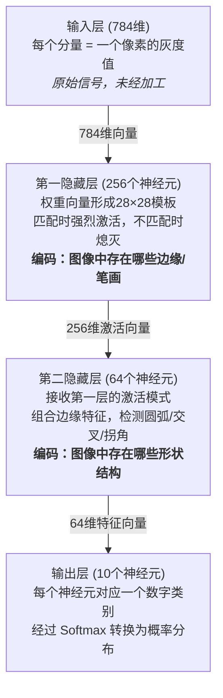

**关键理解**：分层网络的每一层可以看作一个"特征空间"。
**关键理解**：分层网络的每一层可以看作一个"特征空间"。信号从输入空间经过层层变换（激活、熄灭的组合），逐步映射到更抽象的特征空间，最终映射到输出空间。这个过程是**静态的、一次性的**——给定输入，经过固定的前向传播路径，直接得到输出。

**为什么经典图示中节点数逐层递减**：这不是强制要求，而是分类任务的自然需求——从高维输入（784个像素）中提炼出低维判断（10个数字类别），信息需要逐步压缩。其他任务（如自编码器、生成模型）可能使用不同的层宽变化模式。

### 2.2.2 架构二：Transformer——序列内动态交互

**为什么需要不同的架构**：前馈网络有一个根本限制——每个神经元的连接权重在训练后就固定了，它无法根据输入内容**动态调整**不同输入部分之间的关系。对于语言理解这样的任务，"同一个词在不同上下文中含义不同"是核心挑战，前馈网络难以有效处理。

**Transformer 的核心创新——注意力机制**：不再使用固定的权重矩阵，而是让输入中的每个元素（token）根据与其他元素的**相似度**，动态地决定应该关注谁、关注多少。

**自注意力的计算过程**：

每个 token 的嵌入向量通过三个不同的线性变换，生成三种不同角色的向量：

$$
\mathbf{q}_i = \mathbf{W}^Q \mathbf{x}_i \quad (\text{查询：我在找什么})
$$

$$
\mathbf{k}_i = \mathbf{W}^K \mathbf{x}_i \quad (\text{键：我能提供什么})
$$

$$
\mathbf{v}_i = \mathbf{W}^V \mathbf{x}_i \quad (\text{值：我携带的信息})
$$

注意力权重通过查询和键的内积计算：

$$
\alpha_{ij} = \text{softmax}\!\left(\frac{\mathbf{q}_i \cdot \mathbf{k}_j}{\sqrt{d_k}}\right)
$$

最终输出是值向量的加权和：

$$
\mathbf{o}_i = \sum_j \alpha_{ij} \mathbf{v}_j
$$

矩阵形式（整个序列同时计算）：

$$
\text{Attention}(\mathbf{Q}, \mathbf{K}, \mathbf{V}) = \text{softmax}\!\left(\frac{\mathbf{Q}\mathbf{K}^T}{\sqrt{d_k}}\right) \mathbf{V}
$$

**注意力机制中的 Softmax**：此处 Softmax 的作用是将内积相似度分数转换为归一化的注意力权重（概率分布），确保每个 token 的注意力权重之和为 1。这和前馈网络输出层的 Softmax 用途不同——前者用于**信息路由**，后者用于**预测输出**。

**与前馈网络的根本区别**：

| 特性       | 前馈网络                     | Transformer              |
| ---------- | ---------------------------- | ------------------------ |
| 权重       | 训练后固定                   | 注意力权重随输入动态变化 |
| 输入间关系 | 不同输入分量通过固定权重混合 | 不同 token 之间动态交互  |
| 计算模式   | 层内神经元独立计算           | 层内 token 相互"看"对方  |
| 适合的问题 | 固定维度输入的分类/回归      | 变长序列的理解与生成     |

### 2.2.3 架构三：强化学习策略网络——嵌入状态机的决策组件

**为什么又需要不同的架构**：前馈网络和 Transformer 都是"**给定输入，产生输出**"的函数映射，它们不涉及"行动→环境反馈→再行动"的循环决策过程。强化学习面对的问题本质上是**状态机**——智能体处于某个状态，选择动作，环境转移到新状态并给予奖励，循环往复。

**强化学习网络的结构**：

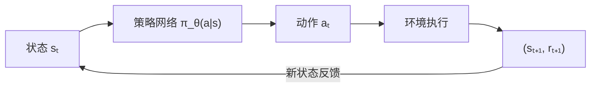

策略网络的内部可以使用前馈网络或 Transformer 来实现（这是架构的可组合性），但整体系统有一个前馈网络和 Transformer 都不具备的特征：**网络的输出（动作）会通过环境改变自己未来的输入（状态）**。

**与其他架构的根本区别**：

| 特性     | 前馈网络/Transformer              | RL策略网络                             |
| -------- | --------------------------------- | -------------------------------------- |
| 系统边界 | 网络本身就是完整系统              | 网络是状态机闭环中的**一个组件** |
| 输入来源 | 固定数据集或用户输入              | 环境动态产生，受自身决策影响           |
| 训练信号 | 标签（监督）或下一token（自监督） | 奖励信号（延迟、稀疏、有噪声）         |
| 数据分布 | 训练集固定，独立同分布            | 数据由策略自身产生，不断变化           |
| 核心概念 | 输入→输出映射                    | 状态→动作→奖励→新状态的循环         |

## 2.3 共同的底层 vs 不同的上层

### 2.3.1 所有架构共享的底层机制

无论架构多么不同，以下底层机制是**完全通用**的：

**1. 前向传播**：数据从输入端流向输出端，每个神经元执行 $y = \sigma(\mathbf{w}^T\mathbf{x} + b)$

**2. 反向传播**：误差/梯度信号从输出端反向流回输入端，通过链式法则逐层计算每个参数的梯度

**3. 梯度下降**：利用计算出的梯度，沿损失函数下降方向更新参数

**4. 激活函数**：为每层计算引入非线性

**5. 概率计算**：通过 Softmax 等函数将原始输出转换为概率分布

### 2.3.2 不同架构的上层逻辑

上层逻辑的差异主要体现在三个方面：

**1. 训练目标函数不同**：

$$
\text{前馈网络（分类）}: \quad \min_\theta \; \mathbb{E}\left[-\sum_i y_i \log p_i\right] \quad \text{（交叉熵：拟合标签）}
$$

$$
\text{Transformer（LLM）}: \quad \min_\theta \; \mathbb{E}\left[-\log P_\theta(x_{t+1}|x_1,...,x_t)\right] \quad \text{（预测下一个token）}
$$

$$
\text{强化学习}: \quad \max_\theta \; \mathbb{E}_{\pi_\theta}\left[\sum_t \gamma^t R_t\right] \quad \text{（最大化累积奖励）}
$$

**2. 反向传播的"起点信号"不同**：

- 前馈网络：梯度起点 = $p_i - y_i$（预测概率 - 真实标签）
- 强化学习：梯度起点 = $\nabla_\theta \log \pi_\theta(a|s) \cdot (R - V(s))$（策略梯度 × 优势信号）
- 反向传播的**传递机制**（链式法则）完全相同，但**起点信号的含义和来源**截然不同

**3. 参数学到的"知识"不同**：

- 前馈网络参数编码：输入模式→类别的**统计规律**（如"这种像素模式通常是数字3"）
- Transformer 参数编码：语言的**统计结构和语义关系**（如"在'吃'之后通常跟食物相关的词"）
- RL 策略网络参数编码：状态→最优动作的**决策策略**（如"在这个棋盘局面下应该走这步棋"）

### 2.3.3 当前 AI 架构的非通用性

一个重要的事实是：**当前没有任何一种架构是"万能"的**。针对一类问题设计的架构，不一定能直接迁移到另一类问题上：

- CNN 擅长图像处理（利用空间局部性和平移不变性），但不适合处理变长序列
- Transformer 擅长序列建模（通过注意力捕获长距离依赖），但在连续控制任务中并非最佳选择
- RL 的 Actor-Critic 架构专为序列决策设计，但不适合纯粹的模式识别任务

**架构选择取决于问题的数学结构**：输入是固定维度还是变长序列？是否需要与环境交互？反馈是即时的还是延迟的？数据是静态的还是由系统自身产生的？

## 2.4 常见误区辨析——标签、架构、训练范式的边界

> **本节定位**：在学习过程中，以下几个概念极易混淆：（1）标签是不是神经元运算的一部分？（2）不同架构的正向传播和反向传播有什么区别？（3）Softmax 是通用的，但标签是通用的吗？本节逐一辨析这些问题，明确各概念的归属层次和边界。

### 2.4.1 概念分层——三个独立维度的组合

理解神经网络系统，必须认识到它由**三个独立维度**组成，三者可以自由组合：

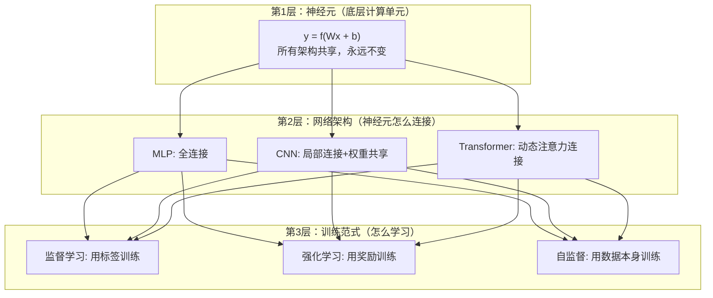

**核心认识**：

- **标签属于第 3 层（训练范式）**，不属于第 1 层（神经元），也不属于第 2 层（架构）
- **Softmax 属于第 1~2 层的通用工具**，在所有训练范式中都可以使用
- 同一个架构可以搭配不同的训练范式：CNN + 监督学习 = 图像分类；CNN + 强化学习 = Atari 游戏 AI（DQN）；Transformer + 监督学习 = 机器翻译；Transformer + 强化学习 = RLHF

**常见混淆的根源**：很多教材在讲解时把"架构"和"训练范式"绑在一起讲（比如总是在讲 MLP 时搭配交叉熵标签），导致读者误以为标签是网络内部运算的一部分。实际上标签从来不进入网络内部——它只在网络外部的损失函数中出场。

**三大训练范式的正式定义**：

| 训练范式 | 核心思想 | 反馈来源 | 数学目标 |
|---------|---------|---------|---------|
| **监督学习**<br/>（Supervised Learning） | 给定"正确答案"（标签），让模型的预测尽量接近标签 | 人工标注的标签 $\mathbf{y}$<br/>（即时、精确、确定性） | $\min_\theta \; \mathcal{L}(\hat{y}, y)$<br/>（最小化预测与标签的差距） |
| **强化学习**<br/>（Reinforcement Learning） | 通过与环境交互试错，让智能体获得更多累积奖励 | 环境返回的奖励信号 $r$<br/>（延迟、稀疏、有噪声） | $\max_\theta \; \mathbb{E}_{\pi_\theta}[\sum_t \gamma^t R_t]$<br/>（最大化累积奖励的期望） |
| **自监督学习**<br/>（Self-supervised Learning） | 从数据本身构造"伪标签"，无需人工标注 | 数据自身结构<br/>（如预测下一个 token） | $\min_\theta \; \mathcal{L}(\hat{x}_{t+1}, x_{t+1})$<br/>（最小化自构造目标的误差） |

**关键区别**：
- **监督学习**有"标准答案"（标签），训练就是让预测逼近答案。交叉熵损失、One-Hot 标签、$p_i - y_i$ 梯度——**这些概念只存在于监督学习中**
- **强化学习**没有"标准答案"，只有"做得好不好"的评分（奖励）。训练目标是试错后找到能获得高奖励的策略。策略梯度 $\nabla\log\pi \cdot R$——**这是 RL 特有的梯度形式**
- **自监督学习**介于两者之间——有"标签"，但标签不是人工标注的，而是从数据自身构造的（如 GPT 的"下一个词预测"）

> 本文档的核心重点是**强化学习**，但在讲解数学基础时不可避免地需要引入监督学习的概念（如第三章的交叉熵损失）。请在阅读时始终注意当前讨论的内容属于哪个训练范式，避免将监督学习的概念错误地套用到强化学习中。

### 2.4.2 误区一："标签是神经元运算的一部分"——错！

**标签在整个系统中的位置**：

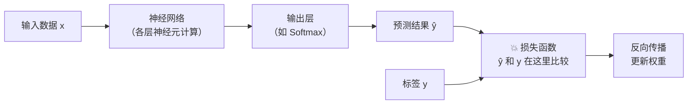

- **网络内部**（从输入到输出）：完全不涉及标签，纯粹是输入数据经过各层神经元的前向计算
- **标签唯一出场的地方**：损失函数——它在网络**外部**，用来衡量"预测和正确答案的差距"
- **反向传播**：从损失函数开始，逆向通过网络更新权重

**所以**：标签不是基础的神经元运算，它是训练阶段的"教师信号"。在推理阶段（使用训练好的模型做预测时），标签完全不存在——网络只做前向计算输出结果。

### 2.4.3 误区二："标签在所有场景下都适用"——不是！

**Softmax 是通用的，但标签不通用。** 这是另一个关键区分：

| | Softmax | 标签（One-Hot） |
|--|---------|---------------|
| **通用性** | ✅ 所有需要概率输出的场景都可用 | ❌ 只属于监督学习 |
| **在前馈网络分类中** | 输出"属于各类别的概率" | 提供"正确类别是什么" |
| **在 Transformer 中** | 注意力层：输出注意力权重<br/>输出层：输出 token 概率 | 自监督：用下一个 token 作为"标签"<br/>（但这不是人工标注的） |
| **在 RL 策略网络中** | 输出"各动作的选择概率" | ❌ **不存在标签！** 用奖励信号替代 |

**这意味着**：当你从监督学习转到强化学习时，训练流程中没有"标签和预测比较"这一步，取而代之的是"用奖励信号评估动作好坏"。整个训练的驱动力从"拟合标准答案"变成了"试错后根据结果调整策略"。

### 2.4.4 误区三："RL 的状态向量就是标签"——不是！

从监督学习迁移到强化学习时，很容易产生这样的对应关系错觉：

| 监督学习概念 | ❌ 容易错误类比到 RL | ✅ RL 中的正确对应 |
|------------|---------------------|------------------|
| 输入 $x$ | — | 状态 $s$（对应"输入"） |
| 标签 $y$（正确答案） | 状态 $s$？ | **不存在！** 奖励 $r$ 是最接近的替代品 |
| 预测 $\hat{y}$ | — | 动作概率 $\pi(a\|s)$（对应"输出"） |
| 损失函数 | — | 策略梯度目标函数 |

**关键区别**：

- **标签告诉你"正确答案是什么"**：$y = [0,0,0,1,0,...,0]$ 明确说"答案是类别 3"
- **奖励只告诉你"你做得好不好"**：$r = 0.5$ 只说"这个动作还行"，但不告诉你"最好的动作是什么"
- **状态是输入，不是答案**：状态 $s$ 描述的是"当前环境长什么样"，对应的是监督学习中的输入 $x$，而不是标签 $y$

### 2.4.5 三大架构的正向传播差异

虽然底层神经元计算相同（$y = \sigma(\mathbf{w}^T\mathbf{x} + b)$），但不同架构的正向传播路径和计算模式有本质区别：

```mermaid
graph TB
    subgraph "MLP 正向传播"
        M1["输入 x"] --> M2["第1层: h₁ = σ(W₁x + b₁)"]
        M2 --> M3["第2层: h₂ = σ(W₂h₁ + b₂)"]
        M3 --> M4["输出: ŷ = softmax(W₃h₂ + b₃)"]
    end
    
    subgraph "CNN 正向传播"
        C1["输入图片"] --> C2["卷积层: 局部特征提取<br/>（权重共享的局部连接）"]
        C2 --> C3["池化层: 空间降维"]
        C3 --> C4["全连接层: 分类输出"]
    end
    
    subgraph "Transformer 正向传播"
        T1["输入序列"] --> T2["嵌入 + 位置编码"]
        T2 --> T3["自注意力: Q·Kᵀ → 动态权重<br/>（权重随输入变化！）"]
        T3 --> T4["前馈子网络 FFN"]
        T4 --> T5["重复 N 层"]
    end
    
    subgraph "RL 策略网络正向传播"
        R1["状态 s"] --> R2["网络（内部可以是 MLP/CNN/Transformer）"]
        R2 --> R3["Softmax → 动作概率 π(a|s)"]
        R3 --> R4["采样/选择动作 a"]
    end
```

**正向传播核心差异对比**：

| 特性 | MLP | CNN | Transformer | RL 策略网络 |
|------|-----|-----|-------------|-------------|
| **连接方式** | 全连接：每个神经元与上层所有神经元相连 | 局部连接：每个神经元只"看"一小块区域 | 全局动态连接：每个 token 和所有 token 交互 | 取决于内部使用的架构 |
| **权重特点** | 固定权重矩阵 | 共享卷积核（同一个滤波器扫描整个输入） | Q/K/V 投影矩阵固定，但**注意力权重随输入动态变化** | 同内部架构 |
| **输入格式** | 固定维度向量 | 2D/3D 网格（图像） | 变长 token 序列 | 状态向量（维度取决于环境） |
| **输出含义** | 各类别的概率 | 各类别的概率 | 下一个 token 的概率 / 注意力权重 | 各动作的选择概率 |

### 2.4.6 三大架构的反向传播差异

反向传播的**底层机制**（链式法则逐层传递梯度）完全相同，但由于前向计算图不同，反向传播展开的路径和起点信号不同：

| 架构 | 反向传播路径特点 | 梯度起点信号 | 容易出现的问题 |
|------|----------------|-------------|--------------|
| **MLP** | 标准逐层回传 | $p_i - y_i$（标签驱动） | 深层网络梯度消失 |
| **CNN** | 卷积的反向 = 转置卷积；权重共享使同一卷积核梯度来自多个位置 | $p_i - y_i$（标签驱动） | 感受野限制 |
| **RNN** | 沿时间维度展开（BPTT），链式法则在时间步上反复乘以同一权重矩阵 | 各时间步的预测误差 | 梯度消失/爆炸（长序列） |
| **Transformer** | 注意力矩阵的 Softmax Jacobian 参与梯度计算，但无时间依赖 | $-\log P(x_{t+1})$（下一token预测误差） | 内存消耗大（$O(n^2)$） |
| **RL 策略网络** | 内部传递机制与所用架构一致 | $\nabla\log\pi(a\|s) \cdot R$（**奖励驱动，非标签驱动**） | 高方差、样本效率低 |

**一个关键的统一与区分**：

> **统一**：所有架构的反向传播都是链式法则——从输出端的梯度起点，逐层乘以局部梯度，一直传回输入端。这个传递机制永远不变。
>
> **区分**：梯度的"起点信号"完全不同。监督学习的起点是"预测和标签的差"（$p - y$），强化学习的起点是"策略梯度乘以奖励"（$\nabla\log\pi \cdot R$）。这两个起点信号的**含义、来源、数学性质**完全不同，但它们进入网络内部后，沿着链式法则传递的方式是一样的。

### 2.4.7 神经元在不同架构中的数学意义

虽然单个神经元的计算公式完全一样（$y = \sigma(\mathbf{w}^T\mathbf{x} + b)$），但由于组织方式不同，同样的神经元在不同架构中扮演着不同的数学角色：

| 架构 | 神经元的数学意义 | 权重 $\mathbf{w}$ 学到的是什么 | 类比 |
|------|----------------|---------------------------|------|
| **MLP** | **线性分类器**：在输入空间中划出一个超平面 | "这种输入模式→属于什么类别" | 投票员：对输入打分 |
| **CNN** | **局部特征探测器**：检测输入中某个小区域是否存在特定模式 | "这种局部纹理/边缘/形状长什么样" | 放大镜：只看一小块 |
| **Transformer 中的 FFN 神经元** | **特征变换器**：对注意力层输出做非线性变换 | 语义空间中的特征组合规律 | 炼金师：混合信息 |
| **Transformer 中的 Q/K/V 投影** | **角色转换器**：把 token 表示投影到不同角色空间 | "什么样的信息应该被查询/被检索/被传递" | 翻译官：转换视角 |
| **RL 策略网络的输出神经元** | **动作评分器**：对每个可能的动作给出原始分数 | "在这种状态下，这个动作有多好" | 参谋：建议行动 |
| **RL 价值网络的输出神经元** | **状态评估器**：输出当前状态的价值估计 | "这个状态有多好（能获得多少未来奖励）" | 评估员：判断局势 |

**再次强调**：这些不同的"数学意义"不是因为神经元本身有什么不同，而是因为：

1. **输入不同**：MLP 接收原始特征，CNN 接收局部图块，Transformer 中的神经元接收注意力层的输出
2. **连接方式不同**：全连接 vs 局部共享 vs 动态注意力
3. **训练信号不同**：标签误差 vs 奖励信号 vs 自回归预测误差

同样的砖头（神经元），在不同的建筑结构（架构）中、接受不同的施工指令（训练范式）后，承担了完全不同的功能。

### 2.4.8 总结：哪些是通用的，哪些不是

| 概念 | 是否通用 | 归属层次 | 说明 |
|------|---------|---------|------|
| 神经元 $y = \sigma(Wx + b)$ | ✅ 完全通用 | 底层计算单元 | 所有架构都一样 |
| 前向传播（概念） | ✅ 通用概念 | — | "输入→输出"的计算过程，但具体路径因架构而异 |
| 反向传播（链式法则） | ✅ 传递机制通用 | — | 但梯度起点信号因训练范式不同而不同 |
| 激活函数（ReLU 等） | ✅ 通用 | 底层工具 | 所有架构都需要非线性 |
| Softmax | ✅ 通用工具 | 概率计算工具 | 但在不同位置服务不同目的（预测概率 / 注意力权重 / 动作概率） |
| 标签（One-Hot） | ❌ **不通用** | 监督学习的训练范式 | RL 中没有标签，用奖励替代；自监督用自构造目标替代 |
| 交叉熵损失 | ❌ 仅限分类任务 | 监督学习的损失函数 | RL 用策略梯度目标，回归任务用 MSE |
| 梯度起点 $p - y$ | ❌ 仅限交叉熵 + 监督学习 | 损失函数的导数 | RL 的梯度起点是 $\nabla\log\pi \cdot R$ |

### 2.4.9 误区四："模型就是训练"——不是！模型是静态数据，训练是动态过程

在学习过程中容易产生这样的混淆：把"模型做预测"和"训练更新模型"混为一谈，或者认为"模型存储了梯度/偏导"。

**模型、训练、梯度三者的关系**：

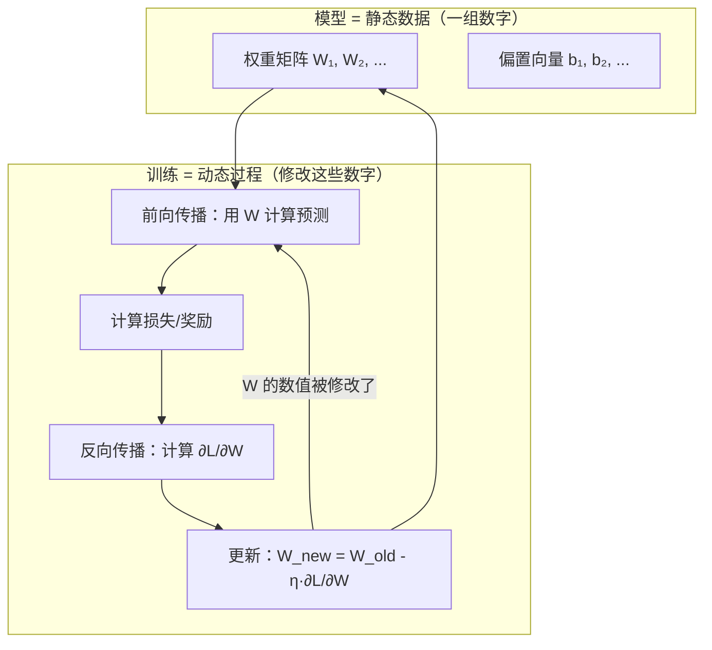

| 概念 | 本质 | 何时存在 | 类比 |
|------|------|---------|------|
| **模型（权重 $W$）** | 一组数字矩阵 | 始终存在 | 雕塑成品 |
| **梯度（$\nabla_W \mathcal{L}$）** | 训练过程中的临时计算结果 | 只在训练时存在，训练完就丢弃 | 雕刻刀的方向 |
| **训练** | 用梯度反复修正 $W$ 的过程 | 训练阶段 | 雕刻过程 |
| **推理（预测）** | 用 $W$ 做矩阵乘法得到输出 | 部署使用阶段 | 观看雕塑 |

**常见混淆纠正**：

| 混淆说法 | 纠正 |
|---------|------|
| "模型存储了各方向的偏导/梯度" | 模型存储的是**权重 $W$**，不是梯度。梯度是训练过程中的临时工具，训练完不存在 |
| "输入状态后得到梯度参数，然后选取动作" | 输入状态后做的是**矩阵乘法 $W \cdot s + b$**（前向传播），得到的是**各动作的评分值**，不是梯度 |
| "更新模型就是更新状态向量的偏导" | 更新模型是更新**权重 $W$**。偏导是对 $W$ 求的（$\partial\mathcal{L}/\partial W$），不是对状态 $s$ 求的。状态 $s$ 是输入，从始至终不被修改 |

> **一句话**：梯度之于模型，就像阳光之于树木——阳光塑造了树木的形态，但树木里储存的是木质纤维，不是阳光本身。

> **过渡说明**：理解了不同架构的区别后，下一章将详细讨论所有架构都需要的核心工具——概率计算。我们将重点解释 Softmax 函数的数学原理和设计动机，以及它在不同架构中的不同角色。

---

# 三、概率计算原理——为什么需要以及如何工作

> **本章定位**：概率输出是连接神经网络"内部计算"与"外部解释"的桥梁。本章不仅讲解数学推导，更重点解释**为什么需要这些机制**、它们是**如何被设计出来的**，以及在**不同架构中扮演什么角色**。
>
> ⚠️ **范式说明**：本章 3.1~3.2 节讨论的 Softmax 是**所有架构通用**的概率工具。但 3.3 节的损失函数（特别是交叉熵损失、One-Hot 标签、MSE 对比）主要从**监督学习分类任务**的视角展开——因为交叉熵和标签本身就是监督学习的概念。强化学习中没有标签，使用的是完全不同的目标函数（策略梯度），将在第五章详细讨论。3.3.6 节专门说明了 RL 中"损失"的本质差异。请在阅读 3.3 节时始终注意这一范式边界。

## 3.1 原始输出的困境——为什么需要概率化

### 3.1.1 问题的提出

神经网络最后一层的输出是一组原始分数，称为 **logits**，记为 $\mathbf{z} = (z_1, z_2, \dots, z_K)^T$。这些值的范围是 $(-\infty, +\infty)$，存在以下问题：

1. **无法解释为概率**：$z_i$ 可能是负数或大于 1 的数，无法直接理解为"第 $i$ 类的概率"
2. **不同样本间不可比**：两个样本的 logits 量纲可能不同，无法直接比较
3. **不满足概率公理**：多个 $z_i$ 的和不等于 1

但在实际应用中，我们需要概率输出：

- **分类任务**：需要知道"属于每个类别的概率"
- **策略网络**：需要知道"选择每个动作的概率"
- **语言模型**：需要知道"下一个词是每个候选词的概率"

因此，需要一个函数将任意实数向量转换为有效的概率分布。

### 3.1.2 概率分布的数学约束

**定义（概率分布的基本要求）**：一个有效的离散概率分布 $\mathbf{p} = (p_1, p_2, \dots, p_K)$ 必须满足：

$$
p_i \geq 0 \quad \forall i, \qquad \sum_{i=1}^{K} p_i = 1
$$

这两个约束看似简单，但要找到一个同时满足它们、数学性质良好、且梯度计算方便的映射函数，并不容易。

## 3.2 Softmax 函数——设计动机与数学性质

### 3.2.1 Softmax 是如何被设计出来的

#### 最朴素的想法——直接归一化为什么不行？

面对"把原始分数变成概率"的需求，最直觉的做法是**直接除以总和**：

$$
p_i^{\text{naive}} = \frac{z_i}{\sum_{j=1}^K z_j}
$$

但这个方案有**致命缺陷**：

**问题①：无法处理负数输入**。假设 logits 为 $\mathbf{z} = [3, -1, 2]$：

$$
p_1^{\text{naive}} = \frac{3}{3+(-1)+2} = \frac{3}{4} = 0.75, \quad p_2^{\text{naive}} = \frac{-1}{4} = -0.25 \quad (\textbf{负概率！非法！})
$$

**问题②：分母可能为零**。如果 $\mathbf{z} = [1, -1, 0]$，则 $\sum z_j = 0$，直接除零崩溃。

**问题③：不能有效放大差异**。分数 $[3.1, 3.0, 2.9]$ 直接归一化后几乎均匀分布 $[0.344, 0.333, 0.322]$，无法凸显最优选择。

因此，我们需要一个**预处理步骤**，在归一化之前先把任意实数变成正数。

#### 设计思路——两步法

**第一步（非负化）**：选择一个函数 $f: \mathbb{R} \to (0, +\infty)$，将任意实数映射为正数。

**第二步（归一化）**：除以总和，使所有值加起来等于 1。

$$
p_i = \frac{f(z_i)}{\sum_{j=1}^K f(z_j)}
$$

关键问题变成了：**$f$ 应该选什么？**

#### 为什么 $f(z) = e^z$ 是最优选择？

候选函数有很多：$z^2$、$|z|$、$\max(0, z) + \epsilon$（修正ReLU）、$e^z$ 等。但只有 $e^z$ 同时满足以下所有要求：

| 要求                 | $z^2$            | $\|z\|$            | $e^z$                                       | 理由                                                  |
| -------------------- | ------------------ | -------------------- | --------------------------------------------- | ----------------------------------------------------- |
| 值域$(0, +\infty)$ | ❌$z=0$ 时为 0   | ❌$z=0$ 时为 0     | ✅ 恒正                                       | 概率不能为 0（数学上需$p_i > 0$）                   |
| 严格单调递增         | ❌$(-1)^2 = 1^2$ | ❌$\|-1\| = \|1\|$ | ✅                                            | 必须保持原始排序：$z_i > z_j \Rightarrow p_i > p_j$ |
| 导数简洁             | —                 | 不连续               | ✅$(e^z)' = e^z$                            | 梯度计算需高效                                        |
| 差值决定比值         | ❌                 | ❌                   | ✅$\frac{e^{z_i}}{e^{z_j}} = e^{z_i - z_j}$ | 概率比仅依赖分数差，与绝对数值无关                    |

**指数函数独有的"差值决定比值"性质**特别重要。它意味着对所有 logits 同时加减常数 $c$ 不改变结果——这就是 Softmax 的**平移不变性**，也是数值稳定性的基础。

**从统计力学角度**：Softmax 的形式 $p_i \propto e^{z_i}$ 与物理学中的**玻尔兹曼分布** $P(E) \propto e^{-E/kT}$ 同构。玻尔兹曼分布是**在给定平均能量约束下熵最大的分布**——即在"选择最优"和"保持不确定性"之间达到数学上的最佳平衡。这不是巧合，而是**最大熵原理**的数学必然结果。

#### 组合得到 Softmax

将两步组合，就得到了 Softmax：

$$
\text{softmax}(z_i) = p_i = \frac{e^{z_i}}{\sum_{j=1}^{K} e^{z_j}}, \quad i = 1, 2, \dots, K
$$

### 3.2.2 Softmax 的性质验证

- **非负性**：由于 $e^{z_i} > 0$，因此 $p_i > 0$ 对所有 $i$ 成立
- **归一性**：$\sum_{i=1}^K p_i = \sum_{i=1}^K \frac{e^{z_i}}{\sum_j e^{z_j}} = \frac{\sum_i e^{z_i}}{\sum_j e^{z_j}} = 1$
- **单调性（保序性）**：$z_i > z_j \Rightarrow e^{z_i} > e^{z_j} \Rightarrow p_i > p_j$
- **极端行为**：当某个 $z_k \gg z_j$（$\forall j \neq k$）时，$p_k \to 1$，分布趋于确定性
- **平移不变性**：对所有 $z_i$ 同时加减常数 $c$，不改变结果（因为 $e^{z_i+c}/\sum e^{z_j+c} = e^c e^{z_i}/(e^c \sum e^{z_j}) = e^{z_i}/\sum e^{z_j}$）

**数值稳定性技巧**：利用平移不变性，实际计算中减去最大值防止指数溢出：

$$
p_i = \frac{e^{z_i - \max(\mathbf{z})}}{\sum_{j=1}^K e^{z_j - \max(\mathbf{z})}}
$$

### 3.2.3 Softmax 的梯度推导

Softmax 的 Jacobian 矩阵对后续反向传播至关重要。

**推导过程**：

当 $i = j$ 时（对自身求导）：

$$
\frac{\partial p_i}{\partial z_i} = \frac{e^{z_i} \cdot \sum_k e^{z_k} - e^{z_i} \cdot e^{z_i}}{(\sum_k e^{z_k})^2} = \frac{e^{z_i}}{\sum_k e^{z_k}} \cdot \frac{\sum_k e^{z_k} - e^{z_i}}{\sum_k e^{z_k}} = p_i(1 - p_i)
$$

当 $i \neq j$ 时（对其他logit求导）：

$$
\frac{\partial p_i}{\partial z_j} = \frac{0 - e^{z_i} \cdot e^{z_j}}{(\sum_k e^{z_k})^2} = -\frac{e^{z_i}}{\sum_k e^{z_k}} \cdot \frac{e^{z_j}}{\sum_k e^{z_k}} = -p_i p_j
$$

用 Kronecker delta 符号统一表示：

$$
\frac{\partial p_i}{\partial z_j} = p_i(\delta_{ij} - p_j)
$$

**梯度的直觉含义**：增大某个 logit $z_j$ 会增大自身概率 $p_j$（系数 $p_j(1-p_j)$），同时**等比例减小**所有其他类别的概率（系数 $-p_ip_j$）。这是归一化约束的自然结果——总和必须为 1。

### 3.2.4 Softmax 在不同架构中的不同角色

虽然 Softmax 的数学形式完全相同，但它在不同架构中**服务于不同目的**：

| 架构               | Softmax 的位置 | Softmax 的角色         | 输入含义             | 输出含义                                               |
| ------------------ | -------------- | ---------------------- | -------------------- | ------------------------------------------------------ |
| 前馈网络（分类）   | 输出层         | **预测概率**     | 各类别的原始分数     | "输入属于第$i$ 类的概率"                             |
| Transformer（LLM） | 输出层         | **生成概率**     | 词汇表上的原始分数   | "下一个 token 是第$i$ 个词的概率"                    |
| Transformer 注意力 | 注意力层内部   | **信息路由权重** | token 间的相似度分数 | "第$i$ 个 token 应分配多少注意力给第 $j$ 个 token" |
| 强化学习策略网络   | 输出层         | **动作选择概率** | 各动作的原始分数     | "在当前状态下选择动作$a$ 的概率"                     |

## 3.3 损失函数——如何衡量"预测得好不好"

> ⚠️ **以下 3.3.1~3.3.5 节的内容属于监督学习分类任务的范畴**。其中涉及的"标签""One-Hot 编码""交叉熵"等概念仅在有"标准答案"的监督学习中存在。强化学习中没有标签和交叉熵，使用的是奖励信号和策略梯度目标函数（见 3.3.6 节和第五章）。

### 3.3.1 为什么需要损失函数

有了概率输出后，需要一个数学工具来衡量"预测的概率分布与真实情况差多远"。这个工具就是**损失函数**（loss function），它将预测结果和真实结果之间的差距映射为一个非负标量——数值越小，预测越好。损失函数的选择不是任意的——不同的选择会导致截然不同的梯度行为和训练效率。

**不同训练范式的"衡量好坏"方式完全不同**：

| 训练范式 | "好不好"的含义 | 衡量工具 | 优化方向 |
|---------|---------------|---------|----------|
| **监督学习** | 预测和标签差多远 | 交叉熵损失（分类）/ MSE（回归） | 最小化损失 |
| **强化学习** | 策略能获得多少累积奖励 | 策略梯度目标函数 $J(\theta)$ | 最大化奖励 |
| **自监督学习** | 能否还原/预测自身数据 | 自构造目标（如下一 token 预测） | 最小化重构误差 |

以下先详细讨论**监督学习分类任务**中的损失函数选择。

### 3.3.2 One-Hot 标签——为什么分类标签要这样编码

在讨论损失函数之前，需要先理解标签的编码方式。

**问题**：假设做手写数字识别，类别有 0~9 共 10 个。如何用数学形式表示"这张图是数字 3"？

**朴素方案——直接用数字**：令 $y = 3$。看似合理，但会引入**不存在的数值关系**：网络会认为"3"和"4"很接近（差 1），而"3"和"9"差很远（差 6）。但数字类别之间没有大小顺序——它们是完全独立的类别。

**正确方案——One-Hot 编码（独热编码）**：用一个 $K$ 维向量表示，只有正确类别的位置为 1，其余全为 0：

$$
\text{数字"3"} \to \mathbf{y} = (0, 0, 0, 1, 0, 0, 0, 0, 0, 0)^T
$$

**"One"**= 只有一个位置，**"Hot"**= 被激活（值为 1）。

**One-Hot 消除了虚假的距离关系**：任意两个不同类别的 one-hot 向量之间的欧氏距离都相等（均为 $\sqrt{2}$），所有类别在数学上完全平等。

**One-Hot 的关键数学性质**：

- $y_i \in \{0, 1\}$，且 $\sum_{i=1}^K y_i = 1$（恰好一个位置为 1）
- 它本身就是一个合法的概率分布（退化分布/确定性分布），信息熵 $H(\mathbf{y}) = 0$
- 与任何向量做内积 $\mathbf{y}^T \mathbf{v} = v_c$，直接选出正确类别的值——这是后续简化交叉熵公式的关键

**One-Hot 标签的本质含义——"理想的概率分布"**：

One-Hot 标签不仅仅是一种编码方式，它代表的是**完美模型应该输出的概率分布**。例如真实类别是"3"：

$$
\text{标签 } \mathbf{y} = [0, 0, 0, 1, 0, 0, 0, 0, 0, 0] \quad \leftarrow \text{"数字3的概率应该是100\%"}
$$

$$
\text{预测 } \hat{\mathbf{p}} = [0.01, 0.02, 0.15, 0.70, 0.05, 0.01, 0.02, 0.01, 0.02, 0.01] \quad \leftarrow \text{"模型认为是3的概率是70\%"}
$$

**两者都是概率分布（向量），因此可以直接在同一个数学空间中比较。** 损失函数（交叉熵）所做的就是逐元素地衡量这两个概率分布之间的差距。

**标签的使用流程——它在训练中的唯一作用**：

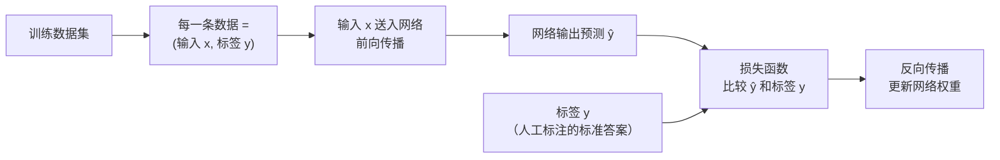

**关键要点**：
- 标签 $\mathbf{y}$ 是**训练数据自带的人工标注**，不是网络计算出来的
- 标签**不进入网络内部**，只在网络外部的损失函数中与预测值比较
- 在推理阶段（模型部署使用时），标签完全不存在——网络只做前向计算输出结果
- 标签是"教师信号"（Teacher Signal），告诉网络"你应该输出什么"

**标签的两种等价实现方式**（代码层面）：

| 方式 | 标签形式 | 损失计算 | 常见框架 |
|------|---------|---------|---------|
| **显式 One-Hot 向量** | $\mathbf{y} = [0,0,0,1,0,...]$ | $\mathcal{L} = -\sum_i y_i \log \hat{p}_i$（向量运算） | TensorFlow |
| **整数索引** | $y = 3$ | $\mathcal{L} = -\log \hat{p}_3$（直接取第3个元素） | PyTorch `nn.CrossEntropyLoss` |

两种方式**数学上完全等价**，结果一模一样。整数索引本质上是 One-Hot 的压缩表示。

**One-Hot 不可替代的高级场景**：

虽然整数索引能处理大多数情况，但以下场景必须使用 One-Hot 的向量形式：

- **软标签（Label Smoothing）**：$\mathbf{y} = [0.025, 0.025, 0.025, 0.9, 0.025, ...]$——"大概率是3，但不100%确定"
- **知识蒸馏（Knowledge Distillation）**：教师模型的 Softmax 输出作为学生模型的"软标签"
- **多标签分类**：一张图片同时包含"猫"和"狗"，$\mathbf{y} = [0, 1, 1, 0, 0, ...]$

**标签的适用范围——不是所有训练范式都有标签！**

> ⚠️ **重要提醒**：One-Hot 标签仅属于**监督学习**。强化学习中没有标签（用奖励信号替代），自监督学习中标签由数据本身生成（如 Transformer 的下一 token 预测）。关于标签在不同训练范式中的适用性，详见第二章 2.4 节的误区辨析。

### 3.3.3 朴素方案——均方误差（MSE）为什么不好

最直觉的损失函数是**均方误差**——预测概率与标签之差的平方和：

$$
\mathcal{L}_{\text{MSE}} = \frac{1}{2}\sum_{i=1}^{K}(p_i - y_i)^2
$$

看似合理，但用于分类任务时有**严重问题**：

**问题①：严重错误时梯度消失——越错反而越不修正**

MSE 对 logits 的梯度为：

$$
\frac{\partial \mathcal{L}_{\text{MSE}}}{\partial z_i} = \sum_k (p_k - y_k) \cdot p_k(\delta_{ki} - p_i)
$$

其中包含 $p_k(1-p_k)$ 项。在严重预测错误时：

$$
\text{假设正确类别 } c, \; p_c = 0.01 \; \text{(严重错误)} \implies \text{梯度} \propto (0.01 - 1) \times 0.01 \times 0.99 = -0.0098
$$

**网络严重搞错了，但梯度极小，参数几乎不更新！** 这是因为 Softmax 输出在接近 0 或 1 时导数 $p(1-p)$ 趋近于 0，MSE 的梯度被这个因子"压扁"了。

**问题②：忽略了概率分布的特殊性质**

MSE 把概率当成普通的数值来算欧氏距离，完全无视"这是一个概率分布"这一事实。两个概率分布之间的"距离"，应该用概率论/信息论的工具来衡量。

### 3.3.4 交叉熵损失——正确的选择

#### 理解前提：信息量、信息熵、交叉熵的递进关系

交叉熵不是凭空选择的损失函数——它来自信息论的严格推导链条。

**（一）信息量——一个事件发生时携带了多少"信息"？**

直觉上：必然发生的事（"明天太阳升起"）没什么信息量；极罕见的事（"明天下陨石雨"）信息量巨大。

信息量应满足两个要求：

1. **概率越小 → 信息量越大**
2. **独立事件的信息量可以相加**（A 和 B 同时发生的信息量 = A 的信息量 + B 的信息量）

什么数学函数能把"概率的乘法"变成"信息量的加法"？——**对数**是唯一满足此要求的连续函数：

$$
I(x) = -\log P(x)
$$

负号使信息量为正（因为 $P(x) \leq 1$ 时 $\log P(x) \leq 0$）。验证可加性：

$$
P(A \cap B) = P(A) \cdot P(B) \implies I(A \cap B) = -\log[P(A)P(B)] = I(A) + I(B) \quad \checkmark
$$

**（二）信息熵——"平均每次观测能提供多少信息？"**

如果一个随机变量有多种取值，每种取值有不同的概率，则**平均信息量**为：

$$
H(\mathbf{p}) = \mathbb{E}[I(x)] = -\sum_{i=1}^K p_i \log p_i
$$

这就是**香农熵**。熵越大 → 不确定性越大 → 平均每次观测的信息量越多。

- 公平骰子（每面 $1/6$）：$H = \log 6 \approx 1.79$（高不确定性）
- 作弊骰子（只出 6）：$H = 0$（完全确定，零信息量）

**（三）交叉熵——"用错误的分布编码时，要多付出多少代价？"**

假设真实分布是 $\mathbf{q}$（真实世界中每个事件的概率），但你不知道真实分布，用了近似分布 $\mathbf{p}$（模型预测的概率）来编码。则**平均编码代价**为：

$$
H(\mathbf{q}, \mathbf{p}) = -\sum_{i=1}^K q_i \log p_i
$$

事件按**真实概率** $q_i$ 发生，但用**近似概率** $p_i$ 评估信息量——如果 $\mathbf{p} \neq \mathbf{q}$，编码效率一定比用真实分布时更差，即 $H(\mathbf{q}, \mathbf{p}) \geq H(\mathbf{q})$。

三者的关系：

$$
\underbrace{H(\mathbf{q}, \mathbf{p})}_{\text{交叉熵}} = \underbrace{H(\mathbf{q})}_{\text{真实分布的熵（常数）}} + \underbrace{D_{\text{KL}}(\mathbf{q} \| \mathbf{p})}_{\text{KL散度} \geq 0}
$$

其中 KL 散度衡量两个分布的差异：$D_{\text{KL}}(\mathbf{q} \| \mathbf{p}) = \sum_i q_i \log \frac{q_i}{p_i}$，当且仅当 $\mathbf{p} = \mathbf{q}$ 时为 0。

**因此：最小化交叉熵 $\Longleftrightarrow$ 最小化 KL 散度 $\Longleftrightarrow$ 让预测分布逼近真实分布。**

对于 one-hot 标签 $\mathbf{y}$，真实分布的熵 $H(\mathbf{y}) = 0$（确定性分布没有不确定性），所以交叉熵直接等于 KL 散度。

#### 交叉熵损失的定义

**定义（交叉熵损失）**：给定真实分布（one-hot 标签）$\mathbf{y}$ 和预测分布 $\mathbf{p}$，交叉熵损失为：

$$
\mathcal{L}(\mathbf{y}, \mathbf{p}) = -\sum_{i=1}^{K} y_i \log p_i
$$

由于 $\mathbf{y}$ 是 one-hot 向量（只有第 $c$ 个位置为 1），大量项被消去，简化为：

$$
\mathcal{L} = -\log p_c
$$

**直觉含义**：$-\log p_c$ 的函数形状天然具有**不对称惩罚**特性——

- $p_c \to 1$（预测正确）：$-\log p_c \to 0$（零惩罚）
- $p_c = 0.5$（不确定）：$-\log 0.5 = 0.69$（中等惩罚）
- $p_c \to 0$（自信地说错）：$-\log p_c \to +\infty$（无穷惩罚）

**交叉熵对"自信的错误预测"施加极重的惩罚**——你宁可模型说"不太确定"，也不能接受模型"自信地说错"。

#### 交叉熵 vs MSE 的梯度对比

**交叉熵对 logits 的梯度**（Softmax + 交叉熵的联合梯度，这是所有使用交叉熵训练的网络都需要的结果）：

$$
\frac{\partial \mathcal{L}}{\partial z_i} = p_i - y_i
$$

**推导过程**：

$$
\frac{\partial \mathcal{L}}{\partial z_i} = -\sum_{k=1}^K y_k \frac{1}{p_k} \cdot \frac{\partial p_k}{\partial z_i} = -\sum_{k=1}^K y_k \frac{p_k(\delta_{ki} - p_i)}{p_k} = -\sum_{k=1}^K y_k(\delta_{ki} - p_i)
$$

$$
= -y_i + p_i \sum_{k=1}^K y_k = -y_i + p_i \cdot 1 = p_i - y_i
$$

**关键对比——严重预测错误（$p_c = 0.01$）时的梯度表现**：

| 损失函数 | 梯度大小                                  | 行为                  |
| -------- | ----------------------------------------- | --------------------- |
| 交叉熵   | $\|p_c - 1\| = 0.99$                    | **强力修正** ✅ |
| MSE      | $\|(p_c-1) \cdot p_c(1-p_c)\| = 0.0098$ | 几乎不修正 ❌         |

**接近正确（$p_c = 0.99$）时**：

| 损失函数 | 梯度大小                                  | 行为    |
| -------- | ----------------------------------------- | ------- |
| 交叉熵   | $\|p_c - 1\| = 0.01$                    | 微调 ✅ |
| MSE      | $\|(p_c-1) \cdot p_c(1-p_c)\| = 0.0001$ | 微调 ✅ |

**交叉熵的梯度 $p_i - y_i$ 极为简洁——错得越多，修正力度越大；已经对了，就微调。MSE 在严重错误时梯度消失，训练极慢。**

> 注意：$p_i - y_i$ 这个简洁的梯度形式**仅适用于使用交叉熵损失的监督学习**。在强化学习中，梯度的起点完全不同（详见第五章）。

### 3.3.5 最大似然估计——交叉熵的另一条推导路径（统计学视角）

交叉熵不仅来自信息论，还有一条完全独立的推导路径——**最大似然估计（Maximum Likelihood Estimation, MLE）**。这条路径更加直接，且揭示了交叉熵在统计学中的必然性。

#### 问题设定

给定 $N$ 个独立同分布的训练样本 $\{(\mathbf{x}^{(n)}, c^{(n)})\}_{n=1}^N$，其中 $c^{(n)}$ 是第 $n$ 个样本的真实类别。模型参数为 $\boldsymbol{\theta}$，对样本 $n$ 的正确类别 $c^{(n)}$ 给出的预测概率为 $p_{c^{(n)}}^{(n)}$。

**核心思想**：找一组参数 $\boldsymbol{\theta}$，使得"所有训练数据在该模型下出现的概率"最大。

#### 推导过程

**第一步：构造似然函数**

由于样本独立，所有样本被正确预测的**联合概率**是各样本概率的乘积：

$$
L(\boldsymbol{\theta}) = \prod_{n=1}^N p_{c^{(n)}}^{(n)}
$$

**第二步：取对数——乘法变加法**

连乘在数值计算中极不稳定（$N$ 很大时乘积趋近于 0），取对数将乘法变为加法：

$$
\log L(\boldsymbol{\theta}) = \sum_{n=1}^N \log p_{c^{(n)}}^{(n)}
$$

**第三步：最大化对数似然 = 最小化负对数似然**

在优化中习惯做"最小化"，因此取负号，并除以 $N$ 做平均：

$$
\min_{\boldsymbol{\theta}} \left( -\frac{1}{N}\sum_{n=1}^N \log p_{c^{(n)}}^{(n)} \right)
$$

**第四步：用 one-hot 标签改写**

对于第 $n$ 个样本，其 one-hot 标签 $\mathbf{y}^{(n)}$ 只有第 $c^{(n)}$ 个位置为 1，因此：

$$
\log p_{c^{(n)}}^{(n)} = \sum_{i=1}^K y_i^{(n)} \log p_i^{(n)}
$$

代入上式：

$$
\min_{\boldsymbol{\theta}} \left( -\frac{1}{N}\sum_{n=1}^N \sum_{i=1}^K y_i^{(n)} \log p_i^{(n)} \right) = \min_{\boldsymbol{\theta}} \left( \frac{1}{N}\sum_{n=1}^N \mathcal{L}_{\text{CE}}^{(n)} \right)
$$

**这就是交叉熵损失！** 最大似然估计原理自然推导出了交叉熵作为最优损失函数。

#### 两条路径的殊途同归

$$
\boxed{
\begin{aligned}
&\text{信息论路径：最小化 KL 散度} \longrightarrow \text{让预测分布逼近真实分布} \longrightarrow \text{交叉熵} \\
&\text{统计学路径：最大化似然} \longrightarrow \text{让数据出现概率最大} \longrightarrow \text{交叉熵}
\end{aligned}
}
$$

两条完全独立的理论路径得到了同一个公式——这说明交叉熵不是"众多选择中的一种"，而是分类问题中**数学上唯一正确的损失函数**。

#### 最大似然估计的一般性意义

最大似然估计不仅推导出了监督学习的交叉熵损失，它还是一种**通用的参数估计原则**，在不同场景下会推导出不同的损失函数：

| 模型假设                  | MLE 推导出的损失函数                      | 适用场景   |
| ------------------------- | ----------------------------------------- | ---------- |
| 类别型输出（Categorical） | 交叉熵损失$-\log p_c$                   | 分类任务   |
| 高斯噪声模型（Gaussian）  | 均方误差$\frac{1}{2}(y-\hat{y})^2$      | 回归任务   |
| 伯努利分布（Bernoulli）   | 二元交叉熵$-[y\log p + (1-y)\log(1-p)]$ | 二分类任务 |

**这揭示了一个深刻的事实**：MSE 并非"错误"的损失函数——它是回归任务（假设高斯噪声）下 MLE 的正确推导结果。但在分类任务（假设类别分布）下，MLE 推导出的正确结果是交叉熵。**选择损失函数的本质是选择对数据分布的假设**。

### 3.3.6 强化学习中的"损失"——本质不同

强化学习中**没有"标签"**，因此不存在传统意义上的交叉熵损失。取而代之的是**策略梯度目标函数**：

$$
J(\boldsymbol{\theta}) = \mathbb{E}_{\pi_\theta}\left[\sum_t \gamma^t R_t\right]
$$

这不是在衡量"预测与标签的差距"，而是在衡量"当前策略能获得多少累积奖励"。优化方向也不同——不是最小化损失，而是**最大化**目标函数。这也解释了为什么最大似然估计的框架不能直接套用到强化学习——RL 中没有"正确答案"的概率需要最大化，只有"好结果"的期望需要优化。

具体的梯度计算留待第五章（强化学习视角）详细推导。

> **过渡说明**：有了概率输出和损失函数后，下一章讨论如何利用梯度信息高效地修正参数——即优化算法和反向传播机制。这些工具是所有架构共享的底层基础设施。

---

# 四、优化算法与反向传播——所有架构共享的参数修正引擎

> **本章定位**：无论使用什么架构、解决什么问题，训练神经网络都需要两个核心工具——反向传播（计算梯度）和梯度下降（利用梯度更新参数）。本章讨论的内容对所有架构通用，但会明确指出不同架构中"梯度起点信号"的差异。

## 4.1 梯度下降数学推导

### 4.1.1 优化问题的形式化

**定义（经验风险最小化）**：给定训练集 $\mathcal{D} = \{(\mathbf{x}^{(m)}, \mathbf{y}^{(m)})\}_{m=1}^M$，参数为 $\boldsymbol{\theta}$（包含所有权重和偏置），目标是最小化经验风险：

$$
J(\boldsymbol{\theta}) = \frac{1}{M} \sum_{m=1}^{M} \mathcal{L}(f(\mathbf{x}^{(m)}; \boldsymbol{\theta}), \mathbf{y}^{(m)}) + \lambda \Omega(\boldsymbol{\theta})
$$

其中 $\lambda \Omega(\boldsymbol{\theta})$ 是正则化项（如 L2 正则化 $\Omega(\boldsymbol{\theta}) = \frac{1}{2}\|\boldsymbol{\theta}\|^2$），防止过拟合。

> ⚠️ **范式声明**：上述公式中的 $(\mathbf{x}, \mathbf{y})$（输入-标签对）和损失函数 $\mathcal{L}$ 是**监督学习**的标准形式。在强化学习中，目标函数的形式完全不同：
>
> $$J_{\text{RL}}(\boldsymbol{\theta}) = \mathbb{E}_{\pi_\theta}\left[\sum_t \gamma^t R_t\right]$$
>
> RL 没有标签 $\mathbf{y}$，没有交叉熵损失 $\mathcal{L}$，优化方向是**最大化**（而非最小化）。但两者共享的底层机制是相同的：**计算目标函数对参数的梯度 $\nabla_\theta J$ → 沿梯度方向调整参数**。本章后续讨论的梯度下降和反向传播机制对两种范式均适用。

### 4.1.2 梯度的几何意义

**定义（梯度）**：函数 $J(\boldsymbol{\theta})$ 在点 $\boldsymbol{\theta}$ 处的梯度 $\nabla_{\boldsymbol{\theta}} J$ 是一个向量，指向函数值增长最快的方向，其大小等于最大方向导数：

$$
\nabla_{\boldsymbol{\theta}} J = \left(\frac{\partial J}{\partial \theta_1}, \frac{\partial J}{\partial \theta_2}, \dots, \frac{\partial J}{\partial \theta_d}\right)^T
$$

**一阶泰勒展开**：在 $\boldsymbol{\theta}$ 附近，

$$
J(\boldsymbol{\theta} + \boldsymbol{\epsilon}) \approx J(\boldsymbol{\theta}) + \boldsymbol{\epsilon}^T \nabla_{\boldsymbol{\theta}} J
$$

为使 $J$ 下降最快，选择 $\boldsymbol{\epsilon} = -\alpha \nabla_{\boldsymbol{\theta}} J$（$\alpha > 0$），则：

$$
J(\boldsymbol{\theta} - \alpha \nabla_{\boldsymbol{\theta}} J) \approx J(\boldsymbol{\theta}) - \alpha \|\nabla_{\boldsymbol{\theta}} J\|^2 \leq J(\boldsymbol{\theta})
$$

**直觉**：想象站在一个山坡上，梯度就是"最陡的上坡方向"。要下山，就朝**反方向**（负梯度方向）走，每步走的距离由学习率 $\alpha$ 控制。

### 4.1.3 三种梯度下降变体

**批量梯度下降（BGD）**——使用全部数据：

$$
\boldsymbol{\theta}_{t+1} = \boldsymbol{\theta}_t - \frac{\alpha}{M} \sum_{m=1}^M \nabla_{\boldsymbol{\theta}} \mathcal{L}^{(m)}
$$

- 时间复杂度：每步 $O(Md)$，$d$ 为参数维度
- 优势：梯度估计无噪声，收敛路径平滑
- 劣势：数据量大时每步代价过高

**随机梯度下降（SGD）**——每次仅用单个样本：

$$
\boldsymbol{\theta}_{t+1} = \boldsymbol{\theta}_t - \alpha \nabla_{\boldsymbol{\theta}} \mathcal{L}(\mathbf{x}^{(m)}, \mathbf{y}^{(m)}; \boldsymbol{\theta}_t)
$$

- 时间复杂度：每步 $O(d)$
- 无偏性：$\mathbb{E}[\nabla_{\boldsymbol{\theta}} \mathcal{L}^{(m)}] = \nabla_{\boldsymbol{\theta}} J$
- 噪声有助于逃离局部极小值

**小批量梯度下降（Mini-batch SGD）**——实践中最常用的折中方案：

$$
\boldsymbol{\theta}_{t+1} = \boldsymbol{\theta}_t - \frac{\alpha}{B} \sum_{m \in \mathcal{B}_t} \nabla_{\boldsymbol{\theta}} \mathcal{L}^{(m)}
$$

- 时间复杂度：每步 $O(Bd)$
- 典型 batch size：32, 64, 128, 256

### 4.1.4 Adam 优化器（自适应矩估计）

**定义（Adam）**：Adam 结合了动量（一阶矩估计）和 RMSProp（二阶矩估计），是目前最广泛使用的优化器。

**算法步骤**：

初始化：$\mathbf{m}_0 = \mathbf{0}, \quad \mathbf{v}_0 = \mathbf{0}, \quad t = 0$

每步迭代 $t \gets t + 1$：

1. 计算梯度：$\mathbf{g}_t = \nabla_{\boldsymbol{\theta}} J(\boldsymbol{\theta}_{t-1})$
2. 更新一阶矩（动量）：$\mathbf{m}_t = \beta_1 \mathbf{m}_{t-1} + (1 - \beta_1) \mathbf{g}_t$
3. 更新二阶矩（自适应学习率）：$\mathbf{v}_t = \beta_2 \mathbf{v}_{t-1} + (1 - \beta_2) \mathbf{g}_t^2$
4. 偏差修正：

$$
\hat{\mathbf{m}}_t = \frac{\mathbf{m}_t}{1 - \beta_1^t}, \qquad \hat{\mathbf{v}}_t = \frac{\mathbf{v}_t}{1 - \beta_2^t}
$$

5. 参数更新：

$$
\boldsymbol{\theta}_t = \boldsymbol{\theta}_{t-1} - \alpha \cdot \frac{\hat{\mathbf{m}}_t}{\sqrt{\hat{\mathbf{v}}_t} + \epsilon}
$$

**默认超参数**：$\alpha = 0.001, \; \beta_1 = 0.9, \; \beta_2 = 0.999, \; \epsilon = 10^{-8}$

**偏差修正的必要性**：由于 $\mathbf{m}_0 = \mathbf{v}_0 = \mathbf{0}$，在训练初期矩估计偏向于零。修正因子 $1/(1-\beta^t)$ 在 $t$ 较小时显著放大估计值，随 $t$ 增大趋于 1。

**伪代码**：

```
算法: Adam优化器
输入: 学习率 α, 衰减率 β₁, β₂, 小常数 ε, 初始参数 θ₀
输出: 优化后参数 θ

初始化 m₀ ← 0, v₀ ← 0, t ← 0
while 未收敛 do
    t ← t + 1
    gₜ ← ∇_θ J(θ_{t-1})            // 计算梯度
    mₜ ← β₁ · m_{t-1} + (1-β₁) · gₜ  // 更新一阶矩
    vₜ ← β₂ · v_{t-1} + (1-β₂) · gₜ² // 更新二阶矩
    m̂ₜ ← mₜ / (1 - β₁ᵗ)             // 偏差修正
    v̂ₜ ← vₜ / (1 - β₂ᵗ)             // 偏差修正
    θₜ ← θ_{t-1} - α · m̂ₜ / (√v̂ₜ + ε) // 参数更新
end while
return θₜ
```

### 4.1.5 收敛性分析

**定理（凸函数上 SGD 的收敛性）**：若 $J(\boldsymbol{\theta})$ 是 $L$-Lipschitz 光滑的凸函数，SGD 使用递减学习率 $\alpha_t = O(1/\sqrt{t})$，则经过 $T$ 步后：

$$
\mathbb{E}[J(\bar{\boldsymbol{\theta}}_T)] - J(\boldsymbol{\theta}^*) \leq O\!\left(\frac{1}{\sqrt{T}}\right)
$$

其中 $\bar{\boldsymbol{\theta}}_T$ 是参数的加权平均，$\boldsymbol{\theta}^*$ 是最优解。

**非凸情况**（神经网络的实际情况）：收敛到驻点（$\|\nabla J\| \leq \epsilon$）的复杂度为 $O(1/\epsilon^4)$。Adam 在实践中通常收敛更快，但理论保证较弱。

**优化器性能对比**：

| 优化器       | 自适应学习率 | 动量 | 收敛速度 | 内存开销  | 适用场景     |
| ------------ | ------------ | ---- | -------- | --------- | ------------ |
| SGD          | 否           | 否   | 慢       | $O(d)$  | 大规模凸优化 |
| SGD+Momentum | 否           | 是   | 中       | $O(2d)$ | 深度网络训练 |
| AdaGrad      | 是           | 否   | 中       | $O(2d)$ | 稀疏数据     |
| RMSProp      | 是           | 否   | 快       | $O(2d)$ | 非平稳目标   |
| Adam         | 是           | 是   | 快       | $O(3d)$ | 通用首选     |

## 4.2 反向传播参数修正

### 4.2.1 为什么需要反向传播——效率问题

一个关键问题：我们已经知道梯度下降需要计算 $\nabla_\theta J$，但**怎么算？**

**朴素方法**：对每个参数 $\theta_i$，用有限差分近似：$\frac{\partial J}{\partial \theta_i} \approx \frac{J(\theta_i + \epsilon) - J(\theta_i)}{\epsilon}$

这需要对每个参数做一次前向传播，若有 $d$ 个参数就需要 $d$ 次——对于有百万甚至十亿参数的网络，这完全不可行。

**反向传播的价值**：它利用链式法则，只需**一次前向传播 + 一次反向传播**（总代价约为 2 次前向传播），就能同时计算**所有参数**的梯度。这是深度学习能够实际训练的基础。

### 4.2.2 链式法则——反向传播的数学基础

**链式法则（多元复合函数）**：若 $y = f(g_1(\mathbf{x}), g_2(\mathbf{x}), \dots, g_m(\mathbf{x}))$，则：

$$
\frac{\partial y}{\partial x_j} = \sum_{i=1}^{m} \frac{\partial y}{\partial g_i} \cdot \frac{\partial g_i}{\partial x_j}
$$

**计算图视角**：将前向传播中的每一步运算表示为有向无环图（DAG）的节点，边表示数据流。反向传播就是在这张图上**逆向**应用链式法则——从输出端的损失值开始，逐步回推到每个参数的梯度。

### 4.2.3 反向传播的逐层推导（以前馈网络为例）

考虑一个 $L$ 层全连接网络。定义误差信号（error signal）为损失对该层净输入的梯度：

$$
\boldsymbol{\delta}^{(l)} = \frac{\partial \mathcal{L}}{\partial \mathbf{z}^{(l)}}
$$

**输出层 ($l = L$)，使用 Softmax + 交叉熵**：

$$
\boldsymbol{\delta}^{(L)} = \mathbf{p} - \mathbf{y}
$$

（即第三章推导的 $p_i - y_i$。**再次强调**：这个简洁的形式仅限于交叉熵损失。RL 中的梯度起点不同。）

**隐藏层 ($l < L$)，误差反向传递**：

$$
\boldsymbol{\delta}^{(l)} = \left((\mathbf{W}^{(l+1)})^T \boldsymbol{\delta}^{(l+1)}\right) \odot \sigma'(\mathbf{z}^{(l)})
$$

其中 $\odot$ 表示逐元素乘法（Hadamard 积），$\sigma'$ 是激活函数的导数。

**这个公式的单神经元展开**——对第 $l$ 层的第 $k$ 个神经元：

$$
\delta_k^{(l)} = \sigma'(z_k^{(l)}) \cdot \sum_j W_{jk}^{(l+1)} \cdot \delta_j^{(l+1)}
$$

**直觉理解**：

- 第 $k$ 个神经元在前向传播时，把自己的输出 $a_k^{(l)}$ 发送给了下一层的所有神经元
- 反向传播时，它需要从下一层的每个神经元那里"收集"误差信号
- $W_{jk}^{(l+1)} \cdot \delta_j^{(l+1)}$：下一层第 $j$ 个神经元通过权重 $W_{jk}$ "退回"给第 $k$ 个神经元的误差
- 求和：从所有下游节点收集的误差总和
- 乘以 $\sigma'(z_k^{(l)})$：考虑激活函数的局部斜率

**矩阵形式不是新概念**——它只是把同一层所有神经元的上述计算"打包"成一个矩阵乘法。

### 4.2.4 参数梯度的计算

有了误差信号 $\boldsymbol{\delta}^{(l)}$，参数梯度的计算非常直接：

**权重梯度**：

$$
\frac{\partial \mathcal{L}}{\partial \mathbf{W}^{(l)}} = \boldsymbol{\delta}^{(l)} (\mathbf{a}^{(l-1)})^T
$$

**偏置梯度**：

$$
\frac{\partial \mathcal{L}}{\partial \mathbf{b}^{(l)}} = \boldsymbol{\delta}^{(l)}
$$

**直觉解释**：权重梯度是误差信号与输入激活的外积——如果某个输入 $a_j^{(l-1)}$ 很大，且对应的误差 $\delta_i^{(l)}$ 也很大，则连接它们的权重 $W_{ij}^{(l)}$ 需要较大的调整。

### 4.2.5 完整反向传播算法

```
算法: 反向传播（单样本，前馈网络）
输入: 训练样本 (x, y), 网络参数 {W⁽ˡ⁾, b⁽ˡ⁾}_{l=1}^{L}
输出: 所有参数的梯度

/* === 前向传播 === */
a⁽⁰⁾ ← x
for l = 1 to L do
    z⁽ˡ⁾ ← W⁽ˡ⁾ · a⁽ˡ⁻¹⁾ + b⁽ˡ⁾
    a⁽ˡ⁾ ← σ(z⁽ˡ⁾)          // 最后一层用softmax
end for

/* === 计算损失 === */
L ← -Σ yᵢ log(aᵢ⁽ᴸ⁾)

/* === 反向传播 === */
δ⁽ᴸ⁾ ← a⁽ᴸ⁾ - y              // 输出层误差（仅限交叉熵损失）
for l = L downto 1 do
    ∂L/∂W⁽ˡ⁾ ← δ⁽ˡ⁾ · (a⁽ˡ⁻¹⁾)ᵀ  // 权重梯度
    ∂L/∂b⁽ˡ⁾ ← δ⁽ˡ⁾              // 偏置梯度
    if l > 1 then
        δ⁽ˡ⁻¹⁾ ← (W⁽ˡ⁾)ᵀ · δ⁽ˡ⁾ ⊙ σ'(z⁽ˡ⁻¹⁾)  // 误差传递
    end if
end for

return {∂L/∂W⁽ˡ⁾, ∂L/∂b⁽ˡ⁾}_{l=1}^{L}
```

### 4.2.6 反向传播的计算复杂度

设网络各层宽度为 $n_0, n_1, \dots, n_L$：

- **前向传播时间复杂度**：$O\!\left(\sum_{l=1}^L n_l \cdot n_{l-1}\right)$（矩阵-向量乘法）
- **反向传播时间复杂度**：与前向传播相同量级
- **空间复杂度**：需要存储所有层的激活值 $\mathbf{a}^{(l)}$ 用于梯度计算，$O\!\left(\sum_{l=0}^L n_l\right)$

**关键洞察**：反向传播的计算代价约为前向传播的 2 倍（一次前向 + 一次反向），而非对每个参数独立计算有限差分（那将需要 $O(d)$ 次前向传播）。

### 4.2.7 反向传播在不同架构中的表现

虽然链式法则的核心机制不变，但不同架构中反向传播的具体路径有差异：

| 架构        | 反向传播的特殊之处                                        |
| ----------- | --------------------------------------------------------- |
| 前馈网络    | 最直接：逐层反向，无额外复杂性                            |
| Transformer | 注意力矩阵的梯度需要特殊处理（涉及 Softmax 的 Jacobian）  |
| RNN/LSTM    | 沿时间维度展开（BPTT），容易梯度消失/爆炸                 |
| RL策略网络  | 梯度起点是策略梯度定理（不是$p-y$），但内部传递机制相同 |

> **过渡说明**：至此，我们建立了完整的底层工具箱：神经元（第一章）→ 架构（第二章）→ 概率计算（第三章）→ 优化与反向传播（第四章）。下面进入本文档的核心重点——强化学习视角。

---

# 五、强化学习视角

> **本章定位**：这是本文档的核心章节。强化学习使用与前馈网络相同的底层工具（神经元、反向传播、梯度下降），但构建了一个本质不同的系统——智能体在状态机中通过试错学习最优策略。理解这一章需要的所有数学基础已在前四章建立。

## 5.1 从监督学习到强化学习的范式转换

### 5.1.1 为什么需要强化学习——监督学习的局限

监督学习需要"正确答案"（标签），但很多重要问题没有现成的标签：

- **围棋**：没有人能为每个棋局标注"最优走法"
- **机器人控制**：没有标签告诉机器人每一时刻关节应该施加多大力矩
- **对话系统**：没有标签定义"完美的回答"

这些问题的共同特征是：

1. 需要做出**一系列决策**（而非单次预测）
2. 每个决策的好坏依赖于**后续所有结果**（延迟反馈）
3. 当前决策会**影响后续可选的状态和动作**（序列依赖）

强化学习正是为解决这类问题而设计的框架。

### 5.1.2 核心差异对比

| 特性     | 监督学习                  | 强化学习                              |
| -------- | ------------------------- | ------------------------------------- |
| 反馈来源 | 已知标签（即时、精确）    | 环境奖励（延迟、稀疏）                |
| 反馈类型 | "正确答案是什么"          | "这个动作好不好"                      |
| 数据分布 | 独立同分布（i.i.d.）      | 序列相关，由策略决定                  |
| 目标     | 最小化预测误差            | 最大化累积奖励                        |
| 梯度起点 | $p_i - y_i$（标签驱动） | $\nabla\log\pi \cdot A$（奖励驱动） |

**从"标签比较"到"奖励驱动"的训练流程对比**（呼应第二章 2.4 节的误区辨析）：

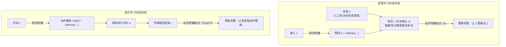

**两个关键区别的深层含义**：

1. **信息量不同**：标签 $\mathbf{y} = [0,0,0,1,0,...,0]$ 包含完整信息——它告诉你正确答案**是什么**（是类别 3）。而奖励 $r = 0.5$ 只告诉你**好不好**（还行），不告诉你最好的动作是什么。RL 需要通过大量试错才能从稀疏的奖励信号中逐步学到好策略。

2. **数据来源不同**：监督学习的训练数据是固定的（数据集预先准备好），网络的输出不影响下一个训练样本。RL 的"训练数据"是智能体自己通过交互产生的——当前策略决定了采取什么动作，动作决定了看到什么新状态，新状态又成为下一次决策的输入。**网络的输出直接改变了自己未来的输入。**

## 5.2 马尔可夫决策过程（MDP）

### 5.2.1 状态机的数学形式化

**定义（MDP）**：一个马尔可夫决策过程由五元组 $\langle \mathcal{S}, \mathcal{A}, P, R, \gamma \rangle$ 定义：

- $\mathcal{S}$：状态空间——智能体可能处于的所有状态的集合
- $\mathcal{A}$：动作空间——智能体可以执行的所有动作的集合
- $P(s'|s,a)$：状态转移概率——在状态 $s$ 执行动作 $a$ 后转移到状态 $s'$ 的概率，满足 $\sum_{s'} P(s'|s,a) = 1$
- $R(s,a,s')$：奖励函数——执行动作 $a$ 从状态 $s$ 转移到 $s'$ 获得的即时奖励
- $\gamma \in [0,1)$：折扣因子——控制对未来奖励的重视程度（$\gamma$ 接近 1 则更重视长远利益）

**马尔可夫性质**（状态机的核心假设）：未来状态仅依赖于当前状态和动作，与历史无关：

$$
P(s_{t+1} | s_t, a_t, s_{t-1}, a_{t-1}, \dots) = P(s_{t+1} | s_t, a_t)
$$

**这就是"状态机"的含义**——系统的演化完全由当前状态和选择的动作决定，无需记忆整个历史。

### 5.2.2 策略——神经网络在 RL 中的角色

**定义（策略）**：策略 $\pi$ 是从状态到动作概率分布的映射：

$$
\pi(a|s) = P(A_t = a | S_t = s), \quad \sum_{a \in \mathcal{A}} \pi(a|s) = 1
$$

**策略网络的具体实现**：使用神经网络参数化策略，输出层用 Softmax 将状态特征映射为动作概率分布：

$$
\pi_{\boldsymbol{\theta}}(a|s) = \text{softmax}(f_{\boldsymbol{\theta}}(s))_a = \frac{e^{f_{\boldsymbol{\theta}}(s)_a}}{\sum_{a'} e^{f_{\boldsymbol{\theta}}(s)_{a'}}}
$$

**注意**：这里的 Softmax 和监督学习分类网络的 Softmax 在数学上完全相同，但**含义不同**——分类网络输出"属于第 $i$ 类的概率"，策略网络输出"在当前状态下选择动作 $a$ 的概率"。

#### 模型与训练的本质区别

在深入 RL 的训练细节之前，必须明确一个基础概念：**模型和训练是两回事。**

| 概念 | 定义 | 类比 |
|------|------|------|
| **模型** | 一组权重矩阵 $W$ 和偏置 $b$ 的集合——这些数字就是模型的全部 | 一个雕塑（成品） |
| **训练** | 用数据/奖励**反复调整** $W$ 和 $b$ 的过程 | 雕刻过程 |
| **前向传播** | 给定输入，用当前 $W$ 计算出输出（$W \cdot s + b \rightarrow \text{Softmax} \rightarrow \pi(a|s)$） | 看雕塑当前长什么样 |
| **反向传播** | 根据奖励信号，计算梯度并修正 $W$ | 拿雕刻刀削一刀 |
| **梯度** | 训练过程中的**临时工具**——告诉 $W$ 应该往哪个方向调整、调整多少 | 雕刻刀的方向和力度 |

**关键认识**：

- **模型存储的是权重 $W$，不是梯度。** 梯度只在训练时作为临时工具出现，用完就丢弃。训练完成后，梯度不存在了，只留下被梯度"雕刻"过的权重。
- **预测时（前向传播）不涉及任何求导操作。** 纯粹就是矩阵乘法 + Softmax：$s \xrightarrow{W \cdot s + b} z \xrightarrow{\text{Softmax}} \pi(a|s)$。
- **权重矩阵 $W$ 定义了一组曲面**（参见第六章曲面拟合）——权重矩阵的每一行对应一个动作的评分函数。输入状态后，就是在这些曲面上"查值"（代入函数求值），不是求曲面的梯度。

> **误区纠正**："更新模型就是更新状态向量处各方向偏导值"——这个说法混淆了训练和推理两个阶段。正确的说法是：更新模型 = 用梯度修改权重 $W$（训练阶段）；使用模型 = 用 $W$ 对输入做矩阵乘法（推理阶段）。梯度是训练的工具，权重才是模型本身。

#### 训练时如何选择动作——采样机制详解

策略网络输出动作概率分布 $\pi(a|s)$ 后，**训练时和推理时的动作选择方式本质上相同：按概率采样。**

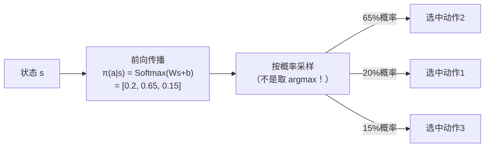

**但训练和推理的区别不在"怎么选"，而在"选完之后做什么"：**

| 阶段 | 动作选择方式 | 选完之后 |
|------|------------|---------|
| **推理**（使用模型） | 按概率采样，或直接取 $\arg\max$ | 执行动作，结束 |
| **训练**（更新模型） | 按概率采样（必须采样，不能 argmax） | 执行动作 → 拿到奖励 $r$ → 计算策略梯度 → 反向传播更新 $W$ |

**为什么训练时必须采样而不能取最大值？**

1. **探索需求**：训练初期，模型的概率分布是随机的，不知道哪个动作最好。如果每次都选概率最高的（贪心），可能永远不会尝试其他动作，错过更好的选择，陷入局部最优。
2. **策略梯度的数学要求**：策略梯度公式 $\nabla J = \mathbb{E}[\nabla\log\pi(a|s) \cdot G_t]$ 中的期望 $\mathbb{E}$ 要求动作是**按策略分布采样**的。如果人为干预选择，梯度估计就会有偏。
3. **自然过渡**：随着训练进行，Softmax 输出会越来越"尖锐"——好动作的概率越来越接近 1，差动作越来越接近 0。**模型自动从探索过渡到利用**，无需手动调节。

**训练时完整的一轮循环**：

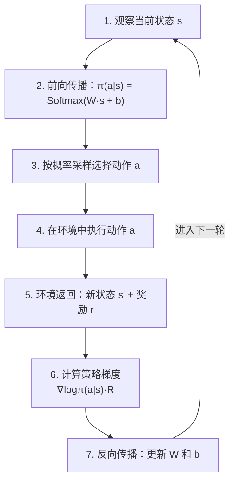

**注意步骤 3 到步骤 7 的区别**：步骤 3 是"用模型"（前向传播 + 采样），步骤 6~7 是"改模型"（计算梯度 + 反向传播）。模型和训练是两个独立的概念，训练是修改模型参数的过程。

### 5.2.3 价值函数——评估状态的好坏

**定义（状态价值函数）**：在策略 $\pi$ 下，从状态 $s$ 出发的期望累积折扣奖励：

$$
V^{\pi}(s) = \mathbb{E}_{\pi}\!\left[\sum_{k=0}^{\infty} \gamma^k R_{t+k+1} \;\middle|\; S_t = s\right]
$$

**定义（动作价值函数）**：在策略 $\pi$ 下，从状态 $s$ 执行动作 $a$ 后的期望累积折扣奖励：

$$
Q^{\pi}(s, a) = \mathbb{E}_{\pi}\!\left[\sum_{k=0}^{\infty} \gamma^k R_{t+k+1} \;\middle|\; S_t = s, A_t = a\right]
$$

两者的关系（策略是桥梁）：

$$
V^{\pi}(s) = \sum_{a \in \mathcal{A}} \pi(a|s) \, Q^{\pi}(s, a)
$$

### 5.2.4 贝尔曼方程——连接新旧状态的桥梁

**定理（贝尔曼期望方程）**：价值函数满足如下递归关系：

$$
V^{\pi}(s) = \sum_{a} \pi(a|s) \sum_{s'} P(s'|s,a) \Big[ R(s,a,s') + \gamma \, V^{\pi}(s') \Big]
$$

$$
Q^{\pi}(s,a) = \sum_{s'} P(s'|s,a) \Big[ R(s,a,s') + \gamma \sum_{a'} \pi(a'|s') \, Q^{\pi}(s', a') \Big]
$$

**直觉解释**：当前状态的价值 = 即时奖励 + 折扣后的下一状态价值的期望。这构建了**新旧状态之间的数学桥梁**——贝尔曼方程是整个 RL 理论的基石。

**贝尔曼最优方程**：最优策略 $\pi^*$ 对应的价值函数满足：

$$
V^*(s) = \max_{a} \sum_{s'} P(s'|s,a) \Big[ R(s,a,s') + \gamma \, V^*(s') \Big]
$$

$$
Q^*(s,a) = \sum_{s'} P(s'|s,a) \Big[ R(s,a,s') + \gamma \max_{a'} Q^*(s', a') \Big]
$$

## 5.3 奖励驱动的参数修正

### 5.3.1 时序差分（TD）误差——新旧状态对比的量化

**定义（TD 误差）**：

$$
\delta_t = R_{t+1} + \gamma \, V(S_{t+1}) - V(S_t)
$$

**新旧状态对比的数学表达**：

- $V(S_t)$：基于旧参数对当前状态的价值估计（"预期"）
- $R_{t+1} + \gamma V(S_{t+1})$：实际奖励 + 新状态的折扣价值估计（"现实"）
- $\delta_t$：现实与预期的差距。正值表示"比预期好"，负值表示"比预期差"

**参数更新规则（TD(0)）**：

$$
\mathbf{w}_{t+1} = \mathbf{w}_t + \alpha \, \delta_t \, \nabla_{\mathbf{w}} V(S_t; \mathbf{w}_t)
$$

### 5.3.2 策略梯度——奖励如何驱动参数修正

**策略梯度定理**（RL 中梯度计算的核心，对应监督学习中的 $\nabla \mathcal{L} = p - y$）：

$$
\nabla_{\boldsymbol{\theta}} J(\boldsymbol{\theta}) = \mathbb{E}_{\pi_{\boldsymbol{\theta}}}\!\left[\sum_{t=0}^{T} \nabla_{\boldsymbol{\theta}} \log \pi_{\boldsymbol{\theta}}(A_t | S_t) \cdot G_t\right]
$$

其中 $G_t = \sum_{k=0}^{T-t} \gamma^k R_{t+k+1}$ 是从时刻 $t$ 起的累积折扣回报。

**与监督学习梯度的对比**：

|          | 监督学习                                       | 强化学习                                                   |
| -------- | ---------------------------------------------- | ---------------------------------------------------------- |
| 梯度公式 | $\nabla_\theta \mathcal{L} = p_i - y_i$      | $\nabla_\theta J = \nabla_\theta \log\pi(a|s) \cdot G_t$ |
| 方向信息 | 标签$y_i$ 告诉"应该是什么"                   | $\nabla\log\pi$ 告诉"让该动作概率增大的方向"             |
| 幅度信息 | 误差大小$|p_i - y_i                      | $ |                                                            |
| 信号质量 | 精确（标签是确定的）                           | 有噪声（奖励是随机的）                                     |

**奖励的影响机制**：

1. **$\nabla_{\boldsymbol{\theta}} \log \pi_{\boldsymbol{\theta}}(A_t|S_t)$**：参数空间中使动作 $A_t$ 概率增大的方向
2. **$G_t$（奖励信号）**：作为缩放因子
   - 若 $G_t > 0$（正奖励）：沿 $\nabla \log \pi$ 方向更新，**增大**该动作的概率
   - 若 $G_t < 0$（负奖励）：沿 $-\nabla \log \pi$ 方向更新，**减小**该动作的概率
   - $|G_t|$ 越大：参数修正幅度越大

## 5.4 动态修正策略

### 5.4.1 优势函数与基线减除

**定义（优势函数）**：

$$
A^{\pi}(s, a) = Q^{\pi}(s, a) - V^{\pi}(s)
$$

**作用**：衡量动作 $a$ 相对于平均水平的优劣。使用优势函数替代原始回报可显著降低梯度估计的方差：

$$
\nabla_{\boldsymbol{\theta}} J(\boldsymbol{\theta}) = \mathbb{E}_{\pi}\!\left[\sum_t \nabla_{\boldsymbol{\theta}} \log \pi_{\boldsymbol{\theta}}(A_t|S_t) \cdot A^{\pi}(S_t, A_t)\right]
$$

**基线减除的合理性**：任何仅依赖于状态的基线 $b(s)$ 都不会引入偏差，因为：

$$
\mathbb{E}_{a \sim \pi}\!\left[\nabla_{\boldsymbol{\theta}} \log \pi_{\boldsymbol{\theta}}(a|s) \cdot b(s)\right] = b(s) \sum_a \nabla_{\boldsymbol{\theta}} \pi_{\boldsymbol{\theta}}(a|s) = b(s) \cdot \nabla_{\boldsymbol{\theta}} 1 = 0
$$

### 5.4.2 Actor-Critic 架构

将策略（Actor）和价值函数（Critic）分别用两个神经网络参数化：

- **Actor（策略网络）**：$\pi_{\boldsymbol{\theta}}(a|s)$，输出动作概率
- **Critic（价值网络）**：$V_{\mathbf{w}}(s)$，估计状态价值

**参数更新规则**：

Critic 更新（最小化 TD 误差的平方）：

$$
\mathbf{w} \leftarrow \mathbf{w} + \alpha_w \, \delta_t \, \nabla_{\mathbf{w}} V_{\mathbf{w}}(S_t)
$$

Actor 更新（策略梯度）：

$$
\boldsymbol{\theta} \leftarrow \boldsymbol{\theta} + \alpha_{\theta} \, \delta_t \, \nabla_{\boldsymbol{\theta}} \log \pi_{\boldsymbol{\theta}}(A_t | S_t)
$$

其中 TD 误差 $\delta_t = R_{t+1} + \gamma V_{\mathbf{w}}(S_{t+1}) - V_{\mathbf{w}}(S_t)$ 同时作为 Critic 的学习信号和 Actor 的优势估计。

**注意**：Actor 和 Critic 内部的反向传播机制与第四章完全一致——链式法则逐层计算梯度。不同的只是**梯度起点**：Critic 用 TD 误差，Actor 用策略梯度。

### 5.4.3 PPO（近端策略优化）

**动机**：策略梯度的一个核心问题是更新步长——步长太大导致策略崩溃，太小则训练缓慢。

**定义（PPO-Clip 目标函数）**：

$$
L^{\text{CLIP}}(\boldsymbol{\theta}) = \mathbb{E}_t\!\left[\min\!\left(r_t(\boldsymbol{\theta}) \hat{A}_t, \; \text{clip}(r_t(\boldsymbol{\theta}), 1-\epsilon, 1+\epsilon) \hat{A}_t\right)\right]
$$

其中概率比：

$$
r_t(\boldsymbol{\theta}) = \frac{\pi_{\boldsymbol{\theta}}(A_t | S_t)}{\pi_{\boldsymbol{\theta}_{\text{old}}}(A_t | S_t)}
$$

**clip 机制分析**：

- 当 $\hat{A}_t > 0$（好动作）：$r_t$ 被限制不超过 $1+\epsilon$，防止过度增大该动作概率
- 当 $\hat{A}_t < 0$（坏动作）：$r_t$ 被限制不低于 $1-\epsilon$，防止过度减小该动作概率
- 典型值 $\epsilon = 0.2$

**收敛性保证**：PPO 通过限制新旧策略之间的距离，隐式地施加了信任域约束：

$$
D_{\text{KL}}(\pi_{\boldsymbol{\theta}_{\text{old}}} \| \pi_{\boldsymbol{\theta}}) \leq \delta
$$

### 5.4.4 策略改进定理

**定理**：若对所有状态 $s$ 有 $\sum_a \pi_{\text{new}}(a|s) A^{\pi_{\text{old}}}(s,a) \geq 0$，则：

$$
J(\pi_{\text{new}}) \geq J(\pi_{\text{old}})
$$

**证明思路**：

$$
J(\pi_{\text{new}}) - J(\pi_{\text{old}}) = \frac{1}{1-\gamma} \mathbb{E}_{s \sim d^{\pi_{\text{new}}}}\!\left[\sum_a \pi_{\text{new}}(a|s) A^{\pi_{\text{old}}}(s,a)\right] \geq 0
$$

这意味着只要优势函数的期望非负，每一步策略更新都保证性能不退化——这是 RL 中参数动态修正的理论基石。

```
算法: PPO-Clip
输入: 初始策略参数 θ₀, 价值参数 w₀
超参数: clip范围 ε, 学习率 α_θ, α_w, epochs K

for iteration = 1, 2, ... do
    // 1. 采集数据
    使用当前策略 π_{θ_old} 采集 T 步轨迹
    计算优势估计 Â_t (GAE 或 TD 误差)
  
    // 2. 多轮更新
    for epoch = 1 to K do
        for 每个 mini-batch do
            rₜ(θ) ← π_θ(aₜ|sₜ) / π_{θ_old}(aₜ|sₜ)
            L_clip ← E[min(rₜÂₜ, clip(rₜ, 1-ε, 1+ε)·Âₜ)]
            L_value ← E[(Vw(sₜ) - Vₜ_target)²]
    
            θ ← θ + α_θ · ∇_θ L_clip      // 策略更新
            w ← w - α_w · ∇_w L_value      // 价值更新
        end for
    end for
    θ_old ← θ
end for
```

> **过渡说明**：至此，核心的强化学习理论框架已经建立。下一章将拓展两个高级概念：向量空间表示和多维曲面拟合，并明确它们在不同架构中的不同含义。

---

# 六、高级概念拓展

> **本章定位**：本章探讨两个贯穿不同架构的高级概念——空间向量表示和多维曲面拟合。关键是理解：这些概念在不同架构中有不同的表现形式和含义。

## 6.1 空间向量表示

### 6.1.1 嵌入空间的基本思想

**定义（嵌入）**：嵌入是将离散符号（如单词、token、状态）映射到连续向量空间的函数：

$$
\text{Embed}: \mathcal{V} \to \mathbb{R}^d
$$

其中 $\mathcal{V}$ 是符号集合（如词汇表），$d$ 是嵌入维度。

**为什么需要嵌入**：神经网络只能处理连续数值。离散符号（如"猫"、"狗"、"上"、"下"）本身没有数值意义，必须先转换为向量才能输入网络。嵌入的关键优势是：经过训练后，语义相似的符号会被映射到向量空间中相近的位置。

向量之间的余弦相似度衡量语义相似性：

$$
\text{sim}(\mathbf{u}, \mathbf{v}) = \frac{\mathbf{u} \cdot \mathbf{v}}{\|\mathbf{u}\| \cdot \|\mathbf{v}\|} = \cos\theta
$$

### 6.1.2 向量表示在不同架构中的角色

**在前馈网络中**：每层的激活向量 $\mathbf{a}^{(l)}$ 可以看作输入在该层"特征空间"中的坐标。层层变换相当于在不同坐标系之间做非线性映射。但这些向量之间**没有动态交互**——每个样本独立处理。

**在 Transformer 中**：每个 token 被表示为嵌入向量 $\mathbf{x}_i \in \mathbb{R}^d$。注意力机制的核心操作就是在这个向量空间中，让 token 之间**动态地交换信息**。

注意力机制的向量空间解释：

$$
\text{Attention}(\mathbf{Q}, \mathbf{K}, \mathbf{V}) = \text{softmax}\!\left(\frac{\mathbf{Q}\mathbf{K}^T}{\sqrt{d_k}}\right) \mathbf{V}
$$

- $\mathbf{Q}\mathbf{K}^T$：计算查询向量与所有键向量的内积——在高维空间中测量方向相似度
- $\text{softmax}(\cdot/\sqrt{d_k})$：将相似度分数转换为概率权重
- 乘以 $\mathbf{V}$：以注意力权重对值向量进行加权平均

几何直觉：注意力机制让每个 token 在向量空间中，根据与其他 token 的相似度，动态地"移动"到新的位置——这个新位置是所有值向量的加权组合。

缩放因子 $\sqrt{d_k}$ 的作用：当 $d_k$ 很大时，内积的方差为 $d_k$，除以 $\sqrt{d_k}$ 使其方差稳定为 1，防止 Softmax 输入过大导致梯度消失。

**在强化学习中**：状态 $s$ 本身可以被表示为向量（如游戏画面的特征提取结果），策略网络在这个状态向量空间中学习"哪些状态区域应该采取什么动作"。价值函数 $V(s)$ 则在状态空间上定义了一个标量场。

### 6.1.3 多头注意力的子空间分解

**定义（多头注意力）**：

$$
\text{MultiHead}(\mathbf{Q}, \mathbf{K}, \mathbf{V}) = \text{Concat}(\text{head}_1, \dots, \text{head}_h) \mathbf{W}^O
$$

其中每个注意力头：

$$
\text{head}_i = \text{Attention}(\mathbf{Q}\mathbf{W}_i^Q, \mathbf{K}\mathbf{W}_i^K, \mathbf{V}\mathbf{W}_i^V)
$$

**子空间分解的意义**：

- 每个头将输入投影到不同的子空间（$\mathbb{R}^{d_k}$，其中 $d_k = d/h$）
- 不同的头可以捕获不同类型的关系（如语法关系、语义关系、位置关系）
- 最终通过 $\mathbf{W}^O$ 将多个子空间的信息融合回原始维度

时间复杂度：对序列长度 $n$，$h$ 头总计 $O(n^2 d)$。空间复杂度：需存储 $n \times n$ 的注意力矩阵，$O(h \cdot n^2)$。

### 6.1.4 位置编码——注入序列顺序信息

注意力机制本身是置换不变的（交换 token 顺序不影响输出），因此需要位置编码注入顺序信息。

**正弦位置编码**：

$$
PE_{(pos, 2i)} = \sin\!\left(\frac{pos}{10000^{2i/d}}\right), \quad PE_{(pos, 2i+1)} = \cos\!\left(\frac{pos}{10000^{2i/d}}\right)
$$

几何解释：每个位置被编码为 $d/2$ 个不同频率的正弦波的采样点，在高维空间中形成一条螺旋曲线。

---

## 6.2 多维曲面拟合

### 6.2.1 函数逼近的统一视角

**定义（函数逼近）**：神经网络本质上是一个参数化的函数逼近器。给定目标函数 $f^*$，网络 $f_{\boldsymbol{\theta}}$ 试图逼近它：

$$
\min_{\boldsymbol{\theta}} \; \mathbb{E}_{\mathbf{x} \sim \mathcal{D}}\!\left[\|f_{\boldsymbol{\theta}}(\mathbf{x}) - f^*(\mathbf{x})\|^2\right]
$$

**万能逼近定理**：对于任意连续函数 $f^*: [0,1]^n \to \mathbb{R}$ 和任意 $\epsilon > 0$，存在一个单隐层网络（具有足够多的隐层神经元和非线性激活），使得：

$$
\sup_{\mathbf{x} \in [0,1]^n} |f_{\boldsymbol{\theta}}(\mathbf{x}) - f^*(\mathbf{x})| < \epsilon
$$

### 6.2.2 曲面拟合在不同架构中的不同含义

**这是一个容易混淆的重点**——"曲面拟合"这个概念在不同架构中指代的东西很不一样：

**在前馈网络中：决策边界的雕刻**

分层前馈网络通过多层神经元的激活/熄灭组合，在输入空间中雕刻出**决策边界**。以 ReLU 网络为例：

- 每个神经元划分一个超平面
- 多个神经元的组合将空间切分为多面体区域
- 在每个区域内，网络是一个不同的线性函数
- 整体输出是一个**分片线性函数**——用大量小平面"拼凑"出复杂曲面

网络深度的增加使区域数量指数级增长：

$$
N_{\text{regions}} \leq \prod_{l=1}^{L-1} \left\lfloor \frac{n_l}{n_0} \right\rfloor^{n_0} \cdot \sum_{j=0}^{n_0} \binom{n_L}{j}
$$

**这种拟合方式的特点**：像用折纸（分片线性）来近似曲面。层数越深，折痕越多，能逼近的曲面越复杂。但本质上是**静态的、局部的**——每个区域的线性映射在训练后就固定了。

**在注意力架构/Transformer 中：动态曲面**

Transformer 的"曲面"不是固定的——注意力权重随输入变化，因此网络在不同输入下有效地使用**不同的计算路径**。这更接近于在高维向量空间中的**动态几何变换**：

- 每个 token 的表示在注意力层中被"推拉"到新位置
- 这些位置取决于输入序列中所有 token 的关系
- 最终的输出不是对固定曲面的查表，而是对输入内容的**动态响应**

**在强化学习中：价值曲面与策略曲面的联合优化**

RL 中同时存在两个需要拟合的"曲面"，而且它们相互耦合：

**价值曲面**：$V(s): \mathbb{R}^n \to \mathbb{R}$——状态空间上的标量场。Critic 网络拟合这个曲面：

$$
\min_{\mathbf{w}} \; \mathbb{E}\!\left[\left(R + \gamma V_{\mathbf{w}^-}(s') - V_{\mathbf{w}}(s)\right)^2\right]
$$

价值曲面描述了"每个状态有多好"，其梯度 $\nabla_s V(s)$ 指向价值增长最快的方向——直觉上就是"应该往哪个状态方向移动"。

**策略曲面**：$\pi_\theta(a|s)$——状态空间上的概率分布场。Actor 网络优化这个曲面：

$$
\max_{\boldsymbol{\theta}} \; J(\boldsymbol{\theta}) = \mathbb{E}_{\tau \sim \pi_{\boldsymbol{\theta}}}\!\left[\sum_{t=0}^T \gamma^t R_t\right]
$$

**两个曲面的耦合**：价值曲面为策略优化提供方向信号（优势函数），策略曲面的变化改变了数据分布从而影响价值估计。这种耦合使得 RL 的训练比监督学习困难得多。

### 6.2.3 曲面视角的统一与区分

| 架构        | "曲面"的含义           | 曲面的性质       | 拟合方式               |
| ----------- | ---------------------- | ---------------- | ---------------------- |
| 前馈网络    | 输入空间中的决策边界   | 静态、分片线性   | 多层激活/熄灭的组合    |
| Transformer | 向量空间中的动态变换   | 随输入动态变化   | 注意力权重的动态路由   |
| RL (Critic) | 状态空间上的价值标量场 | 随策略更新而变化 | TD 误差驱动的逐步修正  |
| RL (Actor)  | 状态空间上的策略概率场 | 随价值估计而变化 | 策略梯度驱动的方向调整 |

**你的直觉是正确的**——"多维空间曲面包络拟合"的思维确实更接近 RL 和注意力架构的工作方式，而非前馈网络。前馈网络更像是在"折叠空间"（分片线性近似），而 RL 和 Transformer 更像是在"雕刻高维曲面"（连续的、动态的函数逼近）。

### 6.2.4 损失景观的高维几何

训练过程可理解为在参数空间中调整 $\boldsymbol{\theta}$，使网络定义的曲面逐步"贴合"目标。

损失函数 $J(\boldsymbol{\theta})$ 本身也是参数空间上的高维曲面。对于 $d$ 维参数空间中的临界点 $\nabla J = 0$：

- 局部极小值的概率随维度 $d$ 指数级减小
- 高维空间中的临界点几乎都是鞍点
- SGD 的噪声有助于逃离鞍点——随机扰动使参数沿负曲率方向滑落

Hessian 矩阵 $\mathbf{H} = \nabla^2 J$ 描述损失曲面的局部曲率：

$$
H_{ij} = \frac{\partial^2 J}{\partial \theta_i \partial \theta_j}
$$

- 特征值全正 → 局部凸（极小值）
- 特征值全负 → 局部凹（极大值）
- 正负混合 → 鞍点

## 6.3 实际应用场景

### 6.3.1 连续控制（如机器人关节控制）

- 状态空间：关节角度、角速度等，$s \in \mathbb{R}^{20+}$
- 动作空间：关节扭矩，$a \in \mathbb{R}^{10+}$
- 策略网络输出高斯分布的均值和方差：$\pi_{\boldsymbol{\theta}}(a|s) = \mathcal{N}(\mu_{\boldsymbol{\theta}}(s), \sigma_{\boldsymbol{\theta}}^2(s))$
- 价值曲面是 20+ 维空间上的标量场

### 6.3.2 大语言模型的 RLHF 对齐

- 状态：对话上下文（token 序列的嵌入表示）
- 动作：下一个 token 的选择
- 奖励：人类偏好模型的打分
- 策略网络就是语言模型本身（Transformer 架构），Softmax 输出 token 概率分布
- 使用 PPO 算法微调模型参数

**注意架构的组合**：RLHF 是一个典型的"架构交叉"案例——Transformer 作为策略网络的内部实现，嵌入在 RL 的状态机循环中。底层神经元计算不变，但同时涉及注意力机制（Transformer 架构）和奖励驱动的策略优化（RL 架构）。

### 6.3.3 游戏AI（如围棋、Atari）

- 状态：棋盘/游戏画面
- 动作：可选的移动/操作
- 价值网络和策略网络共享底层特征提取器
- 蒙特卡洛树搜索（MCTS）+ 神经网络评估 = AlphaGo 架构

---

# 总结：核心思想链条与架构区分

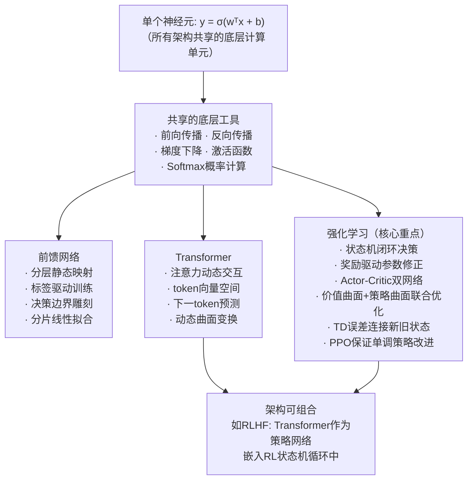

**核心认识**：

1. **神经元**是通用的计算砖块——所有架构共享 $y = \sigma(\mathbf{w}^T\mathbf{x} + b)$
2. **架构**是砖块的组织方式——前馈、注意力、状态机是本质不同的"建筑"
3. **训练范式**是独立于架构的第三个维度——监督学习（标签驱动）、强化学习（奖励驱动）、自监督学习可以与任何架构自由组合
4. **标签不是神经元运算的一部分**——标签只在网络外部的损失函数中出场，它属于监督学习的训练范式，RL 中没有标签
5. **概率计算**（Softmax）是通用工具，但在不同架构中服务于不同目的（预测概率 / 注意力权重 / 动作概率）
6. **反向传播**的传递机制通用，但**梯度起点信号**因训练目标不同而不同（$p-y$ vs $\nabla\log\pi \cdot R$）
7. **曲面拟合**在前馈网络中是静态的分片线性近似，在 RL 和 Transformer 中是动态的高维曲面优化
8. **当前没有万能架构**——不同问题的数学结构决定了最适合的架构选择
9. **架构可以组合**——如 RLHF 将 Transformer 嵌入 RL 框架，利用两种架构的互补优势
10. **模型和训练是两个独立概念**——模型是一组权重数字（静态数据），训练是修改这些数字的过程（动态过程）。梯度是训练的临时工具，训练完就不存在了
11. **RL 训练时按概率采样选动作**——Softmax 输出的概率分布天然兼顾探索与利用，训练时必须采样（不能贪心取最大），推理时可以采样也可以取最大

**常见误区速查**（详见第二章 2.4 节）：

| 误区 | 纠正 |
|------|------|
| "标签是神经元运算的一部分" | 标签只在损失函数中出场，不进入网络内部 |
| "所有训练都需要标签" | 只有监督学习需要标签，RL 用奖励，自监督用自构造目标 |
| "RL 的状态向量 = 标签" | 状态对应"输入 x"，不是"标签 y"。RL 中没有标签 |
| "不同架构的神经元计算方式不同" | 单个神经元完全一样，不同的是连接方式和组织结构 |
| "Softmax 只用于分类" | Softmax 在注意力层做信息路由，在 RL 策略网络做动作选择，用途广泛 |
| "反向传播在不同架构中原理不同" | 链式法则传递机制完全一样，不同的是梯度起点信号和计算图路径 |
| "交叉熵是通用的损失函数" | 交叉熵只属于监督学习分类任务。RL 用策略梯度目标函数，回归用 MSE。损失函数的选择取决于训练范式，不是架构 |
| "模型存储了梯度/偏导" | 模型存储的是权重 $W$，梯度是训练的临时工具，用完就丢弃 |
| "预测时需要求偏导" | 预测（前向传播）只做矩阵乘法 + Softmax，不涉及任何求导操作 |
| "训练时应该选概率最高的动作" | 训练时必须按概率采样以保证探索；贪心选择会陷入局部最优 |
