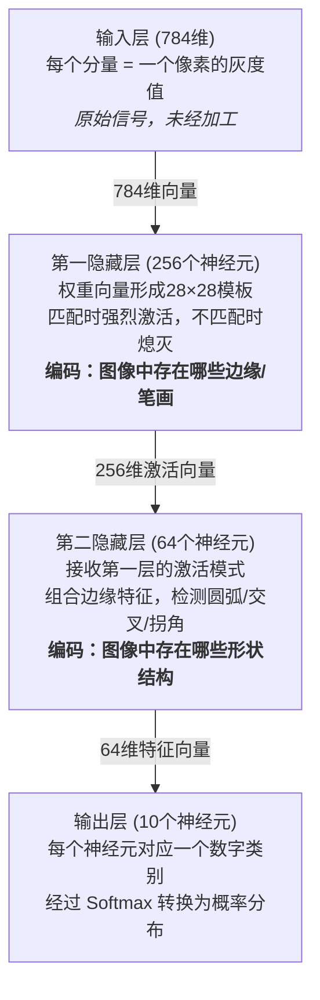
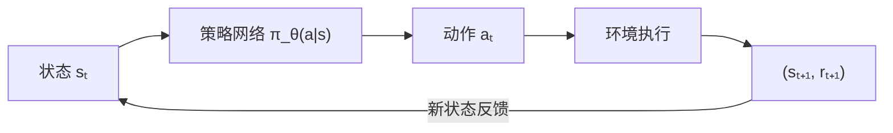
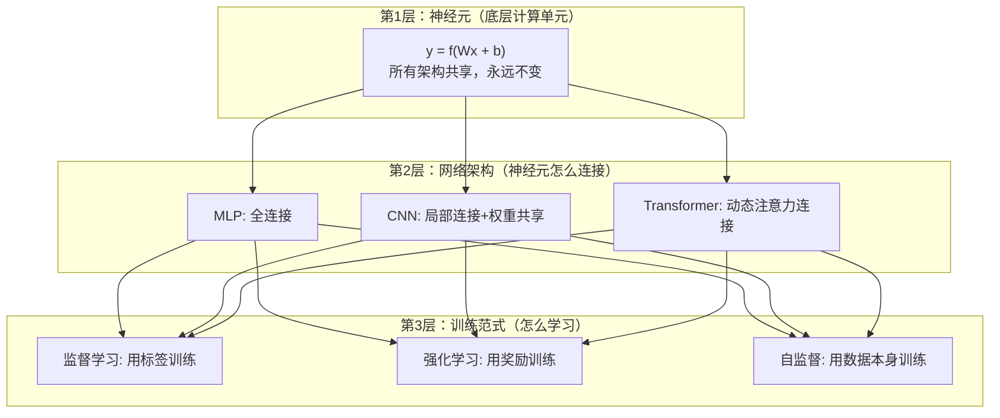
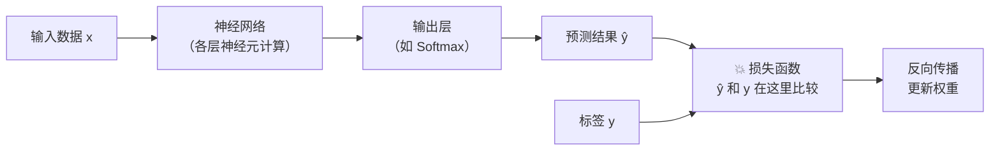
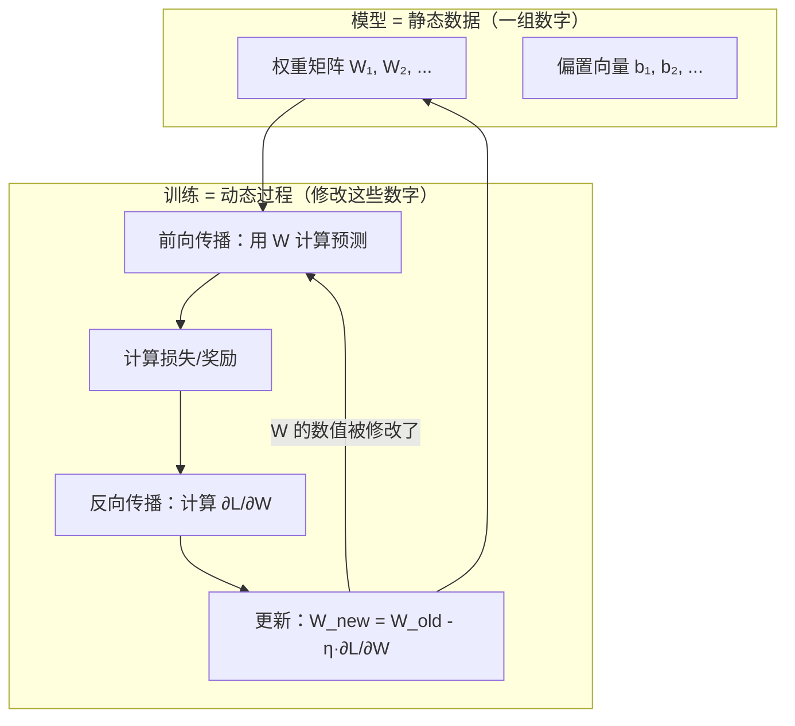
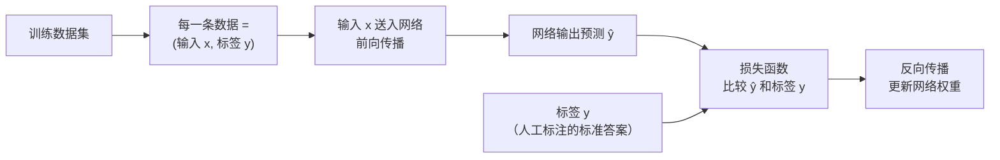
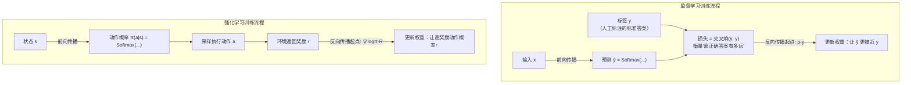
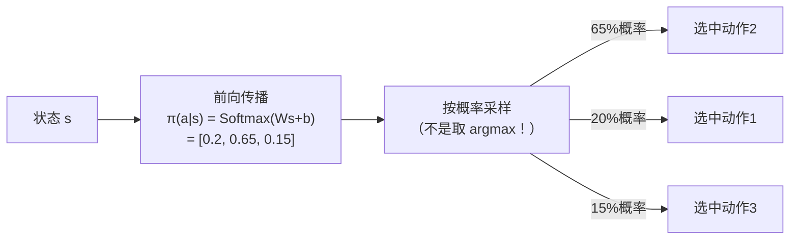
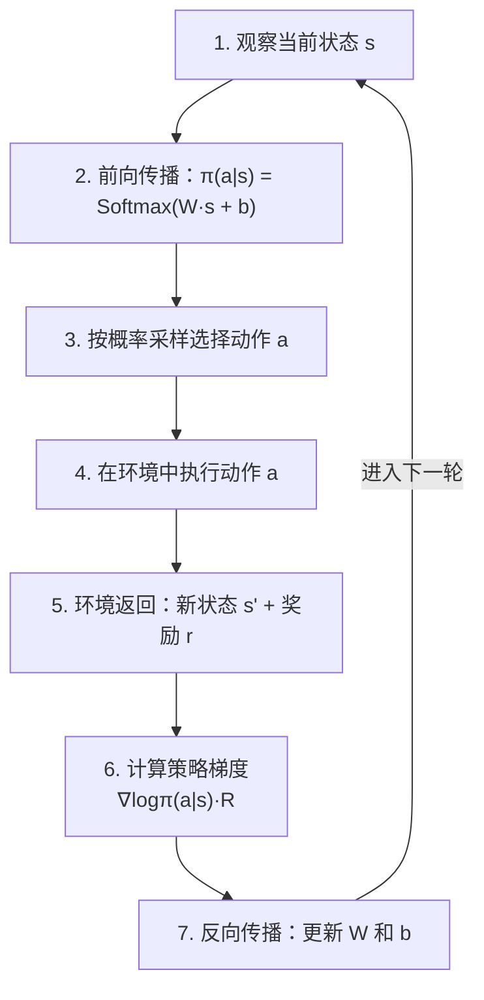
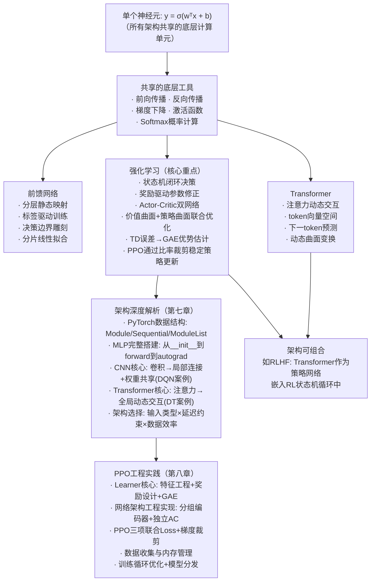

# 神经元概率预测：从基础理论到强化学习的完整技术文档

---

> **文档目标**：从单个神经元的数学模型出发，逐步建立概率预测体系，深入梯度优化与反向传播机制，并明确区分不同网络架构在解决不同类问题时的本质差异，在强化学习框架下统一理解奖励驱动的参数修正与高维空间拟合，最终以一个完整的 PPO 工程项目为案例，展示理论概念在分布式 Actor-Learner 架构中的落地实现。
>
> **核心提醒**：底层神经元的计算机制（加权求和→激活→输出）是所有架构共享的"砖块"，但不同架构是完全不同的"建筑"。**标签、Softmax、反向传播这三个概念分属不同层次**——标签仅属于监督学习的训练范式（RL 中没有标签），Softmax 是通用的概率计算工具（但在不同架构中扮演不同角色），反向传播的传递机制通用但梯度起点信号因训练范式而异。本文档在第二章 2.4 节专门辨析这些常见混淆点，避免将神经元运算、网络架构和训练范式混为一谈。

---

# 一、基础理论：单个神经元的数学模型

> **本章定位**：讨论的是所有神经网络架构共享的最底层计算单元——单个神经元。无论后续架构如何变化，每个神经元内部的数学运算都遵循本章描述的规则。

## 1.1 神经元数学模型

### 1.1.1 为什么需要神经元？——从线性模型的局限说起

假设我们面对一个最简单的任务：根据一组输入特征做出判断。最直觉的做法是**线性模型**——对每个输入乘以一个重要性系数，再加起来：

$$
z = w_1 x_1 + w_2 x_2 + \dots + w_n x_n + b
$$

但线性模型的致命缺陷是：**它只能表示线性关系**。现实世界中绝大多数问题（图像识别、语言理解、决策控制）都是非线性的。比如，判断一张图片是否是猫，不可能是像素值的简单加权和。

**解决思路**：在线性计算之后，加一个**非线性变换**（称为激活函数 $\sigma$ ），这样即使单个计算单元是简单的，大量单元组合起来就能逼近任意复杂的非线性函数。这就是人工神经元的设计动机。

### 1.1.2 单神经元的数学定义

**定义（单神经元模型）**：给定输入向量 $\mathbf{x} = (x_1, x_2, \dots, x_n)^T \in \mathbb{R}^n$ ，权重向量 $\mathbf{w} = (w_1, w_2, \dots, w_n)^T \in \mathbb{R}^n$ ，偏置 $b \in \mathbb{R}$ ，以及激活函数 $\sigma: \mathbb{R} \to \mathbb{R}$ ，单个神经元的输出为：

$$
y = \sigma\!\left(\sum_{i=1}^{n} w_i x_i + b\right) = \sigma(\mathbf{w}^T \mathbf{x} + b)
$$

**每个组件的含义和存在理由**：

- **输入 $\mathbf{x}$** ：一个**完整的向量**（不是单个数值）。例如一张 $28 \times 28$ 的手写数字图像， $\mathbf{x}$ 就是 784 维向量，每个分量代表一个像素的灰度值。一个神经元**同时接收所有输入分量**。
- **权重 $\mathbf{w}$** ：控制每个输入分量的重要性。 $w_i$ 大意味着第 $i$ 个输入对该神经元的输出影响大。权重是**需要学习的参数**——训练的核心就是找到合适的权重值。
- **偏置 $b$**：允许神经元在没有任何输入时也能产生非零的净输入。几何上，偏置控制激活函数的"触发阈值"——类似生物神经元需要足够的刺激才会兴奋。
- **净输入 $z = \mathbf{w}^T\mathbf{x} + b$**：加权求和的结果，是一个标量。这一步是纯线性运算。l
- **激活函数 $\sigma$**：引入非线性的关键。没有它，无论多少个神经元叠加，整体仍是线性变换（线性函数的复合仍是线性函数）。

**关键理解**：一个神经元接收一个**多维输入向量**，内部有**多个可学习参数**（ $n$ 个权重 + 1 个偏置），输出一个**标量**。训练时，反向传播会**同时计算并修正这所有 $n+1$ 个参数**。

### 1.1.3 激活函数——为什么需要以及如何选择

**为什么需要激活函数**：如果没有激活函数（或使用恒等函数 $\sigma(z)=z$ ），那么多层神经元的复合仍然是线性的：

$$
\mathbf{W}^{(2)}(\mathbf{W}^{(1)}\mathbf{x} + \mathbf{b}^{(1)}) + \mathbf{b}^{(2)} = \mathbf{W}'\mathbf{x} + \mathbf{b}'
$$

这等价于一个单层线性模型，完全无法处理非线性问题。激活函数打破了这种线性叠加，使得深层网络拥有远超浅层的表达能力。

**常用激活函数**：

**Sigmoid 函数**：将实数映射到 $(0,1)$ 区间。

$$
\sigma(z) = \frac{1}{1 + e^{-z}}
$$

其导数具有优雅的自乘形式，这使得梯度计算非常高效：

$$
\sigma'(z) = \sigma(z)(1 - \sigma(z))
$$

- **优势**：输出天然具有"概率"含义（0到1之间）
- **劣势**：当 $|z|$ 很大时， $\sigma'(z) \approx 0$ ，梯度几乎为零——这就是**梯度消失问题**，会导致深层网络的底层参数几乎无法更新
- **典型场景**：二分类任务的输出层

**Tanh 函数**：将实数映射到 $(-1,1)$ 区间，输出以零为中心。

$$
\tanh(z) = \frac{e^z - e^{-z}}{e^z + e^{-z}}, \qquad \tanh'(z) = 1 - \tanh^2(z)
$$

- **优势**：零中心输出，使得下一层神经元的输入均值接近零，有利于梯度流动
- **劣势**：同样存在梯度消失问题
- **典型场景**：RNN 隐藏层

**ReLU 函数**：修正线性单元，当前最广泛使用的激活函数。

$$
\text{ReLU}(z) = \max(0, z), \qquad \text{ReLU}'(z) = \begin{cases} 1 & z > 0 \\ 0 & z < 0 \end{cases}
$$

- **优势**：正区间梯度恒为 1，在正半轴有效缓解梯度消失问题；计算极其高效（无需指数运算）
- **劣势**：负区间梯度为 0，可能导致"神经元死亡"（输入持续落入负区间时该神经元停止学习）。工程上可通过 LeakyReLU、Batch Normalization、残差连接等机制缓解此问题
- **典型场景**：CNN/DNN 隐藏层，是目前的默认选择

**激活函数对比**：

| 激活函数 | 输出范围        | 优势                 | 劣势               | 典型场景      |
| -------- | --------------- | -------------------- | ------------------ | ------------- |
| Sigmoid  | $(0,1)$       | 概率解释直观         | 梯度消失、非零中心 | 二分类输出层  |
| Tanh     | $(-1,1)$      | 零中心输出           | 梯度消失           | RNN隐藏层     |
| ReLU     | $[0,+\infty)$ | 计算快、缓解梯度消失 | 神经元死亡问题（$z<0$ 区域梯度恒为 0，一旦进入便永远无法恢复）     | CNN/DNN隐藏层 |
| LeakyReLU | $(-\infty,+\infty)$ | 解决神经元死亡（负区间保留小斜率 $\alpha z$，$\alpha$ 通常取 0.01） | 引入额外超参 $\alpha$ | RL动作头MLP（本项目使用） |

> **ReLU 死亡神经元与 RL 的关联**：在强化学习中，由于策略更新可能比监督学习更加剧烈（尤其是训练初期奖励信号高度不稳定），ReLU 的死亡神经元问题更容易触发。这也是 PPO 强调"每次只做微小更新"（clip 机制）的工程动因之一——过大的梯度更新可能导致大量 ReLU 神经元永久失活，从而降低网络的有效容量。本项目使用 LeakyReLU 来规避此风险。

### 1.1.4 单神经元的几何意义

理解单个神经元的几何含义对后续理解不同架构至关重要：

**超平面划分**：单个神经元的净输入 $z = \mathbf{w}^T\mathbf{x} + b = 0$ 在输入空间中定义了一个**超平面**，将空间划分为两个半空间。激活函数对两侧施加不同的响应：

- 以 ReLU 为例：超平面一侧（ $z > 0$ ）输出线性增长，另一侧（ $z < 0$ ）完全静默（输出为 0）
- 以 Sigmoid 为例：超平面一侧趋近 1（"激活"），另一侧趋近 0（"熄灭"）

**单个神经元 = 一个"特征探测器"**：权重向量 $\mathbf{w}$ 定义了该神经元"关注"的输入模式方向。当输入 $\mathbf{x}$ 与 $\mathbf{w}$ 方向一致（内积大）时，神经元强烈激活；方向相反时，神经元熄灭。

> **过渡说明**：到此为止，我们讨论的都是**单个神经元**——所有架构共享的基本计算单元。下面简要介绍一个通用的概率计算工具 Softmax，然后进入下一章讨论网络架构的差异。

---

## 1.2 Softmax——通用的概率输出工具

> **本节定位**：Softmax 是一个**数学工具**，不属于任何特定的架构或训练范式。它的作用是将任意实数向量转换为概率分布。无论是监督学习的分类、Transformer 的注意力权重、还是强化学习的动作选择，只要需要概率输出，都可以使用 Softmax。本节只给出定义和关键性质；详细的设计动机分析和梯度推导见第三章。

### 1.2.1 为什么需要概率输出

神经网络的最后一层输出通常是一组原始分数（logits），记为 $\mathbf{z} = (z_1, z_2, \dots, z_K)^T$ 。这些值的范围是 $(-\infty, +\infty)$ ，无法直接解释为概率。需要一个函数将其转换为满足概率约束的分布：

$$
p_i \geq 0 \quad \forall i, \qquad \sum_{i=1}^{K} p_i = 1
$$

### 1.2.2 Softmax 函数定义与性质

**定义（Softmax）**：Softmax 函数将 $K$ 维实数向量映射为概率分布：

$$
\text{Softmax}(z_i) = p_i = \frac{e^{z_i}}{\sum_{j=1}^{K} e^{z_j}}, \quad i = 1, 2, \dots, K
$$

**设计逻辑**：先用指数函数 $e^{z_i}$ 将任意实数映射为正数，再除以总和归一化。选择 $e^z$ 而非 $z^2$ 、 $|z|$ 等函数，是因为在恒正、严格单调递增、导数等于自身（简化梯度计算）、差值决定比值这四项约束下，$e^z$ 是最自然且常用的选择。详细的设计动机分析见第三章 3.2.1 节。

**关键性质**：

- **非负性**： $e^{z_i} > 0$ ，因此 $p_i > 0$
- **归一性**： $\sum_i p_i = 1$
- **单调性**： $z_i > z_j \Rightarrow p_i > p_j$ ，保持原始排序
- **极端行为**：当某个 $z_k \gg z_j$ 时， $p_k \to 1$ ，分布趋于确定性
- **平移不变性**： $\text{Softmax}(z_i + c) = \text{Softmax}(z_i)$ ，可用于数值稳定化

**Softmax 的梯度**（Jacobian 矩阵，推导过程见第三章 3.2.3 节）：

Jacobian 矩阵（雅可比矩阵）是多元函数梯度的推广：当一个函数的输入是向量、输出也是向量时（如 Softmax：$\mathbb{R}^K \to \mathbb{R}^K$），不能简单用一个梯度向量描述其变化，需要一个矩阵来记录每个输出分量对每个输入分量的偏导数。Jacobian 的第 $(i,j)$ 个元素就是 $\frac{\partial p_i}{\partial z_j}$：

$$
\frac{\partial p_i}{\partial z_j} = p_i(\delta_{ij} - p_j)
$$

其中 $\delta_{ij}$ 是 **Kronecker delta 符号**（克罗内克 $\delta$），定义为：

$$
\delta_{ij} = \begin{cases} 1 & \text{if } i = j \\ 0 & \text{if } i \neq j \end{cases}
$$

它的作用是把"对自身求导"和"对其他变量求导"统一到一个公式中：当 $i=j$ 时 $\delta_{ij}=1$，梯度为 $p_i(1-p_i)$；当 $i \neq j$ 时 $\delta_{ij}=0$，梯度为 $-p_ip_j$。这个符号在后续的反向传播推导中会反复出现。

**Softmax 的常见误解辨析：归一化而非放大**

一个常见的直觉错误是认为 Softmax "放大"了输入值。事实上，Softmax 的核心作用是**归一化**——将所有输出压缩到 $[0, 1]$ 区间内且总和为 1。用具体数值说明：

| 原始得分（logit） | Softmax 后（概率） | 变化趋势 |
| --- | --- | --- |
| 2.5 | 0.704 | 缩小 |
| 0.3 | 0.078 | 缩小 |
| 1.2 | 0.192 | 缩小 |
| -0.8 | 0.026 | 绝对值缩小 |

每个输出值的绝对大小都比原始得分更小。那么"放大"的直觉从何而来？关键在于 Softmax 利用了指数函数 $e^z$ 的性质——**放大的是相对差距，而非绝对数值**：

$$
\frac{p_i}{p_j} = \frac{e^{z_i}}{e^{z_j}} = e^{z_i - z_j}
$$

原始得分的**线性差距**（如 $2.5 - 0.3 = 2.2$）被指数函数转化为**乘性差距**（如 $e^{2.2} \approx 9.0$ 倍），使得最高分项在概率分布中更加突出。这是 $e^z$ 的严格单调递增和增长率递增两个性质的自然结果（回顾上文"设计逻辑"中选择 $e^z$ 的理由），而不是一种"放大操作"。

**精确表述**：Softmax 是一种**基于指数函数的归一化**——它将任意实数向量转换为合法的概率分布，同时通过指数函数的性质自然地拉大了原始得分之间的相对差距。

### 1.2.3 Softmax 在不同场景中的角色

Softmax 是通用工具，但在不同场景中**含义不同**：

| 场景                       | Softmax 输出的含义                                      |
| -------------------------- | ------------------------------------------------------- |
| 监督学习分类网络（输出层） | "输入属于第$i$ 类的概率"                              |
| Transformer 注意力层       | "第$j$ 个 token 应分配给第 $i$ 个 token 多少注意力" |
| 强化学习策略网络（输出层） | "在当前状态下选择动作$a$ 的概率"                      |
| Transformer 输出层（LLM）  | "下一个 token 是第$i$ 个词的概率"                     |

> **重要区分**：Softmax 本身是纯数学工具（第 1 层），不绑定任何架构（第 2 层）或训练范式（第 3 层）。但 Softmax 之后接什么——是交叉熵损失比较标签？还是用奖励信号做策略梯度？——这取决于训练范式，与 Softmax 无关。关于损失函数的详细讨论（交叉熵、MSE、策略梯度目标），见第三章 3.3 节。

---

# 二、从神经元到网络架构——相同的砖块，不同的建筑

> **本章定位**：这是理解后续所有内容的关键过渡章节。底层神经元的数学运算（加权求和→激活→输出）是通用的，但当大量神经元按照不同方式组织起来时，产生的系统在结构、数据流、训练机制上有本质区别。忽略这一区别是产生混淆的根源。

## 2.1 多个神经元的组合——为什么要"组网"

### 2.1.1 单个神经元的能力边界

一个神经元只能在输入空间中划出**一个超平面**（一条线、一个面），将空间分为两部分。这意味着：

- 单个神经元只能解决**线性可分**问题（例如，用一条直线就能分开的两类数据）
- 对于稍微复杂一点的问题（比如 XOR 问题、图像识别、语言理解），单个神经元完全无能为力

**因此，必须将多个神经元组合起来**。关键问题是：**怎么组合？** 不同的组合方式就是不同的**网络架构**。

### 2.1.2 架构的本质：神经元之间的连接拓扑

所谓"架构"，就是决定：

- 哪些神经元与哪些神经元相连
- 数据按什么方向和路径流动
- 是否存在反馈回路、跳跃连接、动态路由等

**关键认识**：不同架构中的每个神经元内部仍然执行相同的运算 $y = \sigma(\mathbf{w}^T\mathbf{x} + b)$ ，但神经元之间的连接方式、数据流动模式、以及训练目标的不同，使得整体系统的行为截然不同。

用一个类比说明：砖块（神经元）是一样的，但用砖块可以砌房子（前馈网络）、建桥梁（Transformer）、造迷宫（循环网络），这些建筑的功能和特性完全不同。

## 2.2 三大主流架构的对比与区分

### 2.2.1 架构一：分层前馈网络（MLP/CNN）——静态函数映射

**结构特征**：神经元按层排列，信号严格从输入层→隐藏层→输出层单向流动，没有反馈回路。

**多层网络的矩阵表示**：设第 $l$ 层有 $n_l$ 个神经元，其权重矩阵为 $\mathbf{W}^{(l)} \in \mathbb{R}^{n_l \times n_{l-1}}$ ，偏置向量为 $\mathbf{b}^{(l)} \in \mathbb{R}^{n_l}$ ，则前向传播的矩阵形式为：

$$
\mathbf{z}^{(l)} = \mathbf{W}^{(l)} \mathbf{a}^{(l-1)} + \mathbf{b}^{(l)}
$$

$$
\mathbf{a}^{(l)} = \sigma(\mathbf{z}^{(l)})
$$

其中 $\mathbf{a}^{(0)} = \mathbf{x}$ 为网络输入， $\mathbf{a}^{(l)}$ 为第 $l$ 层的激活输出。

**这个矩阵公式的本质**：它不是一个新概念，而是把同一层里所有神经元的计算"打包"成一个矩阵运算。对于第 $l$ 层的第 $k$ 个神经元，展开后就是：

$$
z_k^{(l)} = \sum_{i=1}^{n_{l-1}} W_{ki}^{(l)} \cdot a_i^{(l-1)} + b_k^{(l)}
$$

这就是第一章中单个神经元的公式，只是输入 $\mathbf{x}$ 变成了前一层的输出 $\mathbf{a}^{(l-1)}$ 。

以手写数字识别（784→256→64→10）为例，理解每一层到底发生了什么：


```mermaid
graph TD
    A["输入层 (784维)<br/>每个分量 = 一个像素的灰度值<br/><i>原始信号，未经加工</i>"]
    B["第一隐藏层 (256个神经元)<br/>权重向量形成28×28模板<br/>匹配时强烈激活，不匹配时熄灭<br/><b>编码：图像中存在哪些边缘/笔画</b>"]
    C["第二隐藏层 (64个神经元)<br/>接收第一层的激活模式<br/>组合边缘特征，检测圆弧/交叉/拐角<br/><b>编码：图像中存在哪些形状结构</b>"]
    D["输出层 (10个神经元)<br/>每个神经元对应一个数字类别<br/>经过 Softmax 转换为概率分布"]

    A -->|"784维向量"| B
    B -->|"256维激活向量"| C
    C -->|"64维特征向量"| D
```

**关键理解**：分层网络的每一层可以看作一个"特征空间"。信号从输入空间经过层层变换（激活、熄灭的组合），逐步映射到更抽象的特征空间，最终映射到输出空间。这个过程是**静态的、一次性的**——给定输入，经过固定的前向传播路径，直接得到输出。

**为什么经典图示中节点数逐层递减**：这不是强制要求，而是分类任务的自然需求——从高维输入（784个像素）中提炼出低维判断（10个数字类别），信息需要逐步压缩。其他任务（如自编码器、生成模型）可能使用不同的层宽变化模式。

**MLP 在强化学习策略网络中的完整推理流程**

上面的手写数字识别例子属于监督学习场景。在强化学习中，MLP 同样是策略网络最常见的底层实现，但输入和输出的语义不同：输入不再是图像像素，而是**环境状态向量**；输出不再是类别概率，而是**动作概率分布**。

以一个具有 4 维状态（如位置、速度、角度、角速度）和 4 个可选动作（攻击、防御、前进、后退）的强化学习任务为例，一个典型的两层 MLP 策略网络的完整推理链路如下：

```
状态 s → 特征向量 x ∈ ℝ⁴
         │
    ┌────┴────┐
    │ 第1隐藏层 │  h⁽¹⁾ = ReLU(W₁·x + b₁)
    │ 64个神经元│  每个神经元用自己的权重向量综合全部 4 个状态分量
    │ 各自学到  │  → 提取出 64 个"低级特征模式"
    │ 不同模式  │  （如"速度快且角度大"、"位置近且速度慢"等）
    └────┬────┘
         │  64 维向量
    ┌────┴────┐
    │ 第2隐藏层 │  h⁽²⁾ = ReLU(W₂·h⁽¹⁾ + b₂)
    │ 64个神经元│  每个神经元综合全部 64 个低级特征
    │ 进一步   │  → 提取出 64 个"高级特征模式"
    │ 抽象组合  │  （如"处于危险状态"、"有进攻机会"等）
    └────┬────┘
         │  64 维向量
    ┌────┴────┐
    │  输出层   │  z = W₃·h⁽²⁾ + b₃
    │ 4个神经元 │  每个输出神经元综合全部 64 个高级特征
    │（对应4个  │  → 为每个动作打出一个"原始得分"（logit）
    │  动作）   │
    └────┬────┘
         │  4 维向量（原始得分 / logits）
    ┌────┴────┐
    │ Softmax  │  π(a|s) = Softmax(z)
    │ 归一化   │  把原始得分转换为合法概率分布
    │          │  保序 + 总和为1 + 相对差距放大
    └────┬────┘
         │  4 维概率向量
    ┌────┴────────┐
    │  动作采样     │  a ~ π(·|s)
    │ 按概率随机选择 │  训练时：随机采样（探索）
    │ 或取最大概率  │  测试时：取 argmax（利用）
    └─────────────┘
```

用具体数值走完整链路：

```
输入状态: x = [0.5, -1.2, 0.8, 0.3]  （位置、速度、角度、角速度）

→ 第1隐藏层: 64个神经元各自加权求和 + ReLU
  （每个神经元有 4 个权重 + 1 个偏置 = 5 个参数）
  → 输出 64 维激活向量

→ 第2隐藏层: 64个神经元各自加权求和 + ReLU
  （每个神经元有 64 个权重 + 1 个偏置 = 65 个参数）
  → 输出 64 维激活向量

→ 输出层: 4个神经元各自加权求和（无激活函数）
  原始得分（logits）: z = [2.5, 0.3, 1.2, -0.8]
                          攻击  防御  前进  后退

→ Softmax 归一化:
  e^2.5 = 12.18,  e^0.3 = 1.35,  e^1.2 = 3.32,  e^-0.8 = 0.45
  总和 = 17.30

  π = [12.18/17.30,  1.35/17.30,  3.32/17.30,  0.45/17.30]
    = [0.704,        0.078,       0.192,       0.026]
       攻击70.4%     防御7.8%     前进19.2%    后退2.6%

→ 动作选择:
  训练时: 按概率随机采样 → 有 70.4% 概率选攻击，但也可能选其他（探索）
  测试时: argmax → 直接选攻击（利用已学到的策略）
```

**训练时与测试时动作选择的区分**：训练时采用随机采样是为了保证**探索性**——如果永远只选当前概率最高的动作，agent 就无法发现潜在更优的策略。测试时取 argmax 是因为策略已经收敛，此时应该完全**利用**已学到的知识做出最优决策。这与强化学习中"探索-利用"（Exploration-Exploitation）平衡的核心问题直接相关（详见第五章 5.2 节）。

**关键理解**：与手写数字识别的 MLP 相比，RL 策略网络中的 MLP 在**网络结构上完全相同**（都是分层全连接 + 激活 + Softmax），区别仅在于：(1) 输入的语义不同（像素 vs 状态向量）；(2) 输出的语义不同（分类概率 vs 动作概率）；(3) 训练信号不同（标签→交叉熵 vs 奖励→策略梯度，见第三章 3.3 节）。网络架构本身是通用的，这正是第一章强调的"砖块不变，建筑不同"原则的体现。

**MLP 网络规模的选择——不是神经元越多越好**

前文提到每一层有 64 个神经元，一个自然的问题是：**神经元是不是越多越好？** 直觉上，更多的神经元意味着更强的表达能力（这在数学上由万能逼近定理保证，详见第六章 6.2 节）。但实际工程中，盲目增大网络规模会遇到四个严重问题：

1. **过拟合**：神经元过多时，网络有足够的容量去"死记硬背"训练数据中的每一个样本（包括噪声和异常值），而不是学习数据背后的一般性规律。这导致在训练数据上表现优秀，但面对新数据时泛化能力极差。这与第四章讨论的"经验风险最小化的陷阱"（4.2.2 节）本质上是同一个问题——用有限数据集无法穷尽所有可能的情况，过于精确地拟合有限数据反而偏离了真实的潜在规律。
2. **计算成本**：参数量增大直接导致前向传播和反向传播的计算量增大，训练时间和内存需求都会显著增加。
3. **优化困难**：参数越多，损失函数的"地形"（超平面）越复杂，梯度下降更容易陷入局部最优或鞍点，收敛速度变慢甚至无法收敛。
4. **RL 特有的策略崩溃**：在强化学习中，过大的网络更容易在一次大的参数更新后发生"策略崩溃"——策略突然变得极差且难以恢复。这也是 PPO 等算法引入剪切机制限制更新幅度的原因之一（详见第八章）。

**实践中的经验法则**：

| 任务复杂度 | 状态维度 | 推荐隐藏层配置 | 参数量级 |
| --- | --- | --- | --- |
| 简单（CartPole 等） | < 10 | 64-64 或 128-64 | ~数千 |
| 中等（连续控制等） | 10~100 | 256-256 或 256-128 | ~数万 |
| 复杂（高维观测等） | > 100 | 512-256-128 或更深 | ~数十万 |

**核心认知**：好的模型不是用无限多的参数去"死记硬背"所有训练样本，而是**用有限的参数学到数据背后的一般性规律**。参数的数量需要与问题的复杂度相匹配——太少则欠拟合（学不够），太多则过拟合（学过头）。这是机器学习中**偏差-方差权衡**（Bias-Variance Tradeoff）的核心体现，与第四章 4.2 节讨论的正则化策略一脉相承。

### 2.2.2 架构二：Transformer——序列内动态交互

**为什么需要不同的架构**：前馈网络有一个根本限制——每个神经元的连接权重在训练后就固定了，它无法根据输入内容**动态调整**不同输入部分之间的关系。对于语言理解这样的任务，"同一个词在不同上下文中含义不同"是核心挑战，前馈网络难以有效处理。

**Transformer 的核心创新——注意力机制**：不再使用固定的权重矩阵，而是让输入中的每个元素（token）根据与其他元素的**相似度**，动态地决定应该关注谁、关注多少。

**自注意力的计算过程**：

每个 token 的嵌入向量 $\mathbf{x}_i \in \mathbb{R}^d$（$d$ 为嵌入维度，即每个 token 用 $d$ 个数字表示）通过三个不同的线性变换（即乘以三个不同的权重矩阵），生成三种不同角色的向量：

$$
\mathbf{q}_i = \mathbf{W}^Q \mathbf{x}_i \quad (\text{查询：我在找什么})
$$

$$
\mathbf{k}_i = \mathbf{W}^K \mathbf{x}_i \quad (\text{键：我能提供什么})
$$

$$
\mathbf{v}_i = \mathbf{W}^V \mathbf{x}_i \quad (\text{值：我携带的信息})
$$

其中 $\mathbf{W}^Q, \mathbf{W}^K \in \mathbb{R}^{d_k \times d}$，$\mathbf{W}^V \in \mathbb{R}^{d_v \times d}$ 是可训练的投影矩阵（参数在训练中学习得到），$d_k$ 是查询/键向量的维度，$d_v$ 是值向量的维度（在标准 Transformer 中通常取 $d_k = d_v = d/h$，$h$ 为注意力头数，见第六章 6.1.3 节）。投影后 $\mathbf{q}_i, \mathbf{k}_i \in \mathbb{R}^{d_k}$，$\mathbf{v}_i \in \mathbb{R}^{d_v}$。

注意力权重通过查询和键的内积计算：

$$
\alpha_{ij} = \text{Softmax}\!\left(\frac{\mathbf{q}_i \cdot \mathbf{k}_j}{\sqrt{d_k}}\right)
$$

其中 $d_k$ 是查询/键向量的维度（标量），$\sqrt{d_k}$ 是**缩放因子**：两个 $d_k$ 维随机向量的内积，其方差近似为 $d_k$（每个分量的乘积贡献方差约为 1，$d_k$ 个分量求和后方差累加）。当 $d_k$ 较大时，内积的绝对值倾向于很大，导致 Softmax 的输入落入梯度极小的饱和区（回忆 1.1.3 节 Sigmoid 的梯度消失问题，Softmax 有类似行为）。除以 $\sqrt{d_k}$ 将内积的方差归一化为 1，使 Softmax 输入保持在梯度敏感的区间内。

最终输出是值向量的加权和：

$$
\mathbf{o}_i = \sum_j \alpha_{ij} \mathbf{v}_j
$$

矩阵形式（整个序列同时计算，将所有 token 的 $\mathbf{q}_i, \mathbf{k}_i, \mathbf{v}_i$ 按行堆叠成矩阵 $\mathbf{Q}, \mathbf{K} \in \mathbb{R}^{n \times d_k}$，$\mathbf{V} \in \mathbb{R}^{n \times d_v}$，$n$ 为序列中 token 的数量）：

$$
\text{Attention}(\mathbf{Q}, \mathbf{K}, \mathbf{V}) = \text{Softmax}\!\left(\frac{\mathbf{Q}\mathbf{K}^T}{\sqrt{d_k}}\right) \mathbf{V}
$$

其中 $\mathbf{Q}\mathbf{K}^T \in \mathbb{R}^{n \times n}$ 是所有 token 两两之间的相似度矩阵，Softmax 对每一行做归一化（使每个 token 分配给所有其他 token 的注意力权重之和为 1），最终输出 $\in \mathbb{R}^{n \times d_v}$。

**注意力机制中的 Softmax**：此处 Softmax 的作用是将内积相似度分数转换为归一化的注意力权重（概率分布），确保每个 token 的注意力权重之和为 1。这和前馈网络输出层的 Softmax 用途不同——前者用于**信息路由**，后者用于**预测输出**。

**与前馈网络的根本区别**：

| 特性       | 前馈网络                     | Transformer              |
| ---------- | ---------------------------- | ------------------------ |
| 权重       | 训练后固定                   | 注意力权重随输入动态变化 |
| 输入间关系 | 不同输入分量通过固定权重混合 | 不同 token 之间动态交互  |
| 计算模式   | 层内神经元独立计算           | 层内 token 相互"看"对方  |
| 适合的问题 | 固定维度输入的分类/回归      | 变长序列的理解与生成     |

### 2.2.3 架构三：强化学习策略网络——嵌入状态机的决策组件

**为什么又需要不同的架构**：前馈网络和 Transformer 都是"**给定输入，产生输出**"的函数映射，它们不涉及"行动→环境反馈→再行动"的循环决策过程。强化学习面对的问题本质上是**状态机**——智能体处于某个状态，选择动作，环境转移到新状态并给予奖励，循环往复。

**强化学习网络的结构**：


```mermaid
graph LR
    S["状态 sₜ"] --> Pi["策略网络 π_θ(a|s)"]
    Pi --> A["动作 aₜ"]
    A --> E["环境执行"]
    E --> R["(sₜ₊₁, rₜ₊₁)"]
    R -->|"新状态反馈"| S
```

策略网络的内部可以使用前馈网络或 Transformer 来实现（这是架构的可组合性），但整体系统有一个前馈网络和 Transformer 都不具备的特征：**网络的输出（动作）会通过环境改变自己未来的输入（状态）**。

**与其他架构的根本区别**：

| 特性     | 前馈网络/Transformer                                                     | RL策略网络                             |
| -------- | ------------------------------------------------------------------------ | -------------------------------------- |
| 系统边界 | 网络本身就是完整系统                                                     | 网络是状态机闭环中的**一个组件** |
| 输入来源 | 固定数据集或用户输入                                                     | 环境动态产生，受自身决策影响           |
| 训练信号 | 标签（监督）或下一token（自监督）                                        | 奖励信号（延迟、稀疏、有噪声）         |
| 数据分布 | 训练集固定，独立同分布（i.i.d.，即每个样本独立抽取、服从相同的概率分布） | 数据由策略自身产生，不断变化           |
| 核心概念 | 输入→输出映射                                                           | 状态→动作→奖励→新状态的循环         |

## 2.3 共同的底层 vs 不同的上层

### 2.3.1 所有架构共享的底层机制

无论架构多么不同，以下底层机制是**完全通用**的：

**1. 前向传播**：数据从输入端流向输出端，每个神经元执行 $y = \sigma(\mathbf{w}^T\mathbf{x} + b)$

**2. 反向传播**：误差/梯度信号从输出端反向流回输入端，通过链式法则逐层计算每个参数的梯度

**3. 梯度下降**：利用计算出的梯度，沿损失函数下降方向更新参数

**4. 激活函数**：为每层计算引入非线性

**5. 概率计算**：通过 Softmax 等函数将原始输出转换为概率分布

### 2.3.2 不同架构的上层逻辑

上层逻辑的差异主要体现在三个方面：

**1. 训练目标函数不同**：

$$
\text{前馈网络（分类）}: \quad \min_\theta \; \mathbb{E}\left[-\sum_i y_i \log p_i\right] \quad \text{（交叉熵：拟合标签）}
$$

$$
\text{Transformer（LLM）}: \quad \min_\theta \; \mathbb{E}\left[-\log P_\theta(x_{t+1}|x_1,...,x_t)\right] \quad \text{（预测下一个token）}
$$

$$
\text{强化学习}: \quad \max_\theta \; \mathbb{E}_{\pi_\theta}\left[\sum_t \gamma^t R_t\right] \quad \text{（最大化累积奖励）}
$$

**2. 反向传播的"起点信号"不同**：

- 前馈网络：梯度起点 = $p_i - y_i$（预测概率 - 真实标签）
- 强化学习：梯度起点 = $\nabla_\theta \log \pi_\theta(a|s) \cdot (R - V(s))$（策略梯度 × 优势信号）
- 反向传播的**传递机制**（链式法则）完全相同，但**起点信号的含义和来源**截然不同

**3. 参数学到的"知识"不同**：

- 前馈网络参数编码：输入模式→类别的**统计规律**（如"这种像素模式通常是数字3"）
- Transformer 参数编码：语言的**统计结构和语义关系**（如"在'吃'之后通常跟食物相关的词"）
- RL 策略网络参数编码：状态→最优动作的**决策策略**（如"在这个棋盘局面下应该走这步棋"）

### 2.3.3 当前 AI 架构的非通用性

一个重要的事实是：**当前没有任何一种架构是"万能"的**。针对一类问题设计的架构，不一定能直接迁移到另一类问题上：

- CNN 擅长图像处理（利用空间局部性和平移不变性），但不适合处理变长序列
- Transformer 擅长序列建模（通过注意力捕获长距离依赖），但在连续控制任务中并非最佳选择
- RL 的 Actor-Critic 架构专为序列决策设计，但不适合纯粹的模式识别任务

**架构选择取决于问题的数学结构**：输入是固定维度还是变长序列？是否需要与环境交互？反馈是即时的还是延迟的？数据是静态的还是由系统自身产生的？

## 2.4 常见误区辨析——标签、架构、训练范式的边界

> **本节定位**：在学习过程中，以下几个概念极易混淆：（1）标签是不是神经元运算的一部分？（2）不同架构的正向传播和反向传播有什么区别？（3）Softmax 是通用的，但标签是通用的吗？本节逐一辨析这些问题，明确各概念的归属层次和边界。

### 2.4.1 概念分层——三个独立维度的组合

理解神经网络系统，必须认识到它由**三个独立维度**组成，三者可以自由组合：


```mermaid
graph TB
    subgraph "第1层：神经元（底层计算单元）"
        N["y = f(Wx + b)<br/>所有架构共享，永远不变"]
    end
  
    subgraph "第2层：网络架构（神经元怎么连接）"
        A1["MLP: 全连接"]
        A2["CNN: 局部连接+权重共享"]
        A3["Transformer: 动态注意力连接"]
    end
  
    subgraph "第3层：训练范式（怎么学习）"
        T1["监督学习: 用标签训练"]
        T2["强化学习: 用奖励训练"]
        T3["自监督: 用数据本身训练"]
    end
  
    N --> A1 & A2 & A3
    A1 & A2 & A3 --> T1 & T2 & T3
```

**核心认识**：

- **标签属于第 3 层（训练范式）**，不属于第 1 层（神经元），也不属于第 2 层（架构）
- **Softmax 属于第 1~2 层的通用工具**，在所有训练范式中都可以使用
- 同一个架构可以搭配不同的训练范式：CNN + 监督学习 = 图像分类；CNN + 强化学习 = Atari 游戏 AI（DQN）；Transformer + 监督学习 = 机器翻译；Transformer + 强化学习 = RLHF

**常见混淆的根源**：很多教材在讲解时把"架构"和"训练范式"绑在一起讲（比如总是在讲 MLP 时搭配交叉熵标签），导致读者误以为标签是网络内部运算的一部分。实际上标签从来不进入网络内部——它只在网络外部的损失函数中出场。

**三大训练范式的正式定义**：

| 训练范式                                         | 核心思想                                         | 反馈来源                                           | 数学目标                                                                                |
| ------------------------------------------------ | ------------------------------------------------ | -------------------------------------------------- | --------------------------------------------------------------------------------------- |
| **监督学习**（Supervised Learning）        | 给定"正确答案"（标签），让模型的预测尽量接近标签 | 人工标注的标签$\mathbf{y}$（即时、精确、确定性） | $\min_\theta \; \mathcal{L}(\hat{y}, y)$（最小化预测与标签的差距）                    |
| **强化学习**（Reinforcement Learning）     | 通过与环境交互试错，让智能体获得更多累积奖励     | 环境返回的奖励信号$r$（延迟、稀疏、有噪声）      | $\max_\theta \; \mathbb{E}_{\pi_\theta}[\sum_t \gamma^t R_t]$（最大化累积奖励的期望） |
| **自监督学习**（Self-supervised Learning） | 从数据本身构造"伪标签"，无需人工标注             | 数据自身结构（如预测下一个 token）                 | $\min_\theta \; \mathcal{L}(\hat{x}_{t+1}, x_{t+1})$（最小化自构造目标的误差）        |

**关键区别**：

- **监督学习**有"标准答案"（标签），训练就是让预测逼近答案。交叉熵损失、One-Hot 标签、$p_i - y_i$ 梯度——**这些概念只存在于监督学习中**
- **强化学习**没有"标准答案"，只有"做得好不好"的评分（奖励）。训练目标是试错后找到能获得高奖励的策略。策略梯度 $\nabla\log\pi \cdot R$——**这是 RL 特有的梯度形式**
- **自监督学习**介于两者之间——有"标签"，但标签不是人工标注的，而是从数据自身构造的（如 GPT 的"下一个词预测"）

> 本文档的核心重点是**强化学习**，但在讲解数学基础时不可避免地需要引入监督学习的概念（如第三章的交叉熵损失）。请在阅读时始终注意当前讨论的内容属于哪个训练范式，避免将监督学习的概念错误地套用到强化学习中。

### 2.4.2 误区一："标签是神经元运算的一部分"——错！

**标签在整个系统中的位置**：


```mermaid
graph LR
    A["输入数据 x"] --> B["神经网络<br/>（各层神经元计算）"]
    B --> C["输出层<br/>（如 Softmax）"]
    C --> D["预测结果 ŷ"]
    D --> E["💥 损失函数<br/>ŷ 和 y 在这里比较"]
    F["标签 y"] --> E
    E --> G["反向传播<br/>更新权重"]
```

- **网络内部**（从输入到输出）：完全不涉及标签，纯粹是输入数据经过各层神经元的前向计算
- **标签唯一出场的地方**：损失函数——它在网络**外部**，用来衡量"预测和正确答案的差距"
- **反向传播**：从损失函数开始，逆向通过网络更新权重

**所以**：标签不是基础的神经元运算，它是训练阶段的"教师信号"。在推理阶段（使用训练好的模型做预测时），标签完全不存在——网络只做前向计算输出结果。

### 2.4.3 误区二："标签在所有场景下都适用"——不是！

**Softmax 是通用的，但标签不通用。** 这是另一个关键区分：

|                             | Softmax                                           | 标签（One-Hot）                                         |
| --------------------------- | ------------------------------------------------- | ------------------------------------------------------- |
| **通用性**            | ✅ 所有需要概率输出的场景都可用                   | ❌ 只属于监督学习                                       |
| **在前馈网络分类中**  | 输出"属于各类别的概率"                            | 提供"正确类别是什么"                                    |
| **在 Transformer 中** | 注意力层：输出注意力权重；输出层：输出 token 概率 | 自监督：用下一个 token 作为"标签"（但这不是人工标注的） |
| **在 RL 策略网络中**  | 输出"各动作的选择概率"                            | ❌**不存在标签！** 用奖励信号替代                 |

**这意味着**：当你从监督学习转到强化学习时，训练流程中没有"标签和预测比较"这一步，取而代之的是"用奖励信号评估动作好坏"。整个训练的驱动力从"拟合标准答案"变成了"试错后根据结果调整策略"。

### 2.4.4 误区三："RL 的状态向量就是标签"——不是！

从监督学习迁移到强化学习时，很容易产生这样的对应关系错觉：

| 监督学习概念          | ❌ 容易错误类比到 RL | ✅ RL 中的正确对应                             |
| --------------------- | -------------------- | ---------------------------------------------- |
| 输入$x$             | —                   | 状态$s$（对应"输入"）                        |
| 标签$y$（正确答案） | 状态$s$ ？         | **不存在！** 奖励 $r$ 是最接近的替代品 |
| 预测$\hat{y}$       | —                   | 动作概率$\pi(a\|s)$（对应"输出"）            |
| 损失函数              | —                   | 策略梯度目标函数                               |

**关键区别**：

- **标签告诉你"正确答案是什么"**： $y = [0,0,0,1,0,...,0]$ 明确说"答案是类别 3"
- **奖励只告诉你"你做得好不好"**： $r = 0.5$ 只说"这个动作还行"，但不告诉你"最好的动作是什么"
- **状态是输入，不是答案**：状态 $s$ 描述的是"当前环境长什么样"，对应的是监督学习中的输入 $x$ ，而不是标签 $y$

### 2.4.5 三大架构的正向传播差异

虽然底层神经元计算相同（ $y = \sigma(\mathbf{w}^T\mathbf{x} + b)$ ），但不同架构的正向传播路径和计算模式有本质区别：


```mermaid
graph TB
    subgraph "MLP 正向传播"
        M1["输入 x"] --> M2["第1层: h₁ = σ(W₁x + b₁)"]
        M2 --> M3["第2层: h₂ = σ(W₂h₁ + b₂)"]
        M3 --> M4["输出: ŷ = Softmax(W₃h₂ + b₃)"]
    end
  
    subgraph "CNN 正向传播"
        C1["输入图片"] --> C2["卷积层: 局部特征提取<br/>（权重共享的局部连接）"]
        C2 --> C3["池化层: 空间降维"]
        C3 --> C4["全连接层: 分类输出"]
    end
  
    subgraph "Transformer 正向传播"
        T1["输入序列"] --> T2["嵌入 + 位置编码"]
        T2 --> T3["自注意力: Q·Kᵀ → 动态权重<br/>（权重随输入变化！）"]
        T3 --> T4["前馈子网络 FFN"]
        T4 --> T5["重复 N 层"]
    end
  
    subgraph "RL 策略网络正向传播"
        R1["状态 s"] --> R2["网络（内部可以是 MLP/CNN/Transformer）"]
        R2 --> R3["Softmax → 动作概率 π(a|s)"]
        R3 --> R4["采样/选择动作 a"]
    end
```

**正向传播核心差异对比**：

| 特性               | MLP                                    | CNN                                    | Transformer                                              | RL 策略网络                |
| ------------------ | -------------------------------------- | -------------------------------------- | -------------------------------------------------------- | -------------------------- |
| **连接方式** | 全连接：每个神经元与上层所有神经元相连 | 局部连接：每个神经元只"看"一小块区域   | 全局动态连接：每个 token 和所有 token 交互               | 取决于内部使用的架构       |
| **权重特点** | 固定权重矩阵                           | 共享卷积核（同一个滤波器扫描整个输入） | Q/K/V 投影矩阵固定，但**注意力权重随输入动态变化** | 同内部架构                 |
| **输入格式** | 固定维度向量                           | 2D/3D 网格（图像）                     | 变长 token 序列                                          | 状态向量（维度取决于环境） |
| **输出含义** | 各类别的概率                           | 各类别的概率                           | 下一个 token 的概率 / 注意力权重                         | 各动作的选择概率           |

### 2.4.6 三大架构的反向传播差异

反向传播的**底层机制**（链式法则逐层传递梯度）完全相同，但由于前向计算图不同，反向传播展开的路径和起点信号不同：

| 架构                  | 反向传播路径特点                                                                             | 梯度起点信号                                                      | 容易出现的问题            |
| --------------------- | -------------------------------------------------------------------------------------------- | ----------------------------------------------------------------- | ------------------------- |
| **MLP**         | 标准逐层回传                                                                                 | $p_i - y_i$（标签驱动）                                         | 深层网络梯度消失          |
| **CNN**         | 卷积的反向 = 转置卷积；权重共享使同一卷积核梯度来自多个位置                                  | $p_i - y_i$（标签驱动）                                         | 感受野限制                |
| **RNN**         | 沿时间维度展开（BPTT，Backpropagation Through Time），链式法则在时间步上反复乘以同一权重矩阵 | 各时间步的预测误差                                                | 梯度消失/爆炸（长序列）   |
| **Transformer** | 注意力矩阵的 Softmax Jacobian 参与梯度计算，但无时间依赖                                     | $-\log P(x_{t+1})$ （下一token预测误差）                        | 内存消耗大（$O(n^2)$ ） |
| **RL 策略网络** | 内部传递机制与所用架构一致                                                                   | $\nabla\log\pi(a\|s) \cdot R$（**奖励驱动，非标签驱动**） | 高方差、样本效率低        |

> ⚠️ **术语辨析——"卷积"**：上表中 CNN 行提到的"卷积"是**深度学习中的卷积**（cross-correlation），与数学分析中的卷积（convolution，定义为 $(f * g)(t) = \int f(\tau)g(t-\tau)d\tau$，核函数需翻转）**不是同一个运算**。深度学习中的"卷积"省略了核翻转步骤，严格来说是互相关（cross-correlation），但因历史原因沿用了"卷积"这一名称。由于卷积核的权重是学习得到的，翻转与否不影响最终结果——学到的核自动适应了方向。本文档涉及 CNN 的部分使用的均是深度学习含义。

**一个关键的统一与区分**：

> **统一**：所有架构的反向传播都是链式法则——从输出端的梯度起点，逐层乘以局部梯度，一直传回输入端。这个传递机制永远不变。
>
> **区分**：梯度的"起点信号"完全不同。监督学习的起点是"预测和标签的差"（ $p - y$ ），强化学习的起点是"策略梯度乘以奖励"（ $\nabla\log\pi \cdot R$ ）。这两个起点信号的**含义、来源、数学性质**完全不同，但它们进入网络内部后，沿着链式法则传递的方式是一样的。

### 2.4.7 神经元在不同架构中的数学意义

虽然单个神经元的计算公式完全一样（ $y = \sigma(\mathbf{w}^T\mathbf{x} + b)$ ），但由于组织方式不同，同样的神经元在不同架构中扮演着不同的数学角色：

| 架构                                  | 神经元的数学意义                                               | 权重$\mathbf{w}$ 学到的是什么        | 类比               |
| ------------------------------------- | -------------------------------------------------------------- | -------------------------------------- | ------------------ |
| **MLP**                         | **线性分类器**：在输入空间中划出一个超平面               | "这种输入模式→属于什么类别"           | 投票员：对输入打分 |
| **CNN**                         | **局部特征探测器**：检测输入中某个小区域是否存在特定模式 | "这种局部纹理/边缘/形状长什么样"       | 放大镜：只看一小块 |
| **Transformer 中的 FFN 神经元** | **特征变换器**：对注意力层输出做非线性变换               | 语义空间中的特征组合规律               | 炼金师：混合信息   |
| **Transformer 中的 Q/K/V 投影** | **角色转换器**：把 token 表示投影到不同角色空间          | "什么样的信息应该被查询/被检索/被传递" | 翻译官：转换视角   |
| **RL 策略网络的输出神经元**     | **动作评分器**：对每个可能的动作给出原始分数             | "在这种状态下，这个动作有多好"         | 参谋：建议行动     |
| **RL 价值网络的输出神经元**     | **状态评估器**：输出当前状态的价值估计                   | "这个状态有多好（能获得多少未来奖励）" | 评估员：判断局势   |

**再次强调**：这些不同的"数学意义"不是因为神经元本身有什么不同，而是因为：

1. **输入不同**：MLP 接收原始特征，CNN 接收局部图块，Transformer 中的神经元接收注意力层的输出
2. **连接方式不同**：全连接 vs 局部共享 vs 动态注意力
3. **训练信号不同**：标签误差 vs 奖励信号 vs 自回归预测误差

同样的砖头（神经元），在不同的建筑结构（架构）中、接受不同的施工指令（训练范式）后，承担了完全不同的功能。

### 2.4.8 总结：哪些是通用的，哪些不是

| 概念                         | 是否通用                 | 归属层次           | 说明                                                         |
| ---------------------------- | ------------------------ | ------------------ | ------------------------------------------------------------ |
| 神经元$y = \sigma(Wx + b)$ | ✅ 完全通用              | 底层计算单元       | 所有架构都一样                                               |
| 前向传播（概念）             | ✅ 通用概念              | —                 | "输入→输出"的计算过程，但具体路径因架构而异                 |
| 反向传播（链式法则）         | ✅ 传递机制通用          | —                 | 但梯度起点信号因训练范式不同而不同                           |
| 激活函数（ReLU 等）          | ✅ 通用                  | 底层工具           | 所有架构都需要非线性                                         |
| Softmax                      | ✅ 通用工具              | 概率计算工具       | 但在不同位置服务不同目的（预测概率 / 注意力权重 / 动作概率） |
| 标签（One-Hot）              | ❌**不通用**       | 监督学习的训练范式 | RL 中没有标签，用奖励替代；自监督用自构造目标替代            |
| 交叉熵损失                   | ❌ 仅限分类任务          | 监督学习的损失函数 | RL 用策略梯度目标，回归任务用 MSE                            |
| 梯度起点$p - y$            | ❌ 仅限交叉熵 + 监督学习 | 损失函数的导数     | RL 的梯度起点是$\nabla\log\pi \cdot R$                     |

### 2.4.9 误区四："模型就是训练"——不是！模型是静态数据，训练是动态过程

在学习过程中容易产生这样的混淆：把"模型做预测"和"训练更新模型"混为一谈，或者认为"模型存储了梯度/偏导"。

**模型、训练、梯度三者的关系**：


```mermaid
graph TB
    subgraph "模型 = 静态数据（一组数字）"
        W["权重矩阵 W₁, W₂, ..."]
        B["偏置向量 b₁, b₂, ..."]
    end
  
    subgraph "训练 = 动态过程（修改这些数字）"
        FP["前向传播：用 W 计算预测"]
        LOSS["计算损失/奖励"]
        BP["反向传播：计算 ∂L/∂W"]
        UPDATE["更新：W_new = W_old - η·∂L/∂W"]
        FP --> LOSS --> BP --> UPDATE
        UPDATE -->|"W 的数值被修改了"| FP
    end
  
    W --> FP
    UPDATE --> W
```

| 概念                                         | 本质                       | 何时存在                     | 类比         |
| -------------------------------------------- | -------------------------- | ---------------------------- | ------------ |
| **模型（权重 $W$ ）**                | 一组数字矩阵               | 始终存在                     | 雕塑成品     |
| **梯度（ $\nabla_W \mathcal{L}$ ）** | 训练过程中的临时计算结果   | 只在训练时存在，训练完就丢弃 | 雕刻刀的方向 |
| **训练**                               | 用梯度反复修正$W$ 的过程 | 训练阶段                     | 雕刻过程     |
| **推理（预测）**                       | 用$W$ 做矩阵乘法得到输出 | 部署使用阶段                 | 观看雕塑     |
| **常见混淆纠正**：                     |                            |                              |              |

| 混淆说法                               | 纠正                                                                                                                                                         |
| -------------------------------------- | ------------------------------------------------------------------------------------------------------------------------------------------------------------ |
| "模型存储了各方向的偏导/梯度"          | 模型存储的是**权重 $W$** ，不是梯度。梯度是训练过程中的临时工具，训练完不存在                                                                        |
| "输入状态后得到梯度参数，然后选取动作" | 输入状态后做的是**矩阵乘法 $W \cdot s + b$** （前向传播），得到的是**各动作的评分值**，不是梯度                                                |
| "更新模型就是更新状态向量的偏导"       | 更新模型是更新**权重 $W$** 。偏导是对 $W$ 求的（ $\partial\mathcal{L}/\partial W$ ），不是对状态 $s$ 求的。状态 $s$ 是输入，从始至终不被修改 |

> **一句话**：梯度之于模型，就像阳光之于树木——阳光塑造了树木的形态，但树木里储存的是木质纤维，不是阳光本身。

> **过渡说明**：理解了不同架构的区别后，下一章将详细讨论所有架构都需要的核心工具——概率计算。我们将重点解释 Softmax 函数的数学原理和设计动机，以及它在不同架构中的不同角色。

---

# 三、概率计算原理——为什么需要以及如何工作

> **本章定位**：概率输出是连接神经网络"内部计算"与"外部解释"的桥梁。本章不仅讲解数学推导，更重点解释**为什么需要这些机制**、它们是**如何被设计出来的**，以及在**不同架构中扮演什么角色**。
>
> ⚠️ **范式说明**：本章 3.1~3.2 节讨论的 Softmax 是**所有架构通用**的概率工具。但 3.3 节的损失函数（特别是交叉熵损失、One-Hot 标签、MSE 对比）主要从**监督学习分类任务**的视角展开——因为交叉熵和标签本身就是监督学习的概念。强化学习中没有标签，使用的是完全不同的目标函数（策略梯度），将在第五章详细讨论。3.3.6 节专门说明了 RL 中"损失"的本质差异。请在阅读 3.3 节时始终注意这一范式边界。

## 3.1 原始输出的困境——为什么需要概率化

### 3.1.1 问题的提出

神经网络最后一层的输出是一组原始分数，称为 **logits**，记为 $\mathbf{z} = (z_1, z_2, \dots, z_K)^T$ 。这些值的范围是 $(-\infty, +\infty)$ ，存在以下问题：

1. **无法解释为概率**： $z_i$ 可能是负数或大于 1 的数，无法直接理解为"第 $i$ 类的概率"
2. **不同样本间不可比**：两个样本的 logits 量纲可能不同，无法直接比较
3. **不满足概率公理**：多个 $z_i$ 的和不等于 1

但在实际应用中，我们需要概率输出：

- **分类任务**：需要知道"属于每个类别的概率"
- **策略网络**：需要知道"选择每个动作的概率"
- **语言模型**：需要知道"下一个词是每个候选词的概率"

因此，需要一个函数将任意实数向量转换为有效的概率分布。

### 3.1.2 概率分布的数学约束

**定义（概率分布的基本要求）**：一个有效的离散概率分布 $\mathbf{p} = (p_1, p_2, \dots, p_K)$ 必须满足：

$$
p_i \geq 0 \quad \forall i, \qquad \sum_{i=1}^{K} p_i = 1
$$

这两个约束看似简单，但要找到一个同时满足它们、数学性质良好、且梯度计算方便的映射函数，并不容易。

## 3.2 Softmax 函数——设计动机与数学性质

### 3.2.1 Softmax 是如何被设计出来的

#### 最朴素的想法——直接归一化为什么不行？

面对"把原始分数变成概率"的需求，最直觉的做法是**直接除以总和**：

$$
p_i^{\text{naive}} = \frac{z_i}{\sum_{j=1}^K z_j}
$$

但这个方案有**致命缺陷**：

**问题①：无法处理负数输入**。假设 logits 为 $\mathbf{z} = [3, -1, 2]$ ：

$$
p_1^{\text{naive}} = \frac{3}{3+(-1)+2} = \frac{3}{4} = 0.75, \quad p_2^{\text{naive}} = \frac{-1}{4} = -0.25 \quad (\textbf{负概率！非法！})
$$

**问题②：分母可能为零**。如果 $\mathbf{z} = [1, -1, 0]$，则 $\sum z_j = 0$，直接除零崩溃。

**问题③：不能有效放大差异**。分数 $[3.1, 3.0, 2.9]$ 直接归一化后几乎均匀分布 $[0.344, 0.333, 0.322]$，无法凸显最优选择。

因此，我们需要一个**预处理步骤**，在归一化之前先把任意实数变成正数。

#### 设计思路——两步法

**第一步（非负化）**：选择一个函数 $f: \mathbb{R} \to (0, +\infty)$，将任意实数映射为正数。

**第二步（归一化）**：除以总和，使所有值加起来等于 1。

$$
p_i = \frac{f(z_i)}{\sum_{j=1}^K f(z_j)}
$$

关键问题变成了：**$f$ 应该选什么？**

#### 为什么 $f(z) = e^z$ 是最优选择？

候选函数有很多： $z^2$ 、 $|z|$ 、 $\max(0, z) + \epsilon$ （修正ReLU）、 $e^z$ 等。但只有 $e^z$ 同时满足以下所有要求：

| 要求                 | $z^2$            | $\lvert z\rvert$                     | $e^z$                                       | 理由                                                  |
| -------------------- | ------------------ | -------------------------------------- | --------------------------------------------- | ----------------------------------------------------- |
| 值域$(0, +\infty)$ | ❌$z=0$ 时为 0   | ❌$z=0$ 时为 0                       | ✅ 恒正                                       | 概率不能为 0（数学上需$p_i > 0$ ）                  |
| 严格单调递增         | ❌$(-1)^2 = 1^2$ | ❌$\lvert -1\rvert = \lvert 1\rvert$ | ✅                                            | 必须保持原始排序：$z_i > z_j \Rightarrow p_i > p_j$ |
| 导数简洁             | —                 | 不连续                                 | ✅$(e^z)' = e^z$                            | 梯度计算需高效                                        |
| 差值决定比值         | ❌                 | ❌                                     | ✅$\frac{e^{z_i}}{e^{z_j}} = e^{z_i - z_j}$ | 概率比仅依赖分数差，与绝对数值无关                    |

**指数函数独有的"差值决定比值"性质**特别重要。它意味着对所有 logits 同时加减常数 $c$ 不改变结果——这就是 Softmax 的**平移不变性**，也是数值稳定性的基础。

**从统计力学角度**：Softmax 的形式 $p_i \propto e^{z_i}$ 与物理学中的**玻尔兹曼分布** $P(E) \propto e^{-E/kT}$ 同构。玻尔兹曼分布是**在给定平均能量约束下熵最大的分布**——即在"选择最优"和"保持不确定性"之间达到数学上的最佳平衡。这不是巧合，而是**最大熵原理**的数学必然结果。

#### 组合得到 Softmax

将两步组合，就得到了 Softmax：

$$
\text{Softmax}(z_i) = p_i = \frac{e^{z_i}}{\sum_{j=1}^{K} e^{z_j}}, \quad i = 1, 2, \dots, K
$$

### 3.2.2 Softmax 的性质验证

- **非负性**：由于 $e^{z_i} > 0$ ，因此 $p_i > 0$ 对所有 $i$ 成立
- **归一性**： $\sum_{i=1}^K p_i = \sum_{i=1}^K \frac{e^{z_i}}{\sum_j e^{z_j}} = \frac{\sum_i e^{z_i}}{\sum_j e^{z_j}} = 1$
- **单调性（保序性）**： $z_i > z_j \Rightarrow e^{z_i} > e^{z_j} \Rightarrow p_i > p_j$
- **极端行为**：当某个 $z_k \gg z_j$ （ $\forall j \neq k$ ）时， $p_k \to 1$ ，分布趋于确定性
- **平移不变性**：对所有 $z_i$ 同时加减常数 $c$ ，不改变结果（因为 $e^{z_i+c}/\sum e^{z_j+c} = e^c e^{z_i}/(e^c \sum e^{z_j}) = e^{z_i}/\sum e^{z_j}$ ）

**数值稳定性技巧**：利用平移不变性，实际计算中减去最大值防止指数溢出：

$$
p_i = \frac{e^{z_i - \max(\mathbf{z})}}{\sum_{j=1}^K e^{z_j - \max(\mathbf{z})}}
$$

### 3.2.3 Softmax 的梯度推导

Softmax 的 Jacobian 矩阵对后续反向传播至关重要。

**推导过程**：

当 $i = j$ 时（对自身求导）：

$$
\frac{\partial p_i}{\partial z_i} = \frac{e^{z_i} \cdot \sum_k e^{z_k} - e^{z_i} \cdot e^{z_i}}{(\sum_k e^{z_k})^2} = \frac{e^{z_i}}{\sum_k e^{z_k}} \cdot \frac{\sum_k e^{z_k} - e^{z_i}}{\sum_k e^{z_k}} = p_i(1 - p_i)
$$

当 $i \neq j$ 时（对其他logit求导）：

$$
\frac{\partial p_i}{\partial z_j} = \frac{0 - e^{z_i} \cdot e^{z_j}}{(\sum_k e^{z_k})^2} = -\frac{e^{z_i}}{\sum_k e^{z_k}} \cdot \frac{e^{z_j}}{\sum_k e^{z_k}} = -p_i p_j
$$

用 Kronecker delta 符号统一表示：

$$
\frac{\partial p_i}{\partial z_j} = p_i(\delta_{ij} - p_j)
$$

**梯度的直觉含义**：增大某个 logit $z_j$ 会增大自身概率 $p_j$ （系数 $p_j(1-p_j)$ ），同时**等比例减小**所有其他类别的概率（系数 $-p_ip_j$ ）。这是归一化约束的自然结果——总和必须为 1。

### 3.2.4 Softmax 在不同架构中的不同角色

虽然 Softmax 的数学形式完全相同，但它在不同架构中**服务于不同目的**：

| 架构               | Softmax 的位置 | Softmax 的角色         | 输入含义             | 输出含义                                               |
| ------------------ | -------------- | ---------------------- | -------------------- | ------------------------------------------------------ |
| 前馈网络（分类）   | 输出层         | **预测概率**     | 各类别的原始分数     | "输入属于第$i$ 类的概率"                             |
| Transformer（LLM） | 输出层         | **生成概率**     | 词汇表上的原始分数   | "下一个 token 是第$i$ 个词的概率"                    |
| Transformer 注意力 | 注意力层内部   | **信息路由权重** | token 间的相似度分数 | "第$i$ 个 token 应分配多少注意力给第 $j$ 个 token" |
| 强化学习策略网络   | 输出层         | **动作选择概率** | 各动作的原始分数     | "在当前状态下选择动作$a$ 的概率"                     |

## 3.3 损失函数——如何衡量"预测得好不好"

> ⚠️ **以下 3.3.1~3.3.5 节的内容属于监督学习分类任务的范畴**。其中涉及的"标签""One-Hot 编码""交叉熵"等概念仅在有"标准答案"的监督学习中存在。强化学习中没有标签和交叉熵，使用的是奖励信号和策略梯度目标函数（见 3.3.6 节和第五章）。

### 3.3.1 为什么需要损失函数

有了概率输出后，需要一个数学工具来衡量"预测的概率分布与真实情况差多远"。这个工具就是**损失函数**（loss function），它将预测结果和真实结果之间的差距映射为一个非负标量——数值越小，预测越好。损失函数的选择不是任意的——不同的选择会导致截然不同的梯度行为和训练效率。

**不同训练范式的"衡量好坏"方式完全不同**：

| 训练范式             | "好不好"的含义         | 衡量工具                        | 优化方向       |
| -------------------- | ---------------------- | ------------------------------- | -------------- |
| **监督学习**   | 预测和标签差多远       | 交叉熵损失（分类）/ MSE（回归） | 最小化损失     |
| **强化学习**   | 策略能获得多少累积奖励 | 策略梯度目标函数$J(\theta)$   | 最大化奖励     |
| **自监督学习** | 能否还原/预测自身数据  | 自构造目标（如下一 token 预测） | 最小化重构误差 |

以下先详细讨论**监督学习分类任务**中的损失函数选择。

### 3.3.2 One-Hot 标签——为什么分类标签要这样编码

在讨论损失函数之前，需要先理解标签的编码方式。

**问题**：假设做手写数字识别，类别有 0~9 共 10 个。如何用数学形式表示"这张图是数字 3"？

**朴素方案——直接用数字**：令 $y = 3$ 。看似合理，但会引入**不存在的数值关系**：网络会认为"3"和"4"很接近（差 1），而"3"和"9"差很远（差 6）。但数字类别之间没有大小顺序——它们是完全独立的类别。

**正确方案——One-Hot 编码（独热编码）**：用一个 $K$ 维向量表示，只有正确类别的位置为 1，其余全为 0：

$$
\text{数字"3"} \to \mathbf{y} = (0, 0, 0, 1, 0, 0, 0, 0, 0, 0)^T
$$

**"One"**= 只有一个位置，**"Hot"**= 被激活（值为 1）。

**One-Hot 消除了虚假的距离关系**：任意两个不同类别的 one-hot 向量之间的欧氏距离都相等（均为 $\sqrt{2}$ ），所有类别在数学上完全平等。

**One-Hot 的关键数学性质**：

- $y_i \in \{0, 1\}$，且 $\sum_{i=1}^K y_i = 1$（恰好一个位置为 1）
- 它本身就是一个合法的概率分布（退化分布/确定性分布），信息熵 $H(\mathbf{y}) = 0$（信息熵的定义见下文 3.3.4 节）
- 与任何向量做内积 $\mathbf{y}^T \mathbf{v} = v_c$，直接选出正确类别的值——这是后续简化交叉熵公式的关键

**One-Hot 标签的本质含义——"理想的概率分布"**：

One-Hot 标签不仅仅是一种编码方式，它代表的是**完美模型应该输出的概率分布**。例如真实类别是"3"：

$$
\text{标签 } \mathbf{y} = [0, 0, 0, 1, 0, 0, 0, 0, 0, 0] \quad \leftarrow \text{"数字3的概率应该是100\%"}
$$

$$
\text{预测 } \hat{\mathbf{p}} = [0.01, 0.02, 0.15, 0.70, 0.05, 0.01, 0.02, 0.01, 0.02, 0.01] \quad \leftarrow \text{"模型认为是3的概率是70\%"}
$$

**两者都是概率分布（向量），因此可以直接在同一个数学空间中比较。** 损失函数（交叉熵）所做的就是逐元素地衡量这两个概率分布之间的差距。

**标签的使用流程——它在训练中的唯一作用**：


```mermaid
graph LR
    A["训练数据集"] --> B["每一条数据 =<br/>(输入 x, 标签 y)"]
    B --> C["输入 x 送入网络<br/>前向传播"]
    C --> D["网络输出预测 ŷ"]
    D --> E["损失函数<br/>比较 ŷ 和标签 y"]
    F["标签 y<br/>（人工标注的标准答案）"] --> E
    E --> G["反向传播<br/>更新网络权重"]
```

**关键要点**：

- 标签 $\mathbf{y}$ 是**训练数据自带的人工标注**，不是网络计算出来的
- 标签**不进入网络内部**，只在网络外部的损失函数中与预测值比较
- 在推理阶段（模型部署使用时），标签完全不存在——网络只做前向计算输出结果
- 标签是"教师信号"（Teacher Signal），告诉网络"你应该输出什么"

**标签的两种等价实现方式**（代码层面）：

| 方式                        | 标签形式                         | 损失计算                                                 | 常见框架                        |
| --------------------------- | -------------------------------- | -------------------------------------------------------- | ------------------------------- |
| **显式 One-Hot 向量** | $\mathbf{y} = [0,0,0,1,0,...]$ | $\mathcal{L} = -\sum_i y_i \log \hat{p}_i$（向量运算） | TensorFlow                      |
| **整数索引**          | $y = 3$                        | $\mathcal{L} = -\log \hat{p}_3$（直接取第3个元素）     | PyTorch `nn.CrossEntropyLoss` |

两种方式**数学上完全等价**，结果一模一样。整数索引本质上是 One-Hot 的压缩表示。

**One-Hot 不可替代的高级场景**：

虽然整数索引能处理大多数情况，但以下场景必须使用 One-Hot 的向量形式：

- **软标签（Label Smoothing）**： $\mathbf{y} = [0.025, 0.025, 0.025, 0.9, 0.025, ...]$ ——"大概率是3，但不100%确定"
- **知识蒸馏（Knowledge Distillation）**：教师模型的 Softmax 输出作为学生模型的"软标签"
- **多标签分类**：一张图片同时包含"猫"和"狗"， $\mathbf{y} = [0, 1, 1, 0, 0, ...]$

**标签的适用范围——不是所有训练范式都有标签！**

> ⚠️ **重要提醒**：One-Hot 标签仅属于**监督学习**。强化学习中没有标签（用奖励信号替代），自监督学习中标签由数据本身生成（如 Transformer 的下一 token 预测）。关于标签在不同训练范式中的适用性，详见第二章 2.4 节的误区辨析。

### 3.3.3 朴素方案——均方误差（MSE）为什么不好

最直觉的损失函数是**均方误差**——预测概率与标签之差的平方和：

$$
\mathcal{L}_{\text{MSE}} = \frac{1}{2}\sum_{i=1}^{K}(p_i - y_i)^2
$$

看似合理，但用于分类任务时有**严重问题**：

**问题①：严重错误时梯度消失——越错反而越不修正**

MSE 对 logits 的梯度为：

$$
\frac{\partial \mathcal{L}_{\text{MSE}}}{\partial z_i} = \sum_k (p_k - y_k) \cdot p_k(\delta_{ki} - p_i)
$$

其中包含 $p_k(1-p_k)$ 项。在严重预测错误时：

$$
\text{假设正确类别 } c, \; p_c = 0.01 \; \text{(严重错误)} \implies \text{梯度} \propto (0.01 - 1) \times 0.01 \times 0.99 = -0.0098
$$

**网络严重搞错了，但梯度极小，参数几乎不更新！** 这是因为 Softmax 输出在接近 0 或 1 时导数 $p(1-p)$ 趋近于 0，MSE 的梯度被这个因子"压扁"了。

**问题②：忽略了概率分布的特殊性质**

MSE 把概率当成普通的数值来算欧氏距离，完全无视"这是一个概率分布"这一事实。两个概率分布之间的"距离"，应该用概率论/信息论的工具来衡量。

### 3.3.4 交叉熵损失——正确的选择

#### 理解前提：信息量、信息熵、交叉熵的递进关系

交叉熵不是凭空选择的损失函数——它来自信息论的严格推导链条。

**（一）信息量——一个事件发生时携带了多少"信息"？**

直觉上：必然发生的事（"明天太阳升起"）没什么信息量；极罕见的事（"明天下陨石雨"）信息量巨大。

信息量应满足两个要求：

1. **概率越小 → 信息量越大**
2. **独立事件的信息量可以相加**（A 和 B 同时发生的信息量 = A 的信息量 + B 的信息量）

什么数学函数能把"概率的乘法"变成"信息量的加法"？——**对数**是唯一满足此要求的连续函数：

$$
I(x) = -\log P(x)
$$

负号使信息量为正（因为 $P(x) \leq 1$ 时 $\log P(x) \leq 0$ ）。验证可加性：

$$
P(A \cap B) = P(A) \cdot P(B) \implies I(A \cap B) = -\log[P(A)P(B)] = I(A) + I(B) \quad \checkmark
$$

**（二）信息熵——"平均每次观测能提供多少信息？"**

如果一个随机变量有多种取值，每种取值有不同的概率，则**平均信息量**为：

$$
H(\mathbf{p}) = \mathbb{E}[I(x)] = -\sum_{i=1}^K p_i \log p_i
$$

这就是**香农熵**。熵越大 → 不确定性越大 → 平均每次观测的信息量越多。

- 公平骰子（每面 $1/6$ ）： $H = \log 6 \approx 1.79$ （高不确定性）
- 作弊骰子（只出 6）： $H = 0$ （完全确定，零信息量）

**（三）交叉熵——"用错误的分布编码时，要多付出多少代价？"**

假设真实分布是 $\mathbf{q}$（真实世界中每个事件的概率），但你不知道真实分布，用了近似分布 $\mathbf{p}$（模型预测的概率）来编码。则**平均编码代价**为：

$$
H(\mathbf{q}, \mathbf{p}) = -\sum_{i=1}^K q_i \log p_i
$$

事件按**真实概率** $q_i$ 发生，但用**近似概率** $p_i$ 评估信息量——如果 $\mathbf{p} \neq \mathbf{q}$，编码效率一定比用真实分布时更差，即 $H(\mathbf{q}, \mathbf{p}) \geq H(\mathbf{q})$ 。

三者的关系：

$$
\underbrace{H(\mathbf{q}, \mathbf{p})}_{\text{交叉熵}} = \underbrace{H(\mathbf{q})}_{\text{真实分布的熵（常数）}} + \underbrace{D_{\text{KL}}(\mathbf{q} \| \mathbf{p})}_{\text{KL散度} \geq 0}
$$

其中 KL 散度衡量两个分布的差异： $D_{\text{KL}}(\mathbf{q} \| \mathbf{p}) = \sum_i q_i \log \frac{q_i}{p_i}$ ，当且仅当 $\mathbf{p} = \mathbf{q}$ 时为 0。

**因此：最小化交叉熵 $\Longleftrightarrow$ 最小化 KL 散度 $\Longleftrightarrow$ 让预测分布逼近真实分布。**

对于 one-hot 标签 $\mathbf{y}$，真实分布的熵 $H(\mathbf{y}) = 0$（确定性分布没有不确定性），所以交叉熵直接等于 KL 散度。

#### 交叉熵损失的定义

**定义（交叉熵损失）**：给定真实分布（one-hot 标签）$\mathbf{y}$ 和预测分布 $\mathbf{p}$，交叉熵损失为：

$$
\mathcal{L}(\mathbf{y}, \mathbf{p}) = -\sum_{i=1}^{K} y_i \log p_i
$$

由于 $\mathbf{y}$ 是 one-hot 向量（只有第 $c$ 个位置为 1），大量项被消去，简化为：

$$
\mathcal{L} = -\log p_c
$$

**直觉含义**： $-\log p_c$ 的函数形状天然具有**不对称惩罚**特性——

- $p_c \to 1$ （预测正确）： $-\log p_c \to 0$ （零惩罚）
- $p_c = 0.5$ （不确定）： $-\log 0.5 = 0.69$ （中等惩罚）
- $p_c \to 0$ （自信地说错）： $-\log p_c \to +\infty$ （无穷惩罚）

**交叉熵对"自信的错误预测"施加极重的惩罚**——你宁可模型说"不太确定"，也不能接受模型"自信地说错"。

#### 交叉熵 vs MSE 的梯度对比

**交叉熵对 logits 的梯度**（Softmax + 交叉熵的联合梯度，这是所有使用交叉熵训练的网络都需要的结果）：

$$
\frac{\partial \mathcal{L}}{\partial z_i} = p_i - y_i
$$

**推导过程**：

$$
\frac{\partial \mathcal{L}}{\partial z_i} = -\sum_{k=1}^K y_k \frac{1}{p_k} \cdot \frac{\partial p_k}{\partial z_i} = -\sum_{k=1}^K y_k \frac{p_k(\delta_{ki} - p_i)}{p_k} = -\sum_{k=1}^K y_k(\delta_{ki} - p_i)
$$

$$
= -y_i + p_i \sum_{k=1}^K y_k = -y_i + p_i \cdot 1 = p_i - y_i
$$

**关键对比——严重预测错误（ $p_c = 0.01$ ）时的梯度表现**：

| 损失函数 | 梯度大小                                           | 行为                  |
| -------- | -------------------------------------------------- | --------------------- |
| 交叉熵   | $\lvert p_c - 1\rvert = 0.99$                    | **强力修正** ✅ |
| MSE      | $\lvert (p_c-1) \cdot p_c(1-p_c)\rvert = 0.0098$ | 几乎不修正 ❌         |

**接近正确（ $p_c = 0.99$ ）时**：

| 损失函数 | 梯度大小                                           | 行为    |
| -------- | -------------------------------------------------- | ------- |
| 交叉熵   | $\lvert p_c - 1\rvert = 0.01$                    | 微调 ✅ |
| MSE      | $\lvert (p_c-1) \cdot p_c(1-p_c)\rvert = 0.0001$ | 微调 ✅ |

**交叉熵的梯度 $p_i - y_i$ 极为简洁——错得越多，修正力度越大；已经对了，就微调。MSE 在严重错误时梯度消失，训练极慢。**

> 注意： $p_i - y_i$ 这个简洁的梯度形式**仅适用于使用交叉熵损失的监督学习**。在强化学习中，梯度的起点完全不同（详见第五章）。

### 3.3.5 最大似然估计——交叉熵的另一条推导路径（统计学视角）

交叉熵不仅来自信息论，还有一条完全独立的推导路径——**最大似然估计（Maximum Likelihood Estimation, MLE）**。这条路径更加直接，且揭示了交叉熵在统计学中的必然性。

#### 问题设定

给定 $N$ 个独立同分布的训练样本 $\{(\mathbf{x}^{(n)}, c^{(n)})\}_{n=1}^N$，其中 $c^{(n)}$ 是第 $n$ 个样本的真实类别。模型参数为 $\boldsymbol{\theta}$，对样本 $n$ 的正确类别 $c^{(n)}$ 给出的预测概率为 $p_{c^{(n)}}^{(n)}$。

**核心思想**：找一组参数 $\boldsymbol{\theta}$，使得"所有训练数据在该模型下出现的概率"最大。

#### 推导过程

**第一步：构造似然函数**

由于样本独立，所有样本被正确预测的**联合概率**是各样本概率的乘积：

$$
L(\boldsymbol{\theta}) = \prod_{n=1}^N p_{c^{(n)}}^{(n)}
$$

**第二步：取对数——乘法变加法**

连乘在数值计算中极不稳定（ $N$ 很大时乘积趋近于 0），取对数将乘法变为加法：

$$
\log L(\boldsymbol{\theta}) = \sum_{n=1}^N \log p_{c^{(n)}}^{(n)}
$$

**第三步：最大化对数似然 = 最小化负对数似然**

在优化中习惯做"最小化"，因此取负号，并除以 $N$ 做平均：

$$
\min_{\boldsymbol{\theta}} \left( -\frac{1}{N}\sum_{n=1}^N \log p_{c^{(n)}}^{(n)} \right)
$$

**第四步：用 one-hot 标签改写**

对于第 $n$ 个样本，其 one-hot 标签 $\mathbf{y}^{(n)}$ 只有第 $c^{(n)}$ 个位置为 1，因此：

$$
\log p_{c^{(n)}}^{(n)} = \sum_{i=1}^K y_i^{(n)} \log p_i^{(n)}
$$

代入上式：

$$
\min_{\boldsymbol{\theta}} \left( -\frac{1}{N}\sum_{n=1}^N \sum_{i=1}^K y_i^{(n)} \log p_i^{(n)} \right) = \min_{\boldsymbol{\theta}} \left( \frac{1}{N}\sum_{n=1}^N \mathcal{L}_{\text{CE}}^{(n)} \right)
$$

**这就是交叉熵损失！** 最大似然估计原理自然推导出了交叉熵作为最优损失函数。

#### 两条路径的殊途同归

$$
\boxed{
\begin{aligned}
&\text{信息论路径：最小化 KL 散度} \longrightarrow \text{让预测分布逼近真实分布} \longrightarrow \text{交叉熵} \\
&\text{统计学路径：最大化似然} \longrightarrow \text{让数据出现概率最大} \longrightarrow \text{交叉熵}
\end{aligned}
}
$$

两条完全独立的理论路径得到了同一个公式——这说明在**类别分布建模 + 最大似然框架**下，交叉熵是分类问题中**数学上一致且标准的损失函数**。需要注意的是，在其他建模目标下（如校准、鲁棒性、类别不均衡处理），Focal Loss、Label Smoothing 等变体也是合理的选择，交叉熵并非唯一可用的损失函数。

#### 最大似然估计的一般性意义

最大似然估计不仅推导出了监督学习的交叉熵损失，它还是一种**通用的参数估计原则**，在不同场景下会推导出不同的损失函数：

| 模型假设                  | MLE 推导出的损失函数                      | 适用场景   |
| ------------------------- | ----------------------------------------- | ---------- |
| 类别型输出（Categorical） | 交叉熵损失$-\log p_c$                   | 分类任务   |
| 高斯噪声模型（Gaussian）  | 均方误差$\frac{1}{2}(y-\hat{y})^2$      | 回归任务   |
| 伯努利分布（Bernoulli）   | 二元交叉熵$-[y\log p + (1-y)\log(1-p)]$ | 二分类任务 |

**这揭示了一个深刻的事实**：MSE 并非"错误"的损失函数——它是回归任务（假设高斯噪声）下 MLE 的正确推导结果。但在分类任务（假设类别分布）下，MLE 推导出的正确结果是交叉熵。**选择损失函数的本质是选择对数据分布的假设**。

### 3.3.6 强化学习中的"损失"——本质不同

强化学习中**没有"标签"**，因此不存在传统意义上的交叉熵损失。取而代之的是**策略梯度目标函数**：

$$
J(\boldsymbol{\theta}) = \mathbb{E}_{\pi_\theta}\left[\sum_t \gamma^t R_t\right]
$$

> **记号约定**：从本节开始，策略参数向量有时严格写作 $\boldsymbol{\theta}$，有时为书写简洁记作 $\theta$；两者表示同一组策略参数，并不代表不同对象。因此文中的 $\pi_\theta \equiv \pi_{\boldsymbol{\theta}}$、$J(\theta) \equiv J(\boldsymbol{\theta})$、$r_t(\theta) \equiv r_t(\boldsymbol{\theta})$ 都只是同一记号体系下的简写与全写之分。

这不是在衡量"预测与标签的差距"，而是在衡量"当前策略能获得多少累积奖励"。优化方向也不同——不是最小化损失，而是**最大化**目标函数。

更精确地说：**传统监督学习中“给定标签做最大似然估计”的框架，不能直接无改造地推出标准强化学习的 expected-return 目标。** RL 中没有固定标签可供对数似然最大化，优化对象是策略与环境交互后产生的**轨迹回报期望**。但这并不意味着 RL 与似然观点毫无关系——在 **control as inference / maximum entropy RL / variational RL** 的视角下，RL 又可以被重写为概率推断或变分优化问题，并与 likelihood / ELBO 发生紧密联系。

因此，更准确的边界是：**传统标签驱动的 MLE 不能直接等同于标准 RL 目标；但经过概率建模重构后，RL 可以与推断/似然目标建立严格联系。** 具体的策略梯度推导与这种联系的数学细节留待第五章（强化学习视角）详细展开。

> **过渡说明**：有了概率输出和损失函数后，下一章讨论如何利用梯度信息高效地修正参数——即优化算法和反向传播机制。这些工具是所有架构共享的底层基础设施。

---

# 四、优化算法与反向传播——所有架构共享的参数修正引擎

> **本章定位**：无论使用什么架构、解决什么问题，训练神经网络都需要两个核心工具——反向传播（计算梯度）和梯度下降（利用梯度更新参数）。本章讨论的内容对所有架构通用，但会明确指出不同架构中"梯度起点信号"的差异。

## 4.1 梯度下降数学推导

### 4.1.1 优化问题的形式化

**定义（经验风险最小化）**：给定训练集 $\mathcal{D} = \{(\mathbf{x}^{(m)}, \mathbf{y}^{(m)})\}_{m=1}^M$，参数为 $\boldsymbol{\theta}$（包含所有权重和偏置），目标是最小化经验风险：

$$
J(\boldsymbol{\theta}) = \frac{1}{M} \sum_{m=1}^{M} \mathcal{L}(f(\mathbf{x}^{(m)}; \boldsymbol{\theta}), \mathbf{y}^{(m)}) + \lambda \Omega(\boldsymbol{\theta})
$$

其中 $\lambda \Omega(\boldsymbol{\theta})$ 是正则化项（如 L2 正则化 $\Omega(\boldsymbol{\theta}) = \frac{1}{2}\|\boldsymbol{\theta}\|^2$ ），防止过拟合。

**$\boldsymbol{\theta}$ 到底是什么？——整个网络所有参数的总集合**：

$\boldsymbol{\theta}$ **不是**某个神经元的参数，也**不是**某一层的权重矩阵——它是整个网络中**每一层、每一个神经元**的所有权重 $W$ 和偏置 $b$ **拍平拼接**成的一个高维向量。以一个 3 层全连接网络为例：

| 层 | 规模 | 参数量计算 | 标量参数数 |
| --- | --- | --- | --- |
| 第 1 层 `Linear(32, 64)` | $W_1 \in \mathbb{R}^{64 \times 32}$, $b_1 \in \mathbb{R}^{64}$ | $32 \times 64 + 64$ | 2112 |
| 第 2 层 `Linear(64, 64)` | $W_2 \in \mathbb{R}^{64 \times 64}$, $b_2 \in \mathbb{R}^{64}$ | $64 \times 64 + 64$ | 4160 |
| 第 3 层 `Linear(64, 4)` | $W_3 \in \mathbb{R}^{4 \times 64}$, $b_3 \in \mathbb{R}^{4}$ | $64 \times 4 + 4$ | 260 |
| **合计** | | | **$d = 6532$** |

那么 $\boldsymbol{\theta} \in \mathbb{R}^{6532}$ 就是一个 6532 维的向量——把所有层的参数首尾相连：

$$
\boldsymbol{\theta} = (\underbrace{w_{1,1}^{(1)}, w_{1,2}^{(1)}, \ldots, b_{64}^{(1)}}_{W_1, b_1 \text{ 的 2112 个分量}}, \;\underbrace{w_{1,1}^{(2)}, \ldots, b_{64}^{(2)}}_{W_2, b_2 \text{ 的 4160 个分量}}, \;\underbrace{w_{1,1}^{(3)}, \ldots, b_{4}^{(3)}}_{W_3, b_3 \text{ 的 260 个分量}})
$$

**为什么要打包成单一符号 $\boldsymbol{\theta}$？** 因为数学推导和优化算法不关心"这个参数属于第几层的第几个神经元"——它只看到 $d$ 个可调参数，目标函数 $J$ 是这 $d$ 个变量的标量函数，需要找到让 $J$ 最小的那组值。用单一符号 $\boldsymbol{\theta}$ 统一表示，可以让所有梯度下降公式干净通用。所以当你看到 $\nabla_{\boldsymbol{\theta}} J$ 时，它也是一个 6532 维向量——**每个分量 $\frac{\partial J}{\partial \theta_i}$ 告诉你"第 $i$ 个标量参数应该如何调整"**，梯度下降就是同时对这 6532 个参数做一步更新。

**在代码中的对应**：`model.parameters()` 返回的所有张量的迭代器（对应第七章 7.1.1 节的 `_parameters` 字典），Adam 优化器会遍历这些张量，对每个标量参数逐元素更新。你可以验证：

```python
total_params = sum(p.numel() for p in model.parameters())
print(f"θ 的总维度: {total_params}")  # 输出: θ 的总维度: 6532
```

**正则化（Regularization）与过拟合（Overfitting）详解**：

> ⚠️ **术语辨析**：此处的"正则化"是机器学习术语，**不是**数学分析中"正则"（regular）的含义（如正则空间、正则曲面等指的是"光滑、性质良好"的意思）。机器学习中的 Regularization 更准确的翻译是"约束化"或"惩罚化"——通过在目标函数中添加额外的惩罚项来约束模型复杂度。

- **过拟合**：模型在训练数据上表现极好，但在未见过的新数据上表现很差。直觉上，模型"死记硬背"了训练样本的噪声和细节，而没有学到真正的规律。参数过多、训练过久、数据不足都容易导致过拟合。
- **正则化的作用**：通过惩罚参数的"大小"来限制模型的复杂度。$\lambda$ 是正则化强度（超参数），$\lambda$ 越大，对大权重的惩罚越强，模型越"保守"。
- **L2 正则化**（也称权重衰减 / Weight Decay）：惩罚项 $\Omega(\boldsymbol{\theta}) = \frac{1}{2}\|\boldsymbol{\theta}\|^2 = \frac{1}{2}\sum_i \theta_i^2$，即参数向量的欧氏范数的平方。它的梯度贡献为 $\nabla_\theta [\lambda\Omega] = \lambda\boldsymbol{\theta}$，相当于每步更新时把参数向零"拉回"一点，防止权重增长到过大的值。
- **为什么惩罚大权重能防过拟合**：大权重意味着模型对输入的微小变化非常敏感（输出大幅波动），这正是过拟合的特征——模型过度拟合了训练数据的噪声。限制权重大小使输出曲面更平滑，泛化能力更强。

**正则化的深层理解——为什么训练数据上的"完美"反而是问题？**

过拟合的**根本原因**是：训练数据是真实世界的一个**有限采样**，不可能覆盖所有情况。数据集中必然存在噪声和偶然性的模式，而模型有足够的参数容量时（参见上方 $\boldsymbol{\theta}$ 的维度，动辄数千上万），它**有能力**为这些有限的点"量身定做"一条完美拟合的曲线——但这条曲线只在已见数据上完美，遇到新数据就崩溃。

```
无正则化（权重不受限）：               有正则化（权重受限）：
  y                                      y
  |    *  *                              |    *  *
  |   / \/  \    *                       |   /‾‾‾\    *
  |  /       \  / \                      |  /      \‾‾‾
  | *         \/   *                     | *            *
  +──────────────────── x               +──────────────────── x
  
  ↑ 曲线穿过每个点（训练集上完美）       ↑ 曲线平滑通过大趋势（泛化好）
  ↑ 但在新数据上预测很差（过拟合）       ↑ 在新数据上也能预测得不错
```

正则化的本质就是告诉模型：**"你不许为这几个数据点量身定做，你必须找到一个简洁的、能概括大趋势的解。"** 权重被限制不能太大 → 模型被迫用更平滑的函数来近似数据 → 虽然训练集上不完美，但泛化能力更强。

**数学角度：L2 正则化 = 权重衰减（Weight Decay）**

L2 正则化的梯度贡献是 $\nabla_\theta[\lambda\Omega] = \lambda\boldsymbol{\theta}$。将其代入参数更新公式：

$$
\theta_i \leftarrow \theta_i - \alpha\left(\underbrace{\frac{\partial \mathcal{L}}{\partial \theta_i}}_{\text{让预测更准}} + \underbrace{\lambda\theta_i}_{\text{把参数往 0 拉}}\right) = (1 - \alpha\lambda)\theta_i - \alpha\frac{\partial \mathcal{L}}{\partial \theta_i}
$$

注意 $(1 - \alpha\lambda) < 1$，所以**每一步更新都在让参数"衰减"一点**——即使损失梯度为零，参数也会慢慢缩小。这就是"权重衰减"名称的由来。效果是：只有那些对降低主损失真正重要的参数才能抵抗衰减力保持较大值，不重要的参数会自然衰减到接近零。

**更深一层：偏差-方差权衡（Bias-Variance Tradeoff）**

正则化体现了统计学习理论中一个根本性的权衡：

| | 无正则化（$\lambda = 0$） | 强正则化（$\lambda$ 大） |
| --- | --- | --- |
| **偏差（Bias）** | 低：模型足够灵活，能精确拟合训练数据 | 高：模型被限制得太"保守"，连真正的规律也学不好 |
| **方差（Variance）** | 高：换一批训练数据，学到的模型差异很大 | 低：不同训练数据学出的模型很相似 |
| **泛化表现** | 过拟合风险高 | 欠拟合风险高 |

$\lambda$ 的选择就是在这两者之间找到最佳平衡点——让模型既不"死记硬背"也不"什么都学不到"。

> **与更高维度抽象的关系**：一个过拟合的模型学到的是"低维的、具体的、表面的"数据对应关系（比如"100m² 的房子 = 300 万"），而泛化好的模型学到的是"高维的、抽象的、结构化的"底层规律（比如"每增加 1m²，价值增加约 X 万，但 X 取决于地段和学区"）。正则化迫使网络不能用"记忆具体样本"的策略来通过考试，只能通过"理解抽象规律"来应对——因为参数被限制了，没有足够的"容量"去逐个记忆。
>
> 从神经网络的隐藏层视角来看：过拟合的网络的隐藏层倾向于直接"记住"每个训练样本的特征模式；而正则化后的网络被迫学习更抽象、更可复用的中间表示（如"边缘"、"纹理"、"形状"这类高层概念），这些表示在新数据上同样有效。

**正则化与非线性激活函数的区别**：

两者常被初学者混淆，但它们的作用**方向相反**，构成一对拉锯的力量：

| 技术 | 目的 | 效果 |
| --- | --- | --- |
| **非线性激活（ReLU 等）** | **增加**模型的表达能力 | 让网络能学到复杂的非线性模式 |
| **正则化（L2 / 熵正则等）** | **限制**模型的表达能力 | 防止学到虚假的、过于复杂的模式 |

没有非线性 → 模型太弱，什么都学不了（欠拟合）；没有正则化 → 模型太强，把噪声也学了（过拟合）。两者配合使模型强度"刚好"，学到真正的规律。

**在 RL 中的对应——熵正则化**：

PPO 中虽然不使用 L2 正则化，但有一个**结构上相似**的机制——**熵正则化**（详见第五章 5.4.4 节）：

| 监督学习的 L2 正则化 | RL 的熵正则化 |
| --- | --- |
| 惩罚参数 $\boldsymbol{\theta}$ 太大 | 惩罚策略分布太确定（熵太小） |
| 防止模型过拟合训练数据 | 防止策略过早坍塌到单一动作 |
| 让决策曲面更平滑 | 让策略保持探索性 |
| 控制手段：$\lambda$（正则化强度） | 控制手段：$c_e$（熵系数） |

**结构上相似，控制对象不同**：二者都属于在"主目标"之外加一个"约束项"的优化策略——迫使模型/策略不走极端，保持一定的"温和"或"多样性"。但 L2 正则控制的是**参数范数/模型复杂度**，熵正则控制的是**策略分布的不确定性/探索性**，二者在统计语义上并不等价。正则化 = 给优化器套上缰绳——没有缰绳的马（模型）会跑得飞快但可能冲下悬崖（过拟合/策略坍塌）；有了缰绳，马会在"跑得快"和"跑得稳"之间取得平衡。

**这组符号里最容易混淆的是 $\mathbf{x}$、$\mathbf{y}$ 和数据集 $\mathcal{D}$：**

- **$\mathbf{x}^{(m)}$（第 $m$ 个输入）**：样本的特征向量。它是网络的“已知输入条件”，例如图像像素向量、传感器读数向量、词向量序列等。
- **$\mathbf{y}^{(m)}$（第 $m$ 个标签）**：监督学习里的“标准答案”。分类任务中常是 one-hot 向量，回归任务中常是实值标量/向量。
- **$\mathcal{D}$（数据集）**：由 $M$ 个样本对组成的集合。训练的本质不是拟合单个样本，而是让参数在整个样本分布上都表现良好。
- **$\mathcal{L}(f(\mathbf{x}^{(m)};\theta),\mathbf{y}^{(m)})$**：单样本损失，衡量“这个输入的预测”与“这个输入的标准答案”之间的差距。

**把公式拆成“样本级”视角会更直观**：

$$
\mathcal{L}^{(m)}(\boldsymbol{\theta}) \;\triangleq\; \mathcal{L}(f(\mathbf{x}^{(m)}; \boldsymbol{\theta}), \mathbf{y}^{(m)})
$$

则总体目标可写为：

$$
J(\boldsymbol{\theta}) = \frac{1}{M} \sum_{m=1}^{M} \mathcal{L}^{(m)}(\boldsymbol{\theta}) + \lambda\Omega(\boldsymbol{\theta})
$$

也就是说，**梯度下降每一步做的事，就是在所有样本损失的平均值上往下降方向移动。**

> ⚠️ **范式声明**：上述公式中的 $(\mathbf{x}, \mathbf{y})$（输入-标签对）和损失函数 $\mathcal{L}$ 是**监督学习**的标准形式。在强化学习中，目标函数的形式完全不同：
>
> $$
> J_{\text{RL}}(\boldsymbol{\theta}) = \mathbb{E}_{\pi_\theta}\left[\sum_t \gamma^t R_t\right]
> $$
>
> RL 没有标签 $\mathbf{y}$，没有交叉熵损失 $\mathcal{L}$，优化方向是**最大化**（而非最小化）。但两者共享的底层机制是相同的：**计算目标函数对参数的梯度 $\nabla_\theta J$ → 沿梯度方向调整参数**。本章后续讨论的梯度下降和反向传播机制对两种范式均适用。

### 4.1.2 梯度的几何意义

**定义（梯度）**：函数 $J(\boldsymbol{\theta})$ 在点 $\boldsymbol{\theta}$ 处的梯度 $\nabla_{\boldsymbol{\theta}} J$ 是一个向量，指向函数值增长最快的方向，其大小等于最大方向导数：

$$
\nabla_{\boldsymbol{\theta}} J = \left(\frac{\partial J}{\partial \theta_1}, \frac{\partial J}{\partial \theta_2}, \dots, \frac{\partial J}{\partial \theta_d}\right)^T
$$

**一阶泰勒展开**：在 $\boldsymbol{\theta}$ 附近，

$$
J(\boldsymbol{\theta} + \boldsymbol{\epsilon}) \approx J(\boldsymbol{\theta}) + \boldsymbol{\epsilon}^T \nabla_{\boldsymbol{\theta}} J
$$

为使 $J$ 下降最快，选择 $\boldsymbol{\epsilon} = -\alpha \nabla_{\boldsymbol{\theta}} J$ （ $\alpha > 0$ ），则：

$$
J(\boldsymbol{\theta} - \alpha \nabla_{\boldsymbol{\theta}} J) \approx J(\boldsymbol{\theta}) - \alpha \|\nabla_{\boldsymbol{\theta}} J\|^2 \leq J(\boldsymbol{\theta})
$$

**直觉**：想象站在一个山坡上，梯度就是“最陡的上坡方向”。要下山，就朝**反方向**（负梯度方向）走，每步走的距离由学习率 $\alpha$ 控制。

**和强化学习推导的直接对应关系**（这是从监督学习过渡到 RL 时最关键的一步）：

- 在监督学习中，通常写成“最小化” $J(\boldsymbol{\theta})$，更新方向是 $-\nabla J$。
- 在 RL 中，通常写成“最大化”回报目标 $J_{\text{RL}}(\boldsymbol{\theta})$：

$$
J_{\text{RL}}(\boldsymbol{\theta}) = \mathbb{E}_{\pi_\theta}\left[\sum_t \gamma^t R_t\right]
$$

对应更新写成**梯度上升**：

$$
\boldsymbol{\theta}_{t+1} = \boldsymbol{\theta}_t + \alpha \, \nabla_{\boldsymbol{\theta}} J_{\text{RL}}(\boldsymbol{\theta}_t)
$$

如果你更习惯统一成“下降”框架，也可定义 $\tilde{J}(\boldsymbol{\theta}) = -J_{\text{RL}}(\boldsymbol{\theta})$，再做标准梯度下降：

$$
\boldsymbol{\theta}_{t+1} = \boldsymbol{\theta}_t - \alpha \, \nabla_{\boldsymbol{\theta}} \tilde{J}(\boldsymbol{\theta}_t)
$$

两种写法完全等价，差别只在“最大化”还是“最小化”的符号约定。

**从微分几何视角再看这一步**（与你已有的流形背景对齐）：

- 参数空间可视为一个流形 $\mathcal{M}$ 的局部坐标图，$\boldsymbol{\theta}$ 是局部坐标。
- 欧氏梯度 $\nabla J$ 实际依赖于你选用的度量（默认是欧氏度量）。
- 当参数化存在冗余或概率分布几何更自然时，使用黎曼度量 $\mathbf{G}(\boldsymbol{\theta})$ 会得到更“本征”的下降方向：

$$
\tilde{\nabla} J = \mathbf{G}(\boldsymbol{\theta})^{-1} \nabla J
$$

这就是自然梯度（Natural Gradient）的核心形式。本文在后文讨论策略优化稳定性（见第五章 5.4 节）时会再次回到这个视角：**普通梯度是在参数坐标系里“最陡”，自然梯度是在分布流形上“最陡”。**

### 4.1.3 三种梯度下降变体

前一小节给出了“沿负梯度方向更新”的几何结论，这一小节回答“梯度到底用哪些数据来估计”。本质上是：**用全数据、单样本还是小批量来近似总体梯度**。

**批量梯度下降（BGD）**——使用全部数据：

$$
\boldsymbol{\theta}_{t+1} = \boldsymbol{\theta}_t - \frac{\alpha}{M} \sum_{m=1}^M \nabla_{\boldsymbol{\theta}} \mathcal{L}^{(m)}
$$

- 时间复杂度：每步 $O(Md)$ ， $d$ 为参数维度
- 优势：梯度估计无噪声，收敛路径平滑
- 劣势：数据量大时每步代价过高

**随机梯度下降（SGD）**——每次仅用单个样本：

$$
\boldsymbol{\theta}_{t+1} = \boldsymbol{\theta}_t - \alpha \nabla_{\boldsymbol{\theta}} \mathcal{L}(\mathbf{x}^{(m)}, \mathbf{y}^{(m)}; \boldsymbol{\theta}_t)
$$

- 时间复杂度：每步 $O(d)$
- 无偏性： $\mathbb{E}[\nabla_{\boldsymbol{\theta}} \mathcal{L}^{(m)}] = \nabla_{\boldsymbol{\theta}} J$
- 噪声有助于逃离局部极小值

**小批量梯度下降（Mini-batch SGD）**——实践中最常用的折中方案：

$$
\boldsymbol{\theta}_{t+1} = \boldsymbol{\theta}_t - \frac{\alpha}{B} \sum_{m \in \mathcal{B}_t} \nabla_{\boldsymbol{\theta}} \mathcal{L}^{(m)}
$$

- 时间复杂度：每步 $O(Bd)$
- 典型 batch size：32, 64, 128, 256

**从“数据集符号”再对齐一次直觉**：

- **BGD**：一次更新看完整个数据集 $\mathcal{D}$，梯度最稳但最慢。
- **SGD**：一次更新只看一对样本 $(\mathbf{x}^{(m)},\mathbf{y}^{(m)})$，最快但抖动最大。
- **Mini-batch**：每次看子集 $\mathcal{B}_t \subset \mathcal{D}$，在统计稳定性与计算吞吐之间做工程折中。

这也是你在训练日志里常见“每个 epoch 有多个 step”的原因：一个 epoch 表示数据集 $\mathcal{D}$ 被遍历一轮，而每个 step 是基于一个 mini-batch 的一次参数更新。

**与 RL 的对应关系（为第五章做铺垫）**：

监督学习里 mini-batch 来自静态数据集；RL 里 mini-batch 通常来自轨迹缓冲区（trajectory / replay buffer）中的状态-动作片段。形式上仍然是"样本平均梯度"，但样本来源不再是固定标注数据，而是策略与环境交互生成的数据分布。后文在第五章会详细展开这一分布偏移带来的影响。

#### 单个样本 vs 整个数据集——经验风险最小化的微观与宏观

上面三种变体（BGD / SGD / Mini-batch）回答了"每次用多少数据"的问题，但一个更根本的问题是：**单个样本的一次前向 + 反向传播，和整个数据集的经验风险最小化，到底是什么关系？**

**首先区分两个容易混淆的概念——"输入 $x$"和"参数 $\theta$"**：

对于单个神经元 $y = \sigma(W \cdot x + b)$：
- $x$ 是**输入**（来自上一层或者原始数据），每个样本都不一样——它是"数据"
- $W$ 和 $b$ 是**参数**（属于 $\boldsymbol{\theta}$ 的一部分），**对所有样本共享**——它们是"知识"

类比：$W$ 和 $b$ 是"考官的评分标准"，$x$ 是"每个考生的答卷"。评分标准对所有考生相同，但每个考生的答卷不同。学习的过程就是根据所有考生的表现来**调整评分标准**（更新 $W, b$），而不是改变答卷。

**单个样本 $(x^{(m)}, y^{(m)})$ 在一次前向 + 反向传播中做了什么？**

```
输入 x⁽ᵐ⁾ ──→ [第1层: W₁·x+b₁ → ReLU] ──→ [第2层: W₂·h₁+b₂ → ReLU] ──→ [第3层: W₃·h₂+b₃] ──→ 输出 ŷ⁽ᵐ⁾
                                                                                                        │
                                                                                     与真实值 y⁽ᵐ⁾ 比较
                                                                                                        ↓
                                                                                    损失 L⁽ᵐ⁾ = (ŷ - y)²
```

- **前向传播**：数据 $x^{(m)}$ 像水流一样从输入端流到输出端。每个神经元对输入做线性变换 + 非线性激活。网络的**所有参数 $\boldsymbol{\theta}$ 在这个过程中是固定的**——它们只是"管道的形状"，水流过管道产生输出。
- **反向传播**：从损失 $\mathcal{L}^{(m)}$ 出发，通过链式法则（4.2.2 节）逆向计算 $\frac{\partial \mathcal{L}^{(m)}}{\partial \theta_i}$ 对每个参数的偏导数。这告诉我们："如果 $\theta_i$ 增大一点点，**这个样本的**损失会怎么变？"

**关键认识**：一个样本只能告诉你"**从它的视角看**，参数应该怎么调"。就像一个考生只能反映评分标准的某些方面——这个考生碰巧在某个问题上表现异常，所以它给出的梯度信号可能带有偏见。**多个样本的梯度平均起来**，才能给出一个相对客观的调整方向。

**宏观视角：经验风险 $J(\boldsymbol{\theta})$ 是所有样本的"综合评价"**

回顾 4.1.1 节的定义：

$$
J(\boldsymbol{\theta}) = \frac{1}{M}\sum_{m=1}^M \mathcal{L}^{(m)}(\boldsymbol{\theta}) + \lambda\Omega(\boldsymbol{\theta})
$$

这个公式定义的是**整个数据集上的"理想目标"**。它的梯度是所有样本梯度的平均：

$$
\nabla_\theta J = \frac{1}{M}\sum_{m=1}^M \underbrace{\nabla_\theta \mathcal{L}^{(m)}}_{\text{第 } m \text{ 个样本提供的局部信号}} + \lambda\nabla_\theta\Omega
$$

但在实际计算时（特别是用 Mini-batch SGD），我们不必一次性用完所有 $M$ 个样本——而是用 $B$ 个样本的平均梯度来**近似估计**真实梯度。每次更新只看了一部分数据，但经过足够多次更新后，参数会收敛到对整个数据集都表现良好的值。

**数据集的角色——提供多个不同位置的局部微分信息**

每个样本 $x^{(m)}$ 给出的梯度 $\nabla_\theta \mathcal{L}^{(m)}$ 实际上反映的是**损失函数在当前参数 $\boldsymbol{\theta}$ 处、对这个特定输入点的局部变化信息**——这本质上就是**微分**的含义。数据集提供的是**多个不同位置的局部微分信息**，把它们平均起来（或分批平均），得到的是一个更全局、更可靠的调整方向：

```
                  数据集 D = {(x¹,y¹), (x²,y²), ..., (xᴹ,yᴹ)}
                  提供的是：各种输入条件下，期望输出的参考标准
                                    │
                  ┌─────────────────┼─────────────────┐
                  ↓                 ↓                 ↓
              样本 1             样本 2             样本 M
           "这个点附近        "这个点附近       "这个点附近
            参数该怎么调"      参数该怎么调"     参数该怎么调"
                  │                 │                 │
                  ↓                 ↓                 ↓
             ∇L¹(θ)            ∇L²(θ)           ∇Lᴹ(θ)
          （局部微分）       （局部微分）       （局部微分）
                  │                 │                 │
                  └─────────────────┼─────────────────┘
                                    ↓
                        取平均 → ∇J(θ) ≈ (1/B) Σ ∇Lᵐ
                                    ↓
                     "综合所有证人的证词，得出较公正的判决"
                                    ↓
                     θ ← θ - α · ∇J(θ)    （一次参数更新）
```

**与神经元超平面的关系**：单个神经元（未激活前）的计算 $z = W \cdot x + b$ 定义了一个**超平面**——在输入空间中将数据一分为二。经过 ReLU 激活后，$z > 0$ 的区域保留线性关系，$z \leq 0$ 的区域归零。整个网络由很多这样的超平面嵌套组合，最终将输入空间切割成无数个"多面体区域"（每个区域内网络是线性的），拼接在一起构成复杂的非线性决策曲面。**每个样本的梯度信号都在微调这些超平面的位置和角度**——经过成千上万次微调，整个网络拼出了一个逼近真实规律的函数。

### 4.1.4 Adam 优化器（自适应矩估计）
**定义（Adam）**：Adam（Adaptive Moment Estimation，自适应矩估计）结合了动量（一阶矩估计）和 RMSProp（二阶矩估计），是目前最广泛使用的优化器。

**为什么需要 Adam**：普通 SGD 对所有参数使用同一个学习率 $\alpha$，但不同参数的梯度量级可能差异巨大——某些参数梯度很大需要小步走，某些参数梯度很小需要大步走。Adam 通过跟踪每个参数的梯度统计量（均值和方差），为每个参数**自动调整**有效学习率。

**核心思想中的"矩"**：在概率论中，随机变量 $X$ 的 $k$ 阶矩定义为 $\mathbb{E}[X^k]$。一阶矩 $\mathbb{E}[X]$ 就是均值，二阶矩 $\mathbb{E}[X^2]$ 与方差相关（ $\text{Var}(X) = \mathbb{E}[X^2] - (\mathbb{E}[X])^2$ ）。Adam 用指数移动平均来估计梯度的一阶矩（均值趋势）和二阶矩（波动幅度）。

**算法步骤**：

初始化： $\mathbf{m}_0 = \mathbf{0}, \quad \mathbf{v}_0 = \mathbf{0}, \quad t = 0$

**各符号含义**：

- $\mathbf{g}_t$：第 $t$ 步的梯度向量，与参数 $\boldsymbol{\theta}$ 同维度
- $\mathbf{m}_t$：梯度的**一阶矩估计**（指数移动平均），跟踪梯度的"平均方向"——相当于物理中的动量，让更新方向不会因单步噪声而剧烈抖动
- $\mathbf{v}_t$：梯度的**二阶矩估计**（梯度平方的指数移动平均），跟踪梯度的"波动幅度"——波动大的参数应该用更小的有效步长
- $\beta_1$：一阶矩的衰减率，控制"记忆多久前的梯度方向"。$\beta_1 = 0.9$ 意味着大约记住最近 $\frac{1}{1-0.9} = 10$ 步的梯度趋势
- $\beta_2$：二阶矩的衰减率，控制"记忆多久前的梯度波动"。$\beta_2 = 0.999$ 意味着大约记住最近 1000 步的波动信息
- $\epsilon$：极小正数（$10^{-8}$），防止分母为零导致数值爆炸
- $\hat{\mathbf{m}}_t, \hat{\mathbf{v}}_t$：偏差修正后的矩估计（见下方说明）

每步迭代 $t \gets t + 1$ ：

1. 计算梯度： $\mathbf{g}_t = \nabla_{\boldsymbol{\theta}} J(\boldsymbol{\theta}_{t-1})$
2. 更新一阶矩（动量）： $\mathbf{m}_t = \beta_1 \mathbf{m}_{t-1} + (1 - \beta_1) \mathbf{g}_t$
3. 更新二阶矩（自适应学习率）： $\mathbf{v}_t = \beta_2 \mathbf{v}_{t-1} + (1 - \beta_2) \mathbf{g}_t^2$
4. 偏差修正：

$$
\hat{\mathbf{m}}_t = \frac{\mathbf{m}_t}{1 - \beta_1^t}, \qquad \hat{\mathbf{v}}_t = \frac{\mathbf{v}_t}{1 - \beta_2^t}
$$

5. 参数更新：

$$
\boldsymbol{\theta}_t = \boldsymbol{\theta}_{t-1} - \alpha \cdot \frac{\hat{\mathbf{m}}_t}{\sqrt{\hat{\mathbf{v}}_t} + \epsilon}
$$

**默认超参数**： $\alpha = 0.001, \; \beta_1 = 0.9, \; \beta_2 = 0.999, \; \epsilon = 10^{-8}$

**偏差修正的必要性**：由于 $\mathbf{m}_0 = \mathbf{v}_0 = \mathbf{0}$，在训练初期矩估计偏向于零。以一阶矩为例，展开递推可得 $\mathbf{m}_t = (1-\beta_1)\sum_{i=1}^t \beta_1^{t-i}\mathbf{g}_i$，对其取期望 $\mathbb{E}[\mathbf{m}_t] = (1-\beta_1^t)\mathbb{E}[\mathbf{g}]$，可见 $\mathbf{m}_t$ 系统性地偏小。除以 $(1-\beta_1^t)$ 正好抵消这个偏差。修正因子在 $t$ 较小时显著放大估计值（如 $t=1$ 时 $1/(1-0.9^1) = 10$），随 $t$ 增大趋于 1（偏差自然消失）。

**最终更新公式的直觉**：

$$
\boldsymbol{\theta}_t = \boldsymbol{\theta}_{t-1} - \alpha \cdot \frac{\hat{\mathbf{m}}_t}{\sqrt{\hat{\mathbf{v}}_t} + \epsilon}
$$

分子 $\hat{\mathbf{m}}_t$ 是梯度的平滑方向（动量），分母 $\sqrt{\hat{\mathbf{v}}_t}$ 是梯度的历史波动幅度。**波动大的参数，有效步长自动缩小；波动小的参数，有效步长自动放大。** 这就是"自适应学习率"的含义——每个参数根据自己的梯度历史获得不同的有效步长。

**伪代码**：

```
算法: Adam优化器
输入: 学习率 α, 衰减率 β₁, β₂, 小常数 ε, 初始参数 θ₀
输出: 优化后参数 θ

初始化 m₀ ← 0, v₀ ← 0, t ← 0
while 未收敛 do
    t ← t + 1
    gₜ ← ∇_θ J(θ_{t-1})            // 计算梯度
    mₜ ← β₁ · m_{t-1} + (1-β₁) · gₜ  // 更新一阶矩
    vₜ ← β₂ · v_{t-1} + (1-β₂) · gₜ² // 更新二阶矩
    m̂ₜ ← mₜ / (1 - β₁ᵗ)             // 偏差修正
    v̂ₜ ← vₜ / (1 - β₂ᵗ)             // 偏差修正
    θₜ ← θ_{t-1} - α · m̂ₜ / (√v̂ₜ + ε) // 参数更新
end while
return θₜ
```

> **⚠️ 顶级工程认知：Adam 中的 L2 正则化 ≠ 权重衰减（Weight Decay）**
>
> 4.1.1 节推导了"L2 正则化等价于权重衰减"：$\theta_i \leftarrow (1 - \alpha\lambda)\theta_i - \alpha\frac{\partial \mathcal{L}}{\partial \theta_i}$。这个等价关系**仅对标准 SGD 成立**，对 Adam **不再成立**。
>
> **原因**：如果把 L2 惩罚项 $\lambda\theta_i$ 加入损失函数的梯度中，Adam 会把这个惩罚梯度也当作普通梯度的一部分，送入二阶矩估计 $\sqrt{\hat{\mathbf{v}}_t}$ 进行缩放。结果是：那些梯度波动大的参数（$\hat{\mathbf{v}}_t$ 大），其 L2 惩罚反而被除以了一个大数，正则化效果被**不均匀地削弱**了。这违背了"所有参数应被均匀惩罚"的正则化初衷。
>
> **解决方案**：ICLR 2019 经典论文《Decoupled Weight Decay Regularization》（Loshchilov & Hutter）提出了 **AdamW**——将权重衰减从损失函数中**解耦**出来，直接在参数更新步骤中执行：
>
> $$\boldsymbol{\theta}_t = (1 - \alpha\lambda)\boldsymbol{\theta}_{t-1} - \alpha \cdot \frac{\hat{\mathbf{m}}_t}{\sqrt{\hat{\mathbf{v}}_t} + \epsilon}$$
>
> 注意区别：标准 Adam + L2 是在**梯度里**加惩罚（被二阶矩缩放），AdamW 是在**参数更新时**直接乘衰减因子（不经过二阶矩）。
>
> **工程结论**：在 PPO 等依赖 Adam 的 RL 算法中，如果目标是实现解耦的权重衰减，**应优先使用 `torch.optim.AdamW`**，而不是在损失里手动加 L2 范数后用普通 `Adam`。具体收益需通过任务级消融实验确认。现代深度学习框架（PyTorch、TensorFlow）都已内置了 AdamW，这是当前工业界的主流做法。

### 4.1.5 收敛性分析

本节涉及优化理论中的几个基础概念，先给出定义再讨论收敛性。

**凸函数**：函数 $J$ 是凸的，当且仅当对任意两点 $\boldsymbol{\theta}_1, \boldsymbol{\theta}_2$ 和任意 $\lambda \in [0,1]$，有 $J(\lambda\boldsymbol{\theta}_1 + (1-\lambda)\boldsymbol{\theta}_2) \leq \lambda J(\boldsymbol{\theta}_1) + (1-\lambda)J(\boldsymbol{\theta}_2)$。几何上，函数图像上任意两点的连线段总在图像的上方——没有"山谷中的小山丘"，只有一个全局最低点。凸函数的局部最小值就是全局最小值，这是优化最理想的情形。**注意**：神经网络的损失函数通常是非凸的，存在大量鞍点和局部极值。

**$L$-光滑（$L$-smooth）**：若函数 $J$ 的梯度满足 Lipschitz 连续条件 $\|\nabla J(\boldsymbol{\theta}_1) - \nabla J(\boldsymbol{\theta}_2)\| \leq L\|\boldsymbol{\theta}_1 - \boldsymbol{\theta}_2\|$，则称**函数 $J$ 本身是 $L$-光滑的**（而非仅说"梯度的变化速率有上界"）。学术上的准确表述是：$\nabla J$ 是 $L$-Lipschitz 连续的，等价于 $J$ 是 $L$-光滑的。直觉上，这要求损失曲面不能有"悬崖"——曲率被常数 $L$ 限制。$L$ 越小，曲面越平缓，优化越容易。$L$-光滑条件还蕴含了一个重要不等式：$J(\boldsymbol{\theta}_2) \leq J(\boldsymbol{\theta}_1) + \nabla J(\boldsymbol{\theta}_1)^T(\boldsymbol{\theta}_2 - \boldsymbol{\theta}_1) + \frac{L}{2}\|\boldsymbol{\theta}_2 - \boldsymbol{\theta}_1\|^2$，即函数值被一个二次函数上界控制——这保证了梯度下降步长不会因为曲面突变而"跨过"最优点。

> ⚠️ **术语辨析**："$L$-Lipschitz 光滑"这个复合名称在非正式文献中常见，但学术上应区分两个不同的概念：(1) **函数 $J$ 是 $L$-Lipschitz 的**，指 $|J(\boldsymbol{\theta}_1) - J(\boldsymbol{\theta}_2)| \leq L\|\boldsymbol{\theta}_1 - \boldsymbol{\theta}_2\|$，限制的是函数值的变化速率；(2) **函数 $J$ 是 $L$-光滑的（$L$-smooth）**，指其梯度 $\nabla J$ 是 $L$-Lipschitz 连续的，限制的是梯度的变化速率。两者是不同强度的条件，后者是本节讨论的收敛性分析所需的条件。

**驻点**：满足 $\nabla J(\boldsymbol{\theta}) = \mathbf{0}$ 的点，即梯度为零向量的点。驻点可能是局部极小值、局部极大值或鞍点。在高维空间中，鞍点远多于局部极小值（见第六章 6.2.4 节关于损失景观的讨论）。

**定理（凸函数上 SGD 的收敛性）**：若 $J(\boldsymbol{\theta})$ 是 $L$-光滑的凸函数，SGD 使用递减学习率 $\alpha_t = O(1/\sqrt{t})$，则经过 $T$ 步后：

$$
\mathbb{E}[J(\bar{\boldsymbol{\theta}}_T)] - J(\boldsymbol{\theta}^*) \leq O\!\left(\frac{1}{\sqrt{T}}\right)
$$

其中 $\bar{\boldsymbol{\theta}}_T$ 是前 $T$ 步参数的加权平均（不是最后一步的参数，因为 SGD 有噪声，最后一步不一定最好）， $\boldsymbol{\theta}^*$ 是全局最优解。$O(1/\sqrt{T})$ 表示收敛速率——步数翻 4 倍，误差减半。

**非凸情况**（神经网络的实际情况）：由于损失函数非凸，无法保证找到全局最优。退而求其次，目标是找到驻点（$\|\nabla J\| \leq \epsilon$），即梯度足够小的点。收敛到这样的近似驻点的复杂度为 $O(1/\epsilon^4)$。Adam 在实践中通常收敛更快，但理论保证较弱（已知在某些构造性反例上 Adam 不收敛，但实际应用中很少遇到）。

**优化器性能对比**：

| 优化器       | 自适应学习率 | 动量 | 收敛速度 | 内存开销  | 适用场景     |
| ------------ | ------------ | ---- | -------- | --------- | ------------ |
| SGD          | 否           | 否   | 慢       | $O(d)$  | 大规模凸优化 |
| SGD+Momentum | 否           | 是   | 中       | $O(2d)$ | 深度网络训练 |
| AdaGrad      | 是           | 否   | 中       | $O(2d)$ | 稀疏数据     |
| RMSProp      | 是           | 否   | 快       | $O(2d)$ | 非平稳目标   |
| Adam         | 是           | 是   | 快       | $O(3d)$ | 通用首选     |

## 4.2 反向传播参数修正

### 4.2.1 为什么需要反向传播——效率问题

一个关键问题：我们已经知道梯度下降需要计算 $\nabla_\theta J$，但**怎么算？**

**朴素方法**：对每个参数 $\theta_i$ ，用有限差分近似： $\frac{\partial J}{\partial \theta_i} \approx \frac{J(\theta_i + \epsilon) - J(\theta_i)}{\epsilon}$

这需要对每个参数做一次前向传播，若有 $d$ 个参数就需要 $d$ 次——对于有百万甚至十亿参数的网络，这完全不可行。

**反向传播的价值**：它利用链式法则，只需**一次前向传播 + 一次反向传播**（总代价约为 2 次前向传播），就能同时计算**所有参数**的梯度。这是深度学习能够实际训练的基础。

### 4.2.2 链式法则——反向传播的数学基础

**链式法则（多元复合函数）**：若 $y = f(g_1(\mathbf{x}), g_2(\mathbf{x}), \dots, g_m(\mathbf{x}))$，则：

$$
\frac{\partial y}{\partial x_j} = \sum_{i=1}^{m} \frac{\partial y}{\partial g_i} \cdot \frac{\partial g_i}{\partial x_j}
$$

**计算图视角**：将前向传播中的每一步运算表示为有向无环图（DAG）的节点，边表示数据流。反向传播就是在这张图上**逆向**应用链式法则——从输出端的损失值开始，逐步回推到每个参数的梯度。

#### 从链式法则到误差信号——用最小网络的逐步推导

4.2.3 节将直接给出误差信号 $\boldsymbol{\delta}^{(l)}$ 的矩阵递推公式。但在看到那个公式之前，先用一个**最小的具体网络**走一遍完整的推导过程——理解"链式法则到底是怎么用在反向传播里的"。

**核心思路：求导就是沿着"影响路径"逐段相乘**

链式法则在反向传播中的应用，本质上就一句话：

> **如果 A 影响 B，B 影响 C，那么 A 对 C 的影响 = A→B 的影响 × B→C 的影响**

整个网络就是一条条这样的"影响路径"，反向传播就是**沿着路径从终点往起点逐段乘回来**。

**最小网络定义**：2 个输入、1 个隐藏层（2 个神经元）、1 个输出（回归任务，MSE 损失）：

```
x₁ ─┐           ┌─ h₁ ─┐
     ├─ 隐藏层 ─┤       ├─ o₁ → 损失 L
x₂ ─┘           └─ h₂ ─┘
```

**前向传播（计算链路）**：

```
步骤1: 隐藏层净输入
  z₁⁽¹⁾ = w₁₁⁽¹⁾·x₁ + w₁₂⁽¹⁾·x₂ + b₁⁽¹⁾
  z₂⁽¹⁾ = w₂₁⁽¹⁾·x₁ + w₂₂⁽¹⁾·x₂ + b₂⁽¹⁾

步骤2: 隐藏层激活
  a₁⁽¹⁾ = σ(z₁⁽¹⁾)
  a₂⁽¹⁾ = σ(z₂⁽¹⁾)

步骤3: 输出层净输入
  z₁⁽²⁾ = w₁₁⁽²⁾·a₁⁽¹⁾ + w₁₂⁽²⁾·a₂⁽¹⁾ + b₁⁽²⁾

步骤4: 输出（恒等激活）
  ŷ = z₁⁽²⁾

步骤5: 损失
  L = ½(ŷ - y)²
```

**现在反过来求导——沿影响路径逐段拆解**：

以输出层权重 $w_{11}^{(2)}$ 为例，它到损失 $L$ 的影响路径是：

$$
w_{11}^{(2)} \xrightarrow{\text{影响}} z_1^{(2)} \xrightarrow{\text{影响}} \hat{y} \xrightarrow{\text{影响}} L
$$

每一段箭头都是一个简单的局部导数：

| 路径段 | 数学关系 | 局部导数 | 含义 |
| --- | --- | --- | --- |
| $w_{11}^{(2)} \to z_1^{(2)}$ | $z_1^{(2)} = w_{11}^{(2)} \cdot a_1^{(1)} + \dots$ | $\frac{\partial z_1^{(2)}}{\partial w_{11}^{(2)}} = a_1^{(1)}$ | 权重变一点，净输入变多少 |
| $z_1^{(2)} \to \hat{y}$ | $\hat{y} = z_1^{(2)}$（恒等激活） | $\frac{\partial \hat{y}}{\partial z_1^{(2)}} = 1$ | 净输入变一点，输出一模一样地变 |
| $\hat{y} \to L$ | $L = \frac{1}{2}(\hat{y} - y)^2$ | $\frac{\partial L}{\partial \hat{y}} = \hat{y} - y$ | 偏差越大，损失变化越大 |

**链式法则说：把路径上每一段乘起来，就是端到端的总导数**：

$$
\frac{\partial L}{\partial w_{11}^{(2)}} = \underbrace{a_1^{(1)}}_{w \to z} \times \underbrace{1}_{z \to \hat{y}} \times \underbrace{(\hat{y} - y)}_{\hat{y} \to L}
$$

三段路径，三个局部导数，乘起来——不需要一次性对整个复杂函数求导，只需要每一小段求一个简单导数然后相乘。

**为什么引入"误差信号" $\delta$？——因为路径有公共段**

另一个权重 $w_{12}^{(2)}$ 的影响路径：$w_{12}^{(2)} \to z_1^{(2)} \to \hat{y} \to L$。后半段 $z_1^{(2)} \to \hat{y} \to L$ 完全一样！所以把公共后半段提取出来：

$$
\delta_1^{(2)} \equiv \frac{\partial L}{\partial z_1^{(2)}} = 1 \times (\hat{y} - y) = \hat{y} - y
$$

有了 $\delta$，**任何连接到 $z_1^{(2)}$ 的权重**的梯度都只需要：$\frac{\partial L}{\partial w_{1k}^{(2)}} = \delta_1^{(2)} \times \frac{\partial z_1^{(2)}}{\partial w_{1k}^{(2)}}$。$\delta$ 就是"从损失回传到这个节点为止，已经积累的导数"——**路径公共后缀的乘积**。

**隐藏层的路径怎么走？（反向传播的核心）**

隐藏层权重 $w_{11}^{(1)}$ 的影响路径更长：

$$
w_{11}^{(1)} \xrightarrow{①} z_1^{(1)} \xrightarrow{②} a_1^{(1)} \xrightarrow{③} z_1^{(2)} \xrightarrow{④} \hat{y} \xrightarrow{⑤} L
$$

5 段路径，每段一个局部导数：

| 段号 | 路径段 | 局部导数 | 值 |
| --- | --- | --- | --- |
| ① | $w_{11}^{(1)} \to z_1^{(1)}$ | $\frac{\partial z_1^{(1)}}{\partial w_{11}^{(1)}} = x_1$ | 输入值 |
| ② | $z_1^{(1)} \to a_1^{(1)}$ | $\sigma'(z_1^{(1)})$ | 激活函数的导数 |
| ③ | $a_1^{(1)} \to z_1^{(2)}$ | $w_{11}^{(2)}$ | 连接两层的权重值 |
| ④ | $z_1^{(2)} \to \hat{y}$ | $1$ | 恒等激活 |
| ⑤ | $\hat{y} \to L$ | $\hat{y} - y$ | MSE 导数 |

总导数 = ① × ② × ③ × ④ × ⑤，重新分组——④⑤ 是已算好的 $\delta_1^{(2)}$，②③④⑤ 可合并为隐藏层误差信号 $\delta_1^{(1)}$：

$$
\delta_1^{(1)} = w_{11}^{(2)} \cdot \delta_1^{(2)} \cdot \sigma'(z_1^{(1)})
$$

$$
\frac{\partial L}{\partial w_{11}^{(1)}} = \delta_1^{(1)} \cdot x_1
$$

**这就是"误差反向传递"的全部秘密**：下一层的 $\delta$ 乘连接权重，再乘本层激活函数导数，就得到本层 $\delta$。$\delta$ 像水流一样从输出层"倒流"回来，经过每一层时乘以该层的"管道系数"（权重和激活函数导数）。

```
反向传播的数据流（沿影响路径逆向传播 δ）：

  L 处: 求 ∂L/∂ŷ = (ŷ-y)
         │
         ↓ × (∂ŷ/∂z₁⁽²⁾ = 1)
         │
  z₁⁽²⁾处: 得到 δ₁⁽²⁾ = (ŷ-y)     ← 输出层误差信号
         │
         │  在这里"分叉"：
         │  路1: δ₁⁽²⁾ × a₁⁽¹⁾ = ∂L/∂w₁₁⁽²⁾  （输出层权重梯度）
         │  路2: δ₁⁽²⁾ × a₂⁽¹⁾ = ∂L/∂w₁₂⁽²⁾  （输出层权重梯度）
         │
         ↓ × w₁₁⁽²⁾ × σ'(z₁⁽¹⁾)   （沿连接"退回"误差）
         │
  z₁⁽¹⁾处: 得到 δ₁⁽¹⁾ = w₁₁⁽²⁾ · δ₁⁽²⁾ · σ'(z₁⁽¹⁾)  ← 隐藏层误差信号
         │
         │  继续"分叉"：
         │  路1: δ₁⁽¹⁾ × x₁ = ∂L/∂w₁₁⁽¹⁾  （隐藏层权重梯度）
         │  路2: δ₁⁽¹⁾ × x₂ = ∂L/∂w₁₂⁽¹⁾  （隐藏层权重梯度）
```

**所以反向传播在每一层只做 3 件事**：(1) 接收上一层传来的 $\delta$；(2) 计算本层 $\delta = W^T \cdot \delta_{\text{上层}} \odot \sigma'(z)$；(3) 用 $\delta$ 乘本层输入激活值，得到本层参数梯度。从输出层开始，一层一层往回做，直到输入层。

### 4.2.3 反向传播的逐层推导（以前馈网络为例）

考虑一个 $L$ 层全连接网络。定义误差信号（error signal）为损失对该层净输入的梯度：

$$
\boldsymbol{\delta}^{(l)} = \frac{\partial \mathcal{L}}{\partial \mathbf{z}^{(l)}}
$$

**"误差信号"这个名字的由来**：$\boldsymbol{\delta}^{(l)}$ 度量的是"如果第 $l$ 层的净输入 $\mathbf{z}^{(l)}$ 发生微小变化，损失会如何变化"。它携带了从输出层传回来的误差信息，是每一层参数更新的直接驱动力。维度与该层的神经元个数 $n_l$ 相同。

#### 误差信号的详细推导

误差信号不是人为设定的值，而是对损失函数严格求导的结果。下面分输出层和隐藏层分别推导。

**（1）输出层误差信号的推导——起点计算**

以最简单的 MSE 损失 + 恒等激活（回归任务）为例，输出层只有一个神经元，前向路径为：

$$
z_1^{(L)} \xrightarrow{\text{恒等激活}} \hat{y} = z_1^{(L)} \xrightarrow{\text{损失函数}} L = \frac{1}{2}(\hat{y} - y)^2
$$

反向求导，按链式法则拆成两段：

$$
\delta_1^{(L)} = \frac{\partial L}{\partial z_1^{(L)}} = \frac{\partial L}{\partial \hat{y}} \cdot \frac{\partial \hat{y}}{\partial z_1^{(L)}}
$$

- **第一段** $\frac{\partial L}{\partial \hat{y}}$：对 $L = \frac{1}{2}(\hat{y} - y)^2$ 求导，得 $\hat{y} - y$（预测值与真实值的差距）
- **第二段** $\frac{\partial \hat{y}}{\partial z_1^{(L)}}$：恒等激活 $\hat{y} = z_1^{(L)}$，导数恒为 1（关于恒等激活的详细解释见 4.2.4 节）

合并：$\delta_1^{(L)} = (\hat{y} - y) \times 1 = \hat{y} - y$

**关键洞察**：输出层误差信号的起点值就是"预测偏差"——网络预测值和真实值之间的差距，这是由损失函数的导数直接计算出来的确定值。

**（2）隐藏层误差信号的推导——逐层递推**

隐藏层的 $z_k^{(l)}$ 不直接连接到损失函数，它通过激活函数和下一层的权重间接影响损失。影响路径为：

$$
z_k^{(l)} \xrightarrow{\sigma} a_k^{(l)} \xrightarrow{W^{(l+1)}} z_j^{(l+1)} \xrightarrow{\cdots} L
$$

链式法则沿着这条路径拆成三段：

$$
\delta_k^{(l)} = \frac{\partial L}{\partial z_k^{(l)}} = \underbrace{\frac{\partial a_k^{(l)}}{\partial z_k^{(l)}}}_{\text{穿过激活函数}} \cdot \sum_j \underbrace{\frac{\partial z_j^{(l+1)}}{\partial a_k^{(l)}}}_{\text{穿过权重连接}} \cdot \underbrace{\frac{\partial L}{\partial z_j^{(l+1)}}}_{\text{已算好的下层 } \delta}
$$

逐项分析每一段的含义和来源：

| 项 | 公式 | 值 | 来源 |
| --- | --- | --- | --- |
| $\frac{\partial a_k^{(l)}}{\partial z_k^{(l)}}$ | $\sigma'(z_k^{(l)})$ | 激活函数在当前点的导数 | 前向传播时缓存的 $z_k^{(l)}$ |
| $\frac{\partial z_j^{(l+1)}}{\partial a_k^{(l)}}$ | $W_{jk}^{(l+1)}$ | 连接两层的权重值 | 网络当前参数 |
| $\frac{\partial L}{\partial z_j^{(l+1)}}$ | $\delta_j^{(l+1)}$ | 下一层的误差信号 | 上一步反向传播已经算好 |

合并后得到单个神经元的递推公式：

$$
\delta_k^{(l)} = \sigma'(z_k^{(l)}) \cdot \sum_j W_{jk}^{(l+1)} \cdot \delta_j^{(l+1)}
$$

**三个因素的直觉理解**：

- **$\delta_j^{(l+1)}$（下层误差信号）**：下游神经元告诉你"我这边的误差有多大"——误差源头的大小
- **$W_{jk}^{(l+1)}$（连接权重）**：你和下游之间的"管道粗细"——权重越大，你对下游的影响越大，分摊到你头上的"责任"就越大
- **$\sigma'(z_k^{(l)})$（激活函数导数）**：你自己的"灵敏度"——如果激活函数在当前点的斜率很小（如 Sigmoid 在饱和区接近 0），误差信号就会被严重衰减，这正是**梯度消失**问题的数学根源

> **⚠️ 因果关系提醒**：误差信号 $\delta$ 是在反向传播第③步计算的确定值，它只依赖三样东西：**① 预测偏差 $\hat{y} - y$（来自前向传播的输出与标签的比较）、② 当前权重 $W$（网络的现有参数）、③ 激活函数的导数 $\sigma'(z)$（由前向传播时缓存的净输入决定）**。误差信号的计算完全不依赖参数的变化量（$\Delta W$ 或 $\Delta b$），因为参数更新发生在第⑤步——是在 $\delta$ 全部算完之后才执行的。因果方向是：**$\delta$ 决定参数怎么更新，而不是参数更新决定 $\delta$**。

以下给出误差信号的矩阵形式公式，它就是将上述单神经元推导"打包"后的结果。

**输出层 ($l = L$)，使用 Softmax + 交叉熵**：

$$
\boldsymbol{\delta}^{(L)} = \mathbf{p} - \mathbf{y}
$$

（即第三章推导的 $p_i - y_i$ 。**再次强调**：这个简洁的形式仅限于交叉熵损失。RL 中的梯度起点不同。）

**隐藏层 ($l < L$)，误差反向传递**：

$$
\boldsymbol{\delta}^{(l)} = \left((\mathbf{W}^{(l+1)})^T \boldsymbol{\delta}^{(l+1)}\right) \odot \sigma'(\mathbf{z}^{(l)})
$$

其中 $\odot$ 表示**逐元素乘法**（Hadamard 积）：给定两个同维度向量 $\mathbf{a}, \mathbf{b} \in \mathbb{R}^n$，$(\mathbf{a} \odot \mathbf{b})_i = a_i \cdot b_i$。它与矩阵乘法不同——矩阵乘法是行与列的内积求和，而 Hadamard 积是对应位置的元素直接相乘，不做求和。此处使用逐元素乘法是因为每个神经元的激活函数导数 $\sigma'(z_k^{(l)})$ 只作用于该神经元自身的误差分量，不涉及跨神经元的耦合。$\sigma'$ 是激活函数的导数（如 ReLU 的导数为 $\mathbf{1}_{z>0}$，Sigmoid 的导数为 $\sigma(z)(1-\sigma(z))$，见第一章 1.1.3 节）。

**这个公式的单神经元展开**——对第 $l$ 层的第 $k$ 个神经元：

$$
\delta_k^{(l)} = \sigma'(z_k^{(l)}) \cdot \sum_j W_{jk}^{(l+1)} \cdot \delta_j^{(l+1)}
$$

**直觉理解**：

- 第 $k$ 个神经元在前向传播时，把自己的输出 $a_k^{(l)}$ 发送给了下一层的所有神经元
- 反向传播时，它需要从下一层的每个神经元那里"收集"误差信号
- $W_{jk}^{(l+1)} \cdot \delta_j^{(l+1)}$ ：下一层第 $j$ 个神经元通过权重 $W_{jk}$ "退回"给第 $k$ 个神经元的误差
- 求和：从所有下游节点收集的误差总和
- 乘以 $\sigma'(z_k^{(l)})$ ：考虑激活函数的局部斜率

**矩阵形式不是新概念**——它只是把同一层所有神经元的上述计算"打包"成一个矩阵乘法。

### 4.2.4 参数梯度的计算

有了误差信号 $\boldsymbol{\delta}^{(l)}$，参数梯度的计算非常直接。但在看矩阵公式之前，先从**单个权重**出发理解它为什么成立。

#### 前置知识：恒等激活与偏置

**恒等激活（Identity Activation）**：在前面的最小网络示例中，输出层写了 $\hat{y} = z_1^{(2)}$——输入什么就输出什么，不加任何非线性变换。这就是"恒等激活函数" $\sigma(z) = z$，导数恒为 1。

不同激活函数的对比：

| 激活函数 | 公式 | 导数 | 用途 |
| --- | --- | --- | --- |
| **恒等（Identity）** | $\sigma(z) = z$ | $\sigma'(z) = 1$ | 回归任务的输出层 |
| Sigmoid | $\sigma(z) = \frac{1}{1+e^{-z}}$ | $\sigma'(z) = \sigma(1-\sigma)$ | 二分类输出层 |
| ReLU | $\sigma(z) = \max(0, z)$ | $\sigma'(z) = \begin{cases}1, & z>0\\\\0, & z\leq 0\end{cases}$ | 隐藏层（最常用） |
| Softmax | （见 1.2.2 节） | （见 1.2.2 节） | 多分类 / RL 策略输出层 |

为什么回归任务用恒等激活？因为回归目标 $y$ 可以是任意实数（如预测房价、温度），Sigmoid 会把输出压到 $[0,1]$，ReLU 会截断负值——都限制了输出范围。恒等激活让输出保持原始线性组合值，范围不受限。

恒等激活对反向传播的影响：导数恒为 1，所以 $z \to \hat{y}$ 这一段的局部导数就是 1，误差信号不经任何衰减直接穿过——这就是为什么推导中 $\delta_1^{(2)} = (\hat{y} - y) \times 1 = \hat{y} - y$。

**偏置（Bias）$b$**：在 $z_j = W_{j1} \cdot a_1 + W_{j2} \cdot a_2 + \cdots + b_j$ 中，权重 $W$ 控制"输入的加权组合"，偏置 $b$ 控制"结果的整体平移"。

```
只有 1 个输入 1 个神经元：z = w·x + b

没有偏置 (b=0):          有偏置 (b≠0):
  z                        z
  |    /                   |    /
  |   / ← z = w·x         |   / ← z = w·x + b
  |  /                     |  /
  | /                      | /
  +──────── x              +──────── x
  直线必须过原点            直线可以上下平移
```

没有偏置，$z = w \cdot x$ 定义的超平面必须过原点——表达能力严重受限（比如无法让 $x=0$ 时输出 $z=3$）。有偏置，超平面可以自由平移到空间中的任意位置。

#### 从单个权重到矩阵公式——权重梯度的完整推导

回忆一个神经元的前向计算：

$$
z_j^{(l)} = \sum_k W_{jk}^{(l)} \cdot a_k^{(l-1)} + b_j^{(l)}
$$

翻译：第 $l$ 层第 $j$ 个神经元的净输入 = 它的所有权重分别乘以上一层对应神经元的激活值，再加上偏置。

现在求损失 $L$ 对某个具体权重 $W_{jk}^{(l)}$ 的偏导数。$W_{jk}^{(l)}$ 影响 $L$ 的路径是：

$$
W_{jk}^{(l)} \xrightarrow{\text{影响}} z_j^{(l)} \xrightarrow{\text{影响}} \cdots \xrightarrow{\text{影响}} L
$$

$W_{jk}^{(l)}$ 只出现在 $z_j^{(l)}$ 的计算中，所以链式法则给出：

$$
\frac{\partial L}{\partial W_{jk}^{(l)}} = \frac{\partial L}{\partial z_j^{(l)}} \cdot \frac{\partial z_j^{(l)}}{\partial W_{jk}^{(l)}}
$$

逐项分析：

- **第一项** $\frac{\partial L}{\partial z_j^{(l)}}$：就是误差信号 $\delta_j^{(l)}$（它的定义就是损失对净输入的偏导数）
- **第二项** $\frac{\partial z_j^{(l)}}{\partial W_{jk}^{(l)}}$：看 $z_j^{(l)} = W_{j1} \cdot a_1 + W_{j2} \cdot a_2 + \cdots + \underbrace{W_{jk} \cdot a_k^{(l-1)}}_{\text{只有这一项含 } W_{jk}} + \cdots + b_j$，对 $W_{jk}$ 求偏导，其他项都是常数消掉，只剩 $a_k^{(l-1)}$

所以单个权重的梯度：

$$
\boxed{\frac{\partial L}{\partial W_{jk}^{(l)}} = \delta_j^{(l)} \cdot a_k^{(l-1)}}
$$

**翻译：某个权重的梯度 = 它"右端"的误差信号 × 它"左端"的输入激活值。**

#### 微积分视角的精确对应——W 的变化量是怎么算出来的？

你可能会联想到微积分中的全微分公式 $dy = f'(x) \cdot dx$：**因变量的微小变化 = 导数 × 自变量的微小变化**。权重的更新确实可以用这个框架来理解，但需要注意因果方向：

$$
\Delta W_{jk} = -\eta \cdot \frac{\partial L}{\partial W_{jk}} = -\eta \cdot \delta_j^{(l)} \cdot a_k^{(l-1)}
$$

对照微积分全微分 $dy = f'(x) \cdot dx$：

| 微积分概念 | 对应的神经网络概念 | 说明 |
| --- | --- | --- |
| $dy$（因变量的变化） | $\Delta L$（损失的变化） | 我们的目标是让损失减小 |
| $f'(x)$（导数） | $\frac{\partial L}{\partial W_{jk}} = \delta_j \cdot a_k$（梯度） | 损失对该权重的偏导数 |
| $dx$（自变量的变化） | $\Delta W_{jk} = -\eta \cdot \frac{\partial L}{\partial W_{jk}}$（权重的更新量） | **不是自由选取的**，而是由梯度下降规则决定的 |

**关键区别**：在纯微积分中，$dx$ 可以是任意的微小量（你可以自由选择 $x$ 变化多少）。但在梯度下降中，$\Delta W$ **不是自由选取的**——它严格等于 $-\eta \times$ 梯度。学习率 $\eta$ 控制了"步幅"大小，负号确保权重朝损失减小的方向调整。

换言之，对于单个权重 $W_{jk}$，其更新量由三个因素的乘积决定：

$$
\Delta W_{jk} = \underbrace{-\eta}_{\text{步幅与方向}} \times \underbrace{\delta_j^{(l)}}_{\text{该神经元对误差的责任}} \times \underbrace{a_k^{(l-1)}}_{\text{该输入的贡献强度}}
$$

- $\delta_j$ 大 → 这个神经元对最终误差的"责任"大 → 调 W 幅度大
- $a_k$ 大 → 这个输入信号强 → 它确实对结果有影响 → 调与它相连的 W 幅度大
- $\delta_j \approx 0$ 或 $a_k \approx 0$ → 改了 W 也几乎没用 → 梯度小，几乎不更新

直觉理解——$W_{jk}$ 的作用是"把 $a_k^{(l-1)}$ 乘以 $W_{jk}$ 送给 $z_j^{(l)}$"：
- 如果 $a_k^{(l-1)}$ 很大（左端输入信号强），那 $W_{jk}$ 的微小变化对 $z_j$ 的影响就大，梯度就大
- 如果 $\delta_j^{(l)}$ 很大（右端误差信号强），说明 $z_j$ 的变化对损失影响大，梯度也大

把同一层所有权重的计算"打包"成矩阵形式，就是 4.2.3 节提到的：

$$
\frac{\partial \mathcal{L}}{\partial \mathbf{W}^{(l)}} = \boldsymbol{\delta}^{(l)} (\mathbf{a}^{(l-1)})^T
$$

这是误差信号向量与输入激活向量的**外积**（outer product）——给定列向量 $\boldsymbol{\delta} \in \mathbb{R}^m$ 和行向量 $\mathbf{a}^T \in \mathbb{R}^{1 \times n}$，外积 $\boldsymbol{\delta}\mathbf{a}^T$ 得到一个 $m \times n$ 矩阵，第 $(i,j)$ 个元素恰好就是 $\delta_i \cdot a_j$（与内积不同——内积将两个向量压缩为标量，外积将两个向量展开为矩阵）。

#### 偏置梯度——为什么直接等于误差信号

从同样的式子 $z_j^{(l)} = \sum_k W_{jk} \cdot a_k + b_j$ 出发：

$$
\frac{\partial L}{\partial b_j^{(l)}} = \frac{\partial L}{\partial z_j^{(l)}} \cdot \frac{\partial z_j^{(l)}}{\partial b_j^{(l)}} = \delta_j^{(l)} \cdot 1 = \delta_j^{(l)}
$$

因为 $b_j$ 在 $z_j$ 的计算式中的系数就是 1（$z_j = \cdots + b_j \times 1$），所以 $\frac{\partial z_j}{\partial b_j} = 1$。偏置的梯度就是误差信号本身——不需要乘以任何激活值。

直觉：偏置直接加在净输入上，改变偏置 $\Delta b$ 就直接改变净输入 $\Delta z = \Delta b$，没有任何中间放缩。

矩阵形式：

$$
\frac{\partial \mathcal{L}}{\partial \mathbf{b}^{(l)}} = \boldsymbol{\delta}^{(l)}
$$

#### 偏置的初始化

偏置 $b$ 通常在训练开始前**初始化为 0**。这与权重的初始化策略形成对比：

| 参数 | 常见初始化方式 | 原因 |
| --- | --- | --- |
| **权重 $W$** | 小随机数（如 Xavier、He 初始化） | 如果权重全为 0，所有神经元的输出相同，梯度也相同，永远无法学到不同特征（对称性问题） |
| **偏置 $b$** | **全部置 0** | 偏置不存在对称性问题——即使偏置相同，只要权重不同，各神经元仍然输出不同值。训练过程中偏置会被梯度自动调整到合适的值 |

偏置初始化为 0 是最常见的做法，但某些场景会用其他值（如 ReLU 层有时用小正数 $0.01$ 避免"死神经元"），这属于工程经验。

#### 误差信号与偏置的辨析

> **⚠️ 易混淆提醒**：误差信号 $\delta$ 和偏置 $b$ 是**完全不同的两样东西**，不要混淆。

- **$\delta_j^{(l)}$（误差信号）**：是一个**导数**——损失对净输入的偏导 $\frac{\partial L}{\partial z_j}$，它在每次反向传播中被**计算**出来，用完即丢，下一轮重新算
- **$b_j^{(l)}$（偏置）**：是一个**可训练参数**——它是网络的一部分，在训练过程中被**持久保存并逐步更新**

虽然偏置梯度在数值上恰好等于误差信号（$\frac{\partial L}{\partial b_j} = \delta_j$），但这只是因为偏置在 $z_j = \sum W_{jk} a_k + b_j$ 中的系数恰好是 1（$\frac{\partial z_j}{\partial b_j} = 1$），是一个数学巧合，不意味着二者是同一个概念。

完整的因果链流程如下：

```
① 前向传播：用当前 W 和 b 计算各层的 z, a，最终得到预测 ŷ
              ↓
② 计算损失：L = Loss(ŷ, y)
              ↓
③ 反向传播计算 δ：从输出层开始，逐层递推
   δ 只依赖：(ŷ - y)、当前 W、σ'(z)
   δ 不依赖：b 的值、W 的变化量、任何"更新"操作
              ↓
④ 计算参数梯度：∂L/∂W = δ · aᵀ，∂L/∂b = δ
              ↓
⑤ 更新参数：W ← W - η·(∂L/∂W)，b ← b - η·(∂L/∂b)
              ↓
⑥ 回到①，用更新后的参数进行下一轮前向传播
```

**注意步骤③和⑤的先后关系**：$\delta$ 在第③步就已经完全确定了，第⑤步的参数更新是在 $\delta$ 全部算完之后才执行的。误差信号是"指挥官的命令"，参数更新是"执行命令"——先有命令，后有执行。

#### 为什么 $\delta$ 能"直接"计算所有参数梯度？

这是一个自然的疑问：后面还有那么多层、那么复杂的计算，为什么一个 $\delta$ 就能搞定？

**数学上的原因**：对于网络中**任何**参数 $\theta$，它到损失 $L$ 的影响路径必然经过**它所在的那个神经元的净输入 $z_j^{(l)}$**：

$$
\theta \xrightarrow{\text{影响}} z_j^{(l)} \xrightarrow{\text{影响}} \cdots \xrightarrow{\text{影响}} L
$$

链式法则把导数拆成两段：

$$
\frac{\partial L}{\partial \theta} = \underbrace{\frac{\partial L}{\partial z_j^{(l)}}}_{\delta_j^{(l)}\text{——从 } z_j \text{ 到 } L \text{ 的全部路径积累}} \times \underbrace{\frac{\partial z_j^{(l)}}{\partial \theta}}_{\text{极简的局部导数}}
$$

$\delta_j^{(l)}$ 封装了从 $z_j^{(l)}$ 到损失 $L$ 之间所有路径的复杂求导结果——不管网络后面还有多少层，$\delta$ 已经全部算好了。剩下的 $\frac{\partial z_j}{\partial \theta}$ 是一个极简的局部导数：

| 参数 $\theta$ | 在 $z_j = \sum_k W_{jk} \cdot a_k + b_j$ 中的位置 | $\frac{\partial z_j}{\partial \theta}$ |
| --- | --- | --- |
| 权重 $W_{jk}$ | 乘以 $a_k$ 的系数 | $a_k^{(l-1)}$（上一层的激活值） |
| 偏置 $b_j$ | 直接加上去，系数为 1 | $1$ |

**直觉上的理解**：$\delta_j^{(l)}$ 回答的问题是"第 $l$ 层第 $j$ 个神经元的净输入 $z_j$ 该增大还是减小？增减多少？"有了这个"指挥命令"后：

- 调整权重 $W_{jk}$：$z_j$ 由 $W_{jk} \cdot a_k$ 贡献，所以调整 $W_{jk}$ 对 $z_j$ 的影响程度取决于 $a_k$ 有多大——$a_k$ 越大，$W_{jk}$ 的"杠杆"越长，微调一点就能显著改变 $z_j$ → 梯度 = $\delta \times a_k$
- 调整偏置 $b_j$：$z_j$ 由 $b_j$ 直接加上去，调整幅度是 1:1 的 → 梯度 = $\delta \times 1 = \delta$

> **总结**：$\delta$ 就像一个"指挥官的命令"——它告诉每个神经元"你的输出该往哪个方向调、调多少"。而权重和偏置是"执行命令的士兵"，各自的调整幅度取决于自己的"杠杆效应"（权重的杠杆是输入激活值，偏置的杠杆恒为 1）。

### 4.2.5 完整反向传播算法

```
算法: 反向传播（单样本，前馈网络）
输入: 训练样本 (x, y), 网络参数 {W⁽ˡ⁾, b⁽ˡ⁾}_{l=1}^{L}
输出: 所有参数的梯度

/* === 前向传播 === */
a⁽⁰⁾ ← x
for l = 1 to L do
    z⁽ˡ⁾ ← W⁽ˡ⁾ · a⁽ˡ⁻¹⁾ + b⁽ˡ⁾
    a⁽ˡ⁾ ← σ(z⁽ˡ⁾)          // 最后一层用Softmax
end for

/* === 计算损失 === */
L ← -Σ yᵢ log(aᵢ⁽ᴸ⁾)

/* === 反向传播 === */
δ⁽ᴸ⁾ ← a⁽ᴸ⁾ - y              // 输出层误差（仅限交叉熵损失）
for l = L downto 1 do
    ∂L/∂W⁽ˡ⁾ ← δ⁽ˡ⁾ · (a⁽ˡ⁻¹⁾)ᵀ  // 权重梯度
    ∂L/∂b⁽ˡ⁾ ← δ⁽ˡ⁾              // 偏置梯度
    if l > 1 then
        δ⁽ˡ⁻¹⁾ ← (W⁽ˡ⁾)ᵀ · δ⁽ˡ⁾ ⊙ σ'(z⁽ˡ⁻¹⁾)  // 误差传递
    end if
end for

return {∂L/∂W⁽ˡ⁾, ∂L/∂b⁽ˡ⁾}_{l=1}^{L}
```

#### 反向传播的本质——动态规划，避免重复计算

上面的伪代码揭示了反向传播高效的根本原因：**$\delta$ 的复用**。这与动态规划（Dynamic Programming）的思想完全一致——就像计算斐波那契数列 $f(n) = f(n-1) + f(n-2)$ 时，从 $f(1), f(2)$ 开始逐步推导比直接递归计算 $f(n)$ 高效得多（后者会导致大量重复计算）。

反向传播做的是同样的事：

```
正向逐个求梯度（朴素方法）：           反向传播（动态规划）：
对每个参数 θᵢ 单独做：                 只做一次反向遍历：
  微调 θᵢ → 跑一遍完整网络              从输出层开始：
  → 算损失变化                             δ⁽ᴸ⁾ = p - y    ← 算一次，存起来
  → 得到 ∂L/∂θᵢ                        
                                         第 L-1 层：
P 个参数 × 每次跑整个网络                   δ⁽ᴸ⁻¹⁾ = Wᵀ·δ⁽ᴸ⁾ ⊙ σ'
= P 次前向传播                                ← 直接复用上面的 δ⁽ᴸ⁾
                                         
百万参数 → 百万次前向传播                  第 L-2 层：
                                            δ⁽ᴸ⁻²⁾ = Wᵀ·δ⁽ᴸ⁻¹⁾ ⊙ σ'
                                               ← 直接复用上面的 δ⁽ᴸ⁻¹⁾
                                         ...
                                         
                                         总计：1 次前向 + 1 次反向
                                         = 约 2 次前向传播的代价
```

**核心在于 $\delta$ 的递推复用**：每一层的 $\delta^{(l)}$ 只依赖于已经算好的 $\delta^{(l+1)}$。不需要每次都从损失 $L$ 重新开始算——上一层的计算结果直接被下一层使用。网络越深、参数越多，与朴素方法的效率差距越大。

#### 一次完整训练迭代的精确过程

上面的伪代码是"单个样本的反向传播"。在实际训练中，**一次完整的训练迭代（training step）**包含三个阶段：

```
┌─────────────────────────────────────────────────────┐
│              一次完整的训练迭代                        │
├─────────────────────────────────────────────────────┤
│                                                     │
│  阶段1: 前向传播（Forward Pass）                     │
│  把一个 mini-batch 的 B 个样本喂进网络               │
│  → 逐层计算各层的 z 和 a（全部存入缓存！）           │
│  → 得到 B 个预测 ŷ                                  │
│  → 计算损失 L = (1/B)·Σ L⁽ᵐ⁾                       │
│                                                     │
│  阶段2: 反向传播（Backward Pass）                    │
│  从损失 L 开始逐层往回算                             │
│  → 每层计算 δ → 得到该层所有参数的梯度               │
│  → 所有梯度计算完毕后存起来                          │
│                                                     │
│  ★ 反向传播只是"算梯度"，不更新任何参数！             │
│                                                     │
│  阶段3: 参数更新（Optimizer Step）                   │
│  所有梯度算完之后，一次性更新全部参数：               │
│    θᵢ ← θᵢ - α · gradient_θᵢ   (对每个参数)        │
│                                                     │
│  ★ 下一个 mini-batch 用的是更新后的参数              │
│                                                     │
└─────────────────────────────────────────────────────┘
```

**为什么用 Mini-batch 而非单个样本？**（回顾 4.1.3 节三种变体的对比）

单个样本的梯度噪声太大——可能这个样本恰好是个特例，按它的方向更新反而走偏。**一批样本的梯度取平均**，方向更可靠——就像"多问几个人的意见再做决定"。

**完整的训练循环**：

```python
for epoch in range(总训练轮数):        # 一个 epoch = 遍历一遍全部数据
    for batch in 把数据分成小批:       # 每批 32/64/256 个样本
        
        # 阶段1: 前向传播
        predictions = network(batch_inputs)
        loss = compute_loss(predictions, batch_targets)
        
        # 阶段2: 反向传播（只算梯度，不更新参数）
        loss.backward()
        
        # 阶段3: 参数更新
        optimizer.step()
        optimizer.zero_grad()    # 清零梯度，准备下一个 batch
```

#### 在强化学习中的差异

在 RL（如 PPO）中，训练流程与监督学习有两个关键差异：

| | 监督学习 | 强化学习（PPO） |
| --- | --- | --- |
| **数据来源** | 静态数据集，随机打散取 batch | 策略与环境**交互**实时生成 |
| **训练节奏** | 多个 epoch 反复遍历同一份数据 | 采集一批 → 更新几轮 → 丢弃旧数据 → 重新采集 |

PPO 的典型训练循环（详见第八章 8.7 节）：

```python
while not done:
    # 1. 采集阶段：用当前策略与环境交互 N 步
    rollout_buffer = collect_experience(policy, env, N_steps=2048)
    
    # 2. 计算优势和回报
    compute_gae(rollout_buffer)
    
    # 3. 更新阶段：用采集到的数据做多个 epoch 的 mini-batch 更新
    for epoch in range(K_epochs):        # 如 K=4
        for mini_batch in rollout_buffer.shuffle_and_split(batch_size=256):
            # 前向 + 反向 + 更新（和监督学习完全一样的三阶段）
            loss = compute_ppo_loss(mini_batch)
            loss.backward()
            optimizer.step()
            optimizer.zero_grad()
    
    # 4. 丢弃旧数据，回到步骤 1 用更新后的策略继续采集
```

**关键差异的根源**：监督学习的数据是固定的（标注好的 $(x, y)$ 对不会变），所以可以反复使用；RL 的"数据"是策略自己采集的——策略更新后，旧数据就不再代表新策略的行为分布，继续使用旧数据会引入偏差（on-policy vs off-policy 的区别，详见第五章 5.4.1 节）。

### 4.2.6 反向传播的计算复杂度

设网络各层宽度为 $n_0, n_1, \dots, n_L$ ：

- **前向传播时间复杂度**： $O\!\left(\sum_{l=1}^L n_l \cdot n_{l-1}\right)$ （矩阵-向量乘法）
- **反向传播时间复杂度**：与前向传播相同量级
- **空间复杂度**：需要存储所有层的激活值 $\mathbf{a}^{(l)}$ 用于梯度计算， $O\!\left(\sum_{l=0}^L n_l\right)$

**关键洞察**：反向传播的计算代价约为前向传播的 2 倍（一次前向 + 一次反向），而非对每个参数独立计算有限差分（那将需要 $O(d)$ 次前向传播）。

### 4.2.7 反向传播在不同架构中的表现

虽然链式法则的核心机制不变，但不同架构中反向传播的具体路径有差异：

| 架构        | 反向传播的特殊之处                                         |
| ----------- | ---------------------------------------------------------- |
| 前馈网络    | 最直接：逐层反向，无额外复杂性                             |
| Transformer | 注意力矩阵的梯度需要特殊处理（涉及 Softmax 的 Jacobian）   |
| RNN/LSTM    | 沿时间维度展开（BPTT），容易梯度消失/爆炸                  |
| RL策略网络  | 梯度起点是策略梯度定理（不是$p-y$ ），但内部传递机制相同 |

### 4.2.8 一次梯度更新的全景——所有参数同时被触碰

理解了 $\boldsymbol{\theta}$ 是整个网络参数的拼接（4.1.1 节），以及反向传播如何一次性计算所有梯度（4.2.1 节）之后，一个自然的问题是：**一次梯度更新，是否真的遍历并更新了所有参数？**

**答案是：是的。** 但需要理解两个层面：

**第一层：反向传播一次性计算所有参数的梯度**

调用 `loss.backward()` 时，PyTorch 通过链式法则（4.2.2 节）沿计算图逆向传播，**一次调用**就为网络中的每一个可训练参数计算出对应的梯度 $\frac{\partial J}{\partial \theta_i}$。这不是一个串行的"先算第 1 层，再算第 2 层"的过程（虽然反向传播确实从输出层开始逐层回推），而是在一次反向传播结束后，所有参数都拥有了自己的梯度值。

**第二层：优化器一次性更新所有参数**

调用 `optimizer.step()` 时，Adam 优化器遍历 `model.parameters()` 中的**每一个张量**，用已经计算好的梯度执行 4.1.4 节中的更新规则：

$$
\theta_i \leftarrow \theta_i - \alpha \cdot \frac{\hat{m}_i}{\sqrt{\hat{v}_i} + \epsilon}, \quad \forall \; i \in \{1, 2, \ldots, d\}
$$

一次完整的梯度更新 = `loss.backward()`（计算所有梯度）+ `optimizer.step()`（更新所有参数），对 $d$ 维参数空间中的**每一个标量**都执行了一步调整。

**但"所有参数都更新" ≠ "所有参数都变化很多"**：

这里有一个关键的细微之处——虽然每个参数都被"触碰"了，但实际变化幅度取决于各自的梯度大小：

| 情况 | 说明 | 效果 |
| --- | --- | --- |
| **梯度大** | 该参数对当前 loss 影响显著 | 参数变化明显 |
| **梯度接近 0** | 该参数对当前 loss 几乎无影响 | 参数几乎不动（虽然数学上"更新"了） |
| **梯度恰好为 0** | 该参数完全不影响 loss | $\theta_i - \alpha \cdot 0 = \theta_i$，值不变 |

这就是为什么深度网络中会出现**梯度消失（Vanishing Gradient）**问题——如果靠近输入端的层的梯度因为链式法则中的连乘而趋近于零（参见 4.2.3 节的递推公式 $\boldsymbol{\delta}^{(l)} = ((\mathbf{W}^{(l+1)})^T \boldsymbol{\delta}^{(l+1)}) \odot \sigma'(\mathbf{z}^{(l)})$，每多传一层就多乘一个 $\sigma'$ 和 $W^T$），那些参数虽然参与了更新流程，但实际上"学不到东西"。ReLU 激活函数（$\sigma'(z) = 1$ 当 $z > 0$，避免了 Sigmoid 的 $\sigma' \leq 0.25$ 导致的连乘衰减）和残差连接（ResNet 的跳跃连接提供了梯度直通路径）等技术正是为了缓解这个问题。

**代码验证**：你可以在训练中打印每个参数的梯度范数，观察不同层的梯度差异：

```python
for name, param in model.named_parameters():
    if param.grad is not None:
        print(f"{name}: grad_norm = {param.grad.norm():.6f}")
# 典型输出：
# layer1.weight: grad_norm = 0.023451   ← 前层梯度可能较小
# layer2.weight: grad_norm = 0.089234   ← 中间层
# layer3.weight: grad_norm = 0.312876   ← 靠近输出层的梯度通常更大
```

### 4.2.9 从固定变换到动态注意力——参数 $\boldsymbol{\theta}$ 的进化视角

理解了参数 $\boldsymbol{\theta}$ 的本质是"网络内部存储的知识"（4.1.1 节）、梯度下降如何调整所有参数（4.2.8 节）之后，一个自然的延伸问题是：**普通神经元的参数 $W$ 和 Transformer 中的注意力机制是什么关系？**

答案是：**不是因果关系，而是"基础"与"进化升级"的关系。** 注意力机制是对"固定权重线性变换"的一次根本性突破。

#### 普通神经元的参数：固定的变换规则

在全连接网络中，单个神经元的计算 $z = W \cdot x + b$ 中的 $W$ 是**训练时学好、推理时固定的**变换矩阵。不管输入 $x$ 是什么——猫的图片、狗的图片、车的图片——$W$ 都用同一个矩阵做变换。

类比：$W$ 像一副**固定焦距的眼镜**——不管你看远处还是近处，镜片参数永远一样。它对所有输入"一视同仁"。

#### 注意力机制的参数：生成动态权重的规则

Transformer 的注意力机制核心公式是：

$$
\text{Attention}(Q, K, V) = \text{softmax}\!\left(\frac{QK^T}{\sqrt{d_k}}\right) V
$$

其内部有**两层参数结构**：

| 层次 | 内容 | 性质 | 与 $\boldsymbol{\theta}$ 的关系 |
| --- | --- | --- | --- |
| **第一层（静态参数）** | $W_q, W_k, W_v, W_o$ | 训练时学好，推理时固定 | **就是** $\boldsymbol{\theta}$ 的一部分，和全连接层的 $W$ 本质相同 |
| **第二层（动态权重）** | $\alpha = \text{softmax}(QK^T/\sqrt{d_k})$ | 每次前向传播时**由输入实时计算**出来 | **不是**参数，是"计算结果" |

**三步拆解注意力的工作过程**：

假设输入是一个序列 $[x_1, x_2, x_3, x_4]$（如四个词的向量表示）：

**第一步：生成三个视角（Query / Key / Value）**

每个输入 $x_i$ 通过三个不同的**固定参数矩阵**变换（这些矩阵属于 $\boldsymbol{\theta}$，和你已学的权重矩阵完全同类）：

$$
Q_i = W_q \cdot x_i, \quad K_i = W_k \cdot x_i, \quad V_i = W_v \cdot x_i
$$

- $Q$（Query）："我想找什么信息？"
- $K$（Key）："我能提供什么信息？"
- $V$（Value）："我的实际内容是什么？"

**第二步：计算注意力权重（动态的！）**

对于某个位置的 Query，计算它与**所有**位置的 Key 的相似度（点积），再用 Softmax 归一化：

$$
\alpha_{ij} = \frac{\exp(Q_i \cdot K_j / \sqrt{d_k})}{\sum_k \exp(Q_i \cdot K_k / \sqrt{d_k})}
$$

这个 $\alpha_{ij}$（注意力分数）就是**动态权重**——它不是固定参数，而是根据"当前输入 $x_i$ 和其他输入 $x_j$ 的相关性"实时计算的。

**第三步：加权求和**

$$
z_i = \sum_j \alpha_{ij} \cdot V_j
$$

每个位置的新表示 $z_i$ 是所有位置 Value 的加权和——权重由输入之间的相互关系决定。

**核心对比——普通参数 vs 注意力机制**：

| | 普通全连接层 | 注意力机制 |
| --- | --- | --- |
| **变换方式** | $z = W \cdot x$ | $z = \sum \alpha(x) \cdot V(x)$ |
| **权重从哪来** | 训练时学好，推理时固定 | **由输入自身动态计算出来** |
| **对输入的态度** | 对所有输入一视同仁 | 根据输入间的相关性动态分配注意力 |
| **类比** | 固定焦距的眼镜 | **自动对焦相机**——看什么就对什么聚焦 |
| **包含可训练参数?** | ✅ $W, b \in \boldsymbol{\theta}$ | ✅ $W_q, W_k, W_v, W_o \in \boldsymbol{\theta}$ |
| **参数通过梯度下降更新?** | ✅ | ✅（动态权重 $\alpha$ 不是参数，不直接更新，但 $W_q, W_k, W_v$ 的更新会间接改变 $\alpha$ 的计算方式） |

**统一理解**：注意力机制**内部仍然使用了传统的可训练参数**（$W_q, W_k, W_v$），它们和你在 4.1.1 节学到的 $\boldsymbol{\theta}$ 本质一样——通过梯度下降优化的固定权重矩阵。注意力机制的创新在于：它用这些固定参数来**生成动态的权重**（注意力分数 $\alpha$），让网络能根据具体的输入内容决定"关注什么"。

> **一句话总结**：参数 $\boldsymbol{\theta}$ 定义了"注意力的规则"（$W_q, W_k, W_v$ 决定了如何生成 Query / Key / Value），而注意力分数 $\alpha$ 是这些规则在具体输入上的"执行结果"。梯度下降优化的是**规则本身**（让网络学会"什么情况下该关注什么"），而不是直接优化每一次的执行结果。

> **过渡说明**：至此，我们建立了完整的底层工具箱：神经元（第一章）→ 架构（第二章）→ 概率计算（第三章）→ 优化与反向传播（第四章）。下面进入本文档的核心重点——强化学习视角。

---

# 五、强化学习视角

> **本章定位**：这是本文档的核心章节。强化学习使用与前馈网络相同的底层工具（神经元、反向传播、梯度下降），但构建了一个本质不同的系统——智能体在状态机中通过试错学习最优策略。理解这一章需要的所有数学基础已在前四章建立。

## 5.1 从监督学习到强化学习的范式转换

### 5.1.1 为什么需要强化学习——监督学习的局限

监督学习需要"正确答案"（标签），但很多重要问题没有现成的标签：

- **围棋**：没有人能为每个棋局标注"最优走法"
- **机器人控制**：没有标签告诉机器人每一时刻关节应该施加多大力矩
- **对话系统**：没有标签定义"完美的回答"

这些问题的共同特征是：

1. 需要做出**一系列决策**（而非单次预测）
2. 每个决策的好坏依赖于**后续所有结果**（延迟反馈）
3. 当前决策会**影响后续可选的状态和动作**（序列依赖）

强化学习正是为解决这类问题而设计的框架。

### 5.1.2 核心差异对比

| 特性     | 监督学习                  | 强化学习                              |
| -------- | ------------------------- | ------------------------------------- |
| 反馈来源 | 已知标签（即时、精确）    | 环境奖励（延迟、稀疏）                |
| 反馈类型 | "正确答案是什么"          | "这个动作好不好"                      |
| 数据分布 | 独立同分布（i.i.d.）      | 序列相关，由策略决定                  |
| 目标     | 最小化预测误差            | 最大化累积奖励                        |
| 梯度起点 | $p_i - y_i$（标签驱动） | $\nabla\log\pi \cdot A$（奖励驱动） |

**从"标签比较"到"奖励驱动"的训练流程对比**（呼应第二章 2.4 节的误区辨析）：


```mermaid
graph TB
    subgraph "监督学习训练流程"
        SL1["输入 x"] -->|"前向传播"| SL2["预测 ŷ = Softmax(...)"]
        SL3["标签 y<br/>（人工标注的标准答案）"] --> SL4["损失 = 交叉熵(ŷ, y)<br/>衡量'离正确答案有多远'"]
        SL2 --> SL4
        SL4 -->|"反向传播起点: p-y"| SL5["更新权重：让 ŷ 更接近 y"]
    end
  
    subgraph "强化学习训练流程"
        RL1["状态 s"] -->|"前向传播"| RL2["动作概率 π(a|s) = Softmax(...)"]
        RL2 --> RL3["采样执行动作 a"]
        RL3 --> RL4["环境返回奖励 r"]
        RL4 -->|"反向传播起点: ∇logπ·R"| RL5["更新权重：让高奖励动作概率↑"]
    end
```

**两个关键区别的深层含义**：

1. **信息量不同**：标签 $\mathbf{y} = [0,0,0,1,0,...,0]$ 包含完整信息——它告诉你正确答案**是什么**（是类别 3）。而奖励 $r = 0.5$ 只告诉你**好不好**（还行），不告诉你最好的动作是什么。RL 需要通过大量试错才能从稀疏的奖励信号中逐步学到好策略。
2. **数据来源不同**：监督学习的训练数据是固定的（数据集预先准备好），网络的输出不影响下一个训练样本。RL 的"训练数据"是智能体自己通过交互产生的——当前策略决定了采取什么动作，动作决定了看到什么新状态，新状态又成为下一次决策的输入。**网络的输出直接改变了自己未来的输入。**

## 5.2 马尔可夫决策过程（MDP）

> **📖 阅读约定（适用于第五章至第八章）**
>
> 1. **离散 vs 连续**：第五章的理论主线默认采用**离散动作空间**的记号（求和 $\sum_a$、概率质量函数 $\pi(a|s)$、归一化条件 $\sum_a\pi(a|s)=1$）。若状态或动作空间连续，则相应的求和应理解为积分（$\int_{\mathcal{A}}\pi(a|s)\,da=1$），$\pi(a|s)$ 为概率密度函数（PDF）。连续动作策略的概率密度、动作有界性与 Jacobian 修正在 6.3.1 节专门展开。
> 2. **理论设定 vs 工程实现**：理论推导（Bellman 方程、策略梯度定理、策略改进定理等）默认在**折扣 infinite-horizon MDP** 下进行，即假设智能体与环境交互无限长，累积回报通过 $\gamma < 1$ 保证收敛。工程实现（第八章）则采用**有限 rollout + bootstrap truncation** 的采样近似流程——每次采集固定步数的轨迹片段，以价值函数估计 $V(s_T)$ 填充截断点之后的回报。这是前述理论目标的数值近似，而不是另一套矛盾定义。
> 3. **Episodic 与 Continuing 任务**：本文的训练任务为 episodic（有明确的终止状态），但 GAE / PPO 的数学框架同时适用于 continuing 任务。区别在于终止状态处 $V(s_{\text{terminal}})=0$（不做 bootstrap），而时间截断处需要 bootstrap（详见 5.3.2 节边界条件）。

### 5.2.1 状态机的数学形式化

**定义（MDP）**：一个马尔可夫决策过程由五元组 $\langle \mathcal{S}, \mathcal{A}, P, R, \gamma \rangle$ 定义：

- $\mathcal{S}$ ：**状态空间**——智能体可能处于的所有状态的集合。可以是有限集（如棋盘上所有合法局面）或连续空间（如机器人的关节角度 $\mathcal{S} \subseteq \mathbb{R}^n$）。
- $\mathcal{A}$ ：**动作空间**——智能体可以执行的所有动作的集合。同样可以是离散的（如上下左右四个方向）或连续的（如施加的力矩大小 $\mathcal{A} \subseteq \mathbb{R}^m$）。
- $P(s'|s,a)$ ：**状态转移概率**——在状态 $s$ 执行动作 $a$ 后转移到状态 $s'$ 的概率。满足 $\sum_{s'} P(s'|s,a) = 1$（从任何状态-动作对出发，一定会到达某个下一状态）。$P$ 描述了**环境的动力学规律**，通常对智能体来说是未知的——智能体只能通过交互去探索。
- $R(s,a,s')$ ：**奖励函数**——执行动作 $a$ 从状态 $s$ 转移到 $s'$ 获得的即时奖励。它是环境给智能体的唯一反馈信号。有些文献简写为 $R(s,a)$ 或 $R(s)$，取决于奖励是否依赖于下一状态。
- $\gamma \in [0,1)$ ：**折扣因子**——控制对未来奖励的重视程度。

**折扣因子 $\gamma$ 的深层含义**：

累积折扣回报定义为 $G_t = \sum_{k=0}^{\infty} \gamma^k R_{t+k+1} = R_{t+1} + \gamma R_{t+2} + \gamma^2 R_{t+3} + \cdots$。$\gamma$ 的取值对智能体的行为模式有决定性影响：

- $\gamma = 0$：只关心即时奖励 $G_t = R_{t+1}$，完全短视——"只顾眼前利益"
- $\gamma \to 1$：几乎同等重视所有未来奖励——"高瞻远瞩"
- 典型取值 $\gamma = 0.99$：未来 100 步的奖励衰减到 $0.99^{100} \approx 0.37$，即大约 100 步之外的奖励影响降到原来的 37%

$\gamma < 1$ 的**数学必要性**：当状态空间无限、交互可能永远持续时，如果 $\gamma = 1$ 且奖励非零，则 $G_t = \sum_{k=0}^\infty R_{t+k+1}$ 可能发散为无穷大。$\gamma < 1$ 保证了几何级数收敛：$|G_t| \leq \frac{R_{\max}}{1-\gamma}$，使得价值函数有界。

$\gamma$ 的**经济学直觉**：$\gamma$ 相当于"时间贴现率"——明天的一元钱只值今天的 $\gamma$ 元。这反映了未来的不确定性：越远的未来越不可靠，对当前决策的影响权重应该越低。

**马尔可夫性质**（状态机的核心假设）：未来状态仅依赖于当前状态和动作，与历史无关：

$$
P(s_{t+1} | s_t, a_t, s_{t-1}, a_{t-1}, \dots) = P(s_{t+1} | s_t, a_t)
$$

**这就是"状态机"的含义**——系统的演化完全由当前状态和选择的动作决定，无需记忆整个历史。这意味着状态 $s_t$ 必须包含所有对未来有用的信息。如果原始观测不满足马尔可夫性（如部分可观测环境），可以通过引入历史窗口或记忆机制来构造满足马尔可夫性的"增广状态"。

### 5.2.2 策略——神经网络在 RL 中的角色

**定义（策略）**：策略 $\pi$ 是从状态到动作概率分布的映射：

$$
\pi(a|s) = P(A_t = a | S_t = s), \quad \sum_{a \in \mathcal{A}} \pi(a|s) = 1
$$

**策略网络的具体实现**：使用神经网络参数化策略，输出层用 Softmax 将状态特征映射为动作概率分布：

$$
\pi_{\boldsymbol{\theta}}(a|s) = \text{Softmax}(f_{\boldsymbol{\theta}}(s))_a = \frac{e^{f_{\boldsymbol{\theta}}(s)_a}}{\sum_{a'} e^{f_{\boldsymbol{\theta}}(s)_{a'}}}
$$

**注意**：这里的 Softmax 和监督学习分类网络的 Softmax 在数学上完全相同，但**含义不同**——分类网络输出"属于第 $i$ 类的概率"，策略网络输出"在当前状态下选择动作 $a$ 的概率"。

#### 模型与训练的本质区别

在深入 RL 的训练细节之前，必须明确一个基础概念：**模型和训练是两回事。**

| 概念               | 定义                                                                                                     | 类比               |
| ------------------ | -------------------------------------------------------------------------------------------------------- | ------------------ |
| **模型**     | 一组权重矩阵$W$ 和偏置 $b$ 的集合——这些数字就是模型的全部                                          | 一个雕塑（成品）   |
| **训练**     | 用数据/奖励**反复调整** $W$ 和 $b$ 的过程                                                      | 雕刻过程           |
| **前向传播** | 给定输入，用当前$W$ 计算出输出（ $W \cdot s + b \rightarrow \text{Softmax} \rightarrow \pi(a\|s)$ ） | 看雕塑当前长什么样 |
| **反向传播** | 根据奖励信号，计算梯度并修正$W$                                                                        | 拿雕刻刀削一刀     |
| **梯度**     | 训练过程中的**临时工具**——告诉 $W$ 应该往哪个方向调整、调整多少                                | 雕刻刀的方向和力度 |

**关键认识**：

- **模型存储的是权重 $W$，不是梯度。** 梯度只在训练时作为临时工具出现，用完就丢弃。训练完成后，梯度不存在了，只留下被梯度"雕刻"过的权重。
- **预测时（前向传播）不涉及任何求导操作。** 纯粹就是矩阵乘法 + Softmax： $s \xrightarrow{W \cdot s + b} z \xrightarrow{\text{Softmax}} \pi(a|s)$ 。
- **权重矩阵 $W$ 定义了一组曲面**（参见第六章曲面拟合）——权重矩阵的每一行对应一个动作的评分函数。输入状态后，就是在这些曲面上"查值"（代入函数求值），不是求曲面的梯度。

> **误区纠正**："更新模型就是更新状态向量处各方向偏导值"——这个说法混淆了训练和推理两个阶段。正确的说法是：更新模型 = 用梯度修改权重 $W$（训练阶段）；使用模型 = 用 $W$ 对输入做矩阵乘法（推理阶段）。梯度是训练的工具，权重才是模型本身。

#### 训练时如何选择动作——采样机制详解

策略网络输出动作概率分布 $\pi(a|s)$ 后，**训练时和推理时的动作选择方式本质上相同：按概率采样。**


```mermaid
graph LR
    S["状态 s"] --> FP["前向传播<br/>π(a|s) = Softmax(Ws+b)<br/>= [0.2, 0.65, 0.15]"]
    FP --> SAMPLE["按概率采样<br/>（不是取 argmax！）"]
    SAMPLE --> |"65%概率"| A2["选中动作2"]
    SAMPLE --> |"20%概率"| A1["选中动作1"]
    SAMPLE --> |"15%概率"| A3["选中动作3"]
```

**但训练和推理的区别不在"怎么选"，而在"选完之后做什么"：**

| 阶段                       | 动作选择方式                        | 选完之后                                                        |
| -------------------------- | ----------------------------------- | --------------------------------------------------------------- |
| **推理**（使用模型） | 按概率采样，或直接取$\arg\max$    | 执行动作，结束                                                  |
| **训练**（更新模型） | 按概率采样（随机策略梯度要求采样以保证无偏） | 执行动作 → 拿到奖励$r$ → 计算策略梯度 → 反向传播更新 $W$ |

**为什么训练时通常按概率采样而不取最大值？**

1. **探索需求**：训练初期，模型的概率分布是随机的，不知道哪个动作最好。如果每次都选概率最高的（贪心），可能永远不会尝试其他动作，错过更好的选择，陷入局部最优。
2. **随机策略梯度的数学要求**：策略梯度公式 $\nabla J = \mathbb{E}[\nabla\log\pi(a|s) \cdot G_t]$ 中的期望 $\mathbb{E}$ 要求动作是**按策略分布采样**的，这保证了梯度估计的无偏性。需要指出的是，这是**随机策略梯度**（stochastic policy gradient）的前提条件，确定性策略梯度（DDPG 等）采用不同的估计方式，不要求随机采样。
3. **自然过渡**：随着训练进行，Softmax 输出会越来越"尖锐"——好动作的概率越来越接近 1，差动作越来越接近 0。**模型自动从探索过渡到利用**，无需手动调节。

**训练时完整的一轮循环**：


```mermaid
graph TB
    A["1. 观察当前状态 s"] --> B["2. 前向传播：π(a|s) = Softmax(W·s + b)"]
    B --> C["3. 按概率采样选择动作 a"]
    C --> D["4. 在环境中执行动作 a"]
    D --> E["5. 环境返回：新状态 s' + 奖励 r"]
    E --> F["6. 计算策略梯度<br/>∇logπ(a|s)·R"]
    F --> G["7. 反向传播：更新 W 和 b"]
    G --> |"进入下一轮"| A
```

**注意步骤 3 到步骤 7 的区别**：步骤 3 是"用模型"（前向传播 + 采样），步骤 6~7 是"改模型"（计算梯度 + 反向传播）。模型和训练是两个独立的概念，训练是修改模型参数的过程。

#### 轨迹分布——策略梯度与重要性采样的数学基础

> **为什么需要这一段**：后续 5.3.3 节的策略梯度定理和 5.4.3 节的 PPO 概率比，都依赖于"策略诱导的轨迹分布"这个概念。本段将其正式定义，以便后文推导有明确的概率对象可以挂靠。

**定义（轨迹）**：智能体与环境交互产生的一条完整状态-动作-奖励序列称为一条**轨迹**（trajectory）：

$$
\tau = (s_0, a_0, r_1, s_1, a_1, r_2, \dots, s_{T-1}, a_{T-1}, r_T, s_T)
$$

**定义（轨迹分布）**：给定参数化策略 $\pi_\theta$，一条轨迹 $\tau$ 被采样到的概率为：

$$
p_\theta(\tau) = \rho_0(s_0) \prod_{t=0}^{T-1} \pi_\theta(a_t|s_t) \, P(s_{t+1}|s_t,a_t)
$$

其中 $\rho_0(s_0)$ 是初始状态分布，$P(s_{t+1}|s_t,a_t)$ 是环境转移概率（由 MDP 定义，不依赖 $\theta$）。

这个分解有一个极其重要的性质——**环境部分与 $\theta$ 无关**。对 $\log p_\theta(\tau)$ 关于 $\theta$ 求导时，$\rho_0$ 和 $P$ 的贡献全部消失：

$$
\nabla_\theta \log p_\theta(\tau) = \sum_{t=0}^{T-1} \nabla_\theta \log \pi_\theta(a_t|s_t)
$$

这就是 **log-derivative trick** 的结果——它使得策略梯度可以在**不知道环境动力学** $P$ 的情况下，仅通过策略的 $\log$-概率来估计。5.3.3 节的 REINFORCE 估计器正是基于此。

**RL 目标函数的轨迹视角**：

$$
J(\theta) = \mathbb{E}_{\tau \sim p_\theta(\tau)}\!\left[R(\tau)\right] = \mathbb{E}_{\tau \sim p_\theta(\tau)}\!\left[\sum_{t=0}^{T-1} \gamma^t r_{t+1}\right]
$$

**重要性采样（Importance Sampling）**：当我们用旧策略 $\pi_{\theta_{\text{old}}}$ 采集的数据来估计新策略 $\pi_\theta$ 下的期望时，需要用**概率比**（importance ratio）来修正分布差异。由于环境动力学 $P$ 在新旧策略下完全相同，轨迹级的概率比简化为动作概率的乘积比：

$$
\frac{p_\theta(\tau)}{p_{\theta_{\text{old}}}(\tau)} = \prod_{t=0}^{T-1} \frac{\pi_\theta(a_t|s_t)}{\pi_{\theta_{\text{old}}}(a_t|s_t)}
$$

在实践中，逐步（per-step）的概率比 $r_t(\theta) = \frac{\pi_\theta(a_t|s_t)}{\pi_{\theta_{\text{old}}}(a_t|s_t)}$ 比整条轨迹的乘积比更稳定（避免了连乘导致的指数级方差爆炸），这正是 PPO（5.4.3 节）采用的形式。

> ⚠️ **重要性采样的局限**：$r_t(\theta)$ 修正的是**给定状态下动作分布的变化**，并不能完全消除新旧策略之间的**状态访问分布差异** $d^{\pi_\theta}(s) \neq d^{\pi_{\theta_{\text{old}}}}(s)$。这也是 PPO 必须限制单次更新幅度（clip 或 KL 约束）的根本原因之一——当策略变化过大时，旧数据对新策略下的状态分布不再有代表性。

### 5.2.3 价值函数——评估状态的好坏

**定义（状态价值函数）**：在策略 $\pi$ 下，从状态 $s$ 出发的期望累积折扣奖励：

$$
V^{\pi}(s) = \mathbb{E}_{\pi}\!\left[\sum_{k=0}^{\infty} \gamma^k R_{t+k+1} \;\middle|\; S_t = s\right]
$$

**逐符号解读**：

- $\mathbb{E}_{\pi}[\cdot | S_t = s]$：**条件期望**——在"已知当前处于状态 $s$"的条件下，按策略 $\pi$ 行动所能获得的回报的**平均值**。下标 $\pi$ 表示期望是在策略 $\pi$ 产生的轨迹分布上取的（即智能体按 $\pi$ 选动作、环境按 $P$ 转移状态，所有可能轨迹的加权平均）。
- $\sum_{k=0}^{\infty} \gamma^k R_{t+k+1}$：从时刻 $t$ 开始的累积折扣回报 $G_t$。$\gamma < 1$ 保证这个无穷级数收敛（见 5.2.1 节关于 $\gamma$ 的讨论）。
- $V^\pi(s)$ 是一个**标量值函数**：给定一个状态，输出一个数字，表示"从这个状态出发，遵循策略 $\pi$，平均能获得多少总奖励"。

**定义（动作价值函数）**：在策略 $\pi$ 下，从状态 $s$ 执行动作 $a$ 后的期望累积折扣奖励：

$$
Q^{\pi}(s, a) = \mathbb{E}_{\pi}\!\left[\sum_{k=0}^{\infty} \gamma^k R_{t+k+1} \;\middle|\; S_t = s, A_t = a\right]
$$

$Q^\pi(s,a)$ 比 $V^\pi(s)$ 多了一个条件——不仅指定了当前状态，还指定了当前执行的动作。因此 $Q$ 可以用来比较"在同一状态下，不同动作的好坏"。

两者的关系（策略是桥梁）：

$$
V^{\pi}(s) = \sum_{a \in \mathcal{A}} \pi(a|s) \, Q^{\pi}(s, a)
$$

**直觉**：状态价值 $V(s)$ 是"在该状态下所有可能动作的 $Q$ 值，按策略概率加权的平均"。如果策略倾向于选好动作（$Q$ 值高的动作概率大），则 $V(s)$ 就高。

### 5.2.4 贝尔曼方程——连接新旧状态的桥梁

**定理（贝尔曼期望方程）**：价值函数满足如下递归关系：

$$
V^{\pi}(s) = \sum_{a} \pi(a|s) \sum_{s'} P(s'|s,a) \Big[ R(s,a,s') + \gamma \, V^{\pi}(s') \Big]
$$

**逐层展开这个公式的含义**：

1. 最内层 $R(s,a,s') + \gamma V^\pi(s')$：如果当前在状态 $s$，执行了动作 $a$，到达了状态 $s'$，则"一步收益"= 即时奖励 + 折扣后的后续价值。
2. $\sum_{s'} P(s'|s,a)[\cdot]$：对所有可能到达的下一状态 $s'$ 按转移概率加权平均（因为环境可能是随机的，同一个动作可能到达不同的下一状态）。
3. $\sum_a \pi(a|s)[\cdot]$：对所有可能执行的动作 $a$ 按策略概率加权平均。
4. 最终 $V^\pi(s)$ 就是在当前状态下"按策略行动、对所有可能性取平均"的期望回报。

$$
Q^{\pi}(s,a) = \sum_{s'} P(s'|s,a) \Big[ R(s,a,s') + \gamma \sum_{a'} \pi(a'|s') \, Q^{\pi}(s', a') \Big]
$$

**直觉解释**：当前状态的价值 = 即时奖励 + 折扣后的下一状态价值的期望。贝尔曼方程的核心洞见是：**长远的回报可以拆解为"一步回报 + 后续回报"的递归关系**——这与动态规划（Dynamic Programming）的最优子结构思想一致。这构建了**新旧状态之间的数学桥梁**——贝尔曼方程是整个 RL 理论的基石。

**贝尔曼最优方程**：最优策略 $\pi^*$ 对应的价值函数满足：

$$
V^*(s) = \max_{a} \sum_{s'} P(s'|s,a) \Big[ R(s,a,s') + \gamma \, V^*(s') \Big]
$$

$$
Q^*(s,a) = \sum_{s'} P(s'|s,a) \Big[ R(s,a,s') + \gamma \max_{a'} Q^*(s', a') \Big]
$$

## 5.3 奖励驱动的参数修正

### 5.3.1 时序差分（TD）误差——新旧状态对比的量化

**定义（TD 误差）**：TD（Temporal Difference，时序差分）是 RL 中最核心的学习信号之一。"时序"指的是"相邻时间步之间"，"差分"指的是"估计值的差"——即利用**下一时刻的估计来修正当前时刻的估计**，而不需要等到整个回合结束。

$$
\delta_t = R_{t+1} + \gamma \, V(S_{t+1}) - V(S_t)
$$

**逐项含义**：

- $V(S_t)$ ：基于**当前参数**对当前状态的价值估计——"我觉得站在这里值多少分"（预期）
- $R_{t+1}$：执行动作后实际获得的即时奖励——"我走了一步实际拿到了多少分"
- $\gamma V(S_{t+1})$：对新到达状态的折扣价值估计——"我觉得新位置值多少分（打个折）"
- $R_{t+1} + \gamma V(S_{t+1})$：将即时奖励和新状态价值合在一起——"现实告诉我这步的总价值"
- $\delta_t$：现实与预期的差距。$\delta_t > 0$ 表示"比我原来估计得好"，$\delta_t < 0$ 表示"比我原来估计得差"

**"TD(0)"中的"0"**：这个记号来自 **TD($\lambda$) 家族**（Sutton, 1988），其中 $\lambda=0$ 对应只保留一步 bootstrap 项。在 **$n$-step return 家族**中，一步 TD 对应的是 $n=1$（而非 $n=0$）：

$$
G_t^{(n)} = \sum_{k=0}^{n-1}\gamma^k R_{t+k+1} + \gamma^n V(S_{t+n}), \qquad n \geq 1
$$

$n=1$ 时退化为 TD(0)：$G_t^{(1)} = R_{t+1} + \gamma V(S_{t+1})$；$n \to \infty$ 时趋近蒙特卡洛方法（使用整个回合的真实回报，不依赖价值函数 bootstrap）。TD(0) 是方差最低但偏差最高的端点，蒙特卡洛是偏差最低但方差最高的端点，实践中常取折中（即 5.3.2 节的 GAE）。

> ⚠️ **记号澄清**：`TD(0)` 的 `0` 是 $\lambda$-family 的记号，**不是** $n$-step 记号中的 $n=0$。在 $n$-step 记号里，一步目标对应 $n=1$。后文 5.3.2 节的 GAE 正是通过对不同 $n$ 的估计做指数加权平均来实现偏差-方差的最优折中。

**参数更新规则（TD(0)）**：

$$
\mathbf{w}_{t+1} = \mathbf{w}_t + \alpha \, \delta_t \, \nabla_{\mathbf{w}} V(S_t; \mathbf{w}_t)
$$

**各项含义**：$\alpha$ 是学习率；$\delta_t$ 是 TD 误差（控制更新方向和幅度——正误差增大 $V(S_t)$ 的估计，负误差减小）；$\nabla_\mathbf{w} V(S_t; \mathbf{w}_t)$ 是价值函数对参数的梯度（参数空间中"增大 $V(S_t)$ "的方向）。三者相乘的含义：**沿着能改变当前状态价值估计的方向，以 TD 误差为幅度，更新参数**。

### 5.3.2 广义优势估计（GAE）——TD 与 MC 的最佳折中

> **本节定位**：GAE（Generalized Advantage Estimation）是连接 TD 误差和优势函数的核心桥梁，也是 PPO 算法在实践中不可或缺的组件。上一节介绍了 TD(0) 的单步估计，本节将其推广到多步，并通过参数 $\lambda$ 在偏差与方差之间找到最佳平衡点。
>
> ⚠️ **符号注意**：本节中的 $r_t$ 表示**即时奖励**（reward），与前文 5.3.1 节的 $R_{t+1}$ 含义相同——即 $r_t \equiv R_{t+1}$，表示在时刻 $t$ 执行动作后收到的那一步即时奖励。切换为下标 $t$ 的记号是为了与工程实现中的数组索引保持一致（Schulman et al., 2015 GAE 原论文采用此记法）。后续 5.4.3 节 PPO 中的 $r_t(\theta)$ 表示**概率比**（importance ratio，$\pi_\theta/\pi_{\theta_{\text{old}}}$）。两者符号相似但含义完全不同，这是 RL 文献中的标准用法（Schulman et al., 2017），请根据上下文区分。

#### 偏差-方差权衡——为什么需要 GAE

优势函数 $A^\pi(s,a) = Q^\pi(s,a) - V^\pi(s)$ 的真实值无法直接获得，必须通过估计。估计方法有两个极端：

**极端一：1 步 TD 估计**（偏差高、方差低）

$$
\hat{A}_t^{(1)} = \delta_t = r_t + \gamma V(s_{t+1}) - V(s_t)
$$

只用一步真实奖励 + 价值函数 bootstrap。如果 $V$ 不准确（训练早期几乎一定不准），则估计偏差大。但由于只依赖一步数据，随机波动小，方差低。

**极端二：蒙特卡洛回报**（偏差低、方差高）

$$
\hat{A}_t^{(\infty)} = \sum_{k=0}^{T-t} \gamma^k r_{t+k} - V(s_t)
$$

使用整个回合的真实累积奖励，不依赖 $V$ 的准确度，偏差低。但轨迹越长，随机性来源越多（每一步的环境转移和动作选择都引入随机性），方差指数级增长。

**偏差与方差的含义**：

- **偏差（Bias）**：估计值的期望与真实值的系统性偏移。高偏差意味着即使采样无穷多次，估计值的平均仍偏离真实值——因为估计器本身就是近似的。
- **方差（Variance）**：单次估计值围绕其期望的波动程度。高方差意味着每次采样得到的估计都可能差距很大，梯度方向不稳定，训练收敛慢。

| 估计方法 | 偏差 | 方差 | 适用场景 |
| -------- | ---- | ---- | -------- |
| 1 步 TD | 高（依赖 V 准确度） | 低 | V 已较准确时 |
| $n$ 步 TD | 中 | 中 | 折中 |
| MC 回报 | 低（无 V 依赖） | 高（轨迹长时爆炸） | 回合很短时 |
| **GAE** | **可调（由 $\lambda$ 控制）** | **可调（由 $\lambda$ 控制）** | **通用，PPO 标准配置** |

#### $n$ 步 TD 优势估计——从 1 步到多步的推广

在推导 GAE 之前，先理解多步 TD 优势估计。$n$ 步 TD 优势定义为：

$$
\hat{A}_t^{(n)} = \sum_{k=0}^{n-1} \gamma^k \delta_{t+k} = \sum_{k=0}^{n-1} \gamma^k (r_{t+k} + \gamma V(s_{t+k+1}) - V(s_{t+k}))
$$

展开后等价于：

$$
\hat{A}_t^{(n)} = -V(s_t) + r_t + \gamma r_{t+1} + \cdots + \gamma^{n-1} r_{t+n-1} + \gamma^n V(s_{t+n})
$$

即用 $n$ 步真实奖励 + 第 $n+1$ 步的 $V$ 值 bootstrap。$n$ 越大，真实奖励占比越多（偏差降低），但涉及的随机步数也越多（方差升高）。

**关键问题**：$n$ 取多少合适？不同状态、不同训练阶段可能需要不同的 $n$。与其选一个固定的 $n$，不如**对所有 $n$ 做加权平均**——这就是 GAE 的核心思想。

#### GAE 的数学定义与推导

**定义（GAE）**：GAE 是所有 $n$ 步 TD 优势估计的**指数加权平均**：

$$
\hat{A}_t^{\text{GAE}(\gamma,\lambda)} = (1-\lambda) \sum_{n=1}^{\infty} \lambda^{n-1} \hat{A}_t^{(n)}
$$

其中 $\lambda \in [0,1]$ 是衰减参数，$(1-\lambda)$ 是归一化因子（使权重之和为 1）。$\lambda^{n-1}$ 使得短步估计权重大、长步估计权重小。

**化简过程**（将加权平均化简为 TD 误差的加权和）：

将 $\hat{A}_t^{(n)} = \sum_{k=0}^{n-1} \gamma^k \delta_{t+k}$ 代入上式，交换求和顺序后可以证明：

$$
\hat{A}_t^{\text{GAE}(\gamma,\lambda)} = \sum_{l=0}^{T-t-1} (\gamma\lambda)^l \delta_{t+l}
$$

> **关于求和上限**：在 episodic 任务中，轨迹有有限长度 $T$，因此求和上限为 $T-t-1$（即从当前时刻 $t$ 到轨迹末尾的剩余步数）。在 continuing 任务（无终止状态）中可以形式上写成 $\infty$。由于 $(\gamma\lambda)^l$ 的指数衰减特性，远端项的权重极小，有限截断在实践中不会引入显著误差。工程代码中的 `for i in reversed(range(T))` 天然处理了有限边界。

**证明思路**：$\delta_{t+l}$ 在 $\hat{A}_t^{(n)}$ 中出现当且仅当 $n \geq l+1$。对所有包含 $\delta_{t+l}$ 的项求和，系数为 $(1-\lambda) \sum_{n=l+1}^{\infty} \lambda^{n-1} \gamma^l = \gamma^l \lambda^l$（利用几何级数求和 $(1-\lambda)\lambda^l/(1-\lambda) = \lambda^l$）。因此每个 $\delta_{t+l}$ 的总权重恰好是 $(\gamma\lambda)^l$。

#### GAE 的递推形式——实际计算使用的公式

无穷级数形式在计算中不实用，但可以转化为**从后往前**的递推关系：

$$
\hat{A}_t = \delta_t + \gamma\lambda \hat{A}_{t+1}
$$

**推导**：

$$
\hat{A}_t = \sum_{l=0}^{T-t-1} (\gamma\lambda)^l \delta_{t+l} = \delta_t + \gamma\lambda \sum_{l=0}^{T-t-2} (\gamma\lambda)^l \delta_{t+1+l} = \delta_t + \gamma\lambda \hat{A}_{t+1}
$$

**边界条件**：在轨迹终点 $T$，$\hat{A}_T = \delta_T$（没有后续帧）。如果是回合结束（终止状态），$V(s_{T+1}) = 0$；如果是时间截断（非终止），$V(s_{T+1})$ 使用 **rollout 阶段当前 Actor 持有的价值估计** 作为 bootstrap value。这里的“当前”指采样该段轨迹时 Actor 端持有的价值网络，而不是后续 Learner 多个 epoch 中正在被更新的 $V_\mathbf{w}$。

**计算方向**：从轨迹的**最后一帧向前**遍历，逐帧递推计算 $\hat{A}_t$。这就是为什么实际代码中总是看到 `for i in reversed(range(T))` 这样的逆序循环。

#### TD($\lambda$) 回报——价值网络的训练目标

有了 GAE 优势后，价值网络的训练目标（TD($\lambda$) 回报）自然得到：

$$
R_t^{\lambda,\text{old}} = \hat{A}_t^{\text{GAE, old}} + V_{\mathbf{w}_{\text{old}}}(s_t)
$$

其中下标 `old` 表示：$\hat{A}_t^{\text{GAE, old}}$ 和 $V_{\mathbf{w}_{\text{old}}}(s_t)$ 都是在 **rollout 采样阶段** 用旧价值函数 $V_{\mathbf{w}_{\text{old}}}$ 计算得到的。进入 PPO 的多轮 epoch 更新后，$R_t^{\lambda,\text{old}}$ 被当作**固定监督目标**（frozen target），而不是随着当前价值网络 $V_{\mathbf{w}}$ 的更新而同步变化。

**含义**：这是对 $V(s_t)$ 应有真实值的一个近似估计。价值网络通过最小化 $(V_\mathbf{w}(s_t) - R_t^{\lambda,\text{old}})^2$ 来更新参数，逐步让当前估计 $V_\mathbf{w}(s_t)$ 逼近 rollout 阶段预先算好的目标值。

> ⚠️ **为什么必须强调 old / frozen**：如果把上式中的 $V(s_t)$ 误解为“当前正在训练的 $V_\mathbf{w}(s_t)$”，那么 target 会随着参数更新一起变化，形成 moving target。PPO 的标准做法恰恰相反——先用旧策略和旧价值函数把 $\hat{A}_t^{\text{old}}$ 与 $R_t^{\lambda,\text{old}}$ 整批算好并存入 buffer，然后在后续多个 epoch 中将它们视为常数使用。这也是工程实现里常见 `old_vpred`、`returns.detach()` 等写法的数学来源。

#### $\lambda$ 参数的直觉与选择

$\lambda$ 在 GAE 中扮演的角色类似于 $\gamma$ 在折扣回报中的角色——都是控制"看多远"的衰减因子：

| 参数取值 | 效果 | 等价形式 |
| -------- | ---- | -------- |
| $\lambda = 0$ | $\hat{A}_t = \delta_t$（1 步 TD） | 低方差、高偏差，适合 V 已准确 |
| $\lambda = 1$ | $\hat{A}_t = \sum_{k=0}^{T-t} \gamma^k \delta_{t+k}$（MC） | 低偏差、高方差，适合短回合 |
| $\lambda = 0.95$（**标准 PPO 推荐**） | 短步估计权重大，长步快速衰减 | 平衡偏差与方差，实践中最稳定 |

**$\gamma$ 和 $\lambda$ 的区别**：

- $\gamma$ 是 MDP 本身的参数，决定了"多远的未来奖励应该被重视"（信用分配窗口）。
- $\lambda$ 是 GAE 算法的参数，决定了"在估计优势时，多大程度依赖真实奖励 vs 价值函数 bootstrap"。
- 两者组合的有效窗口约为 $\frac{1}{1-\gamma\lambda}$ 帧。以 $\gamma=0.99, \lambda=0.95$ 为例，$\gamma\lambda=0.9405$，有效窗口 $\approx 17$ 帧。

### 5.3.3 策略梯度——奖励如何驱动参数修正

**策略梯度定理**（Policy Gradient Theorem, Sutton et al., 2000）——RL 中梯度计算的理论基石：

$$
\nabla_{\boldsymbol{\theta}} J(\boldsymbol{\theta}) \propto \sum_{s} d^{\pi}(s) \sum_{a} \nabla_{\boldsymbol{\theta}} \pi_{\boldsymbol{\theta}}(a|s) \, Q^{\pi}(s,a)
$$

其中 $d^{\pi}(s)$ 是策略 $\pi$ 下的**折扣状态访问频率**（discounted state visitation frequency），定义为 $d^\pi(s) = \sum_{t=0}^{\infty} \gamma^t P(S_t=s|S_0 \sim \rho_0, \pi)$（Sutton et al., 1999 原论文定义），其中 $\rho_0$ 是初始状态分布（与 5.2.2 节轨迹分布定义一致）。注意 $d^\pi(s)$ 在此定义下**不是**严格的概率分布（各状态求和为 $\frac{1}{1-\gamma}$ 而非 1），这正是上式使用正比符号 $\propto$ 而非等号的原因。如果引入归一化因子 $\bar{d}^\pi(s) = (1-\gamma)d^\pi(s)$ 使其成为严格的概率分布（称为**折扣状态访问分布**，也称 discounted occupancy measure），则定理可写为严格等式：$\nabla_\theta J(\theta) = \frac{1}{1-\gamma}\mathbb{E}_{s\sim \bar{d}^\pi, a\sim\pi}[\nabla_\theta\log\pi_\theta(a|s)Q^\pi(s,a)]$。在工程实现中，由于我们通过采样近似期望，这些常数因子不影响梯度方向（会被学习率吸收）。$Q^{\pi}(s,a)$ 是动作-状态价值函数。在 continuing（无终止状态）、undiscounted 且满足遍历性（ergodic）假设的设定下，文献中通常改用**平稳状态分布** $\mu^\pi(s)$ 来表述相应结果，而不是简单地将当前折扣访问频率公式中令 $\gamma=1$。

**这个定理的核心伟大之处**：目标函数 $J(\boldsymbol{\theta})$ 对参数 $\boldsymbol{\theta}$ 的导数，**不依赖于状态分布 $d^\pi(s)$ 对参数 $\boldsymbol{\theta}$ 的导数**——尽管策略参数的变化会改变状态分布，但定理证明了我们不需要计算 $\nabla_\theta d^\pi(s)$（这在实际中几乎不可能计算，因为它涉及环境转移矩阵 $P(s'|s,a)$ 的导数）。正因为有了这个严格证明，我们才能安全地通过采样来估计梯度。

**REINFORCE 梯度估计器**（Williams, 1992）——基于采样的实用形式：

利用恒等变换 $\nabla_\theta \pi_\theta(a|s) = \pi_\theta(a|s) \cdot \nabla_\theta \log \pi_\theta(a|s)$，将上述定理转化为可采样的期望形式：

$$
\nabla_{\boldsymbol{\theta}} J(\boldsymbol{\theta}) = \mathbb{E}_{\pi_{\boldsymbol{\theta}}}\!\left[\sum_{t=0}^{T} \nabla_{\boldsymbol{\theta}} \log \pi_{\boldsymbol{\theta}}(A_t | S_t) \cdot G_t\right]
$$

其中 $G_t = \sum_{k=0}^{T-t} \gamma^k R_{t+k+1}$ 是从时刻 $t$ 起的累积折扣回报。

> ⚠️ **术语辨析**：上面这个带 $\log\pi$ 和 $G_t$ 的公式是 **REINFORCE 梯度估计器**（一种基于采样的实用算法），**而非策略梯度定理本身**。定理是数学证明（"梯度可以写成 $\sum_s d^\pi \sum_a \nabla\pi \cdot Q$ 的形式，且不需要对状态分布求导"），而 REINFORCE 是基于定理的一种**蒙特卡洛采样实现**——用轨迹采样的累积回报 $G_t$ 代替 $Q^\pi(s,a)$。两者的关系是：定理为采样提供了数学合法性，REINFORCE 是定理的一种具体实例化。

**$\nabla_\theta \log \pi$ 从何而来——这是最关键的推导**：

初学者看到 $\log\pi$ 时往往困惑：为什么目标函数 $J(\boldsymbol{\theta}) = \mathbb{E}_{\pi_\theta}[\sum_t \gamma^t R_t]$ 的梯度里会冒出一个"对策略取对数"？答案来自一个巧妙的恒等变换——**对数导数技巧**（log-derivative trick，也称 REINFORCE trick）。

**推导过程**（以单步简化版为例，核心思想完全一致）：

目标函数是策略下回报的期望：

$$
J(\boldsymbol{\theta}) = \mathbb{E}_{a \sim \pi_\theta}[R(a)] = \sum_a \pi_{\boldsymbol{\theta}}(a) \cdot R(a)
$$

对 $\boldsymbol{\theta}$ 求梯度：

$$
\nabla_\theta J = \sum_a \nabla_\theta \pi_\theta(a) \cdot R(a)
$$

**关键步骤**——利用恒等式 $\nabla_\theta \pi_\theta(a) = \pi_\theta(a) \cdot \nabla_\theta \log \pi_\theta(a)$（这是对数求导法则 $\frac{d}{dx}\log f(x) = \frac{f'(x)}{f(x)}$ 的直接推论，两边同乘 $f$ 即可）：

$$
\nabla_\theta J = \sum_a \pi_\theta(a) \cdot \nabla_\theta \log \pi_\theta(a) \cdot R(a) = \mathbb{E}_{a \sim \pi_\theta}\left[\nabla_\theta \log \pi_\theta(a) \cdot R(a)\right]
$$

**为什么要做这个变换？** 变换前的 $\sum_a \nabla_\theta \pi_\theta(a) \cdot R(a)$ 需要遍历所有可能的动作——当动作空间很大（甚至连续）时不可行。变换后写成了期望 $\mathbb{E}_{a \sim \pi_\theta}[\cdot]$ 的形式，可以通过**采样**来无偏估计：只需让智能体按策略 $\pi_\theta$ 采样动作、执行、获得奖励，就能估算这个梯度。这就是 REINFORCE 算法的核心思想。

**$\nabla_\theta \log \pi_\theta(a|s)$ 的几何含义**：它是参数空间中"让动作 $a$ 在状态 $s$ 下概率增大"的方向。沿这个方向更新 $\theta$，$\pi_\theta(a|s)$ 会增大；沿反方向更新，$\pi_\theta(a|s)$ 会减小。它本身不包含"好坏"信息——好坏由 $G_t$ 来标定。

**与监督学习梯度的对比**：

|          | 监督学习                                  | 强化学习                                                    |
| -------- | ----------------------------------------- | ----------------------------------------------------------- |
| 梯度公式 | $\nabla_\theta \mathcal{L} = p_i - y_i$ | $\nabla_\theta J = \nabla_\theta \log\pi(a\|s) \cdot G_t$ |
| 方向信息 | 标签$y_i$ 告诉"应该是什么"              | $\nabla\log\pi$ 告诉"让该动作概率增大的方向"              |
| 幅度信息 | 误差大小$\lvert p_i - y_i \rvert$       | $\lvert G_t \rvert$ 控制修正力度                          |
| 信号质量 | 精确（标签是确定的）                      | 有噪声（奖励是随机的）                                      |

**奖励的影响机制**：

1. **$\nabla_{\boldsymbol{\theta}} \log \pi_{\boldsymbol{\theta}}(A_t|S_t)$**：参数空间中使动作 $A_t$ 概率增大的方向
2. **$G_t$（奖励信号）**：作为缩放因子
   - 若 $G_t > 0$（正奖励）：沿 $\nabla \log \pi$ 方向更新，**增大**该动作的概率
   - 若 $G_t < 0$（负奖励）：沿 $-\nabla \log \pi$ 方向更新，**减小**该动作的概率
   - $|G_t|$ 越大：参数修正幅度越大

## 5.4 动态修正策略

### 5.4.1 优势函数与基线减除

**定义（优势函数）**：

$$
A^{\pi}(s, a) = Q^{\pi}(s, a) - V^{\pi}(s)
$$

**各符号含义**：$Q^\pi(s,a)$ 是"在状态 $s$ 执行动作 $a$ 后的期望回报"（5.2.3 节定义），$V^\pi(s)$ 是"在状态 $s$ 下按策略行动的平均回报"。两者之差 $A^\pi(s,a)$ 衡量动作 $a$ 相对于平均水平的优劣：$A > 0$ 意味着动作 $a$ 优于平均，$A < 0$ 意味着动作 $a$ 劣于平均，$A = 0$ 意味着与平均水平持平。

**为什么需要优势函数——降低方差**：

方差（Variance）在此处的含义是梯度估计的**不稳定程度**。由于策略梯度 $\nabla J = \mathbb{E}[\nabla\log\pi \cdot G_t]$ 是通过采样来估计的（不是精确计算），每次采样得到的梯度估计可能波动很大——这就是高方差。高方差意味着参数更新方向不稳定，训练效率低、收敛慢。

直觉上，原始回报 $G_t$ 的绝对值可能很大且波动剧烈（比如某个好状态下所有动作都会获得高回报 $G_t \approx 100$），用它乘以 $\nabla\log\pi$ 会让所有动作都被大幅增强——但我们真正关心的不是"哪个动作获得了高绝对回报"，而是"哪个动作**比其他动作好**"。减去基线 $V(s)$ 后，剩下的 $A(s,a) = Q(s,a) - V(s)$ 只保留了"相对好坏"的信号，消除了状态间回报量级差异带来的噪声。

**使用优势函数替代原始回报可显著降低梯度估计的方差**：

$$
\nabla_{\boldsymbol{\theta}} J(\boldsymbol{\theta}) = \mathbb{E}_{\pi}\!\left[\sum_t \nabla_{\boldsymbol{\theta}} \log \pi_{\boldsymbol{\theta}}(A_t|S_t) \cdot A^{\pi}(S_t, A_t)\right]
$$

**基线减除的合理性**：任何仅依赖于状态的基线 $b(s)$ 都不会引入偏差（即不改变梯度的期望值），因为：

$$
\mathbb{E}_{a \sim \pi}\!\left[\nabla_{\boldsymbol{\theta}} \log \pi_{\boldsymbol{\theta}}(a|s) \cdot b(s)\right] = b(s) \sum_a \nabla_{\boldsymbol{\theta}} \pi_{\boldsymbol{\theta}}(a|s) = b(s) \cdot \nabla_{\boldsymbol{\theta}} 1 = 0
$$

**推导说明**：第一个等号利用了 $b(s)$ 与动作 $a$ 无关可以提出期望。第二个等号将 $\mathbb{E}_{a\sim\pi}[\nabla\log\pi] = \sum_a \pi(a|s) \cdot \frac{\nabla\pi(a|s)}{\pi(a|s)} = \sum_a \nabla\pi(a|s)$。第三个等号利用了 $\sum_a \pi(a|s) = 1$ 对 $\theta$ 求梯度为零（归一化常数的梯度为零）。因此减去基线只减小了方差，不引入偏差——这是一个"免费的"改进。$V^\pi(s)$ 是最常用的基线选择，因为它使得 $A^\pi$ 的期望恰好为零（$\mathbb{E}_a[A^\pi(s,a)] = 0$），方差降低效果最好。

### 5.4.2 Actor-Critic 架构

将策略（Actor）和价值函数（Critic）分别用两个神经网络参数化：

- **Actor（策略网络）**： $\pi_{\boldsymbol{\theta}}(a|s)$ ，输出动作概率
- **Critic（价值网络）**： $V_{\mathbf{w}}(s)$ ，估计状态价值

**参数更新规则**：

Critic 更新（最小化 TD 误差的平方）：

$$
\mathbf{w} \leftarrow \mathbf{w} + \alpha_w \, \delta_t \, \nabla_{\mathbf{w}} V_{\mathbf{w}}(S_t)
$$

Actor 更新（策略梯度）：

$$
\boldsymbol{\theta} \leftarrow \boldsymbol{\theta} + \alpha_{\theta} \, \delta_t \, \nabla_{\boldsymbol{\theta}} \log \pi_{\boldsymbol{\theta}}(A_t | S_t)
$$

其中 TD 误差 $\delta_t = R_{t+1} + \gamma V_{\mathbf{w}}(S_{t+1}) - V_{\mathbf{w}}(S_t)$ 同时作为 Critic 的学习信号和 Actor 的优势估计。

**注意**：Actor 和 Critic 内部的反向传播机制与第四章完全一致——链式法则逐层计算梯度。不同的只是**梯度起点**：Critic 用 TD 误差，Actor 用策略梯度。

#### 共享编码器 vs 独立编码器

Actor 和 Critic 可以共享底层特征编码器（共享权重），也可以各自拥有独立的编码器。两种设计各有优劣：

| 设计方案 | 优势 | 劣势 |
| -------- | ---- | ---- |
| **共享编码器** | 参数量小、训练快、两个网络能共享学到的特征表示 | 策略梯度和价值梯度方向可能冲突，互相干扰 |
| **独立编码器** | Actor 和 Critic 各自优化互不干扰，适合两者特征需求差异大的任务 | 参数量翻倍，训练成本更高 |

**何时选择独立编码器**：当策略网络和价值网络的"关注点"明显不同时，独立编码器是更优选择。例如在导航任务中：价值网络需要准确估计"从当前位置到终点的预期累积奖励"——偏重空间距离感知；而策略网络需要学习"如何操控移动和跳跃来前进"——偏重动作与环境的交互关系。两者的梯度方向可能冲突，共享编码器会导致一方的梯度"污染"另一方的特征学习。

**梯度冲突的直觉解释**：假设共享编码器的某个权重 $w$，策略梯度要求增大 $w$（以增强某个好动作的概率），但价值梯度要求减小 $w$（以更准确地估计当前状态的价值）。两个方向的梯度在同一个参数上"拔河"，最终可能哪边都学不好。独立编码器通过参数分离彻底消除了这种冲突。

### 5.4.3 PPO（近端策略优化）

**动机**：策略梯度的一个核心问题是更新步长——步长太大导致策略崩溃（性能突然暴跌且难以恢复），太小则训练缓慢。PPO（Proximal Policy Optimization）通过限制新策略与旧策略之间的"距离"来解决这个问题。"近端"（Proximal）的含义就是"在旧策略附近"。

**定义（PPO-Clip 目标函数）**：

$$
L^{\text{CLIP}}(\boldsymbol{\theta}) = \hat{\mathbb{E}}_t\!\left[\min\!\left(r_t(\boldsymbol{\theta}) \hat{A}_t, \; \text{clip}(r_t(\boldsymbol{\theta}), 1-\epsilon, 1+\epsilon) \hat{A}_t\right)\right]
$$

**逐符号解读**：

- $\hat{\mathbb{E}}_t$：**经验期望**（Empirical Expectation）。注意期望符号上的"帽子" $\hat{}$——它明确表示这不是对真实状态-动作分布的数学期望（那需要对无限轨迹积分），而是在一个有限的、按时间步 $t$ 采样的 Mini-batch 数据集上进行的**经验平均**（$\frac{1}{|B|}\sum_{t \in B}$），其中 $B$ 是当前 mini-batch 的时间步索引集合。这个符号记法来自 PPO 原论文（Schulman et al., 2017），强调了算法是基于采样估计而非精确计算的本质。
- $r_t(\boldsymbol{\theta})$：**概率比**（importance ratio），定义为新策略与旧策略在同一状态-动作对上的概率之比：

$$
r_t(\boldsymbol{\theta}) = \frac{\pi_{\boldsymbol{\theta}}(A_t | S_t)}{\pi_{\boldsymbol{\theta}_{\text{old}}}(A_t | S_t)}
$$

当 $r_t = 1$ 时，新旧策略完全一致。$r_t > 1$ 意味着新策略比旧策略更倾向于选择动作 $A_t$；$r_t < 1$ 则相反。概率比的引入使得可以**用旧策略采集的数据来评估新策略**——这被称为"重要性采样"（Importance Sampling），是提高样本利用率的关键技术。

- $\hat{A}_t$：**优势函数的估计值**（5.4.1 节定义的 $A^\pi$ 的近似），通常通过广义优势估计（GAE）或 TD 误差来计算。$\hat{A}_t > 0$ 表示动作 $A_t$ 优于平均，$\hat{A}_t < 0$ 表示劣于平均。
- $\text{clip}(r_t, 1-\epsilon, 1+\epsilon)$：**截断函数**，将 $r_t$ 限制在 $[1-\epsilon, 1+\epsilon]$ 区间内：

$$
\text{clip}(r_t, 1-\epsilon, 1+\epsilon) = \begin{cases} 1-\epsilon & \text{if } r_t < 1-\epsilon \\ r_t & \text{if } 1-\epsilon \leq r_t \leq 1+\epsilon \\ 1+\epsilon & \text{if } r_t > 1+\epsilon \end{cases}
$$

$\epsilon$ 是截断半径，典型值 $\epsilon = 0.2$，即新策略的概率最多比旧策略高/低 20%。

- $\min(\cdot, \cdot)$：取两项中的较小者。**这是 PPO 的精髓**——它确保目标函数是未裁剪代理目标（$r_t \hat{A}_t$）的一个"悲观估计"（pessimistic estimate），即在策略变化较大时选择较保守的那个值。注意这是对**代理目标**的保守化，而非对真实回报 $J(\pi)$ 的保守化。

**clip 机制的分情况分析**：

- 当 $\hat{A}_t > 0$ （好动作，应增大概率）：目标希望增大 $r_t$，但 $\text{clip}$ 限制 $r_t \leq 1+\epsilon$，超过后目标不再增长——**防止对好动作过度贪心**。
- 当 $\hat{A}_t < 0$ （坏动作，应减小概率）：目标希望减小 $r_t$，但 $\text{clip}$ 限制 $r_t \geq 1-\epsilon$，低于后目标不再下降——**防止对坏动作过度惩罚**。
- 效果：无论动作好坏，新策略都被约束在旧策略的"邻域"内，避免了灾难性的大幅更新。

**信任域约束与 Clip 的关系**：PPO 通过 clip 机制**近似地、启发式地**施加了信任域约束（Trust Region），其**设计意图**是限制新旧策略之间的 KL 散度不超过某个阈值：

$$
D_{\text{KL}}(\pi_{\boldsymbol{\theta}_{\text{old}}} \| \pi_{\boldsymbol{\theta}}) \leq \delta
$$

其中 KL 散度 $D_{\text{KL}}(p\|q) = \sum_i p_i \log(p_i/q_i)$ 衡量两个概率分布之间的"距离"（严格说不是距离，因为不满足对称性，但它度量了分布差异程度）。

> ⚠️ **学术精确性提醒**：此处必须区分 PPO-Clip 和 TRPO 的本质差异。**TRPO**（Trust Region Policy Optimization）通过共轭梯度法和线性搜索（line search）**严格约束**每次更新的 KL 散度不超过阈值，是数学上有保证的信任域方法。**PPO-Clip 是 TRPO 的启发式替代方案**，用简单的概率比裁剪来"模拟"信任域效果——它不等价于严格的 KL 约束。Engstrom 等人在 ICLR 2020 的论文《Implementation Matters in Deep RL》中明确指出：PPO 的 Clip 机制在实践中**经常无法有效限制 KL 散度**，新旧策略的真实差距有时会远远超出预期的信任域范围。PPO 的成功更多归功于其工程实现中的多项技巧组合（如梯度裁剪、优势归一化、多 epoch 更新等），而非 Clip 本身的理论保证。
>
> **工程补救措施——基于 KL 散度的 Early Stopping**：正因为 Clip 在数学上并非完美的 KL 约束，现代高标准 PPO 实现（如 CleanRL、Stable-Baselines3）通常会加入一个额外的安全机制：在每个 mini-batch 的训练 epoch 中，监控当前策略与旧策略之间的近似 KL 散度，当 $\hat{D}_{\text{KL}} > \text{target\_kl}$（典型值如 0.015）时，**直接终止当前 epoch 的更新**，不再继续迭代。这为 PPO 提供了一道"硬约束"保险，弥补了 Clip 机制的理论缺陷。

这与 4.1.2 节讨论的自然梯度（在分布流形上的"最陡"方向）有深层联系——信任域方法本质上是在分布流形上做近似二阶优化，而非在欧氏参数空间中做简单的梯度步。PPO-Clip 虽然是启发式方法，但由于其实现简单、超参数少、在大多数任务上表现与 TRPO 相当甚至更好，已成为当前最广泛使用的策略优化算法。

### 5.4.4 PPO 总损失函数——三项联合优化

PPO 的完整训练目标不仅包含上述 Clip 策略损失，还包含价值函数损失和熵正则化项，三者共同优化：

$$
L_{\text{total}} = L_{\text{policy}}^{\text{CLIP}} + c_v \cdot L_{\text{value}} - c_e \cdot H[\pi_\theta]
$$

其中 $c_v$ 是价值损失系数，$c_e$ 是熵系数，$H[\pi_\theta]$ 是策略分布的信息熵。三项各司其职：

| 损失项 | 作用 | 优化方向 |
| ------ | ---- | -------- |
| $L_{\text{policy}}^{\text{CLIP}}$ | 让高优势动作概率增大、低优势动作概率减小 | 最大化裁剪后的期望优势 |
| $c_v \cdot L_{\text{value}}$ | 让价值网络的估计更准确 | 最小化 $V(s)$ 与 TD($\lambda$) 回报的差距 |
| $-c_e \cdot H[\pi_\theta]$ | 鼓励策略保持探索性 | 最大化策略分布的熵 |

#### 价值损失与裁剪

价值网络的训练目标是让 $V_\mathbf{w}(s)$ 逼近 TD($\lambda$) 回报 $R_t^{\lambda,\text{old}}$（5.3.2 节定义，rollout 阶段预先计算并冻结）。标准形式为均方误差（Schulman 2017 PPO 原论文 Eq.9 形式）：

$$
L_{\text{value}} = \frac{1}{2}\hat{\mathbb{E}}_t\left[(V_\mathbf{w}(s_t) - \operatorname{sg}(R_t^{\lambda,\text{old}}))^2\right]
$$

其中 $\operatorname{sg}(\cdot)$ 表示 **stop-gradient / detach**——强调 $R_t^{\lambda,\text{old}}$ 在 PPO 多个 epoch 中被视为常数监督信号，不参与当前参数的反向传播。很多论文正文会省略这一记号，但在教程和工程实现中写出来更不容易误导读者。

> **关于 $\frac{1}{2}$ 系数的说明**：$\frac{1}{2}$ 使得对 $V_\mathbf{w}$ 求导后系数恰好抵消（$\nabla L = (V-R)\nabla V$ 而非 $2(V-R)\nabla V$），梯度表达式更简洁。PPO 原论文采用此写法。在工程实现中，$\frac{1}{2}$ 可被价值损失系数 $c_v$ 或学习率隐式吸收——例如 PyTorch 的 `F.mse_loss` 不含 $\frac{1}{2}$，但通过调节 $c_v$ 可达到等效效果。

与策略损失类似，PPO 也对价值函数施加裁剪以防止价值估计跳变过大：

其中 $V_{\text{old}}(s_t) \equiv V_{\mathbf{w}_{\text{old}}}(s_t)$ 是 rollout 阶段旧价值网络对 $s_t$ 的估计值（与 $R_t^{\lambda,\text{old}}$ 一样在多个 epoch 中作为常数使用）：

$$
V_{\text{clipped}} = V_{\text{old}}(s_t) + \text{clip}\left(V_\mathbf{w}(s_t) - V_{\text{old}}(s_t), \; -\epsilon, \; +\epsilon\right)
$$

$$
L_{\text{value}}^{\text{CLIP}} = \hat{\mathbb{E}}_t\left[\max\left((V_\mathbf{w}(s_t) - \operatorname{sg}(R_t^{\lambda,\text{old}}))^2, \; (V_{\text{clipped}} - \operatorname{sg}(R_t^{\lambda,\text{old}}))^2\right)\right]
$$

**为什么裁剪价值函数**：价值估计是下一轮 GAE 计算的基础（rollout 阶段会用旧价值函数形成 $\delta_t^{\text{old}} = r_t + \gamma V_{\mathbf{w}_{\text{old}}}(s_{t+1}) - V_{\mathbf{w}_{\text{old}}}(s_t)$）。如果当前训练中的 $V_\mathbf{w}$ 在单次更新中跳变过大，那么下一次采样时得到的优势值可能剧烈波动，进而导致策略更新不稳定。裁剪将 $V$ 的变化限制在旧值 $\pm\epsilon$ 范围内，保证训练过程中 value target 的演化更平滑。

> ⚠️ **现代研究的质疑**：价值函数裁剪（Value Clipping）是早期 OpenAI Baselines 代码引入的工程技巧，但现代 RL 社区已对其有效性提出严重质疑。Andrychowicz 等人在 2021 年的大规模消融实验论文《What Matters In On-Policy Reinforcement Learning》中证明：**价值函数裁剪在大多数任务上对性能没有显著帮助，甚至在某些任务上会损害性能。** 原因在于：价值网络的核心目标是尽可能快地逼近真实的 TD($\lambda$) Return，限制其更新步长会让优势估计（GAE）更长时间处于高偏差状态，反而拖慢了价值函数的收敛速度。当前主流的极简实现（如 CleanRL 的参考实现）倾向于直接计算纯净的 MSE 或 Huber Loss，去掉多余的 Value Clip。本项目保留了 Value Clipping 作为保守选择——在你的具体任务中是否有益，建议通过消融实验（启用 vs 禁用 Value Clip）来验证。

#### 熵正则化——探索与利用的数学平衡

**信息熵的回顾**（第三章 3.3.4 节已给出定义，此处从 RL 视角重新审视）：

策略分布 $\pi_\theta(a|s)$ 的信息熵定义为：

$$
H[\pi_\theta(\cdot|s)] = -\sum_{a \in \mathcal{A}} \pi_\theta(a|s) \log \pi_\theta(a|s)
$$

熵越大 → 策略分布越均匀 → 动作选择越随机（更多探索）；熵越小 → 策略越集中在少数动作上 → 选择越确定（更多利用）。

**为什么需要熵正则化**：

1. **防止过早收敛**：策略梯度天然倾向于让高回报动作的概率趋近于 1——一旦某个动作偶然获得高奖励，策略梯度会大幅增加该动作的概率，之后就很少探索其他动作了。这种"策略坍塌"（policy collapse）是 RL 训练中最常见的失败模式之一。
2. **鼓励多样性**：在总损失中减去 $c_e \cdot H[\pi_\theta]$（注意是负号，等价于最大化熵），使得优化器在提升回报的同时，也要保持策略分布的"宽度"——不能把所有概率都押在单个动作上。
3. **信息论解释**：最大化熵等价于在"已知信息约束下做最少假设"（最大熵原理）。策略优化的约束是"优势函数为正的动作应被增强"，在此约束下保持最大不确定性是信息论意义上的最优策略。

**熵系数 $c_e$ 的调节**：

- $c_e$ 过大：策略过于随机，即使已经发现好动作也不能充分利用
- $c_e$ 过小：探索不足，容易陷入局部最优
- 实践中常从较高值开始（如 0.02~0.05），随训练进行逐步衰减——训练初期多探索，后期多利用

#### 多动作头的损失加权

当策略网络有多个动作头（如主动作头和方向头）时，各头的策略损失和熵损失需要分别计算后加权求和：

$$
L_{\text{policy}} = \sum_{k} w_k^{\text{policy}} \cdot L_{\text{policy}}^{(k)}, \qquad L_{\text{entropy}} = \sum_{k} w_k^{\text{entropy}} \cdot H_k[\pi_\theta]
$$

权重 $w_k$ 反映各动作头在决策中的重要性——高层决策动作（如"走还是跳"）通常比低层执行动作（如"朝哪个方向走"）权重更高，因为前者直接影响全局策略，后者只在特定主动作被选中时才有意义。

**本项目的具体权重配置**（来自 `default.yaml`）：

| 动作头 | 策略损失权重 $w_k^{\text{policy}}$ | 熵损失权重 $w_k^{\text{entropy}}$ | 设计意图 |
| ------ | ---- | ---- | ---- |
| `main_action`（主动作：站立/移动/跳跃/技能） | 1.0 | 1.0 | 最重要的决策层级，全权重 |
| `left_joystick_direction_action`（摇杆方向：25 选 1） | 0.3 | 0.3 | 从属于主动作（仅 main=1 时有效），权重调低避免方向梯度主导策略更新 |
| ~~`right_joystick_perspective_action`~~（视角） | — | — | **暂时禁用**，代码保留不参与训练 |

**为什么方向头权重设为 0.3 而非 1.0**：主动作头的 4 类决策（站立/移动/跳跃/技能）直接决定 Agent 的行为模式，而方向头的 25 方向选择只在"移动"时有意义。如果方向头权重过高，其 25 维 Softmax 产生的梯度信号会远大于主动作头的 4 维 Softmax，导致网络过度优化移动方向而忽略"什么时候该跳跃"的决策。0.3 的权重使两者梯度量级大致均衡。

**条件子动作与 Head Mask**：当某些子动作仅在特定主动作下有意义时（例如"移动方向"仅在主动作为"移动"时有意义），需要使用 Head Mask 机制——在主动作不是对应类型时，将该子动作头的策略损失和熵损失乘以 0，使其完全不参与梯度更新。这避免了对无意义动作计算梯度引入噪声。

#### 优势值归一化

在计算策略损失之前，通常对 GAE 优势值做**批内标准化**（零均值、单位方差）：

$$
\hat{A}_t^{\text{norm}} = \frac{\hat{A}_t - \text{mean}(\hat{A})}{\text{std}(\hat{A}) + \epsilon}
$$

> ⚠️ **计算域的两种主流做法**：优势归一化的计算域在工程实践中有两种常见方案：
>
> **方案 A：Rollout Buffer 级别归一化**——在整个 Buffer（如完整的 2048 步采集数据）上一次性计算所有 $\hat{A}_t$ 的均值和标准差，归一化后的值在后续 Mini-batch 训练中保持不变。优点是同一样本在不同 Mini-batch 中的优势值恒定，数学上更一致。
>
> **方案 B：Mini-batch 级别归一化**——在每个 Mini-batch（如 256 步）内部分别计算 $\text{mean}$ 和 $\text{std}$ 进行归一化。**这是目前主流高质量实现的实际选择**——CleanRL 和 Stable-Baselines3 的 PPO 参考实现均采用此方案（源码中在 `for rollout_data in buffer.get(batch_size)` 循环内对 `advantages` 做归一化）。虽然同一样本在不同 Mini-batch 中可能获得略有差异的归一化值，但在实践中这种微小差异并未导致性能下降，反而因为每个 Mini-batch 的梯度尺度更一致而表现稳定。
>
> 两种方案都是合理的工程选择，应根据具体任务通过消融实验确定。

**作用**：不同 batch 的奖励量级可能差异很大（例如早期 Agent 全程坠落、后期 Agent 快速通关），归一化后策略梯度的尺度稳定在相近范围内，避免了因奖励量级波动导致的学习率"失效"。$\epsilon$ 是小常数（如 $10^{-8}$），防止标准差为零时的除零错误。

### 5.4.5 Performance Difference Lemma 与策略改进条件

以下结果在 RL 文献中称为 **Performance Difference Lemma**（也称策略改进定理，Kakade & Langford, 2002），它给出了新旧策略性能差的精确表达式：

**引理（Performance Difference Lemma）**：对任意两个策略 $\pi_{\text{new}}$ 和 $\pi_{\text{old}}$，有：

$$
J(\pi_{\text{new}}) - J(\pi_{\text{old}}) = \sum_s d^{\pi_{\text{new}}}(s) \sum_a \pi_{\text{new}}(a|s) A^{\pi_{\text{old}}}(s,a)
$$

其中 $d^{\pi_{\text{new}}}(s) = \sum_{t=0}^\infty \gamma^t P(S_t = s | S_0 \sim \rho_0, \pi_{\text{new}})$ 是新策略下的**未归一化折扣状态访问频率**（discounted state visitation frequency，与 5.3.3 节定义一致）。由于 $\sum_s d^{\pi_{\text{new}}}(s) = \frac{1}{1-\gamma}$，它**不是**严格的概率分布，因此这里更严谨的写法是对状态做加权求和，而不是直接写成 $\mathbb{E}_{s\sim d^{\pi_{\text{new}}}}[\cdot]$。

若引入归一化版本 $\bar d^{\pi_{\text{new}}}(s) = (1-\gamma)d^{\pi_{\text{new}}}(s)$，则也可等价写成：

$$
J(\pi_{\text{new}}) - J(\pi_{\text{old}}) = \frac{1}{1-\gamma} \mathbb{E}_{s \sim \bar d^{\pi_{\text{new}}}}\!\left[\sum_a \pi_{\text{new}}(a|s) A^{\pi_{\text{old}}}(s,a)\right]
$$

这两种写法是完全等价的，只是前者把未归一化测度显式写出来，后者把归一化常数提取到了期望号外面。

**推论（策略改进条件）**：若对所有状态 $s$ 有 $\sum_a \pi_{\text{new}}(a|s) A^{\pi_{\text{old}}}(s,a) \geq 0$（即新策略在旧策略的每个状态上都不比旧策略差），则由上式直接得到：

$$
J(\pi_{\text{new}}) \geq J(\pi_{\text{old}})
$$

这意味着在**精确策略迭代**的理想条件下，只要优势函数在新策略访问的状态分布上期望非负，策略更新就能保证性能不退化——这是 RL 中参数动态修正的理论基石。

> **⚠️ 理论与工程的断层**：上述单调改进保证基于两个关键假设：(1) 能精确计算所有状态上的优势函数期望；(2) 新策略确实满足 $\sum_a \pi_{\text{new}}(a|s) A^{\pi_{\text{old}}}(s,a) \geq 0$。在 PPO 的实际实现中，这两个条件都不严格满足——优势函数是通过 GAE 估计的（有偏有方差），策略更新是在有限 mini-batch 上通过多轮 epoch 完成的（函数逼近误差累积）。PPO 的 clip 机制通过限制 $\pi_{\text{new}}$ 与 $\pi_{\text{old}}$ 的概率比差距，使得 $d^{\pi_{\text{new}}} \approx d^{\pi_{\text{old}}}$，**降低策略崩塌的风险**，但这是一种经验上有效的稳定化手段，**并非严格的单调改进证明**。TRPO 通过约束 KL 散度提供了更接近理论保证的方案，但计算代价更高。

```
算法: PPO-Clip
输入: 初始策略参数 θ₀, 价值参数 w₀
超参数: clip范围 ε, 学习率 α_θ, α_w, epochs K

for iteration = 1, 2, ... do
    // 1. 采集数据
    使用当前策略 π_{θ_old} 采集 T 步轨迹
    计算优势估计 Â_t (GAE 或 TD 误差)
  
    // 2. 多轮更新
    for epoch = 1 to K do
        for 每个 mini-batch do
            rₜ(θ) ← π_θ(aₜ|sₜ) / π_{θ_old}(aₜ|sₜ)
            L_clip ← E[min(rₜÂₜ, clip(rₜ, 1-ε, 1+ε)·Âₜ)]
            L_value ← E[(Vw(sₜ) - Vₜ_target)²]
  
            θ ← θ + α_θ · ∇_θ L_clip      // 策略更新
            w ← w - α_w · ∇_w L_value      // 价值更新
        end for
    end for
    θ_old ← θ
end for
```

> **过渡说明**：至此，核心的强化学习理论框架已经建立。下一章将拓展两个高级概念：向量空间表示和多维曲面拟合，并明确它们在不同架构中的不同含义。

---

# 六、高级概念拓展

> **本章定位**：本章探讨两个贯穿不同架构的高级概念——空间向量表示和多维曲面拟合。关键是理解：这些概念在不同架构中有不同的表现形式和含义。

## 6.1 空间向量表示

### 6.1.1 嵌入空间的基本思想

**定义（嵌入）**：嵌入是将离散符号（如单词、token、状态）映射到连续向量空间的函数：

$$
\text{Embed}: \mathcal{V} \to \mathbb{R}^d
$$

其中 $\mathcal{V}$ 是符号集合（如词汇表）， $d$ 是嵌入维度。

**为什么需要嵌入**：神经网络只能处理连续数值。离散符号（如"猫"、"狗"、"上"、"下"）本身没有数值意义，必须先转换为向量才能输入网络。嵌入的关键优势是：经过训练后，语义相似的符号会被映射到向量空间中相近的位置。

向量之间的余弦相似度衡量语义相似性：

$$
\text{sim}(\mathbf{u}, \mathbf{v}) = \frac{\mathbf{u} \cdot \mathbf{v}}{\|\mathbf{u}\| \cdot \|\mathbf{v}\|} = \cos\theta
$$

### 6.1.2 向量表示在不同架构中的角色

**在前馈网络中**：每层的激活向量 $\mathbf{a}^{(l)}$ 可以看作输入在该层"特征空间"中的坐标。层层变换相当于在不同坐标系之间做非线性映射。但这些向量之间**没有动态交互**——每个样本独立处理。

**在 Transformer 中**：每个 token 被表示为嵌入向量 $\mathbf{x}_i \in \mathbb{R}^d$ 。注意力机制的核心操作就是在这个向量空间中，让 token 之间**动态地交换信息**。

注意力机制的向量空间解释：

$$
\text{Attention}(\mathbf{Q}, \mathbf{K}, \mathbf{V}) = \text{Softmax}\!\left(\frac{\mathbf{Q}\mathbf{K}^T}{\sqrt{d_k}}\right) \mathbf{V}
$$

其中 $\mathbf{Q}, \mathbf{K} \in \mathbb{R}^{n \times d_k}$，$\mathbf{V} \in \mathbb{R}^{n \times d_v}$（$n$ 为序列长度，$d_k$ 为查询/键向量维度，$d_v$ 为值向量维度，各符号的完整定义见 2.2.2 节）。

- $\mathbf{Q}\mathbf{K}^T \in \mathbb{R}^{n \times n}$ ：计算所有查询向量与所有键向量的内积——得到 $n \times n$ 的相似度矩阵，第 $(i,j)$ 个元素表示第 $i$ 个 token 对第 $j$ 个 token 的"关注程度"
- $\text{Softmax}(\cdot/\sqrt{d_k})$ ：对相似度矩阵的每一行做 Softmax，将原始分数转换为概率权重（每行之和为 1）。$\sqrt{d_k}$ 是缩放因子，防止 $d_k$ 较大时内积值过大导致 Softmax 饱和（详细分析见 2.2.2 节）
- 乘以 $\mathbf{V}$ ：以注意力权重对值向量进行加权平均，输出 $\in \mathbb{R}^{n \times d_v}$

几何直觉：注意力机制让每个 token 在向量空间中，根据与其他 token 的相似度，动态地"移动"到新的位置——这个新位置是所有值向量的加权组合。

**在强化学习中**：状态 $s$ 本身可以被表示为向量（如游戏画面的特征提取结果），策略网络在这个状态向量空间中学习"哪些状态区域应该采取什么动作"。价值函数 $V(s)$ 则在状态空间上定义了一个标量场。

### 6.1.3 多头注意力的子空间分解

**定义（多头注意力）**：

$$
\text{MultiHead}(\mathbf{Q}, \mathbf{K}, \mathbf{V}) = \text{Concat}(\text{head}_1, \dots, \text{head}_h) \mathbf{W}^O
$$

其中每个注意力头：

$$
\text{head}_i = \text{Attention}(\mathbf{Q}\mathbf{W}_i^Q, \mathbf{K}\mathbf{W}_i^K, \mathbf{V}\mathbf{W}_i^V)
$$

**各符号维度**：$h$ 为注意力头的数量（超参数），$\mathbf{W}_i^Q, \mathbf{W}_i^K \in \mathbb{R}^{d \times d_k}$，$\mathbf{W}_i^V \in \mathbb{R}^{d \times d_v}$ 是第 $i$ 个头的投影矩阵，$\mathbf{W}^O \in \mathbb{R}^{hd_v \times d}$ 是输出投影矩阵（将 $h$ 个头拼接后的 $hd_v$ 维向量映射回 $d$ 维）。标准 Transformer 中取 $d_k = d_v = d/h$，这样多头的总参数量与单头（维度 $d$）相当。

**子空间分解的意义**：

- 每个头将输入投影到不同的子空间（ $\mathbb{R}^{d_k}$ ，其中 $d_k = d/h$ ），在该子空间内独立计算注意力
- 不同的头可以捕获不同类型的关系（如语法关系、语义关系、位置关系）——因为不同的投影矩阵 $\mathbf{W}_i^Q, \mathbf{W}_i^K$ 将同一组 token 映射到不同的"观察视角"
- 最终通过 $\mathbf{W}^O$ 将多个子空间的信息融合回原始维度 $d$

时间复杂度：对序列长度 $n$，$h$ 头总计 $O(n^2 d)$（因为 $h \times d_k = d$，每个头 $O(n^2 d_k)$，$h$ 个头合计 $O(n^2 d)$）。空间复杂度：需存储 $h$ 个 $n \times n$ 的注意力矩阵，$O(h \cdot n^2)$。

### 6.1.4 位置编码——注入序列顺序信息

注意力机制本身是置换不变的（交换 token 顺序不影响输出），因此需要位置编码注入顺序信息。

**正弦位置编码**：

$$
PE_{(pos, 2i)} = \sin\!\left(\frac{pos}{10000^{2i/d}}\right), \quad PE_{(pos, 2i+1)} = \cos\!\left(\frac{pos}{10000^{2i/d}}\right)
$$

**各符号含义**：

- $pos$：token 在序列中的位置索引（$pos = 0, 1, 2, \dots$，第一个 token 的 $pos = 0$，第二个 $pos = 1$，以此类推）
- $i$：嵌入维度中的分量索引（$i = 0, 1, \dots, d/2 - 1$），每个 $i$ 对应一对正弦/余弦分量
- $d$：嵌入向量的总维度（与 token 嵌入的维度相同，以便直接相加）
- $10000^{2i/d}$：**频率控制因子**——$i$ 越大，分母越大，正弦/余弦的频率越低（波长越长）。$i=0$ 时波长为 $2\pi$（最高频），$i=d/2-1$ 时波长约为 $2\pi \times 10000$（最低频）。不同频率的叠加使得不同位置的编码向量彼此可区分

几何解释：每个位置被编码为 $d/2$ 个不同频率的正弦波的采样点，在 $d$ 维空间中形成一条螺旋曲线。相邻位置的编码向量之间的变换可以表示为旋转矩阵（因为 $\sin/\cos$ 的和角公式），这使得模型可以通过线性运算学习到相对位置关系。

---

## 6.2 多维曲面拟合

### 6.2.1 函数逼近的统一视角

**定义（函数逼近）**：神经网络本质上是一个参数化的函数逼近器。给定目标函数 $f^*$，网络 $f_{\boldsymbol{\theta}}$ 试图逼近它：

$$
\min_{\boldsymbol{\theta}} \; \mathbb{E}_{\mathbf{x} \sim \mathcal{D}}\!\left[\|f_{\boldsymbol{\theta}}(\mathbf{x}) - f^*(\mathbf{x})\|^2\right]
$$

**万能逼近定理**（Universal Approximation Theorem）：对于任意连续函数 $f^*: [0,1]^n \to \mathbb{R}$ 和任意 $\epsilon > 0$，存在一个单隐层网络（具有足够多的隐层神经元和非线性激活），使得：

$$
\sup_{\mathbf{x} \in [0,1]^n} |f_{\boldsymbol{\theta}}(\mathbf{x}) - f^*(\mathbf{x})| < \epsilon
$$

其中 $\sup$（supremum，上确界）是集合中"最大值的推广"——它表示在所有可能的 $\mathbf{x}$ 上，逼近误差 $|f_\theta(\mathbf{x}) - f^*(\mathbf{x})|$ 的最小上界。用 $\sup$ 而非 $\max$ 是因为最大值可能取不到（如开区间上的连续函数），但上确界总存在。整个公式的含义是：**在定义域上每一个点的逼近误差都小于 $\epsilon$**（一致逼近），不仅仅是平均误差小。

**该定理的意义与局限**：它保证了神经网络理论上的"万能性"——只要隐层足够宽，就能逼近任意连续函数。但它**没有说**需要多少个神经元、多深的网络，也没有说梯度下降能否找到这样的参数。实际中，深层网络比极宽的浅层网络在同等参数量下逼近效率高得多——这就是"深度学习"优于"宽度学习"的理论动机。

### 6.2.2 曲面拟合在不同架构中的不同含义

**这是一个容易混淆的重点**——"曲面拟合"这个概念在不同架构中指代的东西很不一样：

**在前馈网络中：决策边界的雕刻**

分层前馈网络通过多层神经元的激活/熄灭组合，在输入空间中雕刻出**决策边界**。以 ReLU 网络为例：

- 每个神经元划分一个超平面
- 多个神经元的组合将空间切分为多面体区域
- 在每个区域内，网络是一个不同的线性函数
- 整体输出是一个**分片线性函数**——用大量小平面"拼凑"出复杂曲面

网络深度的增加使区域数量指数级增长：

$$
N_{\text{regions}} \leq \prod_{l=1}^{L-1} \left\lfloor \frac{n_l}{n_0} \right\rfloor^{n_0} \cdot \sum_{j=0}^{n_0} \binom{n_L}{j}
$$

**这种拟合方式的特点**：像用折纸（分片线性）来近似曲面。层数越深，折痕越多，能逼近的曲面越复杂。但本质上是**静态的、局部的**——每个区域的线性映射在训练后就固定了。

**在注意力架构/Transformer 中：动态曲面**

Transformer 的"曲面"不是固定的——注意力权重随输入变化，因此网络在不同输入下有效地使用**不同的计算路径**。这更接近于在高维向量空间中的**动态几何变换**：

- 每个 token 的表示在注意力层中被"推拉"到新位置
- 这些位置取决于输入序列中所有 token 的关系
- 最终的输出不是对固定曲面的查表，而是对输入内容的**动态响应**

**在强化学习中：价值曲面与策略曲面的联合优化**

RL 中同时存在两个需要拟合的"曲面"，而且它们相互耦合：

**价值曲面**： $V(s): \mathbb{R}^n \to \mathbb{R}$ ——状态空间上的标量场。Critic 网络拟合这个曲面：

$$
\min_{\mathbf{w}} \; \mathbb{E}\!\left[\left(R + \gamma V_{\mathbf{w}^-}(s') - V_{\mathbf{w}}(s)\right)^2\right]
$$

价值曲面描述了"每个状态有多好"，其梯度 $\nabla_s V(s)$ 指向价值增长最快的方向——直觉上就是"应该往哪个状态方向移动"。

**策略曲面**： $\pi_\theta(a|s)$ ——状态空间上的概率分布场。Actor 网络优化这个曲面：

$$
\max_{\boldsymbol{\theta}} \; J(\boldsymbol{\theta}) = \mathbb{E}_{\tau \sim \pi_{\boldsymbol{\theta}}}\!\left[\sum_{t=0}^T \gamma^t R_t\right]
$$

**两个曲面的耦合**：价值曲面为策略优化提供方向信号（优势函数），策略曲面的变化改变了数据分布从而影响价值估计。这种耦合使得 RL 的训练比监督学习困难得多。

### 6.2.3 曲面视角的统一与区分

| 架构        | "曲面"的含义           | 曲面的性质       | 拟合方式               |
| ----------- | ---------------------- | ---------------- | ---------------------- |
| 前馈网络    | 输入空间中的决策边界   | 静态、分片线性   | 多层激活/熄灭的组合    |
| Transformer | 向量空间中的动态变换   | 随输入动态变化   | 注意力权重的动态路由   |
| RL (Critic) | 状态空间上的价值标量场 | 随策略更新而变化 | TD 误差驱动的逐步修正  |
| RL (Actor)  | 状态空间上的策略概率场 | 随价值估计而变化 | 策略梯度驱动的方向调整 |

**你的直觉是正确的**——"多维空间曲面包络拟合"的思维确实更接近 RL 和注意力架构的工作方式，而非前馈网络。前馈网络更像是在"折叠空间"（分片线性近似），而 RL 和 Transformer 更像是在"雕刻高维曲面"（连续的、动态的函数逼近）。

### 6.2.4 损失景观的高维几何

训练过程可理解为在参数空间中调整 $\boldsymbol{\theta}$，使网络定义的曲面逐步"贴合"目标。

损失函数 $J(\boldsymbol{\theta})$ 本身也是参数空间上的高维曲面（$d$ 维参数空间中的标量场）。对于 $d$ 维参数空间中的临界点（驻点，$\nabla J = 0$，见 4.1.5 节）：

- 局部极小值的概率随维度 $d$ 指数级减小
- 高维空间中的临界点几乎都是**鞍点**——某些方向上是"谷底"（凸的），某些方向上是"山顶"（凹的）
- SGD 的噪声有助于逃离鞍点——随机扰动使参数沿负曲率方向滑落

**Hessian 矩阵**（海森矩阵）$\mathbf{H} = \nabla^2 J$ 描述损失曲面的**局部曲率**：

$$
H_{ij} = \frac{\partial^2 J}{\partial \theta_i \partial \theta_j}
$$

Hessian 是二阶偏导数组成的 $d \times d$ 对称矩阵。如果说梯度 $\nabla J$ 告诉你曲面的"倾斜方向"（一阶信息），那么 Hessian 告诉你曲面的"弯曲程度和方向"（二阶信息）。Hessian 的特征值和特征向量揭示了曲面在各方向上的曲率：

- **所有特征值为正**（正定） → 局部凸（极小值点）——各方向都是"谷底"
- **所有特征值为负**（负定） → 局部凹（极大值点）——各方向都是"山顶"
- **正负特征值都有**（不定） → **鞍点**——某些方向是谷底，某些方向是山顶
- **特征值的绝对值**表示对应方向的曲率大小——绝对值越大，曲面弯曲越剧烈

在高维空间（如百万参数的网络）中，一个驻点要成为局部极小值，需要**所有** $d$ 个特征值都为正。每个特征值独立地有约 50% 的概率为正或负（在随机矩阵模型下），因此所有特征值同号的概率约为 $2^{-d}$——维度越高，局部极小值越稀少，鞍点越普遍。这也是为什么深度学习实践中"局部极小值陷阱"其实远没有想象中严重——SGD 的随机噪声足以推动参数逃离鞍点。

## 6.3 实际应用场景

### 6.3.1 连续控制（如机器人关节控制）

- 状态空间：关节角度、角速度等， $s \in \mathbb{R}^{20+}$
- 动作空间：关节扭矩， $a \in \mathbb{R}^{10+}$
- 策略网络输出高斯分布的均值和方差： $\pi_{\boldsymbol{\theta}}(a|s) = \mathcal{N}(\mu_{\boldsymbol{\theta}}(s), \sigma_{\boldsymbol{\theta}}^2(s))$
- 价值曲面是 20+ 维空间上的标量场

> ⚠️ **离散 vs 连续动作空间的关键差异**：本文主体（尤其是概率计算、Softmax 输出、one-hot 动作选择等章节）完全建立在**离散动作空间**（Categorical 分布）的语境下。在连续动作空间中，以下关键差异必须注意：
>
> 1. **概率的含义改变**：离散空间中 $\pi_\theta(a|s)$ 是一个概率质量函数（PMF），取值在 $[0,1]$；连续空间中 $\pi_\theta(a|s)$ 是概率密度函数（PDF），取值可以**大于 1**（密度不是概率）。
> 2. **PPO 概率比的计算**：5.4.3 节的 $r_t(\theta) = \pi_\theta(a_t|s_t) / \pi_{\theta_{\text{old}}}(a_t|s_t)$ 在连续空间下使用的是**正态分布的对数概率密度**：$\log\pi_\theta(a|s) = -\frac{1}{2}\left[\frac{(a - \mu_\theta(s))^2}{\sigma_\theta^2(s)} + \log(2\pi\sigma_\theta^2(s))\right]$，而**不是** Softmax 后的离散概率值。
> 3. **网络输出层的差异**：离散空间使用 Softmax 输出动作概率分布；连续空间的策略网络输出**两组值**——均值 $\mu_\theta(s)$（通常最后一层无激活函数或用 Tanh 限制范围）和对数标准差 $\log\sigma_\theta(s)$（用对数参数化保证 $\sigma > 0$）。
> 4. **熵的计算**：离散分布的熵 $H = -\sum_a \pi(a)\log\pi(a)$；连续高斯分布的熵有解析形式 $H = \frac{1}{2}\log(2\pi e \sigma^2)$。
>
> 如果工程需要从离散动作空间拓展到连续控制，上述差异意味着第 8.5 节的网络输出层、第 8.6 节的 ratio 计算和熵计算代码都需要对应修改。
>
> 5. **动作的有界性（Action Bounding）——连续控制几乎必踩的坑**：真实机器人的关节扭矩或游戏摇杆一定有物理边界（如 $[-1, 1]$），但标准高斯分布的定义域是 $(-\infty, +\infty)$。处理这个矛盾有两种主流做法：
>    - **Tanh 压缩（SAC 算法的做法）**：在网络输出后套 $a = \tanh(\mu + \sigma \cdot \mathcal{N}(0,1))$ 将动作压入 $[-1, 1]$。但这要求对数概率 $\log\pi(a|s)$ 的计算必须加上**雅可比行列式的对数修正项**（log-det-jacobian correction）。
>
>      **数学基础——概率密度的变量变换公式**：若随机变量 $U$ 的密度为 $p_U(u)$，且 $a = f(u)$ 是可逆变换，则变换后的密度满足：
>
>      $$p_A(a) = p_U(u) \left|\det \frac{\partial u}{\partial a}\right|$$
>
>      等价地取对数：$\log p_A(a) = \log p_U(u) - \log\left|\det \frac{\partial a}{\partial u}\right|$。
>
      对 $a = \tanh(u)$ 的逐维变换，雅可比矩阵是对角阵，行列式等于各维导数之积，因此：
>
>      $\log\pi(a|s) = \log\mathcal{N}(u|\mu,\sigma^2) - \sum_{i=1}^{d}\log(1 - \tanh^2(u_i))$
>
>      其中 $u$ 是 Tanh 之前的值。如果漏掉雅可比修正项，得到的 $\log$-概率将不再对应目标动作分布的正确对数密度，从而引入系统性偏差，策略梯度估计将显著失准，训练通常会不稳定甚至发散。
>
>      **数值稳定性警告**：上式在数学上正确，但若在代码中直接写成 `torch.log(1 - torch.tanh(u).pow(2))`，当 $u$ 的绝对值较大时，`tanh(u)` 会在浮点数中饱和到接近 $\pm 1$，此时 $1-\tanh^2(u)$ 可能发生严重的数值消减，进而出现 `log(0)`、`-inf` 甚至后续梯度中的 `NaN`。因此工程实现通常会使用**数值稳定的等价重写**或显式的稳定项保护。
>
>      一种常见的稳定恒等式是：
>
>      $$
>      \log(1-\tanh^2(u)) = 2\bigl(\log 2 - u - \operatorname{softplus}(-2u)\bigr)
>      $$
>
>      因而 Jacobian 修正项可以用 `softplus` 形式稳定计算。另一类常见实现则在 $1-a^2$ 上加入一个很小的 $\epsilon$ 或对动作值做 `clamp`，例如计算 $\log(1-a^2+\epsilon)$。两类做法都广泛存在于主流实现中：前者在数学上更“干净”，后者实现更直接。**关键不是唯一采用哪一种，而是不能忽略数值稳定性问题。**
>    - **硬截断（PPO 的通常做法）**：PPO 为了**规避**上述复杂的数学修正，通常选择不使用 Tanh，而是在网络输出高斯动作后，直接在环境交互时做粗暴的 `clip(action, -1, 1)` 截断。虽然这在数学上次优（截断后的分布不再是精确的高斯），但工程上极其稳定且简单，是 PPO 连续控制实现的主流方案。
### 6.3.2 大语言模型的 RLHF 对齐

- 状态：对话上下文（token 序列的嵌入表示）
- 动作：下一个 token 的选择
- 奖励：人类偏好模型的打分
- 策略网络就是语言模型本身（Transformer 架构），Softmax 输出 token 概率分布
- 使用 PPO 算法微调模型参数

**注意架构的组合**：RLHF 是一个典型的"架构交叉"案例——Transformer 作为策略网络的内部实现，嵌入在 RL 的状态机循环中。底层神经元计算不变，但同时涉及注意力机制（Transformer 架构）和奖励驱动的策略优化（RL 架构）。

### 6.3.3 游戏AI（如围棋、Atari）

- 状态：棋盘/游戏画面
- 动作：可选的移动/操作
- 价值网络和策略网络共享底层特征提取器
- 蒙特卡洛树搜索（MCTS）+ 神经网络评估 = AlphaGo 架构


---

# 七、网络架构深度解析——MLP、CNN、Transformer 的数据结构实现与 RL 适用性

> **本章定位**：第二章从理论层面区分了三大网络架构的连接拓扑和数据流差异，第四章讨论了反向传播和梯度优化的通用机制。本章作为技术基础的最后一环，做两件事：（1）深入到 PyTorch 的数据结构层面，解释"神经网络是如何通过代码连接和搭建起来的"——这是理解原理后进入工程实践前的关键疑问；（2）对 CNN 和 Transformer 两种架构给出核心组件的具体实现分析，讨论其在 RL 中的适用场景和替换 MLP 的可行性。所有代码实现均基于 PyTorch 框架，技术细节经过开源项目验证。

## 7.1 PyTorch 网络构建的数据结构基础

> **为什么需要先讲数据结构**：很多人理解了神经网络的数学原理（$y = \sigma(\mathbf{W}\mathbf{x} + \mathbf{b})$），但面对代码时产生困惑——"层和层是怎么连起来的？权重矩阵存在哪里？前向传播怎么按顺序执行？"这些问题的答案在于 PyTorch 框架提供的三个核心数据结构容器。

### 7.1.1 nn.Module——所有网络组件的基类

PyTorch 中**一切网络组件**（从单个线性层到完整的 GPT 模型）都继承自 `nn.Module`。它提供了两个核心机制：

**机制一：参数自动注册**

当你在 `__init__` 中将 `nn.Linear` 赋值给 `self.xxx` 时，`nn.Module` 的 `__setattr__` 方法会自动检测到这是一个子模块，将其注册到内部的 `_modules` 有序字典（`OrderedDict`）中。同时，该子模块的所有参数（权重矩阵 $\mathbf{W}$、偏置向量 $\mathbf{b}$）会被递归注册到 `_parameters` 字典中。

```python
import torch.nn as nn

class SimpleNet(nn.Module):
    def __init__(self):
        super().__init__()
        # 赋值给 self 时，nn.Module 自动注册到 _modules 字典
        self.layer1 = nn.Linear(32, 64)   # _modules["layer1"] = Linear(32, 64)
        self.layer2 = nn.Linear(64, 4)    # _modules["layer2"] = Linear(64, 4)

    def forward(self, x):
        x = torch.relu(self.layer1(x))
        return self.layer2(x)

net = SimpleNet()
# net._modules = OrderedDict([("layer1", Linear(32,64)), ("layer2", Linear(64,4))])
# net.parameters() 会递归返回: layer1.weight, layer1.bias, layer2.weight, layer2.bias
```

**为什么自动注册至关重要**：

1. `model.parameters()` 能自动遍历所有参数——优化器需要知道"哪些张量需要更新"
2. `model.to(device)` 能递归移动所有参数到 GPU/CPU
3. `model.state_dict()` 能序列化所有参数用于模型保存和加载
4. 如果用普通 Python 列表 `self.layers = [nn.Linear(...)]` 存储，PyTorch **无法发现**这些参数——优化器看不到它们，训练时这些层的权重永远不会被更新

**机制二：前向传播的执行入口**

`nn.Module` 的 `__call__` 方法（即 `model(x)` 触发的调用）内部执行了以下步骤：

```python
# nn.Module.__call__ 的简化逻辑
def __call__(self, *input, **kwargs):
    # 1. 执行所有注册的前向钩子（forward hooks）——用于调试和中间层输出提取
    # 2. 调用 self.forward(*input, **kwargs)——这就是你自定义的前向传播逻辑
    # 3. 执行所有注册的后向钩子
    result = self.forward(*input, **kwargs)
    return result
```

**关键认识**：你定义的 `forward()` 方法就是数据流的"路线图"——它决定了输入数据按什么顺序经过哪些层。`nn.Module` 不限制你如何编写 `forward()`，你可以在其中实现任意的分支、循环、条件判断。

### 7.1.2 nn.Sequential——有序容器：自动串联的"流水线"

`nn.Sequential` 是 `nn.Module` 的子类，其内部使用 `OrderedDict`（有序字典）存储子模块，并**自动实现了 `forward()` 方法**——按照添加顺序依次执行每个子模块，前一个的输出自动成为后一个的输入。

**内部数据结构**：

```python
# nn.Sequential 的核心实现（简化版，摘自 PyTorch 源码）
class Sequential(Module):
    def __init__(self, *args):
        super().__init__()
        if len(args) == 1 and isinstance(args[0], OrderedDict):
            for key, module in args[0].items():
                self.add_module(key, module)  # 按名称注册
        else:
            for idx, module in enumerate(args):
                self.add_module(str(idx), module)  # 按序号注册

    def forward(self, input):
        for module in self._modules.values():
            input = module(input)  # 核心：前一层输出 → 后一层输入
        return input
```

**`nn.Sequential` 的数据流可视化**：

```
输入 x
  │
  ▼
┌─────────────────────┐
│ _modules["0"]       │  ← nn.Linear(32, 64)
│ W₁[64×32] · x + b₁ │     weight 存在 _parameters["weight"]
│                     │     bias 存在 _parameters["bias"]
└────────┬────────────┘
         │ 输出 h₁ (64维)
         ▼
┌─────────────────────┐
│ _modules["1"]       │  ← nn.ReLU()
│ max(0, h₁)          │     无参数，纯函数
└────────┬────────────┘
         │ 输出 a₁ (64维)
         ▼
┌─────────────────────┐
│ _modules["2"]       │  ← nn.Linear(64, 4)
│ W₂[4×64] · a₁ + b₂ │
└────────┬────────────┘
         │ 输出 logits (4维)
         ▼
```

**本项目中的实际使用**（来自 ppo 架构学习.md 中 `MLPNetwork` 的实现）：

```python
class MLPNetwork(nn.Module):
    def __init__(self, num_layers, in_size, hid_size, out_size, out_activation=True):
        super().__init__()
        layers = []                           # 临时 Python 列表——用于构建
        input_size = in_size
        for _ in range(num_layers - 1):       # 前 N-1 层
            layers.append(nn.Linear(input_size, hid_size))
            layers.append(nn.LeakyReLU(negative_slope=0.01))
            input_size = hid_size
        layers.append(nn.Linear(hid_size, out_size))  # 输出层
        if out_activation:
            layers.append(nn.LeakyReLU(negative_slope=0.01))
        self.network = nn.Sequential(*layers)  # 关键：将列表展开传入 Sequential

    def forward(self, x):
        return self.network(x)  # Sequential 自动按顺序执行所有层
```

**层之间是如何"连起来"的**：答案很简单——**不是通过某种特殊的"连接"数据结构**，而是通过 `forward()` 方法中的**函数调用链**。`layer2(layer1(x))` 就是"layer1 的输出传给 layer2"的全部实现。PyTorch 用**计算图**（Computational Graph）在后台自动记录这些操作的依赖关系，用于反向传播时的梯度计算——但这是框架内部的事，网络结构本身就是 `forward()` 中的函数调用顺序。

### 7.1.3 nn.ModuleList——无序容器：手动控制的"工具箱"

`nn.ModuleList` 同样是 `nn.Module` 的子类，其内部使用**列表**（而非有序字典）存储子模块。与 `Sequential` 的关键区别是：**它不实现 `forward()` 方法**——你必须自己决定如何使用其中的模块。

```python
class BranchedNet(nn.Module):
    def __init__(self):
        super().__init__()
        # ModuleList 只负责注册参数，不管执行顺序
        self.encoders = nn.ModuleList([
            nn.Sequential(nn.Linear(8, 64), nn.ReLU()),   # [0] 导航编码器
            nn.Sequential(nn.Linear(11, 64), nn.ReLU()),  # [1] 感知编码器
            nn.Sequential(nn.Linear(5, 32), nn.ReLU()),   # [2] 进度编码器
            nn.Sequential(nn.Linear(8, 32), nn.ReLU()),   # [3] 情境编码器
        ])
        self.fusion = nn.Linear(192, 256)

    def forward(self, features_list):
        # 手动控制：各编码器并行处理不同输入，然后拼接
        encoded = [encoder(feat) for encoder, feat in zip(self.encoders, features_list)]
        fused = torch.cat(encoded, dim=-1)  # [batch, 192]
        return torch.relu(self.fusion(fused))
```

**本项目中的实际使用**（价值网络的多头输出）：

```python
# 价值头使用 ModuleList 支持多个价值头
self.value_heads = nn.ModuleList()
for _ in range(value_head_num):  # 当前=1
    self.value_heads.append(nn.Sequential(
        nn.Linear(512, 128), nn.ReLU(),
        nn.Linear(128, 128), nn.ReLU(),
        nn.Linear(128, 1)
    ))
```

### 7.1.4 三种容器的对比与选择

| 特性 | `nn.Module` | `nn.Sequential` | `nn.ModuleList` |
| ---- | ----------- | ---------------- | ---------------- |
| **内部存储** | `OrderedDict` (_modules) | `OrderedDict` | 列表 |
| **自动 forward** | ❌（需手动实现） | ✅（按序执行） | ❌（需手动实现） |
| **参数注册** | ✅ 自动 | ✅ 自动 | ✅ 自动 |
| **典型用途** | 自定义复杂网络 | 纯串行子网络 | 并行分支/可变数量的层 |
| **本项目案例** | 顶层网络类 | 分组编码器、动作头 MLP | 价值头列表 |

**关键理解**：层和层之间**没有**一种叫"连接"的数据结构。"连接"就是 `forward()` 中的函数调用。`Sequential` 帮你把串行调用自动化了；`ModuleList` 让你自己写调用逻辑。两者的共同点是**确保参数被正确注册**，使优化器能找到它们。

### 7.1.5 nn.Linear 内部——权重矩阵的存储与计算

`nn.Linear(in_features, out_features)` 是最基础的全连接层，内部存储了：

```python
# nn.Linear 的核心（简化版，摘自 PyTorch 源码）
class Linear(Module):
    def __init__(self, in_features, out_features, bias=True):
        super().__init__()
        # Parameter 是特殊的 Tensor，被赋值给 self 时自动注册到 _parameters
        self.weight = Parameter(torch.empty(out_features, in_features))
        if bias:
            self.bias = Parameter(torch.empty(out_features))
        self.reset_parameters()  # 初始化权重（默认 Kaiming 均匀分布）

    def forward(self, input):
        # F.linear 实现: output = input @ weight.T + bias
        return F.linear(input, self.weight, self.bias)
```

**张量维度的约定**：

```
输入: x ∈ R^{batch × in_features}
权重: W ∈ R^{out_features × in_features}
偏置: b ∈ R^{out_features}
输出: y = x · W^T + b ∈ R^{batch × out_features}
```

注意 `weight` 的形状是 `[out_features, in_features]`（行=输出维度，列=输入维度），而非教科书常见的 `[in, out]`。这是因为 PyTorch 在底层使用 `input @ weight.T` 实现矩阵乘法，转置后的内存布局更适合 GPU 的行优先访存模式。

**权重初始化——为什么不能全零**：

如果所有权重初始化为 0，则所有神经元的输出相同（$\mathbf{W}\mathbf{x} = \mathbf{0}$），反向传播时所有权重收到相同的梯度，更新后仍然相同——网络陷入**对称性陷阱**，等价于只有一个神经元。打破对称性的标准方法是**随机初始化**：

| 初始化方法 | 适用激活函数 | 分布 |
| ---------- | ------------ | ---- |
| **Xavier（Glorot）均匀** | Sigmoid/Tanh | $W \sim U(-\sqrt{6/(n_{in}+n_{out})}, \sqrt{6/(n_{in}+n_{out})})$ |
| **Kaiming（He）均匀** | ReLU/LeakyReLU | 标准形式（`a=0`）：$W \sim U(-\sqrt{6/n_{in}}, \sqrt{6/n_{in}})$ |

> **⚠️ PyTorch `nn.Linear` 的实际默认初始化**：PyTorch 的 `nn.Linear` 调用的是 `kaiming_uniform_(weight, a=math.sqrt(5))`，其中 `a=sqrt(5)` 而非标准 ReLU 的 `a=0`。代入公式 $\text{bound} = \sqrt{6/((1+a^2)\cdot n_{in})}$ 可得 $\text{bound} = \sqrt{6/(6 \cdot n_{in})} = 1/\sqrt{n_{in}}$，即实际默认分布为 $W \sim U(-1/\sqrt{n_{in}}, 1/\sqrt{n_{in}})$，等价于经典的 **LeCun 均匀初始化**。这与标准 Kaiming 初始化（`a=0`，bound=$\sqrt{6/n_{in}}$）相差约 $\sqrt{6} \approx 2.45$ 倍。PyTorch 选择这个看似奇怪的 `a=sqrt(5)` 是历史原因——早期版本为了兼容 Torch7 的默认行为。在 PPO 等 RL 应用中，通常不依赖此默认值，而是显式指定初始化策略（见下方正交初始化说明）。

其中 $n_{in}$ 是输入维度，$n_{out}$ 是输出维度。初始化的核心思想是：保证前向传播时每层输出的方差不发散也不消失（方差保持在 $\approx 1$），使梯度能顺畅地流过所有层。Kaiming 初始化专门针对 ReLU 修正了 Xavier 的公式（因为 ReLU 截断了一半输出，有效方差减半，需要将权重方差加倍补偿）。

**PPO 的工程最佳实践：正交初始化（Orthogonal Initialization）**

在监督学习中，Kaiming 初始化是搭配 ReLU 的标配选择。但在 PPO 的策略优化场景下，经验表明**正交初始化**（`nn.init.orthogonal_`）能提供更稳定的训练起步。目前三大主流 PPO 实现（OpenAI Baselines、CleanRL、Stable-Baselines3）均统一采用此方案（来源：Huang et al., ICLR 2022 Blog Track《The 37 Implementation Details of Proximal Policy Optimization》）：

| 网络层 | 初始化方法 | Gain（增益系数） | 设计意图 |
| ------ | ---------- | ---------------- | -------- |
| **隐藏层**（所有中间 Linear） | 正交初始化 | $\sqrt{2}$ | 搭配 ReLU 使用，$\sqrt{2}$ 补偿 ReLU 截断一半激活值导致的方差减半，严格保持各层前向传播的方差一致性 |
| **策略头**（动作输出层） | 正交初始化 | $0.01$ | **极小增益使初始 logits 趋近于零**，经 Softmax 后所有动作概率接近均匀分布（如 4 个动作各 25%），最大化初始探索熵 |
| **价值头**（价值输出层） | 正交初始化 | $1.0$ | 标准增益，允许价值函数从一开始就有合理的输出范围 |

**为什么正交初始化在 RL 中优于 Kaiming？** 正交矩阵的核心性质是其所有奇异值均为 1（乘以 Gain 后为 Gain），这意味着前向传播时信号的范数被**严格保持**（不放大也不缩小），反向传播时梯度同样不会爆炸或消失。而 Kaiming 初始化只保证方差统计量上的期望一致，单次采样的随机矩阵可能存在较大的奇异值波动。在 RL 训练初期，高维状态输入的分布极不稳定（Agent 在随机探索），正交初始化的严格范数保持特性提供了更强的数值稳定性保障。

> **注意**：正交初始化是经验上优越的工程惯例，不是数学必需条件。使用 Kaiming 初始化的 PPO 同样可以收敛，但通常需要更仔细的学习率调优。是否有显著性能差异应通过具体任务的消融实验确认。

## 7.2 MLP 完整架构搭建——本项目的逐层数据流分析

> **本节目标**：以本项目的 `ModeOnePolicyNetwork` 和 `ModeOneValueNetwork` 为案例，从 PyTorch 数据结构的视角，逐层追踪数据如何从 128 维输入到最终的 4 维动作 logits。

### 7.2.1 网络对象的构造——`__init__` 阶段发生了什么

当 `ModeOnePolicyNetwork()` 被实例化时，以下数据结构被依次创建和注册：

```python
# 阶段一：创建编码器树
policy_net = ModeOnePolicyNetwork()

# 内部执行了以下注册链：
# policy_net._modules = {
#     "policy_encoder": ModeOneEncoderNetwork(is_policy=True)
#         ._modules = {
#             "global_state_net": GlobalStateNet()
#                 ._modules = {
#                     "network": Sequential(
#                         Linear(1, 128), ReLU(),
#                         Linear(128, 128), ReLU()
#                     )
#                 },
#             "hero_net": ModeOneHeroNetwork()
#                 ._modules = {
#                     "nav_encoder":     Sequential(Linear(8, 64), ReLU()),
#                     "percept_encoder": Sequential(Linear(11, 64), ReLU()),
#                     "progress_encoder":Sequential(Linear(5, 32), ReLU()),
#                     "context_encoder": Sequential(Linear(8, 32), ReLU()),
#                     "fusion":          Sequential(Linear(192, 256), ReLU()),
#                     "input_encoder":   Sequential(Linear(256,256), ReLU(),
#                                                   Linear(256,256), ReLU()),
#                 },
#             "shared_encoder": Sequential(
#                     Linear(384, 512), ReLU(),
#                     Linear(512, 512), ReLU()
#                 ),
#         },
#     "main_action_net": MLPNetwork(3, 512, 64, 4, out_activation=False)
#         ._modules = {
#             "network": Sequential(
#                 Linear(512, 64), LeakyReLU(0.01),
#                 Linear(64, 64),  LeakyReLU(0.01),
#                 Linear(64, 4)    ← 无激活函数，输出原始 logits
#             )
#         },
#     "left_joystick_direction_action_net": MLPNetwork(3, 512, 64, 25, out_activation=False)
#         ._modules = { ... 同上结构，输出 25 维 ... },
# }
```

**参数统计**（策略网络单侧）：

| 子模块 | 参数量计算 | 参数数 |
| ------ | ---------- | ------ |
| GlobalStateNet | $(1 \times 128 + 128) + (128 \times 128 + 128)$ | 16,640 |
| nav_encoder | $8 \times 64 + 64$ | 576 |
| percept_encoder | $11 \times 64 + 64$ | 768 |
| progress_encoder | $5 \times 32 + 32$ | 192 |
| context_encoder | $8 \times 32 + 32$ | 288 |
| fusion | $192 \times 256 + 256$ | 49,408 |
| input_encoder | $(256 \times 256 + 256) \times 2$ | 131,584 |
| shared_encoder | $(384 \times 512 + 512) + (512 \times 512 + 512)$ | 459,776 |
| main_action_net | $(512 \times 64 + 64) + (64 \times 64 + 64) + (64 \times 4 + 4)$ | 37,252 |
| left_joystick_net | $(512 \times 64 + 64) + (64 \times 64 + 64) + (64 \times 25 + 25)$ | 38,617 |
| **策略网络总计** | | **~735K** |

价值网络结构与编码器部分相同，外加价值头 $(512 \times 128 + 128) + (128 \times 128 + 128) + (128 \times 1 + 1) = 82,177$。**两套网络总参数 $\approx$ 1.48M**（策略 ~735K + 价值 ~741K）。

### 7.2.2 前向传播——`forward()` 阶段的数据流追踪

以一个 batch_size=4 的输入为例，追踪完整的数据流：

```
输入:
  input["input/main_hero_attr"]  → Tensor[4, 128]
  input["input/global_state"]    → Tensor[4, 1]

═══════════════════════════════════════════════════
第一步: hero_attr 切片和分组编码
═══════════════════════════════════════════════════

  hero_attr[4, 128] ─→ [..., :32] ─→ effective_feat[4, 32]

  effective_feat[4, 32] 按语义切片:
    nav_feat      = [..., :8]   → [4, 8]
    percept_feat  = [..., 8:19] → [4, 11]
    progress_feat = [..., 19:24]→ [4, 5]
    context_feat  = [..., 24:32]→ [4, 8]

  各编码器并行处理（nn.Sequential 自动串行执行内部层）:
    nav_encoder:     [4, 8]  → Linear(8,64) → ReLU → [4, 64]
    percept_encoder: [4, 11] → Linear(11,64)→ ReLU → [4, 64]
    progress_encoder:[4, 5]  → Linear(5,32) → ReLU → [4, 32]
    context_encoder: [4, 8]  → Linear(8,32) → ReLU → [4, 32]

═══════════════════════════════════════════════════
第二步: 拼接与融合
═══════════════════════════════════════════════════

  torch.cat([nav_64, percept_64, progress_32, context_32], dim=-1) → [4, 192]
  fusion: Linear(192, 256) → ReLU → [4, 256]
  input_encoder: Linear(256,256)→ReLU→Linear(256,256)→ReLU → [4, 256]

═══════════════════════════════════════════════════
第三步: 全局状态编码与合并
═══════════════════════════════════════════════════

  global_state[4, 1] → Linear(1,128)→ReLU→Linear(128,128)→ReLU → [4, 128]
  torch.cat([global_128, hero_256], dim=-1) → [4, 384]

═══════════════════════════════════════════════════
第四步: 共享编码器
═══════════════════════════════════════════════════

  shared_encoder: [4, 384] → Linear(384,512)→ReLU→Linear(512,512)→ReLU → [4, 512]

═══════════════════════════════════════════════════
第五步: 动作头
═══════════════════════════════════════════════════

  main_action_net:
    [4, 512] → Linear(512,64)→LeakyReLU→Linear(64,64)→LeakyReLU→Linear(64,4) → [4, 4]
    输出: main_logits[4, 4]  ← 原始 logits，未经 Softmax

  left_joystick_net（条件执行，仅 main_action=1 时）:
    [4, 512] → Linear(512,64)→LeakyReLU→Linear(64,64)→LeakyReLU→Linear(64,25) → [4, 25]
    输出: joystick_logits[4, 25]

═══════════════════════════════════════════════════
第六步: 动作采样
═══════════════════════════════════════════════════

  main_logits[4, 4] → Categorical(logits=...) → .sample() → main_action[4]
  joystick_logits[4, 25] → Categorical(logits=...) → .sample() → joystick_action[4]
```

### 7.2.3 反向传播——计算图的自动构建

PyTorch 的**动态计算图**（Autograd）是反向传播的基础。在前向传播执行 `y = self.layer(x)` 时，PyTorch 在后台自动记录了：

```
计算图节点:
  x (叶节点, requires_grad=False)
  ↓
  LinearBackward (记住了 weight, input, bias)
  ↓
  ReluBackward (记住了哪些位置被截断为 0)
  ↓
  ...
  ↓
  loss (根节点)
```

调用 `loss.backward()` 时，从 `loss` 节点出发，沿计算图逆向遍历，对每个节点调用其 `backward` 函数，逐层计算梯度（第四章链式法则）。**这就是"层和层如何连接"的最终答案**：

1. **前向传播**时，函数调用链 `layer2(relu(layer1(x)))` 建立了计算图的正向边
2. **反向传播**时，PyTorch 沿这些边的反方向自动传播梯度
3. 不需要你手动指定"哪一层连哪一层"——计算图的拓扑结构由 `forward()` 中的运算自动决定

## 7.3 CNN 架构原理与核心组件实现

> **前置知识回顾**：第二章 2.2.1 节介绍了 CNN 是"局部连接 + 权重共享"的前馈网络，2.4.5 节指出 CNN 的反向传播中"卷积的反向 = 转置卷积"。本节在此基础上，给出卷积运算的完整数学定义和 PyTorch 实现，并以 DeepMind 的 DQN（Nature 2015）为案例分析 CNN 在 RL 中的实际架构。

### 7.3.1 卷积运算的数学定义——从 MLP 到局部连接

MLP 中每个神经元与上一层**所有**神经元全连接。对于 $84 \times 84$ 的灰度图像（7056 维输入），仅第一个隐藏层（假设 512 个神经元）就需要 $7056 \times 512 = 3.6M$ 个参数。这不仅参数量巨大，更重要的是**忽略了图像的空间结构**——相邻像素的相关性远高于远处像素，但全连接层对它们一视同仁。

**卷积层的核心思想**：用一个小的**卷积核**（kernel/filter）$\mathbf{K} \in \mathbb{R}^{k_h \times k_w}$ 在输入图像上**滑动**，每个位置做局部的加权求和。这引入了两个关键的归纳偏置：

1. **局部连接**（locality）：每个输出神经元只"看"输入的一个小区域（**感受野**），而非整个图像
2. **权重共享**（weight sharing）：同一个卷积核在所有位置使用相同的权重——意味着"一个特征检测器在图像任何位置都能检测同一种模式"（**平移等变性**）

**二维卷积的数学定义**：

给定输入特征图 $\mathbf{X} \in \mathbb{R}^{C_{in} \times H \times W}$（$C_{in}$ 个输入通道，高 $H$、宽 $W$），卷积核 $\mathbf{K} \in \mathbb{R}^{C_{out} \times C_{in} \times k_h \times k_w}$（$C_{out}$ 个输出通道，每个通道的核覆盖所有 $C_{in}$ 个输入通道），步长（stride）$s$，输出特征图第 $c$ 个通道在位置 $(i,j)$ 的值为：

$$
Y_{c,i,j} = b_c + \sum_{c'=0}^{C_{in}-1} \sum_{m=0}^{k_h-1} \sum_{n=0}^{k_w-1} K_{c,c',m,n} \cdot X_{c', \, i \cdot s + m, \, j \cdot s + n}
$$

其中 $b_c$ 是第 $c$ 个输出通道的偏置。输出特征图的空间尺寸为：

$$
H_{out} = \left\lfloor \frac{H - k_h}{s} \right\rfloor + 1, \qquad W_{out} = \left\lfloor \frac{W - k_w}{s} \right\rfloor + 1
$$

> **术语辨析**：如第二章 2.4.6 节注释所述，深度学习中的"卷积"实际上是**互相关**（cross-correlation），省略了数学卷积中核的翻转步骤。由于核的权重是学习得到的，翻转与否不影响最终结果。

**与 MLP 全连接层的参数量对比**：

| 层类型 | 输入 $84 \times 84 \times 4$ → 输出 32 通道 | 参数量 |
| ------ | -------------------------------------------- | ------ |
| 全连接 `nn.Linear(28224, 32×20×20)` | $28224 \times 12800$ | ~361M |
| 卷积 `nn.Conv2d(4, 32, 8, stride=4)` | $32 \times 4 \times 8 \times 8 + 32$ | **8,224** |

**参数减少 44000 倍**——这就是局部连接 + 权重共享的威力。

### 7.3.2 PyTorch 中的 `nn.Conv2d`

```python
import torch.nn as nn

# nn.Conv2d(in_channels, out_channels, kernel_size, stride=1, padding=0)
conv1 = nn.Conv2d(4, 32, kernel_size=8, stride=4)

# 内部参数:
#   conv1.weight → Parameter[32, 4, 8, 8]  （32个卷积核，每个覆盖4通道，8×8大小）
#   conv1.bias   → Parameter[32]            （32个偏置，每通道一个）

# 前向传播:
x = torch.randn(1, 4, 84, 84)  # [batch, channels, height, width]
y = conv1(x)                     # [1, 32, 20, 20]  — 空间尺寸: (84-8)/4 + 1 = 20
```

**`nn.Conv2d` 内部结构**（类比 `nn.Linear`）：

```python
class Conv2d(Module):
    def __init__(self, in_channels, out_channels, kernel_size, stride=1, ...):
        super().__init__()
        self.weight = Parameter(torch.empty(out_channels, in_channels, *kernel_size))
        self.bias = Parameter(torch.empty(out_channels))
        # 初始化: Kaiming 均匀（适配 ReLU）

    def forward(self, input):
        return F.conv2d(input, self.weight, self.bias, self.stride, self.padding)
```

### 7.3.3 DQN 的 CNN 架构——RL 中 CNN 的经典案例

DeepMind 的 DQN（Nature 2015，"Human-level control through deep reinforcement learning"）是第一个成功将 CNN 应用于 RL 的里程碑工作。它直接从 Atari 游戏的原始像素输入学习策略，达到了人类水平。

**完整网络架构的 PyTorch 实现**：

```python
class DQN(nn.Module):
    """
    DQN 的 Nature 架构（DeepMind, 2015）
    输入: 4帧堆叠的 84×84 灰度图像 → [batch, 4, 84, 84]
    输出: 每个动作的 Q 值 → [batch, action_dim]
    """
    def __init__(self, action_dim):
        super().__init__()
        # 卷积特征提取器
        self.conv = nn.Sequential(
            # Conv1: 32个 8×8 卷积核, stride=4
            # 输入 [4, 84, 84] → 输出 [32, 20, 20]
            # 感受野: 8×8, 步长 4→每 4 像素采样一次, 提取粗粒度空间特征
            nn.Conv2d(4, 32, kernel_size=8, stride=4),
            nn.ReLU(),

            # Conv2: 64个 4×4 卷积核, stride=2
            # 输入 [32, 20, 20] → 输出 [64, 9, 9]
            # 在 Conv1 的特征图上进一步提取中等粒度模式
            nn.Conv2d(32, 64, kernel_size=4, stride=2),
            nn.ReLU(),

            # Conv3: 64个 3×3 卷积核, stride=1
            # 输入 [64, 9, 9] → 输出 [64, 7, 7]
            # 精细特征提取, stride=1 保留空间分辨率
            nn.Conv2d(64, 64, kernel_size=3, stride=1),
            nn.ReLU(),
        )

        # 全连接决策层
        self.fc = nn.Sequential(
            nn.Linear(64 * 7 * 7, 512),  # 展平: 64通道×7×7=3136维 → 512维
            nn.ReLU(),
            nn.Linear(512, action_dim),   # 输出: 每个动作的 Q 值
        )

    def forward(self, x):
        # x: [batch, 4, 84, 84], 像素值归一化到 [0, 1]
        features = self.conv(x)               # [batch, 64, 7, 7]
        features = features.view(x.size(0), -1)  # [batch, 3136] — 展平
        q_values = self.fc(features)           # [batch, action_dim]
        return q_values
```

**逐层数据流分析**：

```
输入: [batch, 4, 84, 84]  — 4 帧堆叠的灰度图像
  │
  ▼ Conv2d(4→32, 8×8, stride=4) + ReLU
  │  参数量: 32×4×8×8 + 32 = 8,224
  │  功能: 检测大尺度边缘/颜色块/运动方向
  │
  [batch, 32, 20, 20]
  │
  ▼ Conv2d(32→64, 4×4, stride=2) + ReLU
  │  参数量: 64×32×4×4 + 64 = 32,832
  │  功能: 组合边缘特征→检测形状/轮廓
  │
  [batch, 64, 9, 9]
  │
  ▼ Conv2d(64→64, 3×3, stride=1) + ReLU
  │  参数量: 64×64×3×3 + 64 = 36,928
  │  功能: 精细的高阶空间模式（如游戏物体的关键特征）
  │
  [batch, 64, 7, 7]
  │
  ▼ view → 展平
  │
  [batch, 3136]
  │
  ▼ Linear(3136→512) + ReLU
  │  参数量: 3136×512 + 512 = 1,606,144
  │  功能: 将空间特征映射到决策空间
  │
  [batch, 512]
  │
  ▼ Linear(512→action_dim)
  │  参数量: 512×18 + 18 = 9,234（以 Atari 18 个动作为例）
  │
  [batch, 18]  — 每个动作的 Q 值估计
```

**总参数量 $\approx$ 1.69M**——其中卷积层只占 ~78K（4.6%），全连接层占 ~1.62M（95.4%）。卷积层用极少的参数完成了空间特征提取，真正的"参数大户"是将特征映射到决策空间的全连接层。

### 7.3.4 帧堆叠——CNN 处理时序信息的方式

单帧图像无法区分"球正在向左飞"和"球正在向右飞"——两者在静态图像中可能完全相同。**帧堆叠**（frame stacking）将连续 $k$ 帧沿通道维度堆叠，使 CNN 能从帧间差异中推断运动信息：

```
帧 t-3: [1, 84, 84]  ┐
帧 t-2: [1, 84, 84]  ├→ 堆叠 → [4, 84, 84]
帧 t-1: [1, 84, 84]  │
帧 t:   [1, 84, 84]  ┘
```

第一层卷积核的 $C_{in}=4$，意味着每个 $8 \times 8 \times 4$ 的核同时"看"4 帧在同一空间位置的像素变化——这些变化编码了运动方向和速度。帧堆叠是 RL 中 CNN 处理时序信息的标准方法，但它只能捕获短程时序模式（$k$ 帧内），长程依赖需要 RNN 或 Transformer 辅助。

### 7.3.5 CNN 与 PPO 结合——从 DQN 到 Actor-Critic

DQN 输出 Q 值（每个动作的价值估计），使用 off-policy 的 Q-learning 更新。将 CNN 与 PPO（on-policy Actor-Critic）结合时，架构需要做以下调整：

```python
class CNNActorCritic(nn.Module):
    """CNN + PPO Actor-Critic 架构（用于图像输入的 RL 任务）"""
    def __init__(self, action_dim):
        super().__init__()
        # 共享 CNN 特征提取器（DQN 同款卷积结构）
        self.shared_conv = nn.Sequential(
            nn.Conv2d(4, 32, 8, stride=4), nn.ReLU(),
            nn.Conv2d(32, 64, 4, stride=2), nn.ReLU(),
            nn.Conv2d(64, 64, 3, stride=1), nn.ReLU(),
        )

        # Actor 头——输出动作概率分布
        self.actor = nn.Sequential(
            nn.Linear(64 * 7 * 7, 512), nn.ReLU(),
            nn.Linear(512, action_dim),   # 输出 logits → Softmax → 概率
        )

        # Critic 头——输出状态价值 V(s)
        self.critic = nn.Sequential(
            nn.Linear(64 * 7 * 7, 512), nn.ReLU(),
            nn.Linear(512, 1),            # 输出标量 V(s)
        )

    def forward(self, x):
        features = self.shared_conv(x).view(x.size(0), -1)  # [batch, 3136]
        logits = self.actor(features)    # [batch, action_dim]
        value = self.critic(features)    # [batch, 1]
        return logits, value
```

**设计差异**：DQN 只有一个网络输出 Q 值；PPO 需要 Actor（策略）和 Critic（价值）两个头。上述示例使用共享卷积特征提取器（参数量更少），也可以像本项目一样使用完全独立的编码器（避免梯度冲突，第八章 8.5.3 节讨论）。

## 7.4 Transformer 架构核心组件实现

> **前置知识回顾**：第二章 2.2.2 节给出了自注意力的数学定义（Q/K/V 投影、缩放点积注意力、加权求和），第六章 6.1.3 节讨论了多头注意力的子空间分解，6.1.4 节介绍了正弦位置编码。本节在此基础上，给出 Transformer 核心组件的 PyTorch 实现，并以 Decision Transformer（Chen et al., 2021）为案例分析 Transformer 在 RL 中的实际应用。

### 7.4.1 自注意力层的 PyTorch 实现

第二章给出了自注意力的矩阵公式 $\text{Attention}(\mathbf{Q}, \mathbf{K}, \mathbf{V}) = \text{Softmax}(\mathbf{Q}\mathbf{K}^T/\sqrt{d_k})\mathbf{V}$。在代码中，这个公式被分解为以下步骤：

```python
import torch
import torch.nn as nn
import torch.nn.functional as F
import math

class SelfAttention(nn.Module):
    """
    单头自注意力实现
    对应第二章 2.2.2 节的数学公式
    """
    def __init__(self, embed_dim, head_dim):
        super().__init__()
        self.head_dim = head_dim
        self.scale = math.sqrt(head_dim)  # √d_k — 缩放因子

        # Q/K/V 投影矩阵（可学习参数）
        # 将 embed_dim 维的 token 嵌入投影到 head_dim 维的查询/键/值空间
        self.W_q = nn.Linear(embed_dim, head_dim, bias=False)
        self.W_k = nn.Linear(embed_dim, head_dim, bias=False)
        self.W_v = nn.Linear(embed_dim, head_dim, bias=False)

    def forward(self, x, mask=None):
        """
        x: [batch, seq_len, embed_dim]
        mask: [batch, seq_len, seq_len] 或 None（因果掩码，防止看到未来信息）
        """
        Q = self.W_q(x)  # [batch, seq_len, head_dim]
        K = self.W_k(x)  # [batch, seq_len, head_dim]
        V = self.W_v(x)  # [batch, seq_len, head_dim]

        # 计算注意力分数: QK^T / √d_k
        # [batch, seq_len, head_dim] @ [batch, head_dim, seq_len] → [batch, seq_len, seq_len]
        attn_scores = torch.bmm(Q, K.transpose(1, 2)) / self.scale

        # 应用掩码（因果注意力：每个位置只能看到自己及之前的位置）
        if mask is not None:
            attn_scores = attn_scores.masked_fill(mask == 0, float('-inf'))

        # Softmax 归一化: 每行的注意力权重之和 = 1
        attn_weights = F.softmax(attn_scores, dim=-1)  # [batch, seq_len, seq_len]

        # 加权求和: 以注意力权重对 V 进行加权组合
        output = torch.bmm(attn_weights, V)  # [batch, seq_len, head_dim]
        return output
```

**关键数据结构说明**：

- `attn_scores` 是 $n \times n$ 的注意力矩阵（$n$ = 序列长度），第 $(i,j)$ 个元素表示第 $i$ 个 token 对第 $j$ 个 token 的"关注程度"
- `masked_fill(mask == 0, float('-inf'))` 将被掩码位置的分数设为 $-\infty$，Softmax 后这些位置的注意力权重变为 0——这就是**因果掩码**的实现，确保生成式模型不能"偷看"未来信息
- `torch.bmm`（batch matrix multiply）是批次化的矩阵乘法，对 batch 维度广播

### 7.4.2 多头注意力的实现

第六章 6.1.3 节给出了多头注意力的数学定义。在代码实现中，多头不是创建 $h$ 个独立的注意力模块，而是通过**张量重塑**（reshape）高效实现——将嵌入维度拆分为 $h$ 个头，每个头有 $d_k = d/h$ 维：

```python
class MultiHeadAttention(nn.Module):
    """
    多头注意力实现
    对应第六章 6.1.3 节的数学定义
    """
    def __init__(self, embed_dim, num_heads):
        super().__init__()
        assert embed_dim % num_heads == 0, "嵌入维度必须能被头数整除"
        self.num_heads = num_heads
        self.head_dim = embed_dim // num_heads  # d_k = d / h
        self.scale = math.sqrt(self.head_dim)

        # 将所有头的 Q/K/V 投影合并为一个大矩阵（计算效率更高）
        self.W_qkv = nn.Linear(embed_dim, 3 * embed_dim, bias=False)
        # 输出投影矩阵 W^O：将 h 个头的输出拼接后映射回 embed_dim
        self.W_o = nn.Linear(embed_dim, embed_dim, bias=False)

    def forward(self, x, mask=None):
        """
        x: [batch, seq_len, embed_dim]
        """
        B, T, D = x.shape
        h, d_k = self.num_heads, self.head_dim

        # 一次性计算所有头的 Q/K/V
        qkv = self.W_qkv(x)  # [B, T, 3*D]
        qkv = qkv.reshape(B, T, 3, h, d_k)  # [B, T, 3, h, d_k]
        qkv = qkv.permute(2, 0, 3, 1, 4)    # [3, B, h, T, d_k]
        Q, K, V = qkv[0], qkv[1], qkv[2]    # 每个 [B, h, T, d_k]

        # 计算注意力（每个头独立计算）
        # [B, h, T, d_k] @ [B, h, d_k, T] → [B, h, T, T]
        attn_scores = (Q @ K.transpose(-2, -1)) / self.scale

        if mask is not None:
            attn_scores = attn_scores.masked_fill(mask == 0, float('-inf'))

        attn_weights = F.softmax(attn_scores, dim=-1)  # [B, h, T, T]
        attn_output = attn_weights @ V                   # [B, h, T, d_k]

        # 拼接所有头的输出
        attn_output = attn_output.transpose(1, 2).reshape(B, T, D)  # [B, T, D]

        # 输出投影
        output = self.W_o(attn_output)  # [B, T, D]
        return output
```

**张量重塑的直觉**：不是真正创建 $h$ 个独立的注意力模块，而是把 $D$ 维嵌入看作 $h$ 组 $d_k$ 维子空间的拼接。`reshape + permute` 操作将这些子空间"分离"出来，使 `@`（矩阵乘法）可以在批次维度上同时处理所有头。这比循环 $h$ 次高效得多——利用了 GPU 的并行计算能力。

### 7.4.3 Transformer Block 的完整实现

一个标准的 Transformer Block 由**多头注意力层**和**前馈网络**（FFN）两个子层组成，每个子层都有**残差连接**和**层归一化**：

```python
class TransformerBlock(nn.Module):
    """
    标准 Transformer Block（Pre-Norm 版本）
    结构: LayerNorm → MultiHeadAttention → 残差连接 → LayerNorm → FFN → 残差连接
    """
    def __init__(self, embed_dim, num_heads, ff_dim, dropout=0.1):
        super().__init__()
        self.ln1 = nn.LayerNorm(embed_dim)  # 层归一化（注意力前）
        self.attn = MultiHeadAttention(embed_dim, num_heads)
        self.ln2 = nn.LayerNorm(embed_dim)  # 层归一化（FFN 前）
        # FFN: 两层 MLP，中间维度扩大 4 倍
        self.ffn = nn.Sequential(
            nn.Linear(embed_dim, ff_dim),   # embed_dim → 4×embed_dim
            nn.GELU(),                      # 高斯误差线性单元（比 ReLU 更平滑）
            nn.Linear(ff_dim, embed_dim),   # 4×embed_dim → embed_dim
        )
        self.dropout = nn.Dropout(dropout)

    def forward(self, x, mask=None):
        # 子层 1: 多头注意力 + 残差连接
        attn_out = self.attn(self.ln1(x), mask)
        x = x + self.dropout(attn_out)       # 残差: x + Attention(LayerNorm(x))

        # 子层 2: FFN + 残差连接
        ffn_out = self.ffn(self.ln2(x))
        x = x + self.dropout(ffn_out)        # 残差: x + FFN(LayerNorm(x))
        return x
```

**残差连接的数学形式**：$\mathbf{x}' = \mathbf{x} + f(\mathbf{x})$，其中 $f$ 是子层（注意力或 FFN）。其反向传播时梯度为 $\frac{\partial \mathbf{x}'}{\partial \mathbf{x}} = \mathbf{I} + \frac{\partial f}{\partial \mathbf{x}}$——即使 $\frac{\partial f}{\partial \mathbf{x}}$ 趋近于零（梯度消失），梯度依然至少为 $\mathbf{I}$（单位矩阵），保证了信号能通过恒等路径直接传递到底层。这是深层 Transformer（如 GPT-3 的 96 层）能正常训练的关键。

**层归一化（LayerNorm）**与第一章 1.1.3 节讨论的归一化目标一致——保持中间层激活值的分布稳定。具体公式为：

$$
\text{LayerNorm}(\mathbf{x}) = \gamma \odot \frac{\mathbf{x} - \mu}{\sqrt{\sigma^2 + \epsilon}} + \beta
$$

其中 $\mu, \sigma^2$ 是沿嵌入维度计算的均值和方差（对每个 token 独立计算），$\gamma, \beta$ 是可学习的缩放/偏移参数。

**GELU 激活函数**：$\text{GELU}(x) = x \cdot \Phi(x)$，其中 $\Phi(x)$ 是标准正态分布的累积分布函数。与 ReLU 的"硬截断"不同，GELU 是平滑的——在 $x \approx 0$ 附近以概率权重混合"通过"和"截断"，实验表明在 Transformer 中表现优于 ReLU。

### 7.4.4 Decision Transformer——Transformer 在 RL 中的应用

Decision Transformer（DT，Chen et al., 2021，arXiv:2106.01345）将 RL 问题**重新定义为序列建模问题**：不使用 TD 误差、不使用价值函数、不使用策略梯度，而是训练 Transformer 根据"期望回报 + 历史状态 + 历史动作"的序列**直接预测下一个动作**。

**核心思想的转变**：

```
传统 RL（PPO）:
  π(a|s) = 策略网络(当前状态)    ← 一次决策只看当前状态
  训练信号 = 优势函数 × 策略梯度   ← 需要 TD 误差、GAE 等复杂机制

Decision Transformer:
  a_t = Transformer(R̂_1, s_1, a_1, R̂_2, s_2, a_2, ..., R̂_t, s_t)
  ← 一次决策看整个历史序列 + 期望回报
  训练信号 = 交叉熵(预测动作, 真实动作)  ← 退化为监督学习！
```

**Decision Transformer 的架构核心**：

```python
class DecisionTransformer(nn.Module):
    """
    Decision Transformer（简化版核心架构）
    输入: (回报, 状态, 动作) 的交错序列
    输出: 预测的下一个动作
    """
    def __init__(self, state_dim, act_dim, hidden_dim, num_layers, num_heads, max_ep_len):
        super().__init__()
        self.hidden_dim = hidden_dim

        # 三种 token 的嵌入层——将不同类型的数据映射到同一维度
        self.embed_return = nn.Linear(1, hidden_dim)        # 回报 → 嵌入
        self.embed_state = nn.Linear(state_dim, hidden_dim) # 状态 → 嵌入
        self.embed_action = nn.Linear(act_dim, hidden_dim)  # 动作 → 嵌入

        # 可学习的时间步嵌入（替代正弦位置编码）
        self.embed_timestep = nn.Embedding(max_ep_len, hidden_dim)

        # 层归一化（输入嵌入后）
        self.embed_ln = nn.LayerNorm(hidden_dim)

        # Transformer 解码器（多层 Block 堆叠）
        self.blocks = nn.ModuleList([
            TransformerBlock(hidden_dim, num_heads, 4 * hidden_dim)
            for _ in range(num_layers)
        ])

        # 动作预测头
        self.predict_action = nn.Linear(hidden_dim, act_dim)

    def forward(self, returns_to_go, states, actions, timesteps):
        """
        returns_to_go: [batch, T, 1]   — 从当前到回合结束的期望累计回报
        states:        [batch, T, state_dim]
        actions:       [batch, T, act_dim]
        timesteps:     [batch, T]        — 时间步索引
        """
        B, T, _ = states.shape

        # 各类 token 嵌入 + 时间步嵌入
        time_emb = self.embed_timestep(timesteps)  # [B, T, hidden]
        return_emb = self.embed_return(returns_to_go) + time_emb
        state_emb = self.embed_state(states) + time_emb
        action_emb = self.embed_action(actions) + time_emb

        # 三种 token 交错排列: (R̂₁, s₁, a₁, R̂₂, s₂, a₂, ...)
        # [B, T, hidden] × 3 → 交错 → [B, 3T, hidden]
        stacked = torch.stack([return_emb, state_emb, action_emb], dim=2)
        stacked = stacked.reshape(B, 3 * T, self.hidden_dim)
        stacked = self.embed_ln(stacked)

        # 因果掩码: 每个 token 只能看到自己和之前的 token
        causal_mask = torch.tril(torch.ones(3*T, 3*T, device=stacked.device))
        causal_mask = causal_mask.unsqueeze(0)  # [1, 3T, 3T]

        # 通过 Transformer 层
        x = stacked
        for block in self.blocks:
            x = block(x, mask=causal_mask)

        # 提取状态位置的输出 → 预测动作
        # 状态 token 在位置 1, 4, 7, ... (索引 3k+1)
        state_outputs = x[:, 1::3, :]  # [B, T, hidden]
        action_preds = self.predict_action(state_outputs)  # [B, T, act_dim]
        return action_preds
```

**Decision Transformer 的关键创新——"期望回报"条件化**：

传统 RL 的策略是无条件的：$\pi(a|s)$ 只基于当前状态选动作。DT 引入了**returns-to-go**（剩余期望回报）$\hat{R}_t = \sum_{k=t}^{T} r_k$ 作为条件：

- 训练时：$\hat{R}_t$ 是真实的剩余回报（从离线数据集计算）
- 推理时：人为设定 $\hat{R}_1$ 为期望的高回报值（如"我希望获得满分"）

这意味着**同一个模型可以产生不同水平的行为**——设定高回报则模型模仿专家行为，设定低回报则模型模仿新手行为。这是传统策略梯度方法做不到的。

### 7.4.5 Transformer 在 RL 中的局限性

尽管 Decision Transformer 展示了 Transformer 在 RL 中的潜力，但它有明显的局限性：

| 局限 | 原因 | 影响 |
| ---- | ---- | ---- |
| **依赖离线数据集质量** | DT 本质上是对数据集中行为的模仿学习 | 数据集中没有的行为，DT 无法生成 |
| **无法在线探索** | 没有 TD 误差/策略梯度，无法通过试错改进 | 不能超越数据集中最好的轨迹 |
| **计算成本高** | 注意力矩阵 $O(n^2)$，每次决策需处理整个历史序列 | 不适合实时游戏 AI（0.2秒/帧） |
| **信用分配不精确** | Transformer 通过全局注意力隐式分配信用，不如 TD 直接 | 长回合任务中效果不佳 |

**与本项目的对比**：本项目的跑酷 AI 需要实时决策（0.2秒/帧）、需要在线探索（通过采样发现新策略）、需要精确的信用分配（坠落惩罚需要即时反馈到前几帧的动作选择）。这些需求与 PPO+MLP 的特性完全匹配，而 Decision Transformer 在这些维度上都不占优。

## 7.5 三种架构在 RL 中的适用性对比

### 7.5.1 决定架构选择的核心因素

| 因素 | MLP | CNN | Transformer |
| ---- | --- | --- | ----------- |
| **输入类型** | 低维结构化向量（如特征工程后的状态） | 高维空间数据（原始像素、2D/3D 网格） | 变长序列（历史轨迹、token 序列） |
| **参数效率** | 高（输入维度低时参数极少） | 高（权重共享大幅减参） | 低（注意力矩阵 $O(n^2d)$） |
| **推理延迟** | 极低（纯矩阵乘法，$\mu$s 级） | 低（卷积运算优化成熟，ms 级） | 高（序列越长越慢，10~100ms） |
| **训练数据需求** | 低 | 中 | 高（需要大规模数据集） |
| **时序建模能力** | 无（单帧输入无时序信息） | 弱（帧堆叠仅捕获短程时序） | 强（注意力机制天然处理序列） |
| **空间结构利用** | 无 | 强（局部连接利用空间局部性） | 弱（需要额外的位置编码） |

### 7.5.2 典型 RL 任务的架构推荐

| RL 任务类型 | 推荐架构 | 理由 | 实际案例 |
| ----------- | -------- | ---- | -------- |
| **特征向量输入 + 实时决策** | MLP | 延迟最低、参数最少、训练最快 | 本项目（跑酷AI）、OpenAI Five（Dota2）|
| **原始像素输入 + 离散动作** | CNN | 高效提取空间特征 | DQN（Atari）、AlphaStar（星际） |
| **离线数据集 + 条件生成** | Transformer | 序列建模能力强 | Decision Transformer、Gato |
| **连续控制 + 高维状态** | MLP | 没有空间结构可利用 | MuJoCo 任务（HalfCheetah、Ant） |
| **多模态输入（图像+文本）** | CNN+Transformer 混合 | 图像用 CNN 编码，序列用 Transformer | RT-2（DeepMind 机器人） |
| **RLHF（大模型对齐）** | Transformer | 语言模型本身就是 Transformer | ChatGPT、Claude 的 RLHF 训练 |

### 7.5.3 跨架构的共同设计模式

尽管架构不同，以下设计模式在所有 RL 网络架构中是**通用的**：

1. **编码器-头（Encoder-Head）分离**：编码器提取特征表示，头部将表示映射到动作/价值。无论编码器是 MLP、CNN 还是 Transformer，头部通常都是 1~3 层 MLP
2. **Actor-Critic 双网络**：策略和价值可以共享编码器也可以独立——这个设计选择与底层架构无关
3. **输出层不加激活函数**：策略头输出原始 logits（送 Softmax），价值头输出原始标量——与架构无关
4. **梯度裁剪**：所有 PPO 实现都使用梯度 L2 范数裁剪——与架构无关

## 7.6 本项目选择 MLP 的工程决策分析

### 7.6.1 为什么不用 CNN

本项目的输入是**经过特征工程的 32 维结构化向量**（位置、速度、射线距离等），不是原始像素。CNN 的核心优势是利用空间局部性——但 32 维特征向量没有 2D 空间结构（导航特征和感知特征虽然有语义分组，但不存在"相邻维度更相关"的拓扑关系）。

**如果改用 CNN 会怎样**：

```
假设输入: 32维特征 → 强行 reshape 为 [1, 4, 8] 的"伪图像"
Conv1d(1, 16, kernel_size=3) → 卷积核只看 3 个相邻维度

问题: 维度 [7]（目标距离）和 [8]（朝向sin）被卷积核一起处理
      但它们属于不同语义组，一起卷积没有意义
      本项目的分组编码器设计已经比 CNN 更精确地注入了领域先验
```

**结论**：CNN 解决的问题（空间特征提取）与本项目的需求（语义特征融合）不匹配。分组 MLP 编码器是更优选择。

**CNN 适用的变体场景**：如果未来的输入改为客户端提供的**2D 俯视地图**或**第一人称视角画面**（256×256 像素），则应引入 CNN 编码器替换当前的特征向量输入——让 CNN 自动从像素中学习特征，取代手工特征工程。

### 7.6.2 为什么不用 Transformer

Transformer 的核心优势是处理**变长序列中的长距离依赖**。本项目的 Agent 在每帧做决策时只使用**当前帧的状态**（32 维特征 + 1 维全局状态），不涉及序列建模。

**更深层的原因**：

1. **推理延迟约束**：每 0.2 秒必须完成 8 个 Agent 的推理。MLP 的前向传播（纯矩阵乘法）在 CPU 上耗时 $\sim 0.1$ ms/Agent。Transformer 即使只处理 10 帧历史，注意力矩阵计算也至少 $\sim 1$ ms——在 8 Agent 并行时可能超出时间预算。
2. **数据效率**：Transformer 需要大量数据才能学到有意义的注意力模式。本项目的样本吞吐量（8 Agent × 5 FPS = 40 样本/秒）对 MLP 足够，但对 Transformer 远远不够。
3. **马尔可夫性已被满足**：本项目的状态设计（8.2 节）已经通过特征工程将所有决策相关的信息编码到当前帧中（位置、速度、射线、进度、上帧动作），不需要回溯历史轨迹。

**Transformer 适用的变体场景**：

1. **部分可观测环境**（POMDP）：如果 Agent 只能看到有限范围内的信息（如雾战迷雾），当前帧不包含全部决策信息，则需要 Transformer 处理历史观测序列来推断隐藏状态
2. **多 Agent 通信**：多个 Agent 需要协调策略时，可以用 Transformer 的注意力机制让 Agent 之间"看"对方的状态，动态决定与谁协作
3. **离线 RL / 行为克隆**：如果有大量高质量的专家演示数据，Decision Transformer 可以直接从数据中学习策略而无需在线交互


---

# 八、PPO 工程实践——Learner 核心原理与训练优化

> **本章定位**：前七章建立了从神经元到强化学习的完整理论体系，并深入解析了三种网络架构的数据结构实现。本章从理论走向实践，以一个分布式 Actor-Learner 架构的 PPO 项目为案例，重点讲解 **Learner 端的核心原理**：特征工程、奖励函数设计、GAE 计算、网络架构工程实现、PPO Loss 实现、数据收集与内存管理以及训练循环优化。客户端和通信同步协议不是本章重点，仅略提系统架构以提供上下文。所有讨论均以"理论概念 → 工程决策 → 代码实现"的三层递进展开。

## 8.1 系统架构——分布式 Actor-Learner 模式

### 8.1.1 为什么需要分布式架构

PPO 是 on-policy 算法——用于训练的数据必须由**当前策略**采集（5.4.3 节的概率比 $r_t(\theta)$ 假设样本来自 $\pi_{\theta_{\text{old}}}$）。这意味着每次策略更新后，旧数据就"过期"了，需要重新采集。单个环境的数据吞吐量太低，无法满足训练需求。

解决思路：**大规模并行采集**——多个 Actor（环境交互进程）同时收集经验，集中发送给 Learner（训练进程）。这就是分布式 Actor-Learner 架构的动机。

### 8.1.2 三端职责与数据流

在本案例中，系统由三个核心组件组成：

```
游戏客户端（UE）  ←→  AIServer（C++ Actor）  ←→  Learner（PyTorch）
```

| 组件 | 语言 | 职责 |
| ---- | ---- | ---- |
| **游戏客户端** | UE C++/蓝图 | 物理模拟、碰撞检测、坠落检测，每 0.2 秒上报 Agent 状态 |
| **AIServer（Actor）** | C++ | 接收状态 → 特征提取 → 模型推理 → 奖励计算 → GAE → 样本打包发送 |
| **Learner** | PyTorch | 接收样本 → PPO 训练 → 导出 ONNX 模型 → P2P 分发回 Actor |

**每帧（0.2 秒）的数据流**：

1. 客户端发送 `AgentState`（位置、速度、朝向、是否死亡）
2. AIServer 提取 128 维特征向量
3. AIServer 计算 6 个奖励函数的总和
4. ONNX Runtime 推理得到动作概率分布，采样动作
5. 将 $(s, a, r, \log\pi, V)$ 五元组序列化为一条样本
6. 每 32 帧（TMax）触发一次 GAE 计算 + 批量发送
7. 动作索引转换为游戏指令返回客户端

**模型更新路径**（异步）：Learner 每 60 步导出新 ONNX 模型 → ModelDistributor P2P 分发 → AIServer 热加载新模型。Actor 和 Learner 之间存在模型版本延迟（通常几分钟），但 PPO 的 clip 机制对这种延迟具有一定容忍度——因为 $r_t(\theta)$ 的裁剪自动限制了新旧策略的差异。

### 8.1.3 样本结构——理论五元组的工程表达

第五章定义了 RL 样本的核心元素：状态 $s$、动作 $a$、奖励 $r$、策略概率 $\pi(a|s)$、价值估计 $V(s)$。在工程实现中，这些元素被扩展为完整的 `SparseSample` 结构：

| 理论概念 | 工程字段 | 维度/类型 | 说明 |
| -------- | -------- | --------- | ---- |
| 状态 $s$ | `input/main_hero_attr` | float[128] | 128 维特征向量（32 维有效 + 96 预留） |
| | `input/global_state` | float[1] | 归一化游戏时间 |
| 动作 $a$ | `main_action` | int | 主动作索引（0=站立, 1=移动, 2=跳跃, 3=技能） |
| | `left_joystick_direction_action` | int | 摇杆方向索引（0~24） |
| 旧策略概率 $\log\pi_{\text{old}}$ | `old_logp_main_action` | float | 旧策略对数概率（用于计算 $r_t(\theta)$） |
| 价值估计 $V(s)$ | `old_vpred` | float | 旧价值估计（用于 GAE 计算） |
| 奖励 $r$ | `rewards` | float | 当帧 6 个奖励子函数的总和 |
| 优势 $\hat{A}$ | `advs` | float | GAE 计算结果（发送前在 Actor 端计算） |
| TD($\lambda$) 回报 | `y_r` | float | $\hat{A} + V(s)$，价值网络的训练目标 |
| Head Mask | `head_mask` | float | 条件子动作掩码（5.4.4 节讨论） |

**设计决策**：GAE 在 AIServer（Actor）端计算，而非 Learner 端。原因是奖励和价值估计都在 Actor 端产生，就地计算避免了跨进程传输中间数据的开销。

## 8.2 特征工程——状态空间的工程设计

### 8.2.1 归一化——为什么以及怎么做

第一章 1.1.2 节讨论了神经元的数学模型 $y = \sigma(\mathbf{w}^T\mathbf{x} + b)$，其中权重 $\mathbf{w}$ 通过梯度下降学习。如果输入特征 $\mathbf{x}$ 的各分量量纲差异巨大（如位置 $\sim 10^5$ cm、速度 $\sim 600$ cm/s、布尔值 $\in \{0,1\}$），会导致两个问题：

1. **梯度尺度失衡**：大值分量主导 $\mathbf{w}^T\mathbf{x}$ 的计算，小值分量的权重梯度极小，几乎不更新。
2. **激活函数饱和**：大值输入使净输入 $z$ 落入 ReLU 的深正区或 Sigmoid 的饱和区，梯度异常。

**解决方案**：将所有特征归一化到 $[-1, 1]$ 或 $[0, 1]$ 范围。具体方式取决于特征的物理含义：

| 归一化方式 | 适用特征 | 公式 |
| ---------- | -------- | ---- |
| 线性映射到 $[-1,1]$ | 有明确范围的连续值（位置） | $x_{\text{norm}} = 2 \cdot \frac{x - x_{\min}}{x_{\max} - x_{\min}} - 1$ |
| 除以已知最大值 | 有物理上限的量（速度） | $x_{\text{norm}} = x / v_{\max}$ |
| sin/cos 编码 | 角度值（避免 $0°/360°$ 跳变） | $(\sin\theta, \cos\theta)$ |
| 原始值 | 已在 $[0,1]$ 的量（布尔值、比例） | 不变 |

**角度的 sin/cos 编码**特别值得注意：角度 $\theta$ 在 $0°$ 和 $360°$ 时物理上是同一方向，但数值差距最大。直接归一化（$\theta/360$）无法表达这种周期性。使用 $(\sin\theta, \cos\theta)$ 后，两个相近方向在二维空间中也相近，完美保留了角度的拓扑结构。代价是一个角度占用 2 个特征维度。

### 8.2.2 分组语义特征——领域先验的注入

第六章 6.2.1 节讨论了函数逼近的万能性——理论上网络能逼近任何连续函数。但在实践中，如果不给网络任何先验提示，它需要从原始输入中自行发现特征之间的关联关系，这极大增加了学习难度。

**分组编码器**的核心思想是：将输入特征按**语义分组**（导航、感知、进度、情境），每组通过独立的编码器处理，再融合。这等价于在网络架构中**硬编码了一条先验知识**："位置/速度/目标方向"应该一起被处理，"射线距离/朝向/空旷度"应该一起被处理。

**与直接使用大 MLP 的对比**：

```
方案A（大MLP）: 32维输入 → MLP(32→256→256) → 输出
  - 网络需自行发现: 位置和速度有关、射线和朝向有关
  - 可能学到虚假相关: "位置X大时射线距离也大"（地图特异性）
  - 参数量 ≈ 73K，大量参数浪费在学习无效跨组关联

方案B（分组编码器）:
  导航[0-7]   → MLP(8→64)   ┐
  感知[8-18]  → MLP(11→64)  ├→ concat(192) → MLP(192→256) → 输出
  进度[19-23] → MLP(5→32)   │
  情境[24-31] → MLP(8→32)   ┘
  - 每个编码器被迫在组内学有意义的模式
  - 参数量 ≈ 50K，更少参数反而学得更好
  - 改一组不影响其他组，扩展性好
```

**本质**：分组编码是一种**归纳偏置**（inductive bias）——用架构设计限制了网络的假设空间，使其更容易找到有意义的解，而非在巨大的假设空间中盲目搜索。这与第六章 6.2.1 节万能逼近定理的关系是：虽然大 MLP 理论上也能逼近目标函数，但分组编码器**更快、更稳定**地收敛到好的解。

### 8.2.3 预留维度设计

工程中的一个重要实践：输入维度设为 128，但只有前 32 维有效，后 96 维填零预留。这样做的好处：

1. **ONNX 模型前向兼容**：维度变化意味着模型不兼容，必须从零训练。预留足够维度后，新增特征（如更多射线方向）只需修改编码器的切片范围，ONNX 输入形状不变。
2. **编码器参数不受影响**：编码器只处理 `hero_attr[..., :32]`，预留位的零值完全不进入编码器，不消耗参数也不影响梯度。
3. **阶段升级路径清晰**：128 维空间足以容纳 24 方向射线 + 俯角射线 + 时序信息等未来扩展，无需二次改维度。

## 8.3 奖励函数设计——从理论到工程

### 8.3.1 密集奖励 vs 稀疏奖励

第五章定义了奖励函数 $R(s,a,s')$ 作为环境反馈。在理想化的理论条件下（充分探索、精确函数逼近、无限采样），仅使用终极目标奖励（如"通关 +5.0"）在原理上是可行的——策略梯度定理提供了无偏的梯度方向。

但**实践中稀疏奖励几乎不可行**：

- 一局游戏最多 2400 帧，通关奖励只在最后一帧出现
- 折扣因子 $\gamma = 0.99$ 下，2400 步前的奖励衰减为 $0.99^{2400} \approx 10^{-10}$，信号几乎消失
- 策略梯度的方差极高——绝大多数轨迹回报为 0（未通关），偶尔出现极大回报（通关），梯度估计极不稳定

**密集奖励**的作用是提供**中间引导信号**——不等到终点才给反馈，而是每一步都告诉 AI "做得好不好"。工程中的典型设计是**分层奖励体系**：

```
稀疏奖励（终极目标）: 通关 +5.0，时间奖励 +0~3.0
    ↑ 提供方向
密集奖励（过程引导）: 距离奖励 ±0.05/段，墙壁惩罚 ~-0.002/帧
    ↑ 持续信号
事件奖励（行为约束）: 坠落惩罚 -0.3~-1.0/次，停滞惩罚 -0.001~-0.003/帧
```

### 8.3.2 分段累计制——帧率解耦的奖励设计

距离奖励是最重要的密集信号。最朴素的设计是"每帧按距离变化给奖励"：

$$
r_t^{\text{naive}} = (d_{t-1} - d_t) \times c
$$

但这个设计有致命问题：**奖励总量与帧数耦合**。5 FPS 下全程 ~2400 帧，每帧平均前进 ~38cm，系数 $c = 0.003$ 时总奖励 $\approx 2400 \times 38 \times 0.003 \approx 274$——远超通关奖励 8.0，密集奖励完全碾压稀疏奖励，AI 会学到"一直往前走但永远不要到达终点（因为到终点后距离奖励就没了）"。

**分段累计制**的解决思路：不按帧给奖，而是每累积移动 300cm 才给一次固定 $\pm 0.05$。全程 $\sim 91000 \text{cm} \div 300 \text{cm} \times 0.05 \approx 15.2$，与通关奖励 8.0 在同一量级，且完全不受帧率影响。

**工程实现的核心逻辑**：

```
每帧:
  delta = prev_distance - current_distance  (正值=靠近终点)
  if delta > 0: approach_accumulator += delta
  else:         retreat_accumulator += (-delta)

  while approach_accumulator >= 300:
      approach_accumulator -= 300
      reward += 0.05   // 靠近一段

  while retreat_accumulator >= 300:
      retreat_accumulator -= 300
      reward -= 0.05   // 远离一段
```

### 8.3.3 累进惩罚与 Cap 上限

坠落惩罚采用**累进递增 + 硬上限（Cap）**设计：第 $N$ 次坠落的惩罚为 $\max(-0.3 + (N-1)\times(-0.1), -1.0)$。

**为什么需要递增**：固定惩罚（如每次 -0.3）无法区分"偶尔失误"和"反复跳崖"。递增惩罚对频繁坠落施加越来越大的压力。

**为什么需要 Cap**：纯线性递增在 $N$ 很大时发散。假设 150 次坠落：无 Cap 时总惩罚 $\approx -5500$，远超所有正向奖励之和（$\sim 23.2$），导致价值函数估计极端负值，梯度爆炸。Cap=-1.0 后，150 次累计 $\approx -145$，与密集奖励量级可比。

**坠落后重置距离累计器**：这是一个关键的工程细节。坠落后 Agent 被传送回安全点，如果不重置距离累计器，Agent 会发现一条正反馈循环：跳崖（-0.3）→ 传送回安全点 → 走回坠落位附近（吃到多段 +0.05 距离奖励）→ 净收益为正 → 学会反复跳崖。重置累计器切断了这条循环。

### 8.3.4 截断惩罚——多 Agent 博弈中的反摆烂机制

8 个 Agent 并行训练时存在一个纳什均衡陷阱：如果所有 Agent 都学会"慢慢走、吃满时间密集奖励而不追求通关"，它们在相互竞争中都不会亏（因为大家都一样烂）。

**截断惩罚**打破这个均衡：某个 Agent 通关后，其余 Agent 被强制结束，按进度差施加惩罚 $-1.0 \times (1 - \text{progress})$。进度越低罚越重——原地不动的 Agent 被罚 -1.0，走了 90% 的只被罚 -0.1。这使得"不追求通关"变成了风险最高的策略。

### 8.3.5 奖励量级关系——设计者的平衡约束

所有奖励函数的量级必须精心平衡，形成合理的激励层次：

```
正向激励:
  密集距离奖励 ≈ +15.2（提供方向引导——"往前跑有好处"）
  通关总收益    = +8.0  （提供终极目标——"到终点有大奖"）

负向约束:
  坠落惩罚(150次) ≈ -145 （限制无效行为——"别乱跳崖"）
  停滞惩罚(满时)   ≈ -7.2 （逼迫前进——"别原地不动"）
  墙壁惩罚(全程)   ≈ -2.0 （方向提示——"别蹭墙"）
  截断惩罚          ≤ -1.0 （反摆烂——"别人到了你还磨什么"）
```

**核心约束**：密集奖励（15.2）不能过度碾压稀疏奖励（8.0），否则 AI 会只追求密集信号而忽视终极目标。坠落单次惩罚（-0.3~-1.0）不能过重，否则 AI 不敢跳跃过坑。

## 8.4 GAE 的工程实现

### 8.4.1 递推计算——从理论到代码

5.3.2 节推导了 GAE 的递推形式 $\hat{A}_t = \delta_t + \gamma\lambda\hat{A}_{t+1}$。在工程中，这个递推被实现为从轨迹**末尾向前**的遍历：

```
算法: GAE 计算（AIServer 端，每 32 帧或回合结束时执行）
输入: history[0..T-1] — T 帧的 (r, V) 数据
      gamma = 0.99, lambda = 0.95
      is_game_end — 是否为回合终止

// 确定 bootstrap value
if is_game_end:
    value = 0.0          // 终止状态无未来收益
else:
    value = V(s_T)        // TMax 截断：用当前价值估计

gae = 0.0

// 从后往前遍历
for i = T-1 downto 0:
    // δ = r + γ·V(s') - V(s)
    delta = history[i].reward + gamma * value - history[i].V

    // A = δ + γ·λ·A_{t+1}
    gae = delta + gamma * lambda * gae

    // R^λ = A + V(s)
    td_return = gae + history[i].V

    // 存入样本
    history[i].advantage = gae
    history[i].td_return = td_return

    // 为下一轮迭代准备
    value = history[i].V
```

**关键工程决策**：

1. **TMax=32 帧的分批发送**：不等到回合结束才计算 GAE，而是每 32 帧就算一次发一批。这平衡了 GAE 的准确性（需要较长轨迹）和样本延迟（Learner 需要及时收到数据）。
2. **Bootstrap Value 的两种情况**：回合结束时 $V(s_T)=0$（终止状态的定义——没有未来收益）；TMax 截断时用当前价值网络估计 $V(s_T)$（假设游戏还会继续）。如果截断时也设为 0，会低估"游戏仍在进行中"的状态的价值。
3. **GAE 在 Actor 端计算**：奖励 $r_t$ 和价值估计 $V(s_t)$ 都在 Actor 端产生（奖励由 Actor 计算，$V(s_t)$ 由 Actor 端的 ONNX 推理得到），直接在本地计算 GAE 避免了跨进程传输中间数据。

## 8.5 网络架构的工程实现

### 8.5.1 完整数据流

从 128 维输入到最终的动作输出和价值估计，数据流如下：

```
输入:
  main_hero_attr[128]  ─→ 切片取[0:32] ─→ 按语义分 4 组 ─→ 各组独立编码 ─→ 拼接融合
  global_state[1]      ─→ 全局状态编码器 ─────────────────────────────────┘
                                                                          ↓
                                                                    共享编码器(384→512→512)
                                                                          ↓
                                                              ┌───────────┴───────────┐
                                                    策略头(Policy)              价值头(Value)
                                                    ├─ main_action(512→64→64→4)    └─ V(s)(512→128→128→1)
                                                    └─ left_joystick(512→64→64→25)

注意: Policy 和 Value 各有独立的编码器实例（不共享权重）
      总参数量 ≈ 735K（策略） + 741K（价值） ≈ 1.48M（详细计算见 7.2.1 节）
```

### 8.5.2 分组编码器的实现细节

每个分组编码器是 `nn.Linear(in, out) + nn.ReLU()` 的单层 MLP：

```
导航编码器:  Linear(8, 64) → ReLU   输出 [batch, 64]
感知编码器:  Linear(11, 64) → ReLU  输出 [batch, 64]
进度编码器:  Linear(5, 32) → ReLU   输出 [batch, 32]
情境编码器:  Linear(8, 32) → ReLU   输出 [batch, 32]
```

4 组拼接为 192 维，经融合层 `Linear(192, 256) + ReLU` 压缩到 256 维，再经 2 层高层编码器 `Linear(256,256)+ReLU → Linear(256,256)+ReLU` 提取跨组的高阶关系。

**激活函数的选择**：

- 分组编码器和融合层使用 `nn.ReLU`——简单高效，在浅层网络中不存在梯度消失问题（第一章 1.1.3 节讨论）。
- 动作头网络使用 `nn.LeakyReLU(0.01)`——允许负值以小斜率通过，防止"神经元死亡"（ReLU 的已知缺陷：一旦输入落入负区间，该神经元永远输出 0，梯度为 0，再也无法恢复）。
- 动作头的最终输出层**不加激活函数**（`out_activation=False`）——输出的是原始 logits，需要送入 `Categorical` 分布做 Softmax 概率归一化（第三章 3.2 节）。如果加了激活函数（如 ReLU 截断负值），会破坏 logits 的相对大小关系。

### 8.5.3 Actor-Critic 独立编码器

5.4.2 节讨论了共享 vs 独立编码器的设计选择。本项目选择**完全独立的编码器**：

```
Policy 路径: global_state → GlobalStateNet_policy → ┐
             hero_attr    → HeroNet_policy         → ├→ SharedEncoder_policy → 动作头
                                                      ┘

Value 路径:  global_state → GlobalStateNet_value  → ┐
             hero_attr    → HeroNet_value          → ├→ SharedEncoder_value  → 价值头
                                                      ┘

两套编码器参数完全独立，互不共享。
```

**代价**：参数量翻倍（~400K），但在 CPU 训练环境下完全可接受。**收益**：策略梯度和价值梯度互不干扰——在跑酷任务中，价值网络需要学习"空间距离 → 预期累计奖励"的映射（侧重位置感知），策略网络需要学习"射线信号 → 摇杆操作"的映射（侧重动作控制），两者的特征需求不同，独立编码器允许各自专精。

### 8.5.4 动作采样——从 logits 到游戏指令

策略网络输出 logits 后，需要经过以下步骤转化为实际游戏操作：

```
1. logits[4] → Softmax → 概率分布 [0.1, 0.6, 0.25, 0.05]
2. 训练模式: Categorical.sample() → 按概率随机采样（如选中动作1=移动）
   评估模式: argmax → 贪心选择概率最高的（动作1=移动）
3. log_prob(选中动作) → old_logp（存入样本，用于 PPO 的 ratio 计算）
4. 主动作=1(移动) → 触发左摇杆子动作头
   主动作≠1       → 左摇杆 Head Mask=0，不参与训练
5. 动作索引 → 游戏指令映射:
   main_action=0 → 站立不动
   main_action=1 → 移动，方向由 left_joystick 的 24 方向之一决定
   main_action=2 → 跳跃
   main_action=3 → 技能2
```

**条件子动作的 Head Mask 机制**（对应 5.4.4 节讨论的多动作头损失加权）：左摇杆方向只在 `main_action=1(移动)` 时有意义。非移动帧时，左摇杆的策略损失和熵损失的 mask 设为 0，梯度完全为零——不让随机的无意义动作产生噪声梯度干扰策略学习。

## 8.6 PPO Loss 的工程实现

### 8.6.1 策略损失——Clip 的代码层面理解

5.4.3 节定义了 PPO-Clip 目标函数。在代码实现中，需要注意符号约定——许多框架将目标函数取反（从最大化变为最小化），以适配通用的梯度下降优化器：

```
理论: max_θ  E[min(r·A, clip(r,1-ε,1+ε)·A)]       (最大化)
代码: min_θ  E[max(-r·A, -clip(r,1-ε,1+ε)·A)]      (最小化，取反后min变max)
```

**Ratio 的计算**：不直接计算概率的比值 $\pi_\theta / \pi_{\theta_{\text{old}}}$（可能数值不稳定），而是在对数空间相减后取指数：

$$
r_t(\theta) = \exp(\log\pi_\theta(a_t|s_t) - \log\pi_{\theta_{\text{old}}}(a_t|s_t))
$$

**Ratio 裁剪监控**：$|r_t - 1| > \epsilon$ 的样本比例（`ratio_clipfrac`）是训练稳定性的关键指标。如果这个比例过高（如 > 30%），说明新旧策略差异过大，需要降低学习率或增大 mini-batch 数量。

### 8.6.2 价值损失——裁剪的工程意义

5.4.4 节定义了价值损失的裁剪形式。工程实现中取**两种计算方式的较大值**（悲观估计）：

```
value_loss_unclipped = (V_new - R_target)²
value_loss_clipped   = (V_old + clip(V_new - V_old, -ε, +ε) - R_target)²
value_loss = max(value_loss_unclipped, value_loss_clipped)
```

**取 max 而非 mean 的原因**：这是一种保守策略——无论裁剪与否，总是选择损失更大的那项。这确保了即使裁剪生效（限制了 $V$ 的变化幅度），优化器仍然朝着减小损失的方向更新。

> ⚠️ **工程经验更新**（与 5.4.4 节的学术质疑对应）：价值裁剪的实际效果在 RL 社区存在争议（参见 5.4.4 节的详细讨论）。如果你发现训练中价值网络收敛过慢、优势估计长期偏差较大，可以尝试**关闭价值裁剪**（直接使用 `value_loss = (V_new - R_target)²`），并通过对比实验观察效果。保留裁剪作为默认选项是保守策略，但并非必须。

### 8.6.3 梯度裁剪——防止灾难性更新

第四章 4.1.4 节讨论了 Adam 优化器的自适应学习率。在 PPO 训练中，额外施加**梯度 L2 范数裁剪**：

$$
\text{if } \|\nabla_\theta L\| > \text{max\_norm}: \quad \nabla_\theta L \leftarrow \frac{\text{max\_norm}}{\|\nabla_\theta L\|} \cdot \nabla_\theta L
$$

**为什么需要**：PPO 的总损失由三项组成（策略 + 价值 + 熵），它们的梯度可能方向冲突。此外，稀疏奖励事件（如通关 +5.0、坠落 -1.0）产生的异常大奖励值可能导致梯度尖峰。`max_grad_norm=0.5` 是 PPO 论文的标准推荐值，将梯度向量的 L2 范数限制在 0.5 以内，等比例缩小所有梯度分量，保留方向信息但限制步长。

### 8.6.4 多动作头加权——工程实现细节

5.4.4 节定义了多动作头的加权机制。在实际代码中，每个动作头的策略损失和熵损失分别乘以独立的系数再求和：

$$
L_{\text{policy}} = 1.0 \cdot L_{\text{policy}}^{\text{main}} + 0.3 \cdot L_{\text{policy}}^{\text{left\_joystick}}
$$
$$
L_{\text{entropy}} = 1.0 \cdot H^{\text{main}} + 0.3 \cdot H^{\text{left\_joystick}}
$$

**为什么方向头权重是 0.3 而非 1.0**：

主动作头的 Softmax 在 4 维空间上计算，方向头的 Softmax 在 25 维空间上计算。假设两个头的梯度 L2 范数大致正比于输出维度，方向头的原始梯度约为主动作头的 $25/4 \approx 6.25$ 倍。乘以 0.3 后约为 $6.25 \times 0.3 \approx 1.87$ 倍，与主动作头量级接近。这种归一化确保网络不会过度优化低层执行动作（方向选择）而忽视高层战略决策（站立/移动/跳跃的选择）。

**Head Mask 的工程实现**：当 `main_action ≠ 1(移动)` 时，左摇杆方向动作没有意义。此时将该子动作头的 mask 设为 0：

```
if main_action == 0(站立):  left_joystick mask = 0  → 策略损失 × 0 = 0，熵损失 × 0 = 0
if main_action == 1(移动):  left_joystick mask = 1  → 正常计算
if main_action == 2(跳跃):  left_joystick mask = 0  → 策略损失 × 0 = 0
if main_action == 3(技能):  left_joystick mask = 0  → 策略损失 × 0 = 0
```

这确保了只有在移动帧中，方向选择才参与梯度更新。非移动帧的随机方向选择不会产生噪声梯度干扰策略学习。

### 8.6.5 熵退火（Entropy Annealing）

`default.yaml` 中配置了熵系数的衰减机制：

```yaml
ent_decay_rate: 0.0      # 衰减率（当前为 0，未启用退火）
ent_decay_steps: 100000  # 衰减步数
ent_coef_min: 0.0001     # 最小熵系数
ent_coef_max: 0.03       # 最大熵系数
ppo_ent_coef: 0.02       # 当前全局熵系数（固定）
```

**熵退火的原理**：训练初期，Agent 对环境一无所知，需要大量探索（高熵 → 动作分布接近均匀），此时使用较大的熵系数（如 0.03）鼓励探索。随着训练进行，Agent 逐渐掌握了最优策略，应减少探索、增加利用（低熵 → 动作分布集中在最优动作上），逐步降低熵系数到最小值（如 0.0001）。

$$
c_{\text{ent}}(t) = \max\left(c_{\min},\ c_{\max} \cdot e^{-\text{decay\_rate} \cdot t / \text{decay\_steps}}\right)
$$

**本项目当前配置**：`ent_decay_rate=0.0` 意味着指数项 $e^0 = 1$，熵系数恒定为 `ppo_ent_coef=0.02`，不随训练步数变化。这是第一阶段的保守选择——固定熵系数确保 Agent 在整个训练过程中持续探索，避免过早收敛到局部最优。后续阶段（如果 Agent 已掌握基本通关策略）可考虑启用退火，将熵系数从 0.03 线性/指数衰减到 0.0001，让策略逐渐"确定化"。

### 8.6.6 基于 KL 散度的 Early Stopping——PPO 的安全阀

5.4.3 节讨论了 PPO-Clip 机制在理论上并不能严格等价于 KL 散度约束。为了在工程上弥补这一缺陷，现代 PPO 实现通常会加入**基于 KL 散度的早停（Early Stopping）**机制：

**核心思想**：在每个训练 epoch 中，每处理完一个 mini-batch 后，计算当前策略 $\pi_\theta$ 与采集数据时的旧策略 $\pi_{\theta_{\text{old}}}$ 之间的近似 KL 散度。如果 KL 散度超过阈值，直接终止当前 epoch 的剩余迭代。

**近似 KL 散度的计算**：利用已有的概率比 $r_t(\theta)$ 进行高效近似（无需额外的前向传播）：

$$
\hat{D}_{\text{KL}} \approx \hat{\mathbb{E}}_t\left[(r_t(\theta) - 1) - \log r_t(\theta)\right]
$$

这是 KL 散度的二阶泰勒近似（Schulman, 2020），当 $r_t \approx 1$ 时非常准确。

**备选的二阶近似形式**：在部分 RL 实现中，也可以看到另一种泰勒展开下的近似：

$$
\hat{D}_{\text{KL}}^{\text{(2nd)}} \approx \frac{1}{2} \hat{\mathbb{E}}_t\!\left[(\log r_t(\theta))^2\right]
$$

即 `0.5 * (log_prob_new - log_prob_old).pow(2).mean()`。两者在 $r_t \approx 1$ 的邻域内通过泰勒展开可以验证近似等价性：$\log r \approx (r-1)$ 时，$(r-1) - \log r \approx \frac{1}{2}(\log r)^2$。

> ⚠️ **两个估计器的性质区别**：上面的 $(r_t-1)-\log r_t$ 是 KL 散度的**一阶无偏估计**（它恰好等于 $D_{\text{KL}}(\pi_{\text{old}}\|\pi_\theta)$ 在单样本下的无偏蒙特卡洛估计器）。而 $\frac{1}{2}(\log r_t)^2$ 是**二阶近似量**——它在 $r_t\approx 1$ 时与前者数值接近，但**不是**无偏估计器（因为 $\mathbb{E}[(\log r)^2] \neq D_{\text{KL}}$ 一般不严格成立）。两个公式在实际 PPO 的 early-stopping 判断中都可使用（因为只需要一个合理的 KL 监控量，不要求精确值），但在数学性质上不应混淆。CleanRL 的参考实现使用的是第一种（$(r-1)-\log r$），Stable-Baselines3 也采用类似形式。

**工程伪代码**：

```
for epoch in range(K):
    for mini_batch in shuffle_and_split(rollout_buffer):
        # 正常的 PPO 损失计算和梯度更新
        ratio = exp(log_prob_new - log_prob_old)
        ...
        optimizer.step()
        
        # 计算近似 KL 散度
        approx_kl = mean((ratio - 1) - log(ratio))
        
        # 如果 KL 散度超过阈值，终止当前 epoch
        if approx_kl > target_kl:  # 典型值: target_kl = 0.015
            print(f"Early stopping at epoch {epoch}: KL={approx_kl:.4f} > {target_kl}")
            break
    else:
        continue
    break  # 外层循环也终止
```

**典型超参数**：`target_kl = 0.01 ~ 0.02`（CleanRL 默认 0.015，Stable-Baselines3 默认 None 即不启用）。

**与 Ratio Clip 的互补关系**：Ratio Clip（8.6.1 节）是"逐样本"的约束——限制每个样本的概率比不超出 $[1-\epsilon, 1+\epsilon]$；KL Early Stopping 是"全局"的约束——监控整个 batch 的策略偏移程度。两者互补：Clip 防止单个极端样本的过度更新，KL Early Stopping 防止累积多个 epoch 后策略的整体漂移。

## 8.7 数据收集与内存管理

> **为什么需要单独讨论**：PPO 是 on-policy 算法——每次策略更新后，之前收集的数据就"过期"了（因为策略 $\pi_\theta$ 已改变，旧数据不再满足 $r_t(\theta)$ 的 importance sampling 假设）。这意味着**数据收集效率和内存管理直接决定了训练的可行性和效率**。与 off-policy 算法（如 DQN）可以无限复用经验池中的数据不同，PPO 的数据是"用完即弃"的一次性资源。

### 8.7.1 Rollout Buffer——On-Policy 数据的生命周期

PPO 的数据流是一个严格的**收集→计算→训练→丢弃**循环：

```
┌─────────────────────────────────────────────────────────────┐
│                     一个训练周期                             │
│                                                             │
│  1. 收集阶段（Actor 端）                                    │
│     当前策略 πθ 与环境交互 → 收集 N 步经验                  │
│     每步存储: (s_t, a_t, r_t, log π(a_t|s_t), V(s_t))     │
│                                                             │
│  2. 优势计算阶段（Actor 端，本项目在 AIServer 端完成）       │
│     对收集的 N 步经验计算 GAE 优势估计 Â_t 和回报 R̂_t     │
│                                                             │
│  3. 训练阶段（Learner 端）                                  │
│     将 N 步数据分成 mini-batch，执行 K 个 epoch 的梯度更新  │
│                                                             │
│  4. 丢弃阶段                                                │
│     清空 buffer → 回到步骤 1，用更新后的策略重新收集        │
└─────────────────────────────────────────────────────────────┘
```

**Rollout Buffer 的核心实现**（参考 CleanRL 和 Stable-Baselines3 的标准实现）：

```python
class RolloutBuffer:
    """
    On-policy 数据缓冲区
    预分配固定大小的内存，避免动态扩展导致的内存碎片和 GC 压力
    """
    def __init__(self, buffer_size, obs_dim, act_dim, gamma=0.99, lam=0.95):
        # 预分配内存——所有数组在初始化时一次性分配，后续只做赋值
        self.observations = np.zeros((buffer_size, obs_dim), dtype=np.float32)
        self.actions = np.zeros((buffer_size, act_dim), dtype=np.float32)
        self.rewards = np.zeros(buffer_size, dtype=np.float32)
        self.values = np.zeros(buffer_size, dtype=np.float32)
        self.log_probs = np.zeros(buffer_size, dtype=np.float32)
        self.advantages = np.zeros(buffer_size, dtype=np.float32)
        self.returns = np.zeros(buffer_size, dtype=np.float32)

        self.gamma, self.lam = gamma, lam
        self.ptr = 0            # 当前写入位置
        self.buffer_size = buffer_size

    def store(self, obs, action, reward, value, log_prob):
        """存储一步经验——O(1) 操作，直接写入预分配的内存位置"""
        self.observations[self.ptr] = obs
        self.actions[self.ptr] = action
        self.rewards[self.ptr] = reward
        self.values[self.ptr] = value
        self.log_probs[self.ptr] = log_prob
        self.ptr += 1

    def finish_path(self, last_value=0):
        """
        一条轨迹结束时调用：计算 GAE 优势估计和 returns
        对应第五章 5.3.2 节的 GAE 递推公式
        """
        # GAE 递推计算（从后向前）
        last_gae = 0
        for t in reversed(range(self.ptr)):
            if t == self.ptr - 1:
                next_value = last_value
            else:
                next_value = self.values[t + 1]
            delta = self.rewards[t] + self.gamma * next_value - self.values[t]
            self.advantages[t] = last_gae = delta + self.gamma * self.lam * last_gae
        self.returns[:self.ptr] = self.advantages[:self.ptr] + self.values[:self.ptr]

    def get_batches(self, batch_size):
        """
        将 buffer 数据随机分成 mini-batch
        每个 epoch 打乱顺序——打破时间相关性，降低梯度方差
        """
        indices = np.arange(self.ptr)
        np.random.shuffle(indices)
        for start in range(0, self.ptr, batch_size):
            batch_idx = indices[start:start + batch_size]
            yield {
                'obs': torch.FloatTensor(self.observations[batch_idx]),
                'actions': torch.FloatTensor(self.actions[batch_idx]),
                'log_probs': torch.FloatTensor(self.log_probs[batch_idx]),
                'advantages': torch.FloatTensor(self.advantages[batch_idx]),
                'returns': torch.FloatTensor(self.returns[batch_idx]),
            }

    def reset(self):
        """训练完成后重置指针（不释放内存，下次直接覆盖写入）"""
        self.ptr = 0
```

**关键设计决策**：

| 设计决策 | 原因 |
| -------- | ---- |
| **预分配固定大小的 NumPy 数组** | 避免 Python 列表的动态扩展和内存碎片。`np.zeros` 在初始化时一次性分配连续内存，后续 `store()` 只做赋值（O(1)），不触发内存分配 |
| **用 NumPy 存储，取出时转 Tensor** | NumPy 数组的内存布局（C-contiguous）与 PyTorch Tensor 兼容，`torch.FloatTensor(np_array)` 零拷贝或极低成本转换 |
| **reset() 只重置指针不释放内存** | 下一个训练周期直接覆盖写入，避免频繁的内存分配/释放（malloc/free）造成的碎片化和 GC 停顿 |
| **mini-batch 随机打乱** | 时序数据天然有自相关性（相邻帧的状态高度相似），如果按顺序取 batch，梯度方差大、收敛慢。打乱后每个 batch 包含不同时段的样本，梯度更稳定 |

### 8.7.2 On-Policy vs Off-Policy 的内存开销对比

| 特性 | On-Policy（PPO） | Off-Policy（DQN/SAC） |
| ---- | ---------------- | ---------------------- |
| **数据存储量** | $N$ 步（当前周期的数据） | $M$ 步（经验池，通常 $M \gg N$） |
| **典型 Buffer 大小** | 2048~8192 步 | 100K~1M 步 |
| **内存占用**（状态 32 维） | ~1 MB | ~100 MB |
| **数据复用次数** | $K$ 个 epoch（通常 3~10） | 理论上无限（直到被覆盖） |
| **样本效率** | 低（数据用完即弃） | 高（同一数据训练多次） |
| **策略一致性** | 保证（数据来自当前策略） | 不保证（需 importance sampling 修正） |

**PPO 的样本效率优化**：虽然每批数据只用 $K$ 个 epoch，但 PPO 的 clip 机制确保了这 $K$ 个 epoch 都在有效的信任域内。实践中 $K=3\sim 10$ 是最佳平衡——过大的 $K$ 会导致策略偏离采样分布（$r_t(\theta)$ 偏离 1），clip 频繁触发使梯度信号退化。

### 8.7.3 TMax 分批——长回合的内存控制

本项目的回合可能持续数千帧，但 Learner 不需要等到回合结束才训练。**TMax 分批机制**将无限长的回合切成固定长度的片段：

```python
# TMax 分批的核心逻辑
TMAX = 32  # 每个环境实例的轨迹片段长度（5 FPS 时单环境收集 32 步约需 6.4 秒）

# Actor 端: 每收集 TMAX 步就发送一次数据
if step_count >= TMAX:
    # 用当前 V(s_t) 作为 bootstrap value
    # 这不是真正的回合结束，而是人为切断
    last_value = critic(current_state)
    buffer.finish_path(last_value=last_value)  # GAE 计算用 V(s_t) 代替 0
    send_to_learner(buffer.get_data())
    buffer.reset()
    step_count = 0
```

**内存控制的意义**：

- 如果不做 TMax 分批，一个 3000 帧的回合需要在内存中持有 3000 步的完整数据（状态、动作、奖励、log_prob、价值估计），直到回合结束才能计算 GAE
- TMax=32 意味着最多只需要在内存中持有 32 步数据，**内存占用从 $O(\text{回合长度})$ 降低到 $O(\text{TMax})$**
- 代价是 GAE 计算的精度略有损失——片段末尾用 $V(s_t)$ bootstrap 代替了真实的未来回报。但由于 GAE 的指数衰减因子 $(\gamma\lambda)^k$ 使得远处奖励的影响指数级递减（$\gamma\lambda = 0.99 \times 0.95 = 0.9405$，有效窗口约 17 帧），TMax=32 步已经足够覆盖 GAE 的有效范围

### 8.7.4 多 Actor 并行的数据吞吐优化

本项目的分布式架构中，多个 Actor 同时与环境交互，将数据发送给 Learner：

```
Actor 1 ──→ 收集 32 步 ──→ ┐
Actor 2 ──→ 收集 32 步 ──→ ├──→ Learner 合并为大 batch → 训练
Actor 3 ──→ 收集 32 步 ──→ │
...                         │
Actor N ──→ 收集 32 步 ──→ ┘
```

**吞吐量计算**：

- 每个 Actor 运行 $M$ 个游戏实例（如 $M=8$），每个实例 5 FPS
- 单 Actor 的**总吞吐量**：$8 \times 5 = 40$ steps/s
- $N$ 个 Actor 的**总系统吞吐量**：$40N$ steps/s

但要特别注意：**TMax=32 的含义是“每个环境实例的轨迹片段长度是 32 个连续时间步”**，而不是“全局凑够 32 条 transition 就算一批”。因此对于单个环境实例：

$$
\text{收集 32 步所需时间} = \frac{32}{5} = 6.4\text{ s}
$$

由于一个 Actor 内有 8 个环境并行推进，它们会在大约同样的物理时间内各自产生 32 步数据，因此**单个 Actor 一次 flush 给 Learner 的样本量**是：

$$
8 \times 32 = 256 \text{ samples}
$$

这与单 Actor 的总吞吐量完全一致：

$$
\frac{256}{6.4} = 40 \text{ steps/s}
$$

若有 $N$ 个 Actor：

- **同步近似下**：Learner 大约每 $6.4$ 秒会收到一轮总计 $256N$ 条样本的大批次
- **异步队列下**：系统更准确的描述不是“每 0.8 秒来一批”，而是**以约 $40N$ steps/s 的速率持续到数**，每个 Actor 独立地每隔约 $6.4$ 秒形成一个 256 样本的局部 batch 送入队列

因此，Learner 是否成为瓶颈，不应简单表述为“必须在 $\sim 1$ 秒内训练完”，而应根据**数据到达策略**来判断：

- 若 Learner 按 **Actor flush 的局部 batch** 为单位消费，则它至少应能在下一次同一 Actor flush 到来前处理完约 256 样本（时间尺度约 6.4 秒）
- 若 Learner 先聚合多个 Actor 的数据再训练，则应满足其**平均训练吞吐**不低于系统的数据产生速率 $40N$ steps/s，否则队列会持续堆积并最终形成瓶颈

**Learner 端的内存峰值**：

```
内存占用 ≈ batch_size × (obs_dim + act_dim + 5个标量) × 4 bytes(float32)
         = (N × 32 × 8) × (32 + 4 + 5) × 4
         = (N × 256) × 164 bytes

N=4 个 Actor 时: 4 × 256 × 164 ≈ 164 KB（忽略不计）
N=64 个 Actor 时: 64 × 256 × 164 ≈ 2.6 MB（仍然很小）
```

**真正的内存大户是模型参数和梯度**：

```
模型参数: ~1.5M × 4 bytes = 6 MB
梯度缓冲: ~1.5M × 4 bytes = 6 MB
优化器状态(Adam): ~1.5M × 8 bytes = 12 MB（Adam 存储一阶和二阶矩估计）
总计: ~24 MB
```

对于 MLP 架构的 PPO，内存几乎不是瓶颈。但如果换成 CNN（处理图像输入）或 Transformer（处理长序列），内存管理会变得关键——CNN 的中间特征图占用大量显存，Transformer 的注意力矩阵内存为 $O(n^2)$。此时需要引入**梯度检查点**（gradient checkpointing，牺牲计算时间换内存）或**混合精度训练**（FP16 减少一半内存）。

## 8.8 训练循环与模型分发

### 8.8.1 训练主循环

Learner 端的训练循环遵循标准的 mini-batch SGD 流程（第四章 4.1.3 节）：

```
for 每个 batch from SampleBuffer:
    1. 前向传播: 状态 → 网络 → 新的动作分布 + 新的价值估计
    2. 计算 ratio = exp(logp_new - logp_old)
    3. 计算三项损失:
       - L_policy = PPO-Clip(ratio, advantage)
       - L_value  = Clipped MSE(V_new, td_return)
       - L_entropy = -Σ p·log(p)
    4. L_total = L_policy + vf_coef × L_value - ent_coef × L_entropy
    5. 反向传播: ∇_θ L_total
    6. 梯度裁剪: clip_grad_norm(max_norm=0.5)
    7. Adam 优化器更新参数
    8. 定期(每60步)导出 ONNX 模型
```

### 8.8.2 模型导出与热加载

训练好的 PyTorch 模型需要转换为 ONNX 格式，供 AIServer 端的 ONNX Runtime 推理：

```
PyTorch 模型 → torch.onnx.export() → saved_model.onnx → ModelDistributor P2P 分发
                                                          ↓
                                                    AIServer 检测到新版本
                                                          ↓
                                                    ONNX Runtime 热加载（不中断推理）
```

**关键约束**：`mini_batch_count=60`、`save_checkpoint_steps=60`、`upload_pb_steps=600` 这三个参数直接控制了模型保存和分发的时机。训练工作流（ModelDistributor）通过固定的步数间隔来检测新模型输出。修改这些参数会导致工作流与实际模型产出不同步——Learner 导出了模型但工作流找不到，或工作流去找模型但 Learner 还没导出。

### 8.8.3 ONNX 推理 vs PyTorch 训练

```
                    AIServer (C++)              Learner (Python)
推理引擎:          ONNX Runtime                PyTorch
计算内容:          前向传播 only                前向传播 + 反向传播
输入:              当帧状态 s                   batch of (s, a, r, logp, V, A)
输出:              动作概率 + V(s)              Loss + 梯度 → 参数更新
模型更新:          P2P 接收新 .onnx             训练过程中实时更新
```

Actor 端只做**前向传播**（5.2.2 节讨论的"使用模型"阶段——纯矩阵乘法 + Softmax，不涉及求导）。Learner 端做**前向传播 + 反向传播**（"训练模型"阶段——计算损失、链式法则求梯度、更新权重）。

## 8.9 关键工程教训

### 8.9.1 奖励 Hacking 的防御

奖励 Hacking 是 RL 工程中最常见的失败模式之一——AI 找到了设计者未预料的方式来获取高奖励，但行为完全不符合设计意图。

**案例：视角-运动分离导致的 Hacking**

当动作空间包含独立的视角控制头时，AI 发现可以面朝空旷方向（使前方射线距离远，规避墙壁惩罚）但身体实际往墙的方向移动——本质上是利用了"射线检测基于角色朝向"这一机制。

**教训**：奖励函数中使用的量必须是**不可被策略操纵的**。角色朝向可以被视角动作操纵，因此基于朝向的射线惩罚天然可被 hack。解决方案是将视角锁定为移动方向（消除操纵手段），或基于碰撞事件（不可伪造）而非射线距离来计算惩罚。

### 8.9.2 检查点奖励的局部最优陷阱

早期方案中，到达检查点给 +0.5 奖励。AI 很快学会在第一个检查点反复进出刷奖励——因为这是最容易获得的正向信号。

**教训**：局部的高密度奖励会形成"吸引力井"，阻止 Agent 探索更远的区域。检查点信息更适合作为**距离计算的辅助**（帮助解决弯道中直线距离信号反转的问题），而非直接作为奖励。

### 8.9.3 参数之间的隐含依赖

RL 系统中的参数不是独立的——修改一个参数可能需要调整多个相关参数：

| 修改 | 隐含影响 |
| ---- | -------- |
| 增大坠落惩罚 | AI 不敢跳跃 → 无法过坑 → 通关率下降 → 需同时调整跳跃奖励 |
| 增大距离奖励 | 密集奖励碾压稀疏奖励 → AI 不追求通关 → 需同时增大通关奖励 |
| 增大 $\gamma$ | 信用分配窗口变长 → 方差增大 → 需降低学习率或增大 batch |
| 增大熵系数 | 策略更随机 → 学习变慢但探索更充分 → 需更多训练步数 |

**核心原则**：奖励量级必须构成合理的层次关系——密集奖励引导方向，稀疏奖励提供终极目标，惩罚限制无效行为。任何修改都需要在整体量级关系中重新审视。


---

# 总结：核心思想链条与架构区分


```mermaid
graph TD
    N["单个神经元: y = σ(wᵀx + b)<br/>（所有架构共享的底层计算单元）"]
    T["共享的底层工具<br/>· 前向传播 · 反向传播<br/>· 梯度下降 · 激活函数<br/>· Softmax概率计算"]
    FF["前馈网络<br/>· 分层静态映射<br/>· 标签驱动训练<br/>· 决策边界雕刻<br/>· 分片线性拟合"]
    TF["Transformer<br/>· 注意力动态交互<br/>· token向量空间<br/>· 下一token预测<br/>· 动态曲面变换"]
RL["强化学习（核心重点）<br/>· 状态机闭环决策<br/>· 奖励驱动参数修正<br/>· Actor-Critic双网络<br/>· 价值曲面+策略曲面联合优化<br/>· TD误差→GAE优势估计<br/>· PPO通过比率裁剪稳定策略更新"]
    ENG["PPO工程实践（第八章）<br/>· Learner核心: 特征工程+奖励设计+GAE<br/>· 网络架构工程实现: 分组编码器+独立AC<br/>· PPO三项联合Loss+梯度裁剪<br/>· 数据收集与内存管理<br/>· 训练循环优化+模型分发"]
    ARCH["架构深度解析（第七章）<br/>· PyTorch数据结构: Module/Sequential/ModuleList<br/>· MLP完整搭建: 从__init__到forward到autograd<br/>· CNN核心: 卷积→局部连接+权重共享(DQN案例)<br/>· Transformer核心: 注意力→全局动态交互(DT案例)<br/>· 架构选择: 输入类型×延迟约束×数据效率"]
    C["架构可组合<br/>如RLHF: Transformer作为策略网络<br/>嵌入RL状态机循环中"]

    N --> T
    T --> FF
    T --> TF
    T --> RL
    RL --> ARCH
    ARCH --> ENG
    TF --> C
    RL --> C
```

**核心认识**：

1. **神经元**是通用的计算砖块——所有架构共享 $y = \sigma(\mathbf{w}^T\mathbf{x} + b)$
2. **架构**是砖块的组织方式——前馈、注意力、状态机是本质不同的"建筑"
3. **训练范式**是独立于架构的第三个维度——监督学习（标签驱动）、强化学习（奖励驱动）、自监督学习可以与任何架构自由组合
4. **标签不是神经元运算的一部分**——标签只在网络外部的损失函数中出场，它属于监督学习的训练范式，RL 中没有标签
5. **概率计算**（Softmax）是通用工具，但在不同架构中服务于不同目的（预测概率 / 注意力权重 / 动作概率）
6. **反向传播**的传递机制通用，但**梯度起点信号**因训练目标不同而不同（ $p-y$ vs $\nabla\log\pi \cdot R$ ）
7. **曲面拟合**在前馈网络中是静态的分片线性近似，在 RL 和 Transformer 中是动态的高维曲面优化
8. **当前没有万能架构**——不同问题的数学结构决定了最适合的架构选择
9. **架构可以组合**——如 RLHF 将 Transformer 嵌入 RL 框架，利用两种架构的互补优势
10. **模型和训练是两个独立概念**——模型是一组权重数字（静态数据），训练是修改这些数字的过程（动态过程）。梯度是训练的临时工具，训练完就不存在了
11. **RL 训练时按概率采样选动作**——Softmax 输出的概率分布天然兼顾探索与利用，随机策略梯度训练时通常按概率采样以保证梯度无偏性，推理时可以采样也可以取最大
12. **工程实现是理论的延伸而非独立领域**——GAE 递推形式、PPO 总 Loss 的三项加权、分组编码器的归纳偏置、奖励量级的层次平衡，每一项工程决策背后都有明确的理论依据
13. **奖励设计是 RL 工程的核心难点**——稀疏与密集的平衡、量级关系的约束、防止奖励 Hacking、参数间的隐含依赖，都需要在理论理解的基础上反复实验调整
14. **网络架构的选择取决于问题的数学结构**——MLP 适合低维结构化输入（延迟最低），CNN 适合空间数据（利用局部连接和权重共享），Transformer 适合序列数据（注意力机制捕获长距离依赖）。架构本身是可替换的
15. **On-policy 的数据效率是 PPO 的核心约束**——数据用完即弃，Rollout Buffer 的预分配内存、TMax 分批控制、多 Actor 并行吞吐量，都是在这个约束下最大化训练效率的工程手段

**常见误区速查**（详见第二章 2.4 节）：

| 误区                           | 纠正                                                                                                    |
| ------------------------------ | ------------------------------------------------------------------------------------------------------- |
| "标签是神经元运算的一部分"     | 标签只在损失函数中出场，不进入网络内部                                                                  |
| "所有训练都需要标签"           | 只有监督学习需要标签，RL 用奖励，自监督用自构造目标                                                     |
| "RL 的状态向量 = 标签"         | 状态对应"输入 x"，不是"标签 y"。RL 中没有标签                                                           |
| "不同架构的神经元计算方式不同" | 单个神经元完全一样，不同的是连接方式和组织结构                                                          |
| "Softmax 只用于分类"           | Softmax 在注意力层做信息路由，在 RL 策略网络做动作选择，用途广泛                                        |
| "反向传播在不同架构中原理不同" | 链式法则传递机制完全一样，不同的是梯度起点信号和计算图路径                                              |
| "交叉熵是通用的损失函数"       | 交叉熵只属于监督学习分类任务。RL 用策略梯度目标函数，回归用 MSE。损失函数的选择取决于训练范式，不是架构 |
| "模型存储了梯度/偏导"          | 模型存储的是权重$W$ ，梯度是训练的临时工具，用完就丢弃                                                |
| "预测时需要求偏导"             | 预测（前向传播）只做矩阵乘法 + Softmax，不涉及任何求导操作                                              |
| "训练时应该选概率最高的动作"   | 随机策略梯度训练时通常按概率采样以保证探索和梯度无偏性；贪心选择易陷入局部最优（注：确定性策略梯度等方法有不同设定）|
