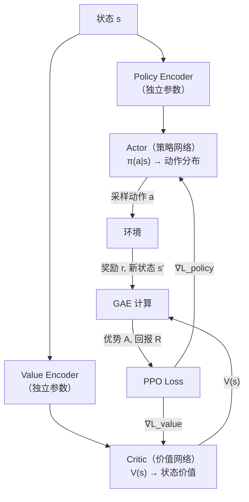
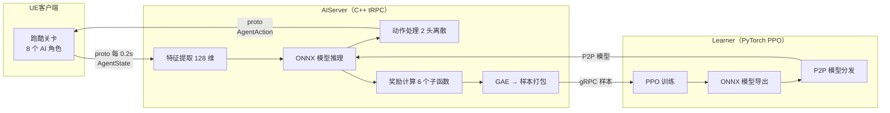
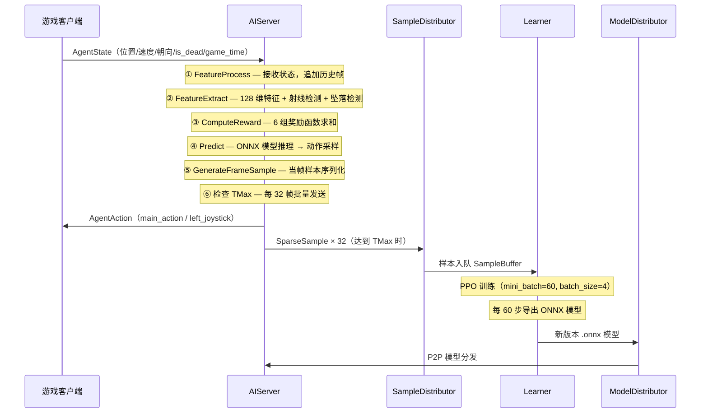
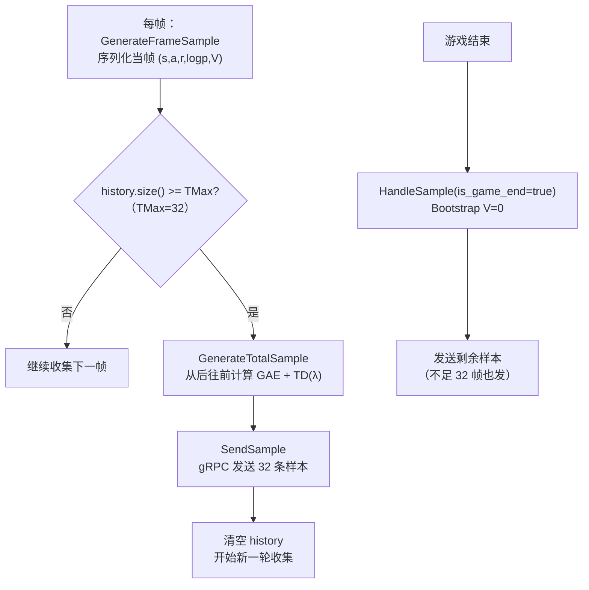
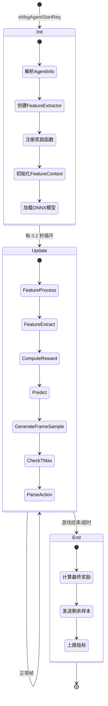
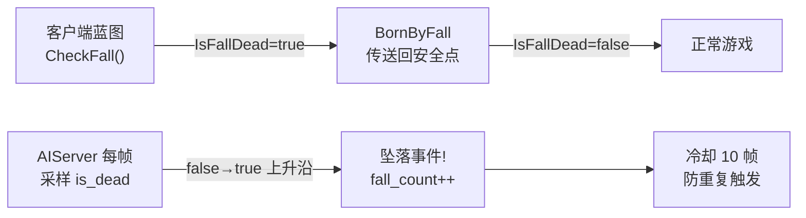
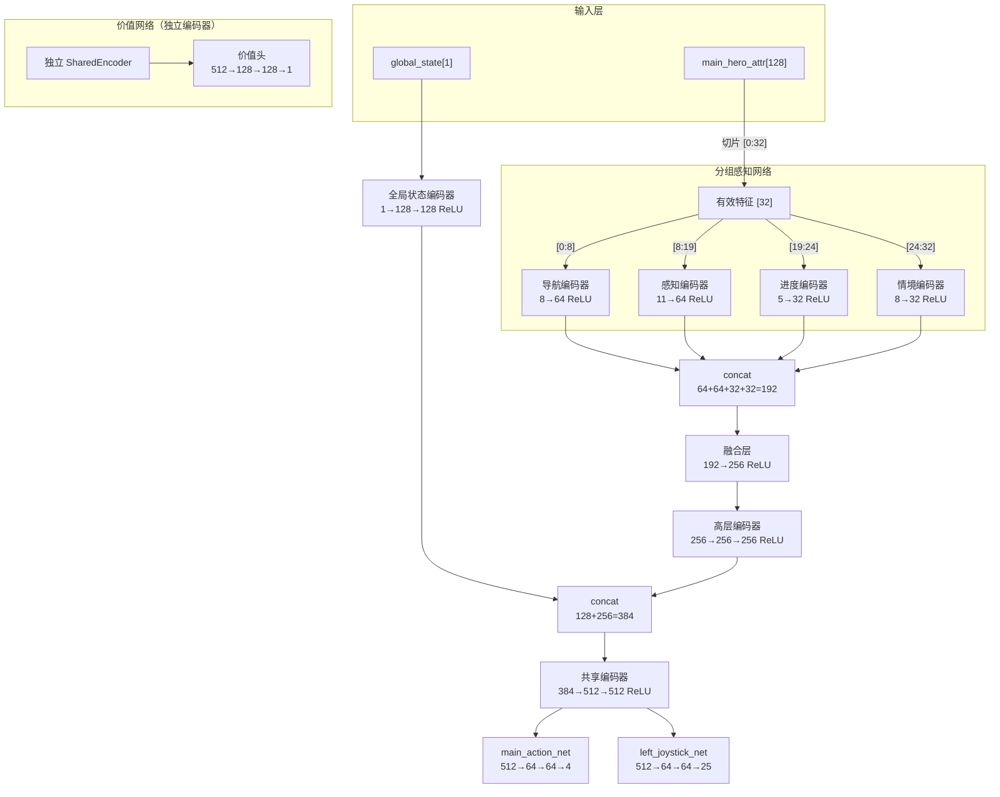
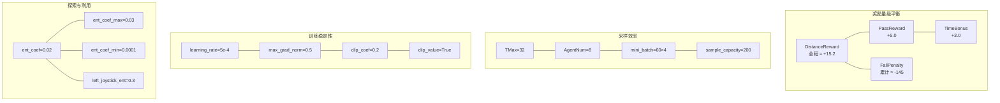

# PPO 强化学习架构实战 —— 从算法原理到工程落地

> **项目**：UGC Demo AI 跑酷寻路  
> **架构**：分布式 Actor-Learner（aiserver-cpp + rl-learner-pytorch）  
> **算法**：Proximal Policy Optimization (PPO) + GAE  
> **定位**：PPO 算法在游戏 AI 中的完整落地案例，覆盖理论推导 → 工程实现 → 参数调优  
> **最后更新**：2026-03-04

---

## 目录

1. [PPO 算法理论基础](#1-ppo-算法理论基础)
   - 1.1 策略梯度的起源
   - 1.2 TRPO → PPO：从信赖域到裁剪
   - 1.3 GAE 优势估计
   - 1.4 Actor-Critic 框架
2. [系统架构总览](#2-系统架构总览)
   - 2.1 分布式 Actor-Learner 架构
   - 2.2 核心组件职责
   - 2.3 部署规模
3. [数据流与样本生命周期](#3-数据流与样本生命周期)
   - 3.1 每帧数据流（0.2 秒一帧）
   - 3.2 样本结构定义
   - 3.3 样本发送与 GAE 计算时机
4. [AIServer 端（C++ Actor）](#4-aiserver-端c-actor)
   - 4.1 Agent 生命周期
   - 4.2 特征提取（128 维分组语义特征）
   - 4.3 奖励函数体系（6 组奖励信号）
   - 4.4 GAE 计算与样本打包
   - 4.5 动作处理与 Head Mask
5. [Learner 端（PyTorch）](#5-learner-端pytorch)
   - 5.1 神经网络结构总览
   - 5.2 分组感知网络（ModeOneHeroNetwork）
   - 5.3 策略网络（PolicyNetwork）
   - 5.4 价值网络（ValueNetwork）
   - 5.5 动作采样与分布
6. [PPO Loss 计算详解](#6-ppo-loss-计算详解)
   - 6.1 总 Loss 公式
   - 6.2 Policy Loss（PPO Clip）
   - 6.3 Value Loss（Clipped）
   - 6.4 Entropy Loss
   - 6.5 多动作头加权机制
   - 6.6 优势值归一化与价值头系数
7. [训练循环与模型分发](#7-训练循环与模型分发)
   - 7.1 训练主循环
   - 7.2 梯度裁剪策略
   - 7.3 模型导出与 P2P 分发
8. [超参数完整一览与调优逻辑](#8-超参数完整一览与调优逻辑)
   - 8.1 AIServer 端参数
   - 8.2 Learner 端参数
   - 8.3 网络结构参数
   - 8.4 参数间依赖关系
9. [关键设计决策与踩坑记录](#9-关键设计决策与踩坑记录)
10. [核心文件索引](#10-核心文件索引)

---

## 1. PPO 算法理论基础

### 1.1 策略梯度的起源

强化学习的目标是找到一个策略 $\pi_\theta(a|s)$，使得期望累计回报最大化：

$$J(\theta) = \mathbb{E}_{\tau \sim \pi_\theta} \left[ \sum_{t=0}^{T} \gamma^t r_t \right]$$

策略梯度定理给出了目标函数梯度的解析形式：

$$\nabla_\theta J(\theta) = \mathbb{E}_{\pi_\theta} \left[ \nabla_\theta \log \pi_\theta(a_t|s_t) \cdot A_t \right]$$

其中 $A_t$ 是优势函数（Advantage），衡量「当前动作相比平均水平好多少」。

**问题**：vanilla 策略梯度每次更新后就必须丢弃数据重新采样（on-policy），样本效率极低。

### 1.2 TRPO → PPO：从信赖域到裁剪

#### TRPO 的思路

TRPO（Trust Region Policy Optimization）引入重要性采样，允许用旧策略 $\pi_{\theta_{old}}$ 采集的数据来更新新策略 $\pi_\theta$：

$$L^{CPI}(\theta) = \mathbb{E} \left[ \frac{\pi_\theta(a_t|s_t)}{\pi_{\theta_{old}}(a_t|s_t)} A_t \right] = \mathbb{E} \left[ r_t(\theta) \cdot A_t \right]$$

但直接优化这个目标会导致策略更新过大、训练不稳定。TRPO 通过 KL 散度约束限制更新幅度：

$$\max_\theta L^{CPI}(\theta) \quad \text{s.t.} \quad D_{KL}(\pi_{\theta_{old}} || \pi_\theta) \leq \delta$$

**问题**：TRPO 需要二阶优化（共轭梯度 + 线搜索），实现复杂、计算昂贵。

#### PPO 的简化

PPO 用裁剪（Clipping）代替信赖域约束，直接在目标函数中限制更新幅度：

$$L^{CLIP}(\theta) = \mathbb{E} \left[ \min \left( r_t(\theta) A_t, \; \text{clip}(r_t(\theta), 1-\epsilon, 1+\epsilon) A_t \right) \right]$$

其中 $r_t(\theta) = \frac{\pi_\theta(a_t|s_t)}{\pi_{\theta_{old}}(a_t|s_t)}$ 是策略比率，$\epsilon$ 是裁剪系数（本项目 $\epsilon=0.2$）。

**直觉理解**：

| 情况 | $A_t > 0$（好动作） | $A_t < 0$（坏动作） |
| :--- | :--- | :--- |
| $r_t > 1+\epsilon$ | 裁剪：不让好动作被过度强化 | 不裁剪：允许坏动作被自由压制 |
| $r_t < 1-\epsilon$ | 不裁剪：允许好动作被自由提升 | 裁剪：不让坏动作被过度抑制 |

**核心思想**：保守更新——好动作最多增强到 $1+\epsilon$，坏动作最多抑制到 $1-\epsilon$，避免一步跳太远。

#### 本项目的 PPO Clip 实现

```python
# 文件: rl-learner/app/ugcdemo/ugcdemo_ppo_modeone.py

def policy_loss(self, advantages, mask, ratio, clip_coef):
    pg_loss1 = -advantages * ratio * mask
    pg_loss2 = -advantages * torch.clamp(ratio, 1 - clip_coef, 1 + clip_coef) * mask
    pg_loss = torch.max(pg_loss1, pg_loss2)
    pg_loss = torch.sum(pg_loss) / (1 + torch.sum(mask))
    return pg_loss
```

> **为什么取 `max` 而不是 `min`**？因为 `advantages` 已经带负号（$-A_t$），所以 `max(-A \cdot r, -A \cdot \text{clip}(r))` 等价于原论文的 `min(A \cdot r, A \cdot \text{clip}(r))`。

### 1.3 GAE 优势估计

#### 为什么需要 GAE

优势函数 $A_t$ 的估计有两个极端：

| 方法 | 公式 | 偏差 | 方差 |
| :--- | :--- | :--- | :--- |
| **1 步 TD** | $A_t = r_t + \gamma V(s_{t+1}) - V(s_t)$ | 高（依赖 V 的准确度） | 低 |
| **MC 回报** | $A_t = \sum_{l=0}^{\infty} \gamma^l r_{t+l} - V(s_t)$ | 低 | 高（轨迹越长方差越大） |

GAE（Generalized Advantage Estimation）用 $\lambda$ 参数在两者之间做平滑插值：

#### 数学推导

定义 TD 误差：

$$\delta_t = r_t + \gamma V(s_{t+1}) - V(s_t)$$

GAE 优势：

$$\hat{A}_t^{GAE(\gamma,\lambda)} = \sum_{l=0}^{\infty} (\gamma\lambda)^l \delta_{t+l}$$

等价递推形式（实际代码使用）：

$$\hat{A}_t = \delta_t + \gamma\lambda \hat{A}_{t+1}$$

TD($\lambda$) 回报（用于训练价值网络）：

$$R_t^{\lambda} = \hat{A}_t + V(s_t)$$

#### 参数直觉

| 参数 | 值 | 效果 |
| :--- | :--- | :--- |
| $\lambda \to 0$ | — | 等价 1 步 TD，低方差高偏差，适合 V 准确时 |
| $\lambda \to 1$ | — | 等价 MC 回报，低偏差高方差，适合长期信用分配 |
| **$\lambda = 0.95$** | **本项目** | **标准 PPO 推荐值，平衡偏差与方差** |
| $\gamma = 0.99$ | 本项目 | 折扣因子，信用分配窗口 $\approx \frac{1}{1-\gamma} = 100$ 帧（20 秒） |

#### 本项目的 GAE 实现

```cpp
// 文件: aiserver-cpp/src/app/agent/sample.cc
// GenerateTotalSample() —— 从后往前遍历计算 GAE

static float gae_lambda = 0.95;

for (int i = (int)history.size() - 1; i >= 0; --i) {
    // δ = r + γ·V(s') - V(s)
    float delta = history[i]->FeatureVector("rewards")->at(head_index)
                + gammas[head_index] * value
                - history[i]->FeatureVector("old_vpred")->at(head_index);

    // A = δ + γ·λ·A_{t+1}
    gae = gammas[head_index] * gae_lambda * gae + delta;

    // R = A + V(s)
    tdret = gae + history[i]->FeatureVector("old_vpred")->at(head_index);

    value = history[i]->FeatureVector("old_vpred")->at(head_index);

    history[i]->FeatureVector("advs")->at(head_index) = gae;    // 优势值
    history[i]->FeatureVector("y_r")->at(head_index) = tdret;   // TD(λ) 回报
}
```

**关键设计**：

- **Bootstrap Value**：游戏结束时 $V(s_T) = 0$（终止状态无未来收益）；TMax 截断时用当前帧的 $V(s_t)$ 作为 bootstrap
- **从后往前遍历**：递推公式 $\hat{A}_t = \delta_t + \gamma\lambda\hat{A}_{t+1}$ 要求从最后一帧开始向前计算
- **GAE 在 AIServer 端计算**：奖励和价值估计都在 AIServer 端产生，直接就地计算 GAE 避免跨进程传输

### 1.4 Actor-Critic 框架

PPO 属于 Actor-Critic 方法，同时学习两个网络：



**本项目的关键设计**：Actor 和 Critic 使用 **完全独立的编码器**，不共享任何权重。

| 共享 vs 独立 | 优点 | 缺点 |
| :--- | :--- | :--- |
| **共享编码器** | 参数量小、训练快 | 策略梯度和价值梯度互相干扰 |
| **独立编码器（本项目）** | 各自优化互不干扰 | 参数量翻倍（CPU 训练可接受） |

在跑酷任务中：
- **价值网络**需要准确估计「从当前位置到终点的预期累计奖励」→ 偏重空间距离感知
- **策略网络**需要学习「如何操控摇杆和跳跃来前进」→ 偏重动作-环境交互

两者的特征需求不同，独立编码器是更优选择。

---

## 2. 系统架构总览

### 2.1 分布式 Actor-Learner 架构



本项目采用经典的 **分布式 Actor-Learner 架构**：

- **Actor（AIServer）**：运行在 C++ 进程中，负责与游戏环境交互、收集经验数据
- **Learner**：运行在 PyTorch 进程中，负责神经网络训练和模型导出
- 两者通过 **gRPC** 传输样本，通过 **P2P（ModelDistributor）** 分发模型

### 2.2 核心组件职责

| 组件 | 语言 | 职责 | 关键文件 |
| :--- | :--- | :--- | :--- |
| **游戏客户端** | UE 蓝图/C++ | 物理模拟、碰撞检测、坠落检测 | UE 工程 |
| **AIServer** | C++ | 特征提取、模型推理、奖励计算、GAE、样本收集 | `src/app/` |
| **ModelDistributor** | Go | 模型 P2P 分发（Learner → AIServer） | Go 服务 |
| **SampleDistributor** | C++ | 样本中转（AIServer → Learner） | SDK 内置 |
| **Learner** | PyTorch | 神经网络训练、PPO Loss、ONNX 模型导出 | `ugcdemo/` |

### 2.3 部署规模

| 项目 | 规格 | 说明 |
| :--- | :--- | :--- |
| AIServer 镜像数 | 200 | 每个镜像运行 1 个 AIServer 进程 |
| Agent 数/镜像 | 8 | 8 个 AI 角色并行跑酷 |
| 并行 Agent 总数 | **1600** | 200 × 8 = 1600 个 Agent 同时收集经验 |
| Learner 实例 | 1 | CPU 训练，PyTorch |
| 每局时长 | ≤480 秒 | 超时强制结束 |
| 帧间隔 | 0.2 秒 | 5 FPS，每局最多 2400 帧 |

---

## 3. 数据流与样本生命周期

### 3.1 每帧数据流（0.2 秒一帧，5 FPS）



### 3.2 样本结构定义

每帧产生一条 `SparseSample`，包含完整的 (s, a, r, logp, V) 五元组：

| 类别 | 字段名 | 维度 | 说明 |
| :--- | :--- | :--- | :--- |
| **状态特征** | `input/global_state` | float[1] | 归一化游戏时间 |
| | `input/main_hero_attr` | float[128] | 128 维英雄属性（32 有效 + 96 预留） |
| **动作掩码** | `input/move_action_mask` | float[1] | 移动是否可用 |
| | `input/skill_action_mask` | float[2] | 技能是否可用 |
| | `input/left_joystick_action_mask` | float[25] | 左摇杆方向掩码 |
| **动作索引** | `main_action` | int | 0=站立, 1=移动, 2=跳跃, 3=技能 2 |
| | `left_joystick_direction_action` | int | 0~24（24 方向 + 不动） |
| **旧策略概率** | `old_logp_main_action` | float | 旧策略对数概率 |
| | `old_logp_left_joystick_*` | float | 左摇杆对数概率 |
| **价值估计** | `old_vpred` | float[1] | V(s) 旧价值估计 |
| **奖励** | `rewards` | float[1] | 当帧总奖励（6 组之和） |
| **Head Mask** | `aux/left_joystick_*_head_mask` | float[1] | 条件子动作掩码 |
| **GAE 结果** | `advs` | float[1] | GAE 优势值（发送前计算） |
| | `y_r` | float[1] | TD(λ) 回报 |
| | `m` | float[1] | mask（1.0=有效样本） |

> **注意**：右摇杆 `right_joystick_perspective_action` 当前已暂时禁用，未来 FPS AI 恢复时重新启用。

### 3.3 样本发送与 GAE 计算时机



**关键设计**：

- **TMax=32**：每 32 帧（6.4 秒）发送一批样本，平衡延迟与样本完整性
- **游戏结束 Bootstrap=0**：终止状态无未来收益，GAE 的 $V(s_T) = 0$
- **TMax 截断 Bootstrap=V(s)**：未结束时用当前帧价值估计作为 bootstrap，避免忽略未来奖励

---

## 4. AIServer 端（C++ Actor）

### 4.1 Agent 生命周期

Agent 生命周期由 `ModeOneAgent` 管理，对应文件 `src/app/agent/modeone_agent.cc`。



#### Init 阶段关键逻辑

```cpp
// 文件: src/app/agent/modeone_agent.cc — ModeOneAgent::Init()

// 接收初始化信息：agent_id、game_mode、episode_id
agent_id_ = agent_full_info->agent_info->agent_unique_id();

// 创建特征提取器（传入地图位置范围用于归一化）
const auto& location_setting = kMapLocationSetting.at((int)GameMap::kGameMapModeOne);
feature_extractor_ = std::make_unique<ugcdemo::FeatureExtractorModeOne>(location_setting);

// 训练模式：注册奖励函数
if (agent_type_ == AgentType::kAgentTypeTrain) {
    reward_manager_->Register("modeone_score_reward", ugcdemo::NewModeOneScoreReward, 0);
    // 第 3 个参数=0 表示奖励头索引（单头系统只有一个头）
}

// 初始化特征上下文（终点坐标、检查点、射线检测器等）
InitFeatureContext(agent_full_info);

// 加载最新模型（从 ModelDistributor 获取）
UpdateCurrentModel();
```

#### Update 阶段核心循环

每帧（0.2 秒）执行一次，是整个训练数据收集的核心：

| 步骤 | 函数 | 作用 |
| :--- | :--- | :--- |
| ① | `FeatureProcess` | 接收游戏状态，追加到历史帧列表 |
| ② | `FeatureExtract` | 提取 128 维特征 + 射线检测 + 坠落检测 |
| ③ | `ComputeReward` | 6 组奖励函数求和，写入当帧 `rewards` |
| ④ | `Predict` | ONNX Runtime 模型推理 → 动作采样 |
| ⑤ | `GenerateFrameSample` | 序列化当帧 (s,a,r,logp,V) 为 SparseSample |
| ⑥ | `CheckTMax` | 达到 32 帧时计算 GAE 并批量发送 |
| ⑦ | `ParseAction` | 动作索引 → 游戏指令 |

#### End 阶段

```cpp
// 文件: src/app/agent/modeone_agent.cc — ModeOneAgent::End()

player_->SetGameEnd(true);
player_->SetSummary(agent_end_info);  // 设置结算信息（is_pass/pass_time）

// 计算最终奖励（PassReward / TimeBonus 在此触发）
reward_manager_->RunReward(player_, *rewards);

// 发送剩余样本（is_game_end=true → Bootstrap V=0）
HandleSample(true);
```

### 4.2 特征提取（128 维分组语义特征）

特征维度在 `constant.h` 中定义为 `kMainSelfAttrSize = 128`，其中前 32 维为有效特征，后 96 维为预留扩展位。

#### 128 维特征布局

```
┌──────────────────────────────────────────────────────────────────┐
│                     128 维特征总览                                │
├──────────┬───────────────────────────────────────────────────────┤
│ [0-31]   │ 有效特征（进入分组编码器）                              │
│ [32-127] │ 预留扩展位（为客户端射线/时序信息预留，当前全填 0）      │
└──────────┴───────────────────────────────────────────────────────┘
```

#### 有效特征分组（[0-31]）

| 分组 | 索引 | 维度 | 特征名称 | 来源 | 归一化方式 |
| :--- | :--- | :--- | :--- | :--- | :--- |
| **导航组** | [0-2] | 3 | 位置 xyz | AgentState.pos | 线性到 [-1,1] |
| | [3-4] | 2 | 速度 xy | AgentState.vel | ÷600 |
| | [5-6] | 2 | 目标方向 sin/cos | 计算得出 | 自然 [-1,1] |
| | [7] | 1 | 目标距离 | 计算得出 | ÷地图对角线 |
| **感知组** | [8-9] | 2 | 朝向 sin/cos | AgentState.rot | 自然 [-1,1] |
| | [10] | 1 | 死亡状态 | AgentState.is_dead | 0 或 1 |
| | [11-15] | 5 | 射线距离（5 方向） | PhysX 射线检测 | ÷2000 |
| | [16] | 1 | 目标夹角 cos | 计算得出 | [-1,1] |
| | [17] | 1 | 前方空旷度 | ray_distances[0] | [0,1] |
| | [18] | 1 | 被包围程度 | 墙壁计数÷5 | [0,1] |
| **进度组** | [19] | 1 | 路径进度 | 距离比值 | [0,1] |
| | [20] | 1 | 停滞程度 | 帧计数÷180 | [0,1] |
| | [21] | 1 | 最空旷方向距离 | 射线最大值 | [0,1] |
| | [22-23] | 2 | 移动朝向差 sin/cos | 摇杆偏移 | [-1,1] |
| **情境组** | [24] | 1 | 环境复杂度 | 墙壁+前方 | [0,1] |
| | [25] | 1 | 上帧 main_action | 索引÷3 | [0,1] |
| | [26] | 1 | 上帧左摇杆方向 | 索引÷24 | [0,1] |
| | [27] | 1 | 速度大小 | 水平速度÷600 | [0,1] |
| | [28] | 1 | Z 轴速度 | vel.z÷600 | [-1,1] |
| | [29] | 1 | 坠落次数 | fall_count÷10 | [0,1] |
| | [30-31] | 2 | 预留 | 0.0 | — |

#### SelfKernel 核心流程

```cpp
// 文件: src/app/feature/feature_extractor_base.cc — SelfKernel()

// ---- [0-2] 位置归一化 ----
// X: [5000, 100000], Y: [-5000, 5000], Z: [-500, 500] → [-1, 1]
self_attr_index += LocationKernel(agent_state->pos(), self_attr_feature, self_attr_index);

// ---- [3-4] 速度归一化 ----
float vel_max = 600.0f;
self_attr_feature->at(self_attr_index)     = Normalize(vel.x(), -vel_max, vel_max);
self_attr_feature->at(self_attr_index + 1) = Normalize(vel.y(), -vel_max, vel_max);

// ---- [5-7] 目标方向和距离 ----
// sin/cos 编码避免角度跳变（0° 和 360° 是同一个方向）
float angle = std::atan2(dy, dx);
self_attr_feature->at(self_attr_index)     = std::sin(angle);   // [5]
self_attr_feature->at(self_attr_index + 1) = std::cos(angle);   // [6]
self_attr_feature->at(self_attr_index + 2) = dist / map_diag;   // [7]

// ---- [11-15] 射线检测距离 ----
// 5 方向: 前(0°), 左前(-45°), 右前(+45°), 左(-90°), 右(+90°)
// 0.0=紧贴障碍, 1.0=2000cm 内无障碍
for (size_t i = 0; i < kRaycastDirectionNum; ++i) {
    self_attr_feature->at(self_attr_index + i) = modeone_ctx->ray_distances[i];
}

// ---- [24-31] 情境感知组 ----
// [24] 环境复杂度 = wall_ratio*0.6 + front_blocked*0.4
// [25] 上帧 main_action 归一化
// [26] 上帧 left_dir 归一化
// [27] 速度大小 / 600
// [28] Z 轴速度（正=跳跃，负=下落）
// [29] 坠落次数 / 10

// ---- [32-127] 预留扩展位 ----
for (size_t i = self_attr_index; i < kMainSelfAttrSize; ++i) {
    self_attr_feature->at(i) = 0.0f;
}
```

#### 射线检测

```
         前(0°)
          ↑
    左前45°  右前45°
     ↗          ↖
左90° ← Agent → 右90°
```

- 射线起点：Agent 位置 + 50cm 高度偏移
- 最大距离：2000cm
- 结果归一化：命中 → `distance/2000`，未命中 → `1.0`

#### 坠落检测（事件驱动）



保护机制：
- **前 15 帧不检测**：跳过出生下落/初始化阶段
- **冷却期 10 帧**：防止蓝图 `IsFallDead` 翻转不干净导致连续帧重复触发

### 4.3 奖励函数体系（6 组奖励信号）

#### 奖励注册

```cpp
// 文件: src/app/reward/modeone/modeone_score_reward.cc

ModeOneScoreReward::ModeOneScoreReward() {
    SetGamma(0.99);  // 折扣因子 γ，用于 GAE 计算
    Register();
}

void ModeOneScoreReward::Register() {
    // 稀疏奖励
    RegisterOnce("PassReward", PassReward);               // 通关奖励：+5.0
    RegisterOnce("TimeBonus", TimeBonus);                 // 时间/进度奖励：最高+3.0

    // 密集奖励（每帧计算）
    RegisterOnce("DistanceReward", DistanceReward);       // 距离引导：±0.05/300cm
    RegisterOnce("WallProximityPenalty", WallProximityPenalty); // 墙壁接近：~-0.002
    RegisterOnce("StagnationPenalty", StagnationPenalty);  // 停滞惩罚：-0.001~-0.003

    // 事件驱动
    RegisterOnce("FallPenalty", FallPenalty);              // 坠落惩罚：-0.3~-1.0
}
```

#### 奖励量级关系

```
┌──────────────────────────────────────────────────────────────────┐
│                      奖励函数量级关系                              │
│                                                                   │
│  通关总收益:                                                       │
│    PassReward(+5.0) + TimeBonus(+3.0) = +8.0                     │
│                                                                   │
│  密集奖励(走完全程):                                               │
│    DistanceReward: 91000cm ÷ 300cm × 0.05 ≈ +15.2               │
│                                                                   │
│  坠落惩罚(150次累计):                                              │
│    FallPenalty: ≈ -145（首次-0.3, 递增-0.1, 单次 Cap=-1.0）      │
│                                                                   │
│  设计意图:                                                         │
│    · 密集奖励提供方向引导（每前进300cm获得+0.05）                   │
│    · 通关奖励提供终极目标吸引力                                    │
│    · 坠落惩罚限制无效行为但允许过坑尝试（跳一次仅-0.3）            │
│    · 停滞惩罚约束摆烂（10秒不推进开始罚）                          │
│    · 截断惩罚打破纳什均衡（有人通关→其余按进度罚）                 │
└──────────────────────────────────────────────────────────────────┘
```

#### 各奖励函数参数汇总

| 奖励函数 | 触发时机 | 量级 | 关键常量 |
| :--- | :--- | :--- | :--- |
| **PassReward** | 游戏结束且通关 | +5.0 | `kPassRewardValue=5.0`, `kPassVerifyDist=500` |
| **TimeBonus** | 游戏结束 | +3.0~-1.0 | `kTimeBonus_MaxReward=3.0`, `kTruncationMaxPenalty=1.0` |
| **DistanceReward** | 每帧（分段累计） | ±0.05/段 | `kDistReward_SegmentDist=300`, `kDistReward_ForwardReward=0.05` |
| **WallProximityPenalty** | 每帧 | ~-0.002 | `kWallProximityThreshold=80`, `kWallProximityPenalty=-0.002` |
| **StagnationPenalty** | 每帧 | -0.001~-0.003 | `kStagnation_LightFrames=50`, `kStagnation_HeavyFrames=150` |
| **FallPenalty** | 坠落事件 | -0.3~-1.0 | `kFallPenalty_Base=-0.3`, `kFallPenalty_Cap=-1.0` |

#### DistanceReward — 分段累计制详解

```cpp
// 核心：不是每帧给奖励，而是累计移动达到阈值后一次性给

// 帧间距离变化（正值=靠近终点）
float delta = prev_distance - current_dist;

// 累加到对应的累计器
if (delta > 0)  dist_accumulated_approach += delta;   // 靠近
else            dist_accumulated_retreat += (-delta);  // 远离

// 检查是否达到分段阈值（300cm）
while (dist_accumulated_approach >= kDistReward_SegmentDist) {
    dist_accumulated_approach -= kDistReward_SegmentDist;
    reward += kDistReward_ForwardReward;   // +0.05
}
while (dist_accumulated_retreat >= kDistReward_SegmentDist) {
    dist_accumulated_retreat -= kDistReward_SegmentDist;
    reward += kDistReward_BackwardPenalty;  // -0.05
}
```

**为什么不用帧间差分制**：帧间差分 `reward = delta * coef` 会导致帧率变化时奖励量级不稳定（5FPS vs 10FPS 总奖励差 2 倍），分段累计制完全脱钩。

#### FallPenalty — 累进惩罚 + Cap 上限

```
第 N 次坠落惩罚 = max(kFallPenalty_Base + (N-1) × kFallPenalty_Increment, kFallPenalty_Cap)

N=1:  max(-0.3 + 0×(-0.1), -1.0) = -0.3
N=5:  max(-0.3 + 4×(-0.1), -1.0) = -0.7
N=8:  max(-0.3 + 7×(-0.1), -1.0) = -1.0（触顶）
N=50: max(-0.3 + 49×(-0.1), -1.0) = -1.0（不再增加）
```

坠落后还会**重置距离累计器**，消除「跳崖→传送→走回来赚奖励」的正反馈循环。

### 4.4 GAE 计算与样本打包

GAE 计算在 `sample.cc` 的 `GenerateTotalSample()` 中实现，在样本发送前执行。

**完整流程**：

1. 每帧调用 `GenerateFrameSample()`，序列化 (s, a, r, logp, V)
2. 达到 TMax=32 帧时触发 `HandleSample()`
3. `GenerateTotalSample()` 从后往前遍历 32 帧，计算 GAE 和 TD(λ) 回报
4. `SendSample()` 通过 gRPC 发送 32 条样本到 SampleDistributor

详细 GAE 计算代码见 [1.3 节](#13-gae-优势估计)。

### 4.5 动作处理与 Head Mask

#### 动作空间定义

| 动作头 | 类型 | 选项数 | 说明 |
| :--- | :--- | :--- | :--- |
| `main_action` | Categorical | 4 | 0=站立, 1=移动, 2=跳跃, 3=技能 2 |
| `left_joystick_direction_action` | Categorical | 25 | 24 个水平方向 + 不动 |

> 右摇杆 `right_joystick_perspective_action`（25 选项）当前暂时禁用，未来 FPS AI 恢复。

#### 条件子动作 Head Mask

左摇杆方向只在 `main_action=1（移动）` 时有意义：

```
main_action = 0（站立）  → left_joystick_head_mask = 0  → 不训练左摇杆
main_action = 1（移动）  → left_joystick_head_mask = 1  → 训练左摇杆
main_action = 2（跳跃）  → left_joystick_head_mask = 0  → 不训练左摇杆
main_action = 3（技能）  → left_joystick_head_mask = 0  → 不训练左摇杆
```

这确保子动作只在对应主动作被选择时才更新梯度，避免噪声梯度干扰。

#### 动作到游戏指令映射

```
main_action=0 → 站立不动
main_action=1 → 移动，朝向 = kHorizontalYaws[left_joystick_action - 1]
                （24 个方向：-180°, -165°, ..., 0°, ..., 150°, 165°）
main_action=2 → 跳跃
main_action=3 → 技能 2
```

---

## 5. Learner 端（PyTorch）

### 5.1 神经网络结构总览



### 5.2 分组感知网络（ModeOneHeroNetwork）

```python
# 文件: rl-learner/app/ugcdemo/ugcdemo_network_modeone.py

class ModeOneHeroNetwork(nn.Module):
    """分组感知网络：输入 128 维但只编码有效特征 [0:32]"""

    def __init__(self, prefix):
        super().__init__()
        self.effective_size = 32  # 有效特征维度

        # 分组维度定义
        self.nav_size = 8       # [0-7]   导航特征
        self.percept_size = 11  # [8-18]  感知特征
        self.progress_size = 5  # [19-23] 进度特征
        self.context_size = 8   # [24-31] 情境感知特征

        # 分组编码器（每组独立编码，保留语义分离性）
        self.nav_encoder = nn.Sequential(nn.Linear(8, 64), nn.ReLU())
        self.percept_encoder = nn.Sequential(nn.Linear(11, 64), nn.ReLU())
        self.progress_encoder = nn.Sequential(nn.Linear(5, 32), nn.ReLU())
        self.context_encoder = nn.Sequential(nn.Linear(8, 32), nn.ReLU())

        # 融合层: 64+64+32+32=192 → 256
        self.fusion = nn.Sequential(nn.Linear(192, 256), nn.ReLU())

        # 高层编码器
        self.input_encoder = nn.Sequential(
            nn.Linear(256, 256), nn.ReLU(),
            nn.Linear(256, 256), nn.ReLU())

    def forward(self, input):
        hero_attr = input["input/main_hero_attr"]  # [batch, 128]

        # 切片：只取有效特征 [0:32]
        effective_feat = hero_attr[..., :self.effective_size]

        # 分组切片（在有效特征中按语义分组）
        nav_feat     = effective_feat[..., :8]      # [0-7]
        percept_feat = effective_feat[..., 8:19]     # [8-18]
        progress_feat= effective_feat[..., 19:24]    # [19-23]
        context_feat = effective_feat[..., 24:32]    # [24-31]

        # 各组独立编码 → 融合
        nav_hidden     = self.nav_encoder(nav_feat)         # [batch, 64]
        percept_hidden = self.percept_encoder(percept_feat) # [batch, 64]
        progress_hidden= self.progress_encoder(progress_feat)# [batch, 32]
        context_hidden = self.context_encoder(context_feat) # [batch, 32]

        fused = torch.cat([nav_hidden, percept_hidden,
                          progress_hidden, context_hidden], dim=-1)  # [batch, 192]
        hero_attr_hidden = self.fusion(fused)               # [batch, 256]
        x = self.input_encoder(hero_attr_hidden)            # [batch, 256]
        return x, None, None
```

**分组设计意图**：

| 分组 | 编码什么 | 网络学习目标 |
| :--- | :--- | :--- |
| **导航组** [0-7] | 位置、速度、目标方向/距离 | 「去哪里」—— 目标导航 |
| **感知组** [8-18] | 朝向、死亡、射线、目标对齐 | 「周围有什么」—— 环境感知 |
| **进度组** [19-23] | 路径进度、停滞度、最空旷方向 | 「走了多远」—— 进度评估 |
| **情境组** [24-31] | 环境复杂度、上帧动作、速度、坠落 | 「当前处境」—— 状态记忆 |

> **为什么 [32-127] 不进入编码器**：这 96 维是为阶段二/三预留的扩展位（客户端射线数据、时序信息等），当前全填 0。网络只处理有效的前 32 维，避免大量零值干扰梯度。

#### 5.2.1 分组编码的设计动机与好处

为什么不直接把 32 维特征拍平扔进一个大 MLP？分组编码器（Group-wise Encoder）的核心价值在于**用架构设计注入领域先验知识**：

| 好处 | 说明 |
| :--- | :--- |
| **语义隔离，防止特征干扰** | 如果把 32 维直接拍平进大 MLP，网络需自己猜哪些特征有关联，容易学到虚假相关性（如"位置 X 大时射线距离也大"→换图就废了）。分组后每个编码器只看语义相关的特征，被迫在组内学有意义的模式 |
| **参数效率高** | 大 MLP（32→256→256）需 ~73K 参数但大量浪费在学虚假跨组关联；分组编码（4组独立→192→256）只需 ~50K 参数，更少的参数反而学得更好——归纳偏置帮网络省了试错 |
| **可扩展，改一组不影响其他组** | 阶段三把 5 方向射线换成 24 方向客户端射线时，只需改感知组编码器（11→64 改成 30→64），导航组/进度组/情境组完全不动，融合层输入维度不变（还是 192） |
| **调试友好** | 可单独观察每组编码器的梯度/激活值：导航组梯度大+感知组梯度小→说明模型没学会看射线；情境组梯度全零→说明上帧动作没用上 |
| **对抗 128 维稀疏输入** | 128 维输入只有前 32 维有效，后 96 维全是 0。分组切片直接跳过无效位，避免参数浪费在学"0 是什么意思" |

> **一句话总结**：分组编码 = 用架构设计告诉网络"哪些特征该一起看"，减少学习难度，提高参数效率，方便扩展维护。这比让网络自己从 128 维 raw 输入中摸索结构，训练快、泛化好、改起来也不怕牵一发动全身。

#### 5.2.2 编码器实现机制详解

每个分组编码器是**单层 MLP + ReLU**（`nn.Linear(in, out)` + `nn.ReLU()`），将低维原始特征映射到高维潜在空间。4 组编码器输出通过 `torch.cat` 拼接为 192 维向量，经融合层压缩到 256 维，再经 2 层高层编码器提取跨组的高阶关系。

```
单个编码器内部:
    input[N] → Linear(N, M) → ReLU → output[M]
                  ↑               ↑
           可学习的权重矩阵      非线性激活
           W[M×N] + b[M]       截断负值为0

4组拼接:
    [nav_64, percept_64, progress_32, context_32] → concat → [192]

融合层:
    Linear(192, 256) + ReLU → [256]
    作用：学习 4 组编码结果之间的交叉关系

高层编码器:
    Linear(256,256) + ReLU → Linear(256,256) + ReLU → [256]
    作用：多层非线性变换，提取更高阶的决策特征

最终输出到两个头:
    Policy端: encoding[256] → SharedEncoder → main_action_MLP → logits[4]
                                            → left_joystick_MLP → logits[25]
    Value端:  encoding[256] → SharedEncoder → value_MLP → V(s)[1]
```

**关键实现细节**：

| 细节 | 说明 |
| :--- | :--- |
| **Policy/Value 独立编码器** | 各自有一套完整的 分组编码器→融合层→高层编码器，不共享任何权重。代价是参数量翻倍（~400K），但 CPU 训练可接受，且避免策略梯度干扰价值估计 |
| **编码器激活函数用 ReLU** | 分组编码器和融合层使用 `nn.ReLU`，简单高效，适合浅层网络 |
| **动作头激活函数用 LeakyReLU** | 动作头网络（`MLPNetwork`）使用 `nn.LeakyReLU(0.01)`，允许负值少量通过，避免 dead neurons |
| **动作头输出层不加激活** | `out_activation=False`，输出原始 logits，由 `Categorical` 分布的 softmax 处理概率归一化 |
| **推理 vs 训练** | 训练时 `Categorical.sample()` 随机采样（探索）；评估时 `argmax` 贪婪选择（利用） |
| **预留位跳过机制** | `hero_attr[..., :32]` 切片直接丢弃 [32-127] 的零值，编码器参数量不随总维度增长 |

**参数量对比**（说明分组编码的参数效率）：

| 方案 | 编码器参数量 | 能否独立扩展 |
| :--- | :--- | :--- |
| 大 MLP：32→256→256 | ~73K（32×256 + 256×256） | ❌ 改一个特征影响所有权重 |
| 分组编码（本项目） | ~50K（8×64 + 11×64 + 5×32 + 8×32 + 192×256） | ✅ 改一组不影响其他 |

**阶段三升级路径**（客户端射线就绪后）：

1. `[11-34]` 改为 24 方向客户端射线，`percept_size` 从 11 扩到 27
2. `percept_encoder` 从 11→64 扩到 27→128
3. 其余分组不变，仅修改感知组切片范围和编码器宽度

### 5.3 策略网络（PolicyNetwork）

```python
# 文件: rl-learner/app/ugcdemo/ugcdemo_network_modeone.py

class ModeOnePolicyNetwork(nn.Module):
    def __init__(self):
        super().__init__()
        self.policy_encoder = ModeOneEncoderNetwork(is_policy=True)

        # 主动作头：512 → 64 → 64 → 4
        self.main_action_net = MLPNetwork(
            num_layers=3, in_size=512, hid_size=64,
            out_size=4, out_activation=False)

        # 左摇杆方向头：512 → 64 → 64 → 25
        self.left_joystick_direction_action_net = MLPNetwork(
            num_layers=3, in_size=512, hid_size=64,
            out_size=25, out_activation=False)

        # [暂时禁用] 右摇杆视角头（未来 FPS AI 恢复）
        # self.right_joystick_perspective_action_net = MLPNetwork(...)

    def forward(self, input):
        self.encoding = self.policy_encoder(input)  # [batch, 512]

        # 主动作：mask → logits → Categorical 分布
        main_action_mask = concat([move_mask, skill_mask])
        action_logits["main_action"] = mask_logits(
            self.main_action_net(self.encoding),
            add_none_action_mask(main_action_mask))
        return action_logits

    def handle_sub_action(self, selected_actions, input):
        # 左摇杆：条件子动作，只在 main_action=1(移动) 时训练
        move_logits = self.left_joystick_direction_action_net(self.encoding)
        move_logits = mask_logits(move_logits, input["input/left_joystick_action_mask"])
        action_logits["left_joystick_direction_action"] = move_logits
        return action_logits
```

#### MLPNetwork 结构

```python
# 文件: rl-learner/app/ugcdemo/network_module.py

class MLPNetwork(nn.Module):
    """多层感知机（动作头使用 LeakyReLU 激活）"""
    def __init__(self, num_layers, in_size, hid_size, out_size, out_activation=True):
        layers = []
        input_size = in_size
        for _ in range(num_layers - 1):       # 前 N-1 层
            layers.append(nn.Linear(input_size, hid_size))
            layers.append(nn.LeakyReLU(negative_slope=0.01))
            input_size = hid_size
        layers.append(nn.Linear(hid_size, out_size))  # 输出层
        if out_activation:
            layers.append(nn.LeakyReLU(negative_slope=0.01))
        self.network = nn.Sequential(*layers)
```

实际动作头结构（`num_layer_action=3`，`out_activation=False`）：

```
main_action_net:     512 → Linear → LeakyReLU → 64 → Linear → LeakyReLU → 64 → Linear → 4（原始 logits）
left_joystick_net:   512 → Linear → LeakyReLU → 64 → Linear → LeakyReLU → 64 → Linear → 25（原始 logits）
```

> **为什么动作头 `out_activation=False`**：输出的是原始 logits，会送入 `Categorical` 分布做 softmax，不能再加激活函数。

### 5.4 价值网络（ValueNetwork）

```python
# 文件: rl-learner/app/ugcdemo/ugcdemo_network_modeone.py

class ModeOneValueNetwork(nn.Module):
    def __init__(self):
        super().__init__()
        # 独立编码器（不与 Policy 共享参数！）
        self.value_encoder = ModeOneEncoderNetwork(is_policy=False)

        # 价值头：512 → 128 → ReLU → 128 → ReLU → 1
        self.value_heads = nn.ModuleList()
        for _ in range(value_head_num):  # 当前=1
            self.value_heads.append(nn.Sequential(
                nn.Linear(512, 128), nn.ReLU(),
                nn.Linear(128, 128), nn.ReLU(),
                nn.Linear(128, 1)       # 输出标量 V(s)
            ))
```

**Actor-Critic 完全分离架构**：

```
Policy 编码器 = GlobalStateNet + HeroNet + SharedEncoder  →  动作头
Value  编码器 = GlobalStateNet + HeroNet + SharedEncoder  →  价值头
         ↑                                                      ↑
      独立参数                                              独立参数
```

两套编码器参数量：~200K × 2 = ~400K 总参数，CPU 训练完全可承受。

### 5.5 动作采样与分布

```python
# 文件: rl-learner/app/ugcdemo/ugcdemo_network_modeone.py

def sample_action(self, logits_p_dict, play_mode, comment=''):
    for action_name, action_spec in self.action_space.items():
        distribution = action_spec.pdclass(logits=logits_p_dict[action_name])
        # pdclass = torch.distributions.Categorical

        greedy_action = torch.argmax(logits_p_dict[action_name], dim=-1)  # 贪心
        sample_action = distribution.sample()                              # 随机采样

        # play_mode > 0 → 贪心（评估模式）
        # play_mode = 0 → 随机采样（训练模式）
        action = torch.where(play_mode > 0, greedy_action, sample_action)
        logp = distribution.log_prob(action)  # 对数概率
```

**采样流程**：

```
logits [4] → softmax → Categorical 分布 → sample → action_index
                                         → log_prob → old_logp（存入样本）
```

---

## 6. PPO Loss 计算详解

### 6.1 总 Loss 公式

$$L_{total} = pg\_coef \cdot L_{policy} - ent\_coef \cdot L_{entropy} + vf\_coef \cdot L_{value}$$

当前参数：

| 系数 | 值 | 作用 |
| :--- | :--- | :--- |
| `pg_coef` | 由框架内部设定 | 策略损失权重 |
| `ent_coef` | 0.02（可衰减，范围 [0.0001, 0.03]） | 熵损失权重，控制探索强度 |
| `vf_coef` | 1.0 | 价值损失权重 |

> **注意符号**：熵损失前面是**负号**，因为要**最大化**熵（鼓励探索），等价于最小化 $-L_{entropy}$。

### 6.2 Policy Loss（PPO Clip）

```python
# 文件: rl-learner/app/ugcdemo/ugcdemo_ppo_modeone.py

def policy_loss(self, advantages, mask, ratio, clip_coef):
    """
    PPO Clipped Policy Loss

    ratio = π_new(a|s) / π_old(a|s) = exp(logp_new - logp_old)
    A = GAE 优势估计
    ε = clip_coef = 0.2

    L = max(-A·r, -A·clip(r, 1-ε, 1+ε))
    """
    pg_loss1 = -advantages * ratio * mask
    pg_loss2 = -advantages * torch.clamp(ratio, 1 - clip_coef, 1 + clip_coef) * mask
    pg_loss = torch.max(pg_loss1, pg_loss2)
    pg_loss = torch.sum(pg_loss) / (1 + torch.sum(mask))
    return pg_loss
```

**Ratio 计算**：

```python
logratio = input[f'logp_{action_name}'].view(-1) - input[f'old_logp_{action_name}'].view(-1)
ratio = logratio.exp()  # π_new / π_old
```

**Ratio 裁剪监控**：

```python
# 超出 [1-ε, 1+ε] 范围的比例
ratio_clipfrac = (|ratio - 1.0| > clip_coef).float() * mask / mask.sum()
```

这个指标是训练稳定性的关键观测量。`ratio_clipfrac` 过高说明新旧策略差异过大，需要降低学习率。

### 6.3 Value Loss（Clipped）

```python
def value_loss(self, new_values, old_values, returns, mask, clip_coef):
    """
    Clipped Value Loss（与 PPO 论文一致）

    V_clipped = V_old + clip(V_new - V_old, -ε, +ε)
    L = max((V_new - R)², (V_clipped - R)²)
    """
    value_loss1 = torch.square(new_values - returns)
    values_pred = old_values + torch.clamp(
        new_values - old_values, -clip_coef, clip_coef)
    value_loss2 = torch.square(values_pred - returns)

    if FLAGS.algo.clip_value:  # 当前=True
        loss = torch.max(value_loss1, value_loss2)
    else:
        loss = value_loss1

    loss = torch.sum(loss * mask) / (1 + torch.sum(mask))
    return loss.mean()
```

**为什么裁剪价值函数**：防止价值估计在单次更新中跳变太大，导致下一轮 GAE 计算出的优势值不稳定。

### 6.4 Entropy Loss

```python
def entropy_loss(self, entropy, mask):
    """
    Entropy = -Σ p(a)·log(p(a))
    最大化熵 → 策略更均匀 → 更多探索

    各动作头的熵权重:
        main_action: 1.0
        left_joystick: 0.3
    """
    entropy_losses = None
    for key in entropy.keys():
        tmp_entropy = entropy[key] * mask[key]
        entropy_losses += torch.sum(tmp_entropy) / (1 + torch.sum(mask[key]))
    return entropy_losses
```

**熵系数动态调节**：

```python
# ent_coef 支持指数衰减
self.ent_coef = self.ent_coef * exp(ent_decay_rate / ent_decay_steps)
self.ent_coef = clamp(self.ent_coef, ent_coef_min, ent_coef_max)
```

当前配置：初始 0.02，范围 [0.0001, 0.03]，衰减率 0.0（不衰减）。

### 6.5 多动作头加权机制

```python
# 各动作头的 Policy Loss 权重
policy_coef = {
    "main_action": 1.0,                          # 主动作（全权重）
    "left_joystick_direction_action": 0.3,        # 左摇杆（低权重）
}

# 各动作头的 Entropy 权重
entropy_coef = {
    "main_action": 1.0,
    "left_joystick_direction_action": 0.3,
}
```

**为什么左摇杆权重只有 0.3**：

- `main_action` 是高层决策（走/跳/停），影响全局策略
- `left_joystick` 是低层执行（朝哪个方向走），且受 Head Mask 限制只在移动时训练
- 低权重防止左摇杆的梯度主导整个策略更新

**总 Policy Loss 聚合**：

```python
total_policy_loss = torch.mean(torch.stack(list(policy_loss.values())))
```

### 6.6 优势值归一化与价值头系数

```python
def forward(self, input, batch_idx):
    # 从样本取 GAE 优势值
    advs = input["advs"].view(-1, value_head_num)  # [batch, 1]

    # 标准化优势值（零均值、单位方差）
    if self.normalize_advantages:
        advs = (advs - advs.mean(dim=0)) / (advs.std(dim=0) + 1e-8)

    # 乘以价值头系数（支持动态衰减）
    advs = advs * self.value_coef  # 初始=1.0
    advs = torch.sum(advs, dim=1)  # 多头→标量
```

**优势值归一化的作用**：消除不同 batch 间奖励量级差异，使 Policy Loss 的梯度尺度稳定。

---

## 7. 训练循环与模型分发

### 7.1 训练主循环

```python
# 文件: rl-learner/app/ugcdemo/ugcdemo_trainer.py

class UGCDemoTrainer(UltronTrainer):
    def train_loop(self, model, optimizer, train_loader, ...):
        for batch in train_loader:
            # ① 前向传播：状态 → 网络 → 动作分布 + 价值估计 → Loss
            self.training_step(model=model, batch=batch, batch_idx=self.global_step)

            # ② 梯度裁剪（防止梯度爆炸）
            if FLAGS.algo.clip_gradient:
                self.fabric.clip_gradients(model, optimizer, max_norm=0.5)

            # ③ 优化器更新
            optimizer.step()
            optimizer.zero_grad()

            # ④ 定期保存模型 + 导出 ONNX
            if self.should_save:
                self.save(state)

            self.global_step += 1
```

### 7.2 梯度裁剪策略

```python
# 梯度 L2 范数裁剪
max_grad_norm = 0.5  # 超过此值按比例缩放

# 实现方式: clip_gradients(model, optimizer, max_norm=0.5)
# 等价于: torch.nn.utils.clip_grad_norm_(model.parameters(), max_norm=0.5)
```

**为什么要梯度裁剪**：

- PPO 的多个 Loss 项（Policy + Value + Entropy）梯度可能方向冲突
- 坠落/通关等稀疏事件产生的异常大奖励值可能导致梯度尖峰
- `max_grad_norm=0.5` 是 PPO 的标准推荐值

### 7.3 模型导出与 P2P 分发


**关键配置**：

| 参数 | 值 | 文件 | 说明 |
| :--- | :--- | :--- | :--- |
| `save_checkpoint_steps` | 60 | server_conf.yaml | 每 60 步保存 checkpoint |
| `save_pb_steps` | 60（由框架控制） | default.yaml | 每 60 步导出 ONNX |
| `upload_pb_steps` | 600 | default.yaml | 每 600 步上传到远端 |
| `save_model_num` | 10 | default.yaml | 本地保留最近 10 个版本 |

> ⚠️ `mini_batch_count`、`save_checkpoint_steps`、`upload_pb_steps` 等参数直接影响工作流中的模型监测，**不可随意修改**。

---

## 8. 超参数完整一览与调优逻辑

### 8.1 AIServer 端参数

| 参数 | 值 | 定义位置 | 作用 | 调优说明 |
| :--- | :--- | :--- | :--- | :--- |
| **γ (gamma)** | 0.99 | `modeone_score_reward.cc` | 折扣因子，信用分配窗口 ≈100 帧(20s) | 降低→短视但收敛快；升高→远见但方差大 |
| **λ (gae_lambda)** | 0.95 | `sample.cc` | GAE 偏差-方差平衡 | 标准推荐值，通常不改 |
| **TMax** | 32 | `server_conf.yaml` | 每 32 帧发送一批样本 | 增大→GAE 更准但延迟高 |
| **AgentNum** | 8 | `server_conf.yaml` | 并行 Agent 数 | 增加→样本吞吐量线性增长 |
| **kDistReward_SegmentDist** | 300cm | `constant.h` | 距离分段阈值 | 减小→信号更密集但量级增大 |
| **kDistReward_ForwardReward** | +0.05 | `constant.h` | 每段靠近奖励 | 需与通关奖励量级协调 |
| **kDistReward_BackwardPenalty** | -0.05 | `constant.h` | 每段远离惩罚 | 对称设计，与前向奖励等额 |
| **kFallPenalty_Base** | -0.3 | `constant.h` | 首次坠落惩罚 | ≈6 段距离奖励代价 |
| **kFallPenalty_Increment** | -0.1 | `constant.h` | 每次额外递增 | 渐进威慑 |
| **kFallPenalty_Cap** | -1.0 | `constant.h` | 单次惩罚上限 | 防止惩罚量级爆炸 |
| **kPassRewardValue** | 5.0 | `constant.h` | 通关奖励 | 与距离总奖励(15.2)配合 |
| **kTimeBonus_MaxReward** | 3.0 | `constant.h` | 最快通关额外奖励 | 通关总收益 = 5.0+3.0 = 8.0 |
| **kTimeBonus_ReferenceTime** | 300s | `constant.h` | 满分通关时间 | ≤300 秒得满分 |
| **kTimeBonus_MaxTime** | 480s | `constant.h` | 超时不给时间奖励 | 等于游戏最大时长 |
| **kTruncationMaxPenalty** | 1.0 | `constant.h` | 截断惩罚最大值 | 进度 0→-1.0, 进度 0.9→-0.1 |
| **kWallProximityThreshold** | 80cm | `constant.h` | 墙壁检测触发距离 | 收窄：只在即将撞墙时触发 |
| **kWallProximityPenalty** | -0.002 | `constant.h` | 墙壁接近惩罚基准 | 量级较小，仅做引导 |
| **kStagnation_LightFrames** | 50 帧 | `constant.h` | 轻惩罚起始（10 秒） | 给 AI 喘息时间 |
| **kStagnation_HeavyFrames** | 150 帧 | `constant.h` | 重惩罚起始（30 秒） | 强制推动前进 |
| **kStagnation_LightPenalty** | -0.001 | `constant.h` | 轻惩罚/帧 | 温和提醒 |
| **kStagnation_HeavyPenalty** | -0.003 | `constant.h` | 重惩罚/帧 | 强烈推动 |
| **kPassVerifyDist** | 500cm | `constant.h` | 通关距离验证阈值 | 服务端防伪 |

### 8.2 Learner 端参数

| 参数 | 值 | 定义位置 | 作用 | 调优说明 |
| :--- | :--- | :--- | :--- | :--- |
| **learning_rate** | 0.0005 | `default.yaml` | 学习率 | 标准 PPO 范围 [1e-4, 1e-3] |
| **lr_decay_rate** | 1.0 | `default.yaml` | 学习率衰减 | 1.0=不衰减 |
| **mini_batch_count** | 60 | `default.yaml` | 每步采样 mini-batch 数 | ⚠️ **不可修改**，影响模型分发 |
| **batch_size** | 4 | `default.yaml` | 每个 mini-batch 样本数 | 实际 batch = 60×4 = 240 |
| **ppo_clip_coef** | 0.2 | `default.yaml`(框架默认) | PPO 裁剪系数 ε | 标准推荐值 |
| **ppo_ent_coef** | 0.02 | `default.yaml` | 熵系数初始值 | 控制探索强度 |
| **ent_coef_max** | 0.03 | `default.yaml` | 熵系数上限 | 防止过度探索 |
| **ent_coef_min** | 0.0001 | `default.yaml` | 熵系数下限 | 保留最小探索 |
| **ent_decay_rate** | 0.0 | `default.yaml` | 熵衰减率 | 0.0=不衰减 |
| **ppo_vf_coef** | 1.0 | `default.yaml` | 价值损失权重 | 标准值 |
| **clip_value** | True | `default.yaml` | 是否裁剪价值函数 | 防止 V 跳变 |
| **max_grad_norm** | 0.5 | `default.yaml` | 梯度裁剪阈值 | PPO 标准推荐值 |
| **value_head_num** | 1 | `default.yaml` | 价值头数量 | 当前单头 |
| **use_rnn** | False | `default.yaml` | 是否使用 RNN | 阶段三可能开启 |
| **sample_distributor_capacity** | 200 | `default.yaml` | 样本缓冲区容量 | 太小→样本不足，太大→样本过旧 |

#### 动作头系数

| 参数 | 值 | 作用 |
| :--- | :--- | :--- |
| `main_action_coef` | 1.0 | 主动作 Policy Loss 权重 |
| `left_joystick_direction_action_coef` | 0.3 | 左摇杆 Policy Loss 权重 |
| `main_action_ent_coef` | 1.0 | 主动作熵权重 |
| `left_joystick_direction_action_ent_coef` | 0.3 | 左摇杆熵权重 |

#### 价值头系数（动态衰减）

| 参数 | 值 | 说明 |
| :--- | :--- | :--- |
| `value_coef_start` | [1.0, 1.0, 0.5] | 初始系数 |
| `value_coef_max` | [1.0, 1.0, 1.0] | 上限 |
| `value_coef_min` | [1.0, 1.0, 0.0] | 下限 |
| `value_coef_decay_rate` | [0.0, 0.0, 0.0] | 衰减率（当前不衰减） |
| `value_loss_head_weight` | [1.0, 1.0, 1.0] | 多头加权（归一化后使用） |

### 8.3 网络结构参数

| 参数 | 值 | 说明 |
| :--- | :--- | :--- |
| `global_state_size_modeone` | 1 | 全局状态输入维度 |
| `main_hero_attr_size_modeone` | 128 | 英雄属性输入维度（32 有效+96 预留） |
| `global_state_hidden_size` | 128 | 全局状态编码器隐层 |
| `main_hero_attr_hidden_size` | 256 | 英雄属性融合层输出 |
| `main_hero_hidden_size` | 256 | 英雄属性高层编码器输出 |
| `encoder_hidden_size` | 512 | 共享编码器输出维度 |
| `value_decode_hidden_size` | 128 | 价值头隐层维度 |
| `size_action_hidden_modeone` | 64 | 动作头隐层维度 |
| `num_layer_action` | 3 | 动作 MLP 层数 |
| `move_action_num` | 25 | 左摇杆选项数 |
| `perspective_action_num` | 25 | 右摇杆选项数（暂时禁用） |
| `skill_action_num` | 2 | 技能数（跳跃+技能 2） |

### 8.4 参数间依赖关系



**关键量级约束**：

- `通关奖励(8.0)` 必须对 AI 有足够吸引力 → 不能低于 `距离累积(15.2)` 的一半
- `坠落单次(-0.3~-1.0)` 不能过重 → 否则 AI 不敢跳跃过坑
- `停滞惩罚(-0.001~-0.003/帧)` × `最大帧数(2400)` = `-2.4~-7.2` → 与通关奖励同量级
- `墙壁惩罚(-0.002)` 量级故意设得很小 → 仅做方向提示，不能让 AI 为避墙而 hack

---

## 9. 关键设计决策与踩坑记录

### 9.1 为什么用分段累计制而非帧间差分奖励

| 方案 | 问题 | 结果 |
| :--- | :--- | :--- |
| **帧间差分** `r = Δd × coef` | 帧率变化→量级不稳定；2400 帧累积→碾压其他奖励 | ❌ 量级爆炸 |
| **分段累计（当前）** | 每 300cm 给一次固定 ±0.05，全程 303 段 | ✅ 量级确定 |

### 9.2 为什么坠落惩罚需要 Cap 上限

**问题**：纯线性累进 `penalty = -0.3 + (N-1)×(-0.1)` 在 N→∞ 时发散。150 次坠落→惩罚 -5500，远超所有正向奖励之和。

**方案**：Cap=-1.0，第 8 次后单次惩罚不再增加。150 次累计 ≈-145，与距离奖励量级可比。

### 9.3 为什么 FallPenalty 要重置距离累计器

**问题**：坠落后被传送回安全点，位置突变。不重置→Agent 从安全点走回坠落位附近→吃到 DistanceReward→「跳崖→传送→走回来赚奖励」正反馈循环。

**方案**：坠落时清零 `dist_accumulated_approach/retreat` 和 `prev_distance_to_target`。

### 9.4 为什么 Actor 和 Critic 完全分离

**问题**：共享编码器时策略梯度影响价值估计准确性。跑酷任务中 V(s) 需要精确估计「空间距离→累计奖励」映射，而 π(a|s) 需要学习「射线信号→摇杆操作」映射——两个目标的梯度方向不同。

**方案**：独立编码器。代价是参数量翻倍（~400K），CPU 训练可接受。

### 9.5 条件子动作 Head Mask 的必要性

**问题**：`main_action=0(站立)` 时左摇杆输出无意义，如果也参与训练，相当于给随机动作计算梯度→噪声。

**方案**：Head Mask。非移动帧的左摇杆 `policy_loss_mask=0`，梯度为零，完全不更新。

### 9.6 截断惩罚打破纳什均衡

**问题**：8 个 Agent 并行训练，如果都学会「摆烂吃满时间密集奖励」而不追求通关，形成纳什均衡。

**方案**：有 Agent 通关→其余 Agent 被强制结束→按进度差施加截断惩罚：

```
progress=0（原地）→ -1.0
progress=0.5（一半）→ -0.5
progress=0.9（差一点）→ -0.1
```

### 9.7 检查点引导的局部最优陷阱

**早期方案**：到达检查点给 +0.5 奖励→Agent 在第一个检查点反复进出刷奖励。

**教训**：检查点奖励是局部最优陷阱。已降级为仅追踪（记录到达了多少检查点，不参与奖励计算）。

### 9.8 视角-运动分离导致 Reward Hacking

**问题**：WallPenalty 基于角色朝向计算前方权重→AI 学会转身让前方射线变远→规避惩罚但实际仍在撞墙。反复出现 2 次。

**教训**：基于角色朝向的惩罚永远可被 hack，必须基于不可操纵量（速度方向/碰撞事件）。通过阶段二的「视角锁定=移动方向」彻底解决。

### 9.9 不可修改参数的血泪教训

修改 `mini_batch_count` 后模型无法分发（工作流检测不到 ONNX 输出）。

**铁律**：`mini_batch_count`、`save_checkpoint_steps`、`upload_pb_steps` 不可随意修改，它们是模型分发链路的关键环节。

---

## 10. 核心文件索引

### AIServer 端（C++）

| 文件路径 | 功能 |
| :--- | :--- |
| `src/app/agent/modeone_agent.cc` | Agent 生命周期（Init/Update/End） |
| `src/app/agent/modeone_agent.h` | Agent 类声明 |
| `src/app/agent/sample.cc` | GAE 计算 + 样本序列化 + 发送 |
| `src/app/feature/feature_extractor_base.cc` | 128 维特征提取 + 射线检测 + 坠落检测 |
| `src/app/feature/feature_extractor_modeone.cc` | 特征提取入口 + 动作掩码 |
| `src/app/reward/modeone/modeone_score_reward.cc` | 6 组奖励函数实现 |
| `src/app/reward/modeone/modeone_score_reward.h` | 奖励类声明 |
| `src/app/defines/constant.h` | 所有常量定义（特征维度/奖励参数/动作空间） |
| `src/app/defines/defines.h` | 核心数据结构（FeatureContext/State/Action） |
| `src/app/proto/ugcdemoai.proto` | 通信协议定义 |
| `conf/server_conf.yaml` | AIServer 配置（TMax/AgentNum/模型路径） |

### Learner 端（PyTorch）

| 文件路径 | 功能 |
| :--- | :--- |
| `ugcdemo/ugcdemo_network_modeone.py` | 神经网络结构（分组感知 + Actor-Critic） |
| `ugcdemo/ugcdemo_ppo_modeone.py` | PPO Loss 计算（Clip Policy + Value + Entropy） |
| `ugcdemo/ugcdemo_trainer.py` | 训练循环 |
| `ugcdemo/network_module.py` | 基础网络组件（MLPNetwork/SelectNetwork 等） |
| `ugcdemo/network_util.py` | 工具函数（mask_logits/attention 等） |
| `ugcdemo/conf/default.yaml` | 训练超参数配置 |

### 数据流关键路径

```
游戏客户端 (UE)
  → AgentState (proto)
    → AIServer: FeatureExtract → Reward → Predict → GAE
      → SparseSample (gRPC)
        → SampleDistributor
          → Learner: PPO Train → ONNX Export
            → ModelDistributor (P2P)
              → AIServer: Model Hot-Reload
```
