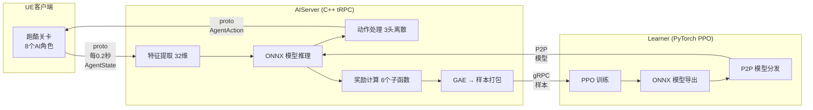
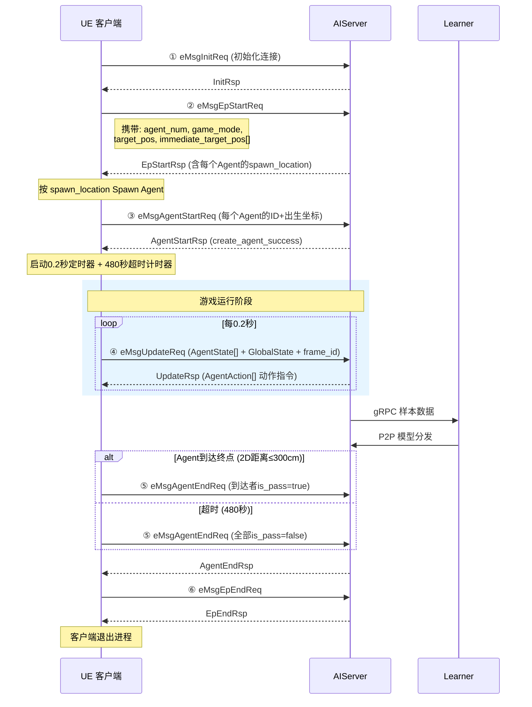
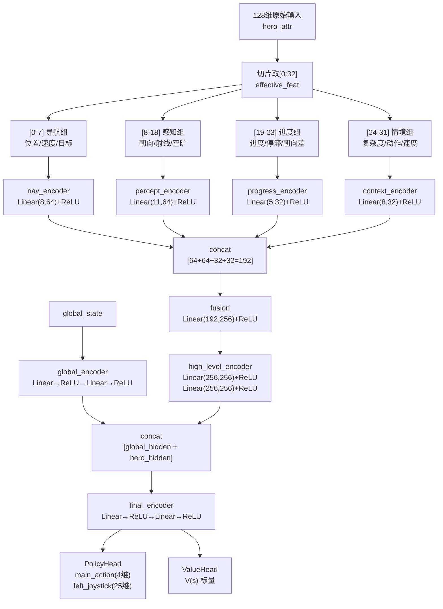
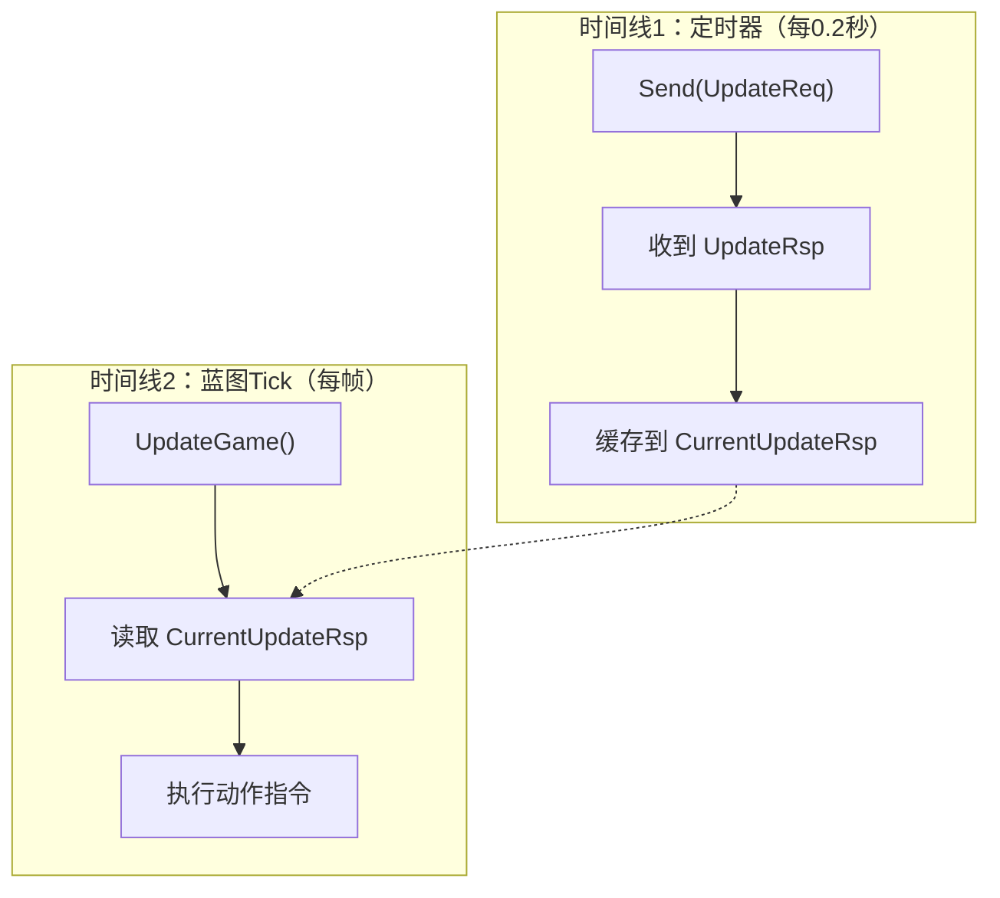

# AI 寻路强化学习系统 —— 渐进式技术方案

> **项目**：UGC Demo AI 跑酷寻路
> **最后更新**：2026-03-04
> **状态**：阶段一完成 → 阶段二（感知增强 + 模型扩充）方案确认
> **文档定位**：批判性架构审视 + 渐进式改进路线图 + 技术难点探讨

---

## 目录

1. [项目概述与系统架构](#1-项目概述与系统架构)
2. [当前系统全面审计](#2-当前系统全面审计)
3. [历史迭代教训](#3-历史迭代教训)
4. [射线检测方案深度分析](#4-射线检测方案深度分析)
5. [阶段一：基础通关训练（已完成）](#5-阶段一基础通关训练已完成)
6. [阶段二：模型扩充 + 视角统一 + 基础设施搭建（确认方案）](#6-阶段二模型扩充--视角统一--基础设施搭建确认方案)
7. [阶段三：高维特征 + 注意力 + 时序记忆](#7-阶段三高维特征--注意力--时序记忆)
8. [阶段四：泛化探索能力（远期）](#8-阶段四泛化探索能力远期)
9. [客户端协议与数据支持规划](#9-客户端协议与数据支持规划)
   - [9.3 当前协议定义](#93-当前协议定义以-proto-为准)
   - [9.4 动作指令体系](#94-动作指令体系aiserver--客户端)
   - [9.5 游戏结束机制](#95-游戏结束机制)
   - [9.9 协议扩展计划](#99-当前协议不足与分阶段扩展计划)
10. [PPO 超参数与训练策略](#10-ppo-超参数与训练策略)
11. [C++ 代码规范](#11-c-代码规范)
12. [文件清单](#12-文件清单)

---

## 1. 项目概述与系统架构

### 1.1 项目目标

训练一个强化学习 AI，在 UE 跑酷关卡中从起点到达终点。

| 阶段                   | 目标                           | 核心能力                                   |
| :--------------------- | :----------------------------- | :----------------------------------------- |
| **一（已完成）** | AI 能稳定通关单张地图          | 基础导航、避坑、到达终点                   |
| **二（当前）**   | 感知增强 + 模型扩充 + 基础设施 | 128 维特征、视角锁定、客户端射线、排名结束 |
| **三**           | AI 行为像人类玩家              | 时序记忆、死路回退、智能决策               |
| **四（远期）**   | AI 能在陌生地图自主探索通关    | 泛化探索策略、地图无关能力                 |

### 1.2 系统架构



### 1.3 部署架构

- **200 个 AIServer 镜像 × 8 Agent = 1600 个并行 Agent**
- **1 个 Learner 实例**（CPU 训练，PyTorch）
- 样本通过 gRPC 分发，模型通过 P2P（ModelDistributor）分发

### 1.4 完整生命周期流程



**Proto 数据流概要**：

| 方向               | 消息            | 关键字段                                        |
| :----------------- | :-------------- | :---------------------------------------------- |
| 客户端 → AIServer | `EpStartReq`  | `target_pos`, `immediate_target_pos[]`      |
| 客户端 → AIServer | `UpdateReq`   | `AgentState[]`, `GlobalState`, `frame_id` |
| 客户端 → AIServer | `AgentEndReq` | `is_pass`, `pass_time`                      |
| AIServer → 客户端 | `UpdateRsp`   | `AgentAction{move, perspective, skill}`       |

### 1.5 地图参数

| 参数                  | 值                   | 说明                                           |
| :-------------------- | :------------------- | :--------------------------------------------- |
| X 范围                | 5000 ~ 100000        | 主轴方向约 95000cm                             |
| Y 范围                | -5000 ~ 5000         | 横向约 100m                                    |
| Z 范围                | -500 ~ 500           | 高度                                           |
| 起点到终点直线距离    | ~91696cm             | 出生点(8333,-208,25) → 终点(100000,-2500,140) |
| 检查点数量            | 11 个（球#0~#10）    | 球#0=出生点区域，球#10≈终点                   |
| 终点坐标 (target_pos) | (100000, -2500, 140) | 压力板位置，2D距离≤300cm判定通关              |
| 每局最大时间          | 480 秒               | TMax=400 帧（由环境变量覆盖）                  |

**检查点序列（`immediate_target_pos[]`）**：

```
[球#0/出生点] ──→ [球#1] ──→ [球#2] ──→ ... ──→ [球#9] ──→ [球#10 ≈ 压力板]
     ↑                  有效路径检查点                          ↑
imm_target[0]                                            target_pos
(8333,-208,25)                                     (100000,-2500,140)
```

| 用途                          | 数据源                                                                   |
| :---------------------------- | :----------------------------------------------------------------------- |
| Agent 出生点参考              | `immediate_target_pos[0]`                                              |
| 路径规划/奖励计算的有效检查点 | `immediate_target_pos[1]` ~ `[9]`                                    |
| 终点坐标                      | `target_pos`（与 `immediate_target_pos[10]` XY 重合，仅 Z 差 100cm） |

---

## 2. 当前系统全面审计

### 2.1 动作空间

| 动作头                         | 维度                       | 功能                                   |
| :----------------------------- | :------------------------- | :------------------------------------- |
| `main_action`                | 4                          | 0=站立, 1=移动, 2-3=技能               |
| `left_joystick_dir`          | 25                         | 0=不移动, 1-24=移动方向(15°间隔)      |
| `right_joystick_perspective` | ~~25~~ **暂时禁用** | 未来FPS AI恢复，当前不参与模型输入输出 |

**核心问题**：视角与运动分离 → AI 学会面朝空旷倒退走来 hack 射线惩罚。
**阶段二方案**：**直接从模型中移除右摇杆动作头**（暂时禁用，所有相关代码保留注释标记，未来FPS AI恢复）。视角指令不发送给客户端，由客户端自行跟随移动方向。

### 2.2 观测空间（32 维特征向量）

| 位置        | 内容                       | 分组 |
| :---------- | :------------------------- | :--- |
| `[0-2]`   | 位置 xyz（归一化）         | 导航 |
| `[3-4]`   | 速度 xy（归一化）          | 导航 |
| `[5-7]`   | 目标方向 sin/cos + 距离    | 导航 |
| `[8-9]`   | 朝向 sin/cos(yaw)          | 感知 |
| `[10]`    | 是否死亡                   | 感知 |
| `[11-15]` | 射线距离 5 方向（归一化）  | 感知 |
| `[16]`    | 目标夹角 cos               | 感知 |
| `[17]`    | 前方空旷度                 | 感知 |
| `[18]`    | 被包围程度                 | 感知 |
| `[19]`    | 路径进度 [0,1]             | 进度 |
| `[20]`    | 停滞程度                   | 进度 |
| `[21]`    | 最空旷方向距离             | 进度 |
| `[22-23]` | 移动朝向差 sin/cos         | 进度 |
| `[24]`    | 环境复杂度                 | 情境 |
| `[25-27]` | 奖励信号（距离/墙壁/停滞） | 情境 |
| `[28]`    | 坠落次数归一化             | 情境 |
| `[29-31]` | 预留填 0                   | 情境 |

**当前已知缺陷**：射线仅 5 方向无后方感知、目标方向指向终点（弯道误导）、奖励信号作为观测（非标准做法，阶段二移除）、无时序信息、绝对坐标依赖换图失效。

### 2.3 奖励函数

| 奖励函数             | 类型       | 量级          | 全程累积 |
| :------------------- | :--------- | :------------ | :------- |
| PassReward           | 稀疏       | +5.0          | +5.0     |
| TimeBonus            | 稀疏       | +0~3.0        | +0~3.0   |
| DistanceReward       | 密集(分段) | ±0.05/300cm  | ±15.2   |
| WallProximityPenalty | 密集(每帧) | -0.001~-0.003 | ~-2.0    |
| StagnationPenalty    | 密集(每帧) | -0.001~-0.003 | ~-3.0    |
| FallPenalty          | 事件       | -0.3~-1.0/次  | ~-15.0   |

**核心矛盾**：密集奖励(+15.2) > 稀疏奖励(+8.0)，墙壁惩罚量级无效，直线距离在弯道信号反转。

### 2.4 网络架构

#### 2.4.1 分组编码器设计

采用**特征编组分层**架构，将 32 维有效特征按语义分成 4 组，每组通过独立编码器处理后再融合：

```
128维原始输入
    ↓ 切片取[0:32]
32维有效特征
    ↓ 按语义分组
┌──────────────────────────────────────────────────────────┐
│ 导航组 [0-7]   → nav_encoder(8→64)    位置/速度/目标方向 │
│ 感知组 [8-18]  → percept_encoder(11→64) 朝向/射线/空旷度 │
│ 进度组 [19-23] → progress_encoder(5→32)  进度/停滞/朝向差 │
│ 情境组 [24-31] → context_encoder(8→32)   复杂度/上帧动作  │
└──────────────────────────────────────────────────────────┘
    ↓ concat(64+64+32+32=192)
融合层: 192→256 (1层MLP+ReLU)
    ↓
高层编码器: 256→256→256 (2层MLP+ReLU)
    ↓
┌─────────────┬──────────────┐
│ PolicyHead  │  ValueHead   │
│ →动作分布   │  →状态价值   │
└─────────────┴──────────────┘
总参数量 ≈ 200K, Policy/Value 各一套独立编码器
```

#### 2.4.2 分组编码的设计动机与好处

| 好处 | 说明 |
| :--- | :--- |
| **语义隔离，防止特征干扰** | 如果把 32 维直接拍平进大 MLP，网络需自己猜哪些特征有关联，容易学到虚假相关性（如"位置 X 大时射线距离也大"→换图就废了）。分组后每个编码器只看语义相关的特征，被迫在组内学有意义的模式 |
| **参数效率高** | 大 MLP（32→256→256）需 ~73K 参数但大量浪费在学虚假跨组关联；分组编码（4组独立→192→256）只需 ~50K 参数，更少的参数反而学得更好——归纳偏置帮网络省了试错 |
| **可扩展，改一组不影响其他组** | 阶段三把 5 方向射线换成 24 方向客户端射线时，只需改感知组编码器（11→64 改成 30→64），导航组/进度组/情境组完全不动，融合层输入维度不变（还是 192） |
| **调试友好** | 可单独观察每组编码器的梯度/激活值：导航组梯度大+感知组梯度小→说明模型没学会看射线；情境组梯度全零→说明上帧动作没用上 |
| **对抗 128 维稀疏输入** | 128 维输入只有前 32 维有效，后 96 维全是 0。分组切片直接跳过无效位，避免参数浪费在学"0 是什么意思" |

> **一句话总结**：分组编码 = 用架构设计告诉网络"哪些特征该一起看"，减少学习难度，提高参数效率，方便扩展维护。

#### 2.4.3 编码器实现机制

每个分组编码器是**单层 MLP + ReLU**（`nn.Linear(in, out)` + `nn.ReLU()`），将低维原始特征映射到高维潜在空间。4 组编码器输出通过 `torch.cat` 拼接为 192 维向量，经融合层压缩到 256 维，再经 2 层高层编码器提取跨组的高阶关系。

```
每个编码器: input → Linear(in_dim, out_dim) → ReLU → output
                    ↑                          ↑
             可学习的权重矩阵W+偏置b      非线性激活（截断负值）

拼接: [nav_64, percept_64, progress_32, context_32] → [192]
融合: Linear(192, 256) + ReLU → [256]
高层: Linear(256,256)+ReLU → Linear(256,256)+ReLU → [256]

Policy端: encoding[256] → main_action_MLP → logits[4]
                        → left_joystick_MLP → logits[25]
Value端:  encoding[256] → value_MLP → V(s)[1]
```

**关键细节**：

- Policy 和 Value 使用**独立的编码器实例**（不共享权重），各自有一套完整的 分组编码器→融合层→高层编码器
- 动作头网络（`MLPNetwork`）使用 `nn.LeakyReLU(0.01)` 而非 `nn.ReLU`，最后一层不加激活函数直接输出 logits
- 推理时 logits 经 Softmax 得到概率分布，再用 `Categorical.sample()` 采样离散动作
- `play_mode > 0`（评估模式）时改用 `argmax` 贪婪选择而非采样

**问题**：无时序记忆、编码器太浅、注意力关闭、Policy/Value 不共享参数。

### 2.5 PPO 超参数

| 参数                 | 当前值  | 问题                 |
| :------------------- | :------ | :------------------- |
| `gamma`            | 0.99    | 末端奖励衰减到 0.018 |
| `ppo_ent_coef`     | 0.02    | 偏低，探索不足       |
| `learning_rate`    | 0.0005  | 偏高，策略震荡       |
| `mini_batch_count` | 60      | **不可修改**   |
| `batch_size`       | 4       | 偏小                 |
| 左/右摇杆系数        | 0.3/0.3 | 偏低                 |
| `use_rnn`          | False   | 无时序能力           |

### 2.6 客户端协议

当前 `AgentState` 仅 5 字段（pos/vel/rot/is_dead/id），缺失：客户端射线数据、地面类型、碰撞信息、动画状态等。完整协议定义、动作指令体系、游戏结束机制等详见[第 9 章](#9-客户端协议与数据支持规划)。

---

## 3. 历史迭代教训

### 3.1 逐帧差分制量级爆炸

最初 DistanceReward 每帧给 ±0.003，2400 帧累积 ~13 碾压其他奖励。**教训**：帧数=量级，改用分段累计制脱钩。

### 3.2 检查点引导导致 Agent 扎堆

到达检查点给 +0.5 奖励 → Agent 在第一个检查点反复进出刷奖励。**教训**：检查点奖励是局部最优陷阱。已降级为仅追踪。

### 3.3 信号冗余导致梯度干扰

GoalAlignment + OpenSpace + TimePressure 与 DistReward + WallPenalty 高度重叠。**教训**：同一件事只需一个信号。

### 3.4 动态系数过度复杂

温度波动 + 止损 + 动态系数（~60 字段 AdaptiveRewardState）调试困难效果不明。**教训**：情境感知应让模型学习而非硬编码。

### 3.5 视角-运动分离导致 Reward Hacking（重复 2 次）

1. WallPenalty 前方权重最高 → AI 转身让前方射线变远避罚
2. 调大量级后 AI 更激进转身 hack

**教训**：基于角色朝向的惩罚永远可被 hack，必须基于不可操纵量（速度方向/碰撞事件）。已通过锁定视角修复。

### 3.6 墙壁惩罚参数几乎无效

`threshold_normalized = 80/2000 = 0.04`，最大惩罚 -0.003/帧。**教训**：奖励信号必须在同一数量级。

### 3.7 不可修改参数导致模型分发断裂

修改 `mini_batch_count` 后模型无法分发。**教训**：`mini_batch_count`、`save_checkpoint_steps`、`upload_pb_steps` 不可随意修改

## 4. 射线检测方案深度分析

### 4.1 当前方案

AIServer 侧用 PhysXRaycaster 对碰撞网格（从 UE 导出的 `.obj` 文件）做射线检测，5 方向水平平面：

```
         前(0°)
          |
    左前45°  右前45°
     /          \
左90° -----X----- 右90°
```

每条射线从 Agent 位置 + 50cm 高度偏移出发，最远 2000cm，结果归一化为 `[0,1]`。

### 4.2 当前方案的缺陷

| 编号 | 缺陷                          | 影响                              | 严重性 |
| :--- | :---------------------------- | :-------------------------------- | :----- |
| 1    | **仅 5 方向，45°间隔** | 30°窄通道完全检测不到            | 严重   |
| 2    | **无后方射线**          | AI 回头时完全盲区，U 型弯调头困难 | 严重   |
| 3    | **纯 2D 水平面**        | 检测不到坑洞、跳跃点、斜坡        | 中等   |
| 4    | **碰撞 mesh 精度受限**  | 小台阶/窄缝可能检测不到           | 中等   |
| 5    | **无法区分障碍物类型**  | 普通墙 vs 死亡区域 vs 可破坏物体  | 中等   |
| 6    | **基于角色朝向**        | 视角锁定前射线方向 ≠ 移动方向    | 已修复 |

### 4.3 碰撞 mesh 精度问题详解

服务端射线检测依赖从 UE 导出的碰撞 mesh（`.obj`），而非运行时的 UE 物理引擎：

- 导出 mesh 是静态的，不包含动态物体（移动平台、开关门等）
- 简化碰撞体（Box/Sphere）与实际渲染几何体有差异
- 导出时可能丢失复杂碰撞的细节（如楼梯台阶被简化为斜面）
- 坐标系转换可能存在偏差（UE 左手坐标系 vs PhysX）

**关键限制**：服务端射线检测的精度天花板取决于碰撞 mesh 的质量，而非算法本身。长期来看，**客户端射线检测是唯一能获得精确环境感知的途径**。

### 4.4 射线方向与数量的权衡

| 方案   | 方向数 | 覆盖角          | 角度分辨率 | 特征增量 | 计算成本 |
| :----- | :----- | :-------------- | :--------- | :------- | :------- |
| 当前   | 5      | 180°（前半球） | 45°       | 0        | 低       |
| 方案 A | 12     | 360°（全向）   | 30°       | +7 维    | 中       |
| 方案 B | 16     | 360°（全向）   | 22.5°     | +11 维   | 中       |
| 方案 C | 24     | 360°（全向）   | 15°       | +19 维   | 高       |

**建议**：阶段二维持服务端 5 方向不变，等客户端射线检测器插件就绪后一步到位。具体射线方向数和角度间隔由客户端插件设计确定。

### 4.5 从服务端射线到客户端射线的迁移路径

```
阶段一: 服务端 PhysX 5方向射线（当前，精度有限但可用）
    ↓
阶段二 2A/2B: 维持服务端 5方向不变，先进行模型扩充和视角锁定
    ↓
阶段二 2C: 客户端 UE 射线检测器插件（跟随移动方向，方向数由客户端确定）
    ↓
阶段三: 客户端拓展到 24水平 + 4俯角射线 + 地面类型（完整环境感知）
```

每一步都是**向后兼容**的——客户端射线数据作为 proto 新字段添加，AIServer 可以选择使用客户端数据或回退到本地 PhysX。

**客户端 UE 射线检测器插件设计要点**：

- 作为 Actor Component 附着在 Agent 上
- 跟随 Agent **移动方向**（而非角色朝向）旋转
- 确保射线检测方向始终与实际运动方向一致
- 具体射线方向数、角度间隔、俯角配置等在客户端侧讨论确定

---

## 5. 阶段一：基础通关训练（已完成）

### 5.1 目标

让 AI 能在当前单张地图上稳定通关。不追求最优表现，只要"能通关"就达标。

> ✅ **状态**：已有少量 Agent 通关记录，准备进入阶段二。

### 5.2 当前奖励体系

```
第一层：里程碑驱动（稀疏）
├─ PassReward         : 通关 +5.0（含服务端2D距离验证防伪）
└─ TimeBonus          : 通关时间奖/未通关进度分级/截断惩罚

第二层：方向引导（分段累计制）
├─ DistanceReward     : 到终点2D距离，每靠近300cm→+0.05
└─ WallProximityPenalty: 靠墙惩罚 + 转向提示

第三层：行为约束（密集/事件）
├─ StagnationPenalty  : 10秒不动=-0.001/帧，30秒=-0.003/帧
└─ FallPenalty        : 坠落累进惩罚(-0.3 ~ -1.0)

已删除: CheckpointReward, RankBonus, GoalAlignment,
       OpenSpacePreference, TimePressure, 温度/止损/动态系数
```

### 5.3 各奖励函数规格

**DistanceReward（分段累计制）**：每帧算 `delta = prev_dist - current_dist`，靠近累计器达 300cm 给 +0.05，远离累计器达 300cm 给 -0.05。坠落时重置累计器。全程 ~303 段 × 0.05 = +15.2。

**WallProximityPenalty**：5 方向权重（前=1.0, 左前/右前=0.7, 左/右=0.3），射线归一化 < 0.04 触发，基准 -0.002。转向提示：前方被堵(< 0.15) + 侧方有路(> 0.5) → +0.001。

**FallPenalty**：第 N 次 = max(-0.3 + (N-1)×(-0.1), -1.0)。检测客户端 `is_dead` 上升沿，前 15 帧不检测，冷却 10 帧。

**TimeBonus**：通关时快速通关给 0~3.0；未通关按进度分级（>50% 正奖，<15% 轻罚）；截断惩罚 -1.0×(1-progress)。

### 5.4 阶段一训练观测

| 指标        | 观测值              | 评价                   |
| :---------- | :------------------ | :--------------------- |
| 通关        | 有少量 Agent 通关   | 首次突破               |
| target_dist | 0.88 → 0.53        | 从 15800 推进到 48000+ |
| fall_count  | 高位 → 趋稳        | 坠落次数在减少         |
| Agent 行为  | 有 Agent 出现倒退走 | 视角锁定在阶段二修复   |

### 5.5 阶段一遗留问题（转入阶段二解决）

| 编号 | 问题                       | 解决方案             | 对应子阶段          |
| :--- | :------------------------- | :------------------- | :------------------ |
| 1    | 视角-运动分离导致倒退跑    | 锁定视角=移动方向    | **2B**        |
| 2    | 弯道距离信号反转           | 检查点路径距离       | **2A 后观察** |
| 3    | 射线仅 5 方向无后方感知    | 客户端射线检测器插件 | **2C**        |
| 4    | 奖励信号作为观测（非标准） | 替换为上帧动作+速度  | **2A**        |
| 5    | 第一名通关全局结束         | 倒计时 60 秒排名机制 | **2D**        |

---

## 6. 阶段二：模型扩充 + 视角统一 + 基础设施搭建（确认方案）

> **前置条件**：阶段一 AI 已有通关记录
> **核心目标**：128 维模型扩充 + 视角锁定 + 客户端射线检测基础设施 + 排名结束机制
> **方案状态**：✅ 已确认，分 4 个子阶段实施

### 6.1 子阶段总览与依赖关系


| 子阶段       | 依赖       | 预估工作量                 | 影响范围                                          |
| :----------- | :--------- | :------------------------- | :------------------------------------------------ |
| **2A** | 无         | 服务端 2-3 天              | constant.h / defines.h / feature / network / yaml |
| **2B** | 2A 完成    | 服务端 0.5 天              | action_processor                                  |
| **2D** | 独立       | 服务端+客户端各 1 天       | proto / episode / 客户端                          |
| **2C** | 2A+2B 完成 | 客户端 2-3 天，服务端 1 天 | proto / feature / 客户端                          |

**推荐实施顺序**：2A → 2B → 训练验证 → 2D（可与 2C 并行）→ 2C → 全量训练验证

### 6.2 子阶段 2A：模型维度扩充（32→128 维）

#### 6.2.1 设计决策与理由

**为什么直接到 128 维而非 64 维？**

| 方案             | 维度 | 有效占比     | 风险                         | 结论                    |
| :--------------- | :--- | :----------- | :--------------------------- | :---------------------- |
| 64 维            | 64   | ~55%         | 低风险但紧张，阶段三可能再扩 | ❌ 扩充一次就要重新训练 |
| **128 维** | 128  | ~25%（初期） | 需精心设计编码器             | ✅ 一步到位，长期稳定   |

**关键约束**：编码器只处理有效特征 `[0-31]`，预留位 `[32-127]` **不进入任何编码器**，避免零值浪费参数。客户端射线就绪后只需修改编码器的切片范围，无需改维度。

#### 6.2.2 特征向量布局（128 维）

| 范围         | 内容                                  | 维度 | 编码器分组             | 变化说明                         |
| :----------- | :------------------------------------ | :--- | :--------------------- | :------------------------------- |
| `[0-2]`    | 位置 xyz（归一化）                    | 3    | 导航组                 | 不变                             |
| `[3-4]`    | 速度 xy（归一化）                     | 2    | 导航组                 | 不变                             |
| `[5-7]`    | 目标方向 sin/cos + 距离               | 3    | 导航组                 | 不变                             |
| `[8-9]`    | 朝向 sin/cos(yaw)                     | 2    | 感知组                 | 不变                             |
| `[10]`     | 是否死亡                              | 1    | 感知组                 | 不变                             |
| `[11-15]`  | 射线距离 5 方向（归一化）             | 5    | 感知组                 | 不变（客户端射线就绪后扩展）     |
| `[16]`     | 目标夹角 cos                          | 1    | 感知组                 | 不变                             |
| `[17]`     | 前方空旷度                            | 1    | 感知组                 | 不变                             |
| `[18]`     | 被包围程度                            | 1    | 感知组                 | 不变                             |
| `[19]`     | 路径进度 [0,1]                        | 1    | 进度组                 | 不变                             |
| `[20]`     | 停滞程度                              | 1    | 进度组                 | 不变                             |
| `[21]`     | 最空旷方向距离                        | 1    | 进度组                 | 不变                             |
| `[22-23]`  | 移动朝向差 sin/cos                    | 2    | 进度组                 | 不变                             |
| `[24]`     | 环境复杂度                            | 1    | 情境组                 | 不变                             |
| `[25-26]`  | 上帧动作编码（main_action, left_dir） | 2    | 情境组                 | **新增**：替换奖励信号     |
| `[27]`     | 速度大小（归一化）                    | 1    | 情境组                 | **新增**：替换奖励信号     |
| `[28]`     | Z 轴速度（归一化）                    | 1    | 情境组                 | **新增**：替换停滞奖励信号 |
| `[29]`     | 坠落次数归一化                        | 1    | 情境组                 | 从 `[28]` 移位                 |
| `[30-31]`  | 预留（填 0）                          | 2    | 情境组                 | 凑齐 8 维                        |
| `[32-127]` | **预留扩展位（全填 0）**        | 96   | **不进入编码器** | 为客户端射线/时序信息预留        |

#### 6.2.3 关键变化：移除奖励信号特征

**旧方案 `[25-27]`**：奖励信号（距离/墙壁/停滞）直接作为观测输入。

**问题**：

- 奖励信号是 Agent 自身行为的后果，放入观测会造成因果循环
- Value Function 可以直接"看到"奖励值而不需要真正理解环境
- 换图后奖励函数改了，这些特征就失效

**新方案 `[25-28]`**：上帧动作编码 + 速度信息

- `[25]` 上帧 main_action 索引归一化：`main_action_index / 3.0f`
- `[26]` 上帧 left_joystick_dir 索引归一化：`left_dir_index / 24.0f`
- `[27]` 当前速度大小归一化：`sqrt(vx²+vy²) / 600.0f`
- `[28]` Z 轴速度归一化：`vz / 600.0f`（正=上升/跳跃，负=下落）

#### 6.2.4 网络架构

##### 分组编码器设计理由

详细的分组编码设计动机见 [2.4.2 分组编码的设计动机与好处](#242-分组编码的设计动机与好处)。以下是阶段二扩充到 128 维后的关键设计约束：

- **编码器只处理 `[0-31]` 有效特征**，`[32-127]` 预留位不进入任何编码器
- 128 维输入先切片为 32 维有效特征，再按语义分 4 组
- 预留位全为 0，不消耗编码器参数，但保证了 ONNX 模型输入维度的前向兼容
- 客户端射线就绪后只需扩展感知组切片范围和编码器宽度，其余分组不变

##### 分组维度与编码器结构

```python
# 分组维度（只编码有效特征 [0-31]，[32-127] 跳过不进入编码器）
nav_size = 8        # [0-7]   导航特征
percept_size = 11   # [8-18]  感知特征（含 5 方向射线）
progress_size = 5   # [19-23] 进度特征
context_size = 8    # [24-31] 情境特征（环境复杂度+上帧动作+速度+坠落+预留）
# [32-127] → 预留位，不进入编码器

# 编码器结构保持不变
nav_encoder:     8 → 64   (1层MLP+ReLU)
percept_encoder: 11 → 64  (1层MLP+ReLU)
progress_encoder: 5 → 32  (1层MLP+ReLU)
context_encoder:  8 → 32  (1层MLP+ReLU)
fusion: 192 → 256         (1层MLP+ReLU)
high_level: 256 → 256 → 256 (2层MLP+ReLU)
# 参数量 ≈ 200K（与阶段一完全一致，因为编码器切片范围不变）
```

##### 完整数据流（从 128 维输入到动作输出）



##### 编码器核心实现代码

```python
# 文件: rl-learner/app/ugcdemo/ugcdemo_network_modeone.py
# 类: ModeOneHeroNetwork

class ModeOneHeroNetwork(nn.Module):
    def __init__(self, prefix):
        super().__init__()
        self.effective_size = 32  # 有效特征维度（128维中只取前32维）

        # 分组维度定义
        self.nav_size = 8       # [0-7]
        self.percept_size = 11  # [8-18]
        self.progress_size = 5  # [19-23]
        self.context_size = 8   # [24-31]

        # 4个独立分组编码器（各自学习组内特征的语义表示）
        self.nav_encoder = nn.Sequential(nn.Linear(8, 64), nn.ReLU())
        self.percept_encoder = nn.Sequential(nn.Linear(11, 64), nn.ReLU())
        self.progress_encoder = nn.Sequential(nn.Linear(5, 32), nn.ReLU())
        self.context_encoder = nn.Sequential(nn.Linear(8, 32), nn.ReLU())

        # 融合层：将4组编码结果拼接后压缩
        self.fusion = nn.Sequential(nn.Linear(192, 256), nn.ReLU())

        # 高层编码器：提取跨组的高阶关系
        self.input_encoder = nn.Sequential(
            nn.Linear(256, 256), nn.ReLU(),
            nn.Linear(256, 256), nn.ReLU(),
        )

    def forward(self, input):
        hero_attr = input["input/main_hero_attr"]

        # ---- 1. 切片：跳过[32:127]预留位 ----
        effective_feat = hero_attr[..., :self.effective_size]  # [batch, 32]

        # ---- 2. 按语义分组 ----
        nav_feat      = effective_feat[..., :8]      # 位置/速度/目标方向距离
        percept_feat  = effective_feat[..., 8:19]    # 朝向/死亡/射线/空旷度/包围
        progress_feat = effective_feat[..., 19:24]   # 进度/停滞/空旷方向/朝向差
        context_feat  = effective_feat[..., 24:32]   # 复杂度/上帧动作/速度/坠落

        # ---- 3. 独立编码 ----
        nav_hidden      = self.nav_encoder(nav_feat)          # [batch, 64]
        percept_hidden  = self.percept_encoder(percept_feat)  # [batch, 64]
        progress_hidden = self.progress_encoder(progress_feat)# [batch, 32]
        context_hidden  = self.context_encoder(context_feat)  # [batch, 32]

        # ---- 4. 拼接融合 ----
        fused = torch.cat([nav_hidden, percept_hidden,
                           progress_hidden, context_hidden], dim=-1)  # [batch, 192]
        hero_attr_hidden = self.fusion(fused)   # [batch, 256]

        # ---- 5. 高层编码 ----
        x = self.input_encoder(hero_attr_hidden)  # [batch, 256]
        return x
```

> **注意**：Policy 和 Value 使用完全独立的编码器实例（不共享参数），各有一套完整的分组编码器 + 融合层 + 高层编码器。动作头网络（`MLPNetwork`）使用 `nn.Linear` + `nn.LeakyReLU(0.01)` 构建多层 MLP，最终输出 logits 经 Softmax 采样得到离散动作。

**阶段三升级路径**（客户端射线就绪后）：

1. `[11-34]` 改为 24 方向射线，`percept_size` 从 11 扩到 27
2. `percept_encoder` 从 11→64 扩到 27→128
3. 其余分组不变，仅修改切片范围

#### 6.2.5 代码修改清单

| 文件                           | 修改内容                                                                           |
| :----------------------------- | :--------------------------------------------------------------------------------- |
| `constant.h`                 | `kMainSelfAttrSize` 32→128，新增 `kFeatureEffectiveSize=32`                   |
| `defines.h`                  | `ModeOneFeatureContext` 新增 `prev_main_action_index`、`prev_left_dir_index` |
| `feature_extractor_base.cc`  | `[25-28]` 改为上帧动作+速度，`[29]` 坠落次数移位，`[30-127]` 填 0            |
| `ugcdemo_network_modeone.py` | 输入 128 维但切片只取 `[0:32]`，编码器不变                                       |
| `conf/default.yaml`          | `main_hero_attr_size_modeone` 32→128                                            |

#### 6.2.6 验证标准

- [ ] 模型能成功编译、训练、推理
- [ ] 1000 步后 loss 正常收敛
- [ ] 通关率恢复到阶段一水平（3-5 分钟通关）
- [ ] 上帧动作编码日志输出正常

### 6.3 子阶段 2B：右摇杆暂时禁用（视角由客户端跟随移动方向）

#### 6.3.1 问题根源

```
右摇杆(perspective_action) 独立于 左摇杆(move_action)
→ AI 可以面朝空旷方向但实际往墙的方向移动
→ 射线检测基于角色朝向 → 面朝空旷 = 射线正常 = 无惩罚
→ 但实际倒退 = 背着撞墙 → Reward Hacking
```

**历史教训**：此问题在阶段一重复出现 2 次（见 3.5 节），是最严重的 Reward Hacking。

#### 6.3.2 方案：暂时从模型中移除右摇杆

**决策**：不再是"保留动作头但降低系数"，而是**直接从模型输入输出中移除右摇杆**。

- 模型不再有 `right_joystick_perspective_action` 动作头
- ONNX 模型不再输出右摇杆动作
- AIServer 不再从模型结果中读取右摇杆索引
- `ProcessRightJoystickPerAction` 函数体直接返回 `cmd_type=0`（不发送视角指令）
- 视角由客户端自行跟随移动方向

**所有相关代码保留注释标记 `[暂时禁用] 右摇杆视角输出，未来FPS AI恢复`，方便未来恢复。**

**好处**：

- 彻底消除右摇杆产生的噪声梯度（之前即使降低系数到0.1仍有噪声）
- 减少约 30% 的动作空间复杂度（3个动作头→2个）
- 训练收敛更快（更少的参数需要优化）

#### 6.3.3 客户端射线检测器方案

未来客户端将设计一个 **UE 射线检测器插件（Actor Component）**，附着在 Agent 上：

- 跟随 Agent **移动方向**（而非角色朝向）旋转
- 从而实现射线检测方向始终与实际运动方向一致
- 具体射线检测方案在客户端侧讨论，服务端只需做好接收和兼容

#### 6.3.4 代码修改清单

| 文件                            | 修改内容                                                |
| :------------------------------ | :------------------------------------------------------ |
| `ugcdemo_proto_modeone.py`    | 注释掉右摇杆 state/action/extra 注册                    |
| `ugcdemo_network_modeone.py`  | 注释掉右摇杆动作头网络和 handle_sub_action 中的右摇杆   |
| `ugcdemo_ppo_modeone.py`      | 注释掉右摇杆 policy_coef/entropy_coef/head_mask         |
| `conf/default.yaml`           | 注释掉右摇杆系数参数                                    |
| `constant.h`                  | 从 kPolicyTargets/kTargets/kActionNames 中移除右摇杆    |
| `feature_modeone.cc`          | 注释掉右摇杆的 predict_features/auxillary_features 注册 |
| `modeone_agent.cc`            | 不读取右摇杆模型输出，不设置 head mask                  |
| `action_processor_modeone.cc` | ProcessRightJoystickPerAction 直接返回 cmd_type=0       |

#### 6.3.5 验证标准

- [ ] 模型能正常编译、训练、推理（仅 2 个动作头：main_action + left_joystick）
- [ ] Agent 运动时面朝运动方向
- [ ] 不再出现背身倒退跑行为
- [ ] 通关率不下降

### 6.4 子阶段 2C：客户端射线检测迁移

#### 6.4.1 迁移理由

| 维度     | 服务端 PhysX（当前）     | 客户端 UE LineTrace                |
| :------- | :----------------------- | :--------------------------------- |
| 精度     | 受限于碰撞 mesh 导出质量 | UE 物理引擎原生精度                |
| 动态物体 | ❌ 无法检测              | ✅ 支持                            |
| 维护成本 | 地图变更需重新导出 mesh  | 零维护                             |
| 计算负载 | 服务端承担               | 客户端承担（分摊到 200 个实例）    |
| 泛化准备 | 每张图需要对应 mesh 文件 | 客户端通用                         |
| 延迟     | 无额外延迟               | 随状态上报传输（0.2 秒间隔内完成） |

#### 6.4.2 服务端压力评估

| 指标                         | 当前（5 方向服务端射线） | 未来（客户端射线）      |
| :--------------------------- | :----------------------- | :---------------------- |
| 带宽/Agent                   | ~41 B                    | ~155 B（+114 B）        |
| 带宽/服务器（8 Agent, 5Hz）  | ~1.6 KB/s                | ~6.1 KB/s               |
| 带宽/服务器（16 Agent, 5Hz） | ~3.3 KB/s                | ~12.2 KB/s              |
| 服务端射线计算               | 5 次 Raycast/Agent/帧    | **0（省掉了）**   |
| proto 反序列化增量           | —                       | ~1μs/Agent（忽略不计） |

**结论**：压力完全没问题。即使扩展到 16 Agent，带宽增量只有 ~9 KB/s，而且省掉了服务端射线检测的计算开销。

#### 6.4.3 Proto 扩展（AgentState）

```protobuf
message AgentState {
    int32 agent_unique_id = 1;
    Vec3  pos             = 2;
    Vec3  vel             = 3;
    Vec3  rot             = 4;
    bool  is_dead         = 5;
    // ===== 阶段 2C 新增 =====
    repeated float ray_distances    = 6;  // 水平射线归一化距离 [0,1]（方向数由客户端决定）
    repeated float ray_down_dists   = 7;  // 俯角射线归一化距离 [0,1]
    bool  is_on_ground              = 8;  // 是否在地面上
    bool  is_colliding              = 9;  // 是否正在碰撞墙壁
}
```

#### 6.4.4 服务端兼容策略

```cpp
// 伪代码：优先使用客户端数据，无数据时回退到服务端 PhysX
if (agent_state->ray_distances_size() > 0) {
    // 使用客户端传入的射线数据
    for (int i = 0; i < agent_state->ray_distances_size(); ++i) {
        modeone_ctx->ray_distances[i] = agent_state->ray_distances(i);
    }
} else {
    // 回退到服务端 PhysX 射线检测（当前逻辑不变）
    PerformServerRaycast(...);
}
```

#### 6.4.5 客户端实现要点

- 客户端设计 **UE 射线检测器插件（Actor Component）** 附着在 Agent 上
- 插件跟随 Agent 移动方向旋转，射线检测方向始终与运动方向一致
- 归一化在客户端侧完成：`hit_distance / max_distance`，无命中=1.0
- 具体射线方向数、角度间隔、俯角配置等在客户端侧讨论确定
- 数据通过 `AgentState.ray_distances` 和 `ray_down_dists` 上报

#### 6.4.6 代码修改清单

| 文件                          | 修改内容                              |
| :---------------------------- | :------------------------------------ |
| `ugcdemoai.proto`           | `AgentState` 新增 4 个字段          |
| `feature_extractor_base.cc` | 客户端/服务端射线数据切换逻辑         |
| `constant.h`                | 新增 `kMaxClientRayDirections` 常量 |

#### 6.4.7 验证标准

- [ ] 客户端射线数据能正确传输到服务端
- [ ] 服务端能正确解析并使用客户端射线数据
- [ ] 回退机制正常（客户端数据为空时使用 PhysX）
- [ ] 训练效果不劣于服务端射线检测

### 6.5 子阶段 2D：排名结束机制（倒计时 60s）

#### 6.5.1 机制设计

```
Agent#3 到达终点 (2D距离≤300cm)
    ↓
客户端发送 eMsgAgentEndReq (Agent#3, is_pass=true)
    ↓
服务端记录: winner_agent=3, winner_time=游戏时间
    ↓
服务端返回 AgentEndRsp {countdown_seconds=60}  ← 新增字段
    ↓
客户端启动60秒倒计时，继续发送其余Agent的UpdateReq
    ↓
倒计时结束 或 所有Agent都通关
    ↓
客户端发送剩余Agent的 eMsgAgentEndReq (is_pass=true/false)
    ↓
客户端发送 eMsgEpEndReq
```

#### 6.5.2 Proto 扩展

```protobuf
message AgentEndRsp {
    int32 ret_code          = 1;
    float countdown_seconds = 2;  // 新增：>0 表示倒计时（秒），0=立即结束
}
```

#### 6.5.3 对训练的影响

| 影响              | 说明                                                                  |
| :---------------- | :-------------------------------------------------------------------- |
| 更多训练样本      | 每局不再因一个 Agent 通关就结束，其余 7 个 Agent 多获得 60 秒训练数据 |
| 截断惩罚仍有效    | `episode_has_winner=true` 在倒计时结束时对未通关 Agent 生效         |
| 多 Agent 通关奖励 | 倒计时内其他 Agent 也可以通关拿 PassReward                            |
| 竞争学习          | Agent 之间形成排名竞争，而非"第一名通关全灭"                          |

#### 6.5.4 代码修改清单

| 文件                   | 修改内容                                         |
| :--------------------- | :----------------------------------------------- |
| `ugcdemoai.proto`    | `AgentEndRsp` 新增 `countdown_seconds`       |
| `modeone_episode.cc` | Episode 结束逻辑：记录 winner 后不立即结束       |
| `modeone_agent.cc`   | Agent 结束处理：区分"通关结束"和"倒计时超时结束" |
| 客户端蓝图/C++         | 倒计时逻辑 + 继续发送 UpdateReq                  |

### 6.6 检查点路径距离（解决弯道信号反转）

**问题**：直线距离到终点 → U 型弯中前进反而远离终点 → DistReward 给负值。

**方案**：改用 `到下一个检查点的距离 + 剩余检查点到终点的路径距离`，数据已有（`intermediate_pos_list`）。**仅改变距离计算方式**，奖励发放逻辑不变，不是恢复旧的检查点奖励系统。

```
旧：Agent ──── 直线距离 ──── 终点
                              ↑ U型弯中方向反转！

新：Agent → 下一CP → 后续CP → ... → 终点
    路径距离 = 到下一CP + Σ(后续CP间距)
                              → 弯道中靠近下一CP = 正奖励
```

**实施时机**：2A 完成后，在训练验证阶段观察弯道表现，必要时启用。

### 6.7 兼容性说明

- **阶段二不兼容阶段一模型**（特征维度 32→128），必须从零训练
- 阶段一积累的超参数和奖励量级经验可复用
- 阶段二内部各子阶段 2A/2B/2C/2D 之间的模型兼容性：
  - 2A→2B：兼容（仅改动作处理，不改特征/网络）
  - 2B→2C：兼容（射线数据来源变化但维度不变）
  - 2D：独立于模型

### 6.8 为阶段三泛化训练打下的基础

| 基础设施          | 泛化意义                                                  |
| :---------------- | :-------------------------------------------------------- |
| 128 维特征空间    | 96 维预留位可容纳 24 方向射线+俯角+时序信息，无需再改维度 |
| 客户端射线检测    | 地图无关：任何地图都能自动获取环境感知，无需导出碰撞 mesh |
| UE 射线检测器插件 | 跟随移动方向旋转，360° 覆盖                              |
| 上帧动作编码      | 最小时序信息：AI 知道上一帧做了什么                       |
| 速度/Z 轴速度     | 运动状态感知：区分在地面/跳跃/坠落                        |
| `is_on_ground`  | 跳跃感知：精确区分在地面/跳跃/坠落                        |
| 排名结束机制      | 更多训练样本，竞争学习                                    |

---

## 7. 阶段三：高维特征 + 注意力 + 时序记忆

> 前置条件：阶段二通关率稳定在 60%+
> 核心目标：行为像人类玩家——会绕路、会回退、会判断岔路口

### 7.1 特征向量扩展至 128 维（完整填充）

阶段二已将维度扩充到 128 ，但有效特征只占 32 维。阶段三将填充预留位：

```
[0-39]   环境感知层(40维): 24方向射线 + 4俯角射线 + 地面信息 + 综合指标
[40-55]  目标引导层(16维): 自我中心目标方向 + 距离 + 进度 + 位置编码
[56-71]  运动状态层(16维): 速度分量 + 朝向 + 停滞/死亡/坠落 + 效率指标
[72-87]  行为记忆层(16维): 平均运动方向 + 方向熵 + 回溯检测 + 趋势
[88-111] 奖励信号层(24维): 各奖励当帧值/累计值/统计量
[112-127] 扩展预留(16维)
```

### 7.2 网络架构升级

```
输入: obs[128]
  |
  ├─ [0-39]   → RayEncoder(Conv1D 40→128)  → env_emb[128]
  ├─ [40-55]  → NavEncoder(MLP 16→64)      → nav_emb[64]
  ├─ [56-71]  → MotionEncoder(MLP 16→64)   → mot_emb[64]
  ├─ [72-87]  → MemoryEncoder(MLP 16→64)   → mem_emb[64]
  └─ [88-111] → RewardEncoder(MLP 24→64)   → rew_emb[64]
       |
       ├─ Concat(env,nav,mot,mem) → context[320]
       |
       └─ Reward Attention:
            context→Q, rew_emb→K/V
            → reward_context[64]
            |
            └─ Concat → final[384]
                 ├─ PolicyHead → actions
                 └─ ValueHead  → V(s)
```

射线用 Conv1D（相邻射线有空间结构），注意力学习"什么情境下关注什么奖励"。

### 7.3 回退探索能力

PPO 的 advantage 基于未来累计回报折现。死路尽头 V(s) 低（未来全是停滞惩罚），岔路口 V(s) 高（多方向可探索）。回退时当帧距离奖励为负，但到达 V(s) 更高的岔路口 → advantage > 0。前提：Value Function 能区分死路和岔路口（128 维特征提供了足够信息）。

---

## 8. 阶段四：泛化探索能力（远期）

> 前置条件：阶段三在已知地图表现良好
> 核心目标：陌生地图零样本通关

### 8.1 泛化的核心矛盾

| 容易泛化（地图无关） | 难以泛化（地图依赖） |
| :------------------- | :------------------- |
| "靠墙了应该转弯"     | "第 3 个路口左转"    |
| "前方空旷就往前走"   | "T 字路口走右边更快" |
| "停滞了尝试新方向"   | "终点在右上角"       |

泛化 = 只学左列不学右列。

### 8.2 关键技术路线

**消除绝对坐标依赖**：`[0-2]` 从归一化绝对坐标改为自我中心（Egocentric）特征 + Sinusoidal 位置编码。

**测地距离引导**：预计算 NavMesh → Dijkstra/A* 算沿可通行区域到终点的最短路径长度，完全解决弯道问题。但需要额外工具链（UE NavMesh 导出 + 服务端路径查询）。

**探索奖励**：首次进入新网格(500×500cm) → +0.01。新图全是未知区域 → 天然有效。

**好奇心驱动（可选）**：RND（Random Network Distillation）内在奖励，预测误差大 = 新奇状态 = 给奖励。风险："好奇心陷阱"（如盯着噪声源）。

### 8.3 多图训练策略

| 阶段    | 策略           | 目的                    |
| :------ | :------------- | :---------------------- |
| Phase 1 | 单图精训       | 验证 128 维特征基础能力 |
| Phase 2 | 3 图轮换       | 打破地图特异性记忆      |
| Phase 3 | 5-8 图随机     | 泛化压力测试            |
| Phase 4 | 新图 zero-shot | 验证真正泛化能力        |

### 8.4 泛化能力的关键前提

1. 足够丰富的环境感知（24+方向射线 + 地面信息 ≥ 40 维环境特征）
2. 时序记忆能力（GRU/Transformer 记住走过的路避免重复）
3. 自我中心观测（消除所有绝对坐标依赖）
4. 沿路径距离引导（而非直线距离，消除弯道误导）
5. 多样化训练地图（至少 5 张不同结构的地图）

---

## 9. 客户端协议与数据支持规划

> 以 [ugcdemoai.proto](/data/aiserver-cpp/src/app/proto/ugcdemoai.proto) 为准

### 9.1 通信方式

| 项目     | 说明                                        |
| :------- | :------------------------------------------ |
| 传输层   | Ultron AI Service SDK（TCP 长连接）         |
| 序列化   | Protocol Buffers（Protobuf）                |
| 通信模式 | 请求-响应式（客户端发请求，服务器返回响应） |
| 连接管理 | 客户端主动连接，连接失败自动每 1 秒重试     |

### 9.2 消息类型枚举

| 枚举值 | 名称                  | 方向 | 说明             |
| :----- | :-------------------- | :--- | :--------------- |
| 1      | `eMsgInitReq`       | C→S | 初始化连接       |
| 2      | `eMsgInitRsp`       | S→C | 初始化响应       |
| 5      | `eMsgEpStartReq`    | C→S | Episode 开始请求 |
| 6      | `eMsgEpStartRsp`    | S→C | Episode 开始响应 |
| 7      | `eMsgAgentStartReq` | C→S | Agent 创建上报   |
| 8      | `eMsgAgentStartRsp` | S→C | Agent 创建确认   |
| 9      | `eMsgUpdateReq`     | C→S | 帧状态上报       |
| 10     | `eMsgUpdateRsp`     | S→C | 动作指令下发     |
| 11     | `eMsgAgentEndReq`   | C→S | Agent 结算上报   |
| 12     | `eMsgAgentEndRsp`   | S→C | Agent 结算确认   |
| 13     | `eMsgEpEndReq`      | C→S | Episode 结束     |
| 14     | `eMsgEpEndRsp`      | S→C | Episode 结束确认 |

### 9.3 当前协议定义（以 proto 为准）

#### 9.3.1 公共类型

```protobuf
message Vec2 { float x = 1; float y = 2; }
message Vec3 { float x = 1; float y = 2; float z = 3; }
message Rotation { float pitch = 1; float yaw = 2; float roll = 3; }
enum GameMode { GameModeEmpty = 0; GameModeOne = 1; }
```

#### 9.3.2 EpStartReq — Episode 开始

```protobuf
message EpStartReq {
    int32    agent_num                  = 1;  // AI Agent 数量
    int32    player_num                 = 2;  // 玩家数量（当前固定 0）
    GameMode game_mode                  = 3;  // 固定 GameModeOne(1)
    Vec3     target_pos                 = 4;  // ★ 终点坐标（压力板位置）
    repeated Vec3 immediate_target_pos  = 5;  // ★ 检查点序列（球#0~#10，共11个）
}
```

服务器返回 `EpStartRsp`，其中 `agent_settings` 数组长度决定客户端 Spawn 多少 Agent，每个 Agent 放置在对应的 `spawn_location`。

#### 9.3.3 AgentStartReq — Agent 创建确认

```protobuf
message AgentInfo {
    int32 agent_unique_id = 1;  // Agent 唯一ID（从1开始递增）
    Vec3  spawn_location  = 2;  // Agent 实际出生坐标
}
```

服务器返回 `AgentStartRsp`，通过 `create_agent_success` 控制哪些 Agent 参与训练。仅 `true` 的 Agent 参与后续状态上报和通关判定。

#### 9.3.4 UpdateReq — 帧状态上报（每 0.2 秒）

```protobuf
message AgentState {
    int32 agent_unique_id = 1;
    Vec3  pos             = 2;  // 世界坐标 (X,Y,Z)，单位：cm
    Vec3  vel             = 3;  // 速度向量 (X,Y,Z)，单位：cm/s
    Vec3  rot             = 4;  // 朝向 (Roll, Pitch, Yaw)，单位：度
    bool  is_dead         = 5;  // 是否坠落死亡
}

message GlobalState { float game_time = 1; }

message UpdateReq {
    repeated AgentState agent_states = 1;
    GlobalState         global_state = 2;
    int32               frame_id     = 3;  // 帧计数器（从0递增）
}
```

**各字段详细说明**：

| 字段          | 数据来源                             | 坐标系        | 单位 | 补充                               |
| :------------ | :----------------------------------- | :------------ | :--- | :--------------------------------- |
| `pos`       | `Actor->GetActorLocation()`        | UE 世界坐标系 | cm   | 角色脚底位置                       |
| `vel`       | `Actor->GetVelocity()`             | UE 世界坐标系 | cm/s | 含垂直分量 Z                       |
| `rot`       | `Actor->GetControlRotation()`      | UE 旋转坐标系 | 度   | rot.x=Roll, rot.y=Pitch, rot.z=Yaw |
| `is_dead`   | 蓝图属性 `IsFallDead`              | —            | bool | 坠落死亡标记，不触发游戏结束       |
| `game_time` | `GetTimeSeconds() - GameStartTime` | —            | 秒   | 从游戏正式开始计时                 |
| `frame_id`  | 内部计数器                           | —            | 整数 | 每次 Send 后自增                   |

#### 9.3.5 AgentEndReq — Agent 结算

```protobuf
message AgentEndInfo {
    int32 agent_unique_id = 1;
    bool  is_pass         = 2;  // 是否通关
    float pass_time       = 3;  // 通关耗时（秒），未通关为 0
}
```

| 结束场景          | 到达终点的 Agent                         | 其他 Agent                              |
| :---------------- | :--------------------------------------- | :-------------------------------------- |
| 有 Agent 到达终点 | `is_pass=true`, `pass_time=已过秒数` | `is_pass=false`, `pass_time=0`      |
| 超时（480秒）     | —                                       | 全部 `is_pass=false`, `pass_time=0` |

### 9.4 动作指令体系（AIServer → 客户端）

#### 9.4.1 双时间线执行机制



同一组指令在 0.2 秒内被每帧重复执行（约 12 次 @60FPS）。客户端不做任何自主决策，100% 执行服务器指令。

#### 9.4.2 每帧执行顺序

每个 Agent 严格按此顺序执行：**① 旋转 → ② 移动 → ③ 技能/跳跃**。在执行动作前，每帧先检查是否有 Agent 到达终点。

#### 9.4.3 旋转指令（perspective_action）

```protobuf
message AgentPerspectiveAction {
    uint32   cmd_type        = 1;  // 0=不旋转, 1=设置旋转
    Rotation target_rotation = 2;  // pitch/yaw/roll
}
```

执行方式：`AIActor->SetActorRotation(FRotator(pitch, yaw, roll))` —— **绝对角度设置**（非增量），每帧重复执行同一角度不会累积。`yaw` 是控制面朝方向的主要参数。

#### 9.4.4 移动指令（move_action）

```protobuf
message AgentMoveAction {
    uint32 cmd_type       = 1;  // 0=不移动, 1=按方向移动
    Vec2   move_direction = 2;  // 世界坐标系方向向量
}
```

执行方式：`AIActor->AddMovementInput(FVector(x, y, 0))` —— **世界坐标系**方向向量（不是 Agent 本地相对方向），Z 分量强制为 0。移动速度由角色 `MaxWalkSpeed` 决定，`move_direction` 只控制方向。`AddMovementInput` 是增量输入，每帧持续产生移动。

#### 9.4.5 技能指令（skill_action）

```protobuf
message AgentSkillAction {
    uint32 cmd_type        = 1;  // 0=不释放, 1=释放技能
    int32  skill_id        = 2;  // 1=跳跃
    Vec2   skill_direction = 3;  // 跳跃时不使用
}
```

UE 的 `Jump()` 有内建防重复机制，空中连续调用不会二段跳。需要 Agent 落地后才能再次起跳。

### 9.5 游戏结束机制

#### 9.5.1 到达终点

每帧在动作执行前检测：计算角色位置与 `target_pos` 的 **2D 距离（仅 X/Y，忽略 Z）**，≤ 300cm 触发通关。第一个到达的 Agent 立即触发结束。

#### 9.5.2 超时

480 秒后所有 Agent 的 `is_pass=false`。

#### 9.5.3 注意事项

| 事项                   | 说明                                 |
| :--------------------- | :----------------------------------- |
| 坠落死亡不触发结束     | `is_dead=true` 仅表示 Agent 坠落   |
| 终点判定忽略 Z 轴      | 只比较 XY 平面距离                   |
| 通关判定优先于动作执行 | 每帧先检查通关，触发则不执行本帧动作 |

### 9.6 客户端坠落检测机制

当前坠落检测链路：客户端蓝图 `CheckFall()` 检测掉落 → `IsFallDead=true` → `BornByFall` 传送回安全点 → `IsFallDead=false`。服务端每 0.2 秒采样 `is_dead`，检测 `false→true` 上升沿即为坠落事件。首 15 帧不检测（跳过出生下落），冷却 10 帧（防连续误触发）。

### 9.7 错误处理与重连

| 场景                           | 客户端行为                                   |
| :----------------------------- | :------------------------------------------- |
| 初始连接失败                   | 每 1 秒自动重试                              |
| `eMsgInitReq` 发送失败       | 每 1 秒重试                                  |
| `eMsgEpStartReq` 发送失败    | 每 1 秒重试                                  |
| `eMsgAgentStartReq` 发送失败 | 每 1 秒重试                                  |
| `eMsgUpdateReq` 发送失败     | **不重试**，等待下一次定时器触发       |
| `eMsgAgentEndReq` 发送失败   | 每 1 秒重试                                  |
| `eMsgEpEndReq` 发送失败      | **不重试**，直接当作成功处理并退出程序 |

### 9.8 关键配置参数

| 参数                        | 值             | 说明                                           |
| :-------------------------- | :------------- | :--------------------------------------------- |
| `AIServerUpdateDeltaTime` | 0.2 秒         | 状态上报频率                                   |
| `AIServerMaxRaceTime`     | 480 秒         | 超时时间                                       |
| `CheckEndDist`            | 300.0 cm       | 终点判定距离阈值                               |
| `ActorAgentId` 起始值     | 1              | Agent ID 从 1 开始递增                         |
| Agent 角色蓝图              | `BP_Monster` | `/Game/BP/Character/BP_Monster.BP_Monster_C` |

### 9.9 当前协议不足与分阶段扩展计划

当前 `AgentState` 仅 5 字段，所有环境感知依赖服务端碰撞 mesh 射线检测，精度和信息量严重不足。

**阶段二新增（已确认）**：

```protobuf
message AgentState {
    // ... 前5字段不变 ...
    // ===== 阶段二新增 =====
    repeated float ray_distances    = 6;  // 水平射线归一化距离 [0,1]（方向数由客户端确定）
    repeated float ray_down_dists   = 7;  // 俯角射线归一化距离 [0,1]
    bool  is_on_ground              = 8;  // 是否在地面上
    bool  is_colliding              = 9;  // 是否正在碰撞墙壁
}

message AgentEndRsp {
    int32 ret_code          = 1;
    float countdown_seconds = 2;  // 新增：>0 表示倒计时（秒），0=立即结束
}
```

**服务端压力评估（已确认无压力）**：

| 指标                         | 当前（5 方向服务端射线） | 未来（客户端射线）    |
| :--------------------------- | :----------------------- | :-------------------- |
| 带宽/Agent                   | ~41 B                    | ~155 B（+114 B）      |
| 带宽/服务器（8 Agent, 5Hz）  | ~1.6 KB/s                | ~6.1 KB/s             |
| 带宽/服务器（16 Agent, 5Hz） | ~3.3 KB/s                | ~12.2 KB/s            |
| 服务端射线计算               | 5 次 Raycast/Agent/帧    | **0（省掉了）** |

**阶段三建议新增**：

```protobuf
message AgentState {
    // ... 前7字段不变 ...
    // ===== 阶段三新增 =====
    repeated float ray_distances   = 8;   // 24方向水平射线[0,1]
    repeated float ray_down_dists  = 9;   // 4方向俯角射线[0,1]
    float ground_height            = 10;  // 脚下地面高度
    float forward_path_width       = 11;  // 前方通道宽度
    float surface_type             = 12;  // 地面类型(0=普通,1=死亡)
}
```

**客户端射线实现要点**：

- 24 方向水平射线：每帧在 `AICharacter::Tick` 中执行 `LineTraceSingleByChannel`
- 建议使用异步 `AsyncLineTraceByChannel` 避免主线程卡顿
- 24 个 float 仅 96 字节带宽增量，可忽略
- 归一化在客户端侧完成：`hit_distance / max_distance`，无命中=1.0

### 9.10 客户端功能需求优先级

| 功能                       | 优先级       | 对应子阶段   | 说明                                  |
| :------------------------- | :----------- | :----------- | :------------------------------------ |
| UE 射线检测器插件          | 高           | **2C** | Actor Component，跟随移动方向旋转     |
| `ray_distances` 字段上报 | 高           | **2C** | 射线归一化距离数据                    |
| `is_on_ground` 字段      | 高           | **2C** | CharacterMovement->IsMovingOnGround() |
| `is_colliding` 字段      | 高           | **2C** | 碰撞回调或短距离全向射线检测          |
| 排名结束倒计时             | 中           | **2D** | 首人通关后给剩余 60 秒                |
| 地图变体支持               | 低（阶段四） | 远期         | 多张不同结构地图                      |

---

## 10. PPO 超参数与训练策略

### 10.1 当前参数与建议

| 参数                    | 当前值 | 阶段二建议         | 理由                     |
| :---------------------- | :----- | :----------------- | :----------------------- |
| `gamma`               | 0.99   | 0.995              | 拉长信用分配窗口         |
| `ppo_ent_coef`        | 0.02   | 0.05+decay         | 加大探索，后期衰减       |
| `learning_rate`       | 0.0005 | 0.0001             | 128 维特征需要更小学习率 |
| `batch_size`          | 4      | 8                  | 更大特征空间需更大 batch |
| `left_joystick_coef`  | 0.3    | 0.5                | 提高移动方向梯度         |
| `right_joystick_coef` | 0.3    | **暂时禁用** | 右摇杆从模型中移除       |
| `gae_lambda`          | 0.95   | 保持               | 合理值                   |

### 10.2 不可修改参数

以下参数直接影响模型保存/导出/分发链路，修改会导致工作流监测断裂：

- `mini_batch_count` = 60
- `save_checkpoint_steps` = 60
- `upload_pb_steps` = 600

### 10.3 训练策略

**阶段二 2A 过渡**：

- 保持奖励函数不变，只改特征维度和情境组内容
- lr=0.0001，前 1000 步高熵系数(0.05)后衰减
- 编码器只处理 [0-31] 有效特征，[32-127] 不进入编码器
- 确认收敛后再进行 2B（视角锁定）

**阶段二 2B 后**：

- 右摇杆已从模型中暂时移除，无需设置 coef
- 观察 Agent 行为是否不再倒退跑
- 确认弯道表现，必要时启用检查点路径距离（见 6.6 节）

---

## 11. C++ 代码规范

### 11.1 函数注册区

按从属分类组织，每分类用单行注释标注类别名，注册行末尾行内注释写明含义，不同分类间空一行。

```cpp
// 稀疏奖励
RegisterOnce("PassReward", PassReward);               // 通关奖励：成功到达目标时给予的大额奖励
RegisterOnce("TimeBonus", TimeBonus);                 // 通关时间奖励：通关越快奖励越高

// 密集奖励（每帧，固定系数）
RegisterOnce("DistanceReward", DistanceReward);       // 距离引导：靠近目标正奖远离负罚

// 事件驱动
RegisterOnce("FallPenalty", FallPenalty);              // 坠落惩罚：每次坠落一次性惩罚
```

### 11.2 函数定义

每个函数定义前用 `// ====...====` 分隔符块标注中文名 + 属性标签 + 关键机制。简单函数只写第一行。不写变更说明/参数说明。

```cpp
// =====================================================================
// 距离引导奖励（密集，分段累计制）
// 分段累计：每累计靠近/远离300cm才给一次固定奖励，避免帧数导致量级失控
// =====================================================================
float DistanceReward(const std::any req) {
```

### 11.3 常量定义区

用 `// --- 分类名 ---` 分组，行内注释对齐，相关常量紧邻。概念说明可在组上方补充。

```cpp
// --- 坠落检测 ---
// 采用累进惩罚+上限：首次-0.3，之后每次额外-0.1，单次最大-1.0
constexpr float kFallPenalty_Base = -0.3f;          // 首次坠落基础惩罚
constexpr float kFallPenalty_Increment = -0.1f;     // 每次额外递增惩罚
constexpr float kFallPenalty_Cap = -1.0f;           // 单次惩罚上限
```

### 11.4 函数体内注释

关键逻辑前写单行注释（做什么/为什么），多阶段用 `// ---- N. 阶段名 ----` 分隔，分支前简要说明。

```cpp
// ---- 1. 更新周围墙壁检测信息 ----
int wall_count = 0;

// ---- 2. 更新目标方向对齐信息 ----
float dx = target_pos[0] - pos.x();

// --- 规则1：前方空旷 → 正奖励 ---
if (front_dist > threshold) {
```

### 11.5 代码清理

- 用户手动注释掉的代码保留不动（除非明确要求清理）
- 废弃功能彻底删除不留残余注释
- 不写变更日志（"删除了 xxx"、"新增了 xxx"）
- 注释统一中文，描述功能和设计意图而非代码翻译

---

## 12. 文件清单

```
aiserver-cpp/
├── conf/server_conf.yaml                     # AIServer配置
├── src/app/
│   ├── defines/
│   │   ├── constant.h                        # 所有奖励/特征/动作常量
│   │   └── defines.h                         # ModeOneFeatureContext 结构定义
│   ├── feature/
│   │   ├── feature_extractor_base.cc         # 32维特征提取 + 射线检测 + 坠落检测
│   │   └── feature_extractor_modeone.cc      # ModeOne特征提取器入口
│   ├── reward/modeone/
│   │   ├── modeone_score_reward.cc           # 6个奖励函数实现
│   │   └── modeone_score_reward.h            # 奖励函数声明
│   ├── action/
│   │   ├── action_processor_modeone.cc       # 3头动作处理（含视角锁定）
│   │   └── action_processor_modeone.h
│   ├── agent/
│   │   ├── modeone_agent.cc                  # Agent主循环
│   │   ├── modeone_agent.h
│   │   └── sample.cc                         # GAE计算
│   ├── episode/modeone_episode.cc            # Episode管理
│   ├── metric/modeone_metric.cc              # 训练指标追踪
│   ├── perception/include/PhysicsWrapper.h   # PhysX射线检测封装
│   └── proto/ugcdemoai.proto                 # 通信协议定义

rl-learner/
├── app/ugcdemo/
│   ├── conf/default.yaml                     # Learner配置（PPO超参数）
│   ├── ugcdemo_network_modeone.py            # 分组感知网络架构
│   ├── ugcdemo_ppo_modeone.py                # PPO算法实现
│   └── ugcdemo_trainer.py                    # 训练循环
```
