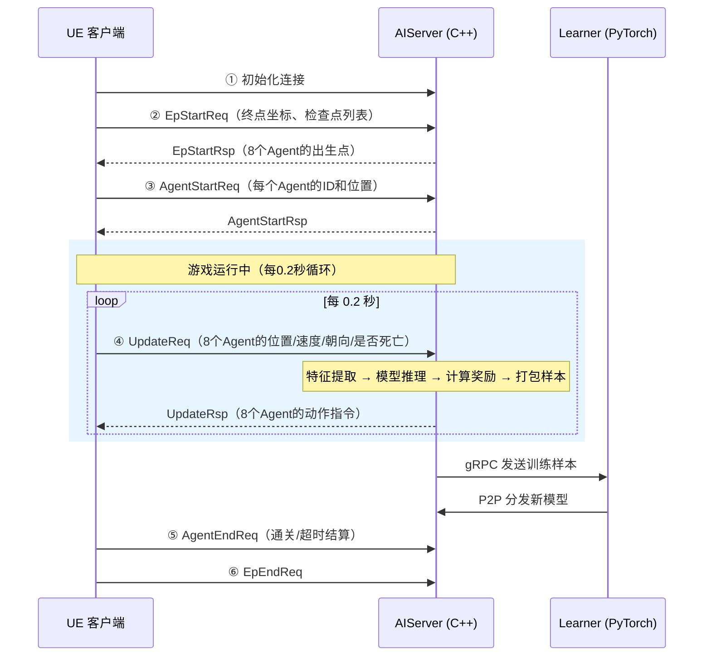
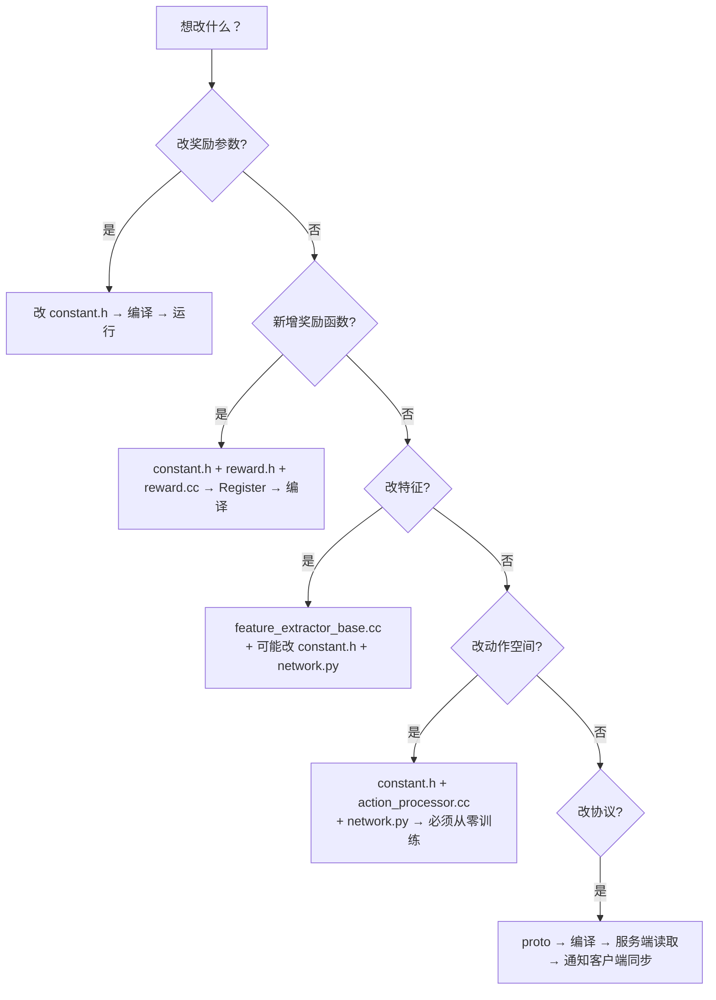

# AI 跑酷寻路项目 —— 新人入门指南

> **项目**：UGC Demo AI 跑酷寻路（强化学习 PPO）

> **环境**：Docker 容器内运行（CentOS）

> **技术栈**：C++ AIServer（tRPC） + PyTorch Learner + UE5 客户端

> **当前阶段**：第一阶段已完成（AI 稳定通关单张地图，约 3 分钟）

---

## 目录

1. [项目是什么](#1-项目是什么)
2. [整体架构一句话概括](#2-整体架构一句话概括)
3. [三端通信流程](#3-三端通信流程)
4. [关键概念速查](#4-关键概念速查)
5. [奖励函数体系（核心重点）](#5-奖励函数体系核心重点)
6. [特征向量（模型看到了什么）](#6-特征向量模型看到了什么)
7. [动作空间（模型能做什么）](#7-动作空间模型能做什么)
8. [模型结构简介](#8-模型结构简介)
9. [训练超参数速查](#9-训练超参数速查)
10. [本地运行与调试](#10-本地运行与调试)
11. [如果需要改东西，怎么改？](#11-如果需要改东西怎么改)
12. [核心文件速查表](#12-核心文件速查表)
13. [常见问题 FAQ](#13-常见问题-faq)

---

## 1. 项目是什么

一句话：**用强化学习（PPO 算法）训练 AI，让它在 UE 跑酷关卡里从起点跑到终点**。

地图是一条约 **91000cm（910 米）** 的跑酷赛道，有墙壁、弯道、坑洞。8 个 AI Agent 同时在赛道上跑，谁先到终点谁赢。

**第一阶段已达成的目标**：AI 能稳定在 **~3 分钟** 内通关。

---

## 2. 整体架构一句话概括

```

UE客户端（跑游戏） ←→ AIServer（C++，做决策） ←→ Learner（PyTorch，训练模型）

```

-**UE 客户端**：运行跑酷关卡，每 0.2 秒把 Agent 状态（位置/速度/朝向等）发给 AIServer

-**AIServer（C++）**：接收状态 → 提取特征 → 模型推理 → 返回动作指令 → 计算奖励 → 打包样本

-**Learner（PyTorch）**：接收样本 → PPO 训练 → 导出 ONNX 模型 → 分发回 AIServer

你日常改的最多的是 **AIServer 端**（奖励函数、特征提取），Learner 端的神经网络结构一般不需要频繁改动。

---

## 3. 三端通信流程

### 3.1 完整生命周期



### 3.2 单帧处理流程（AIServer 每 0.2 秒执行一次）

```

客户端发来 AgentState

  │

  ├─① FeatureExtract：提取 128 维特征向量（当前只用前 32 维）

  │

  ├─② ComputeReward：6 个奖励函数分别计算，求和得到当帧总奖励

  │

  ├─③ Predict：ONNX 模型推理，输出动作索引

  │

  ├─④ GenerateFrameSample：把 (状态, 动作, 奖励, 概率, 价值) 存起来

  │

  ├─⑤ CheckTMax：每攒满 32 帧 → 计算 GAE → 批量发送样本给 Learner

  │

  └─⑥ ParseAction：动作索引 → 游戏指令（移动方向/跳跃等）→ 返回客户端

```

### 3.3 Proto 协议要点

协议定义在 `aiserver-cpp/src/app/proto/ugcdemoai.proto`。

**客户端 → AIServer（每 0.2 秒发一次）**：

```protobuf

message AgentState {

    int32 agent_unique_id = 1;  // Agent ID

    Vec3  pos             = 2;  // 世界坐标 (X,Y,Z) 单位cm

    Vec3  vel             = 3;  // 速度 (X,Y,Z) 单位cm/s

    Vec3  rot             = 4;  // 朝向 (Roll,Pitch,Yaw) 单位度

    bool  is_dead         = 5;  // 是否坠落死亡

}

```

**AIServer → 客户端（返回动作指令）**：

```protobuf

message AgentAction {

    AgentMoveAction        move_action        = 2;  // 移动方向

    AgentPerspectiveAction perspective_action  = 3;  // 视角旋转

    AgentSkillAction       skill_action        = 4;  // 技能（跳跃）

}

```

**游戏结束时客户端上报**：

```protobuf

message AgentEndInfo {

    int32 agent_unique_id = 1;

    bool  is_pass         = 2;  // 是否通关

    float pass_time       = 3;  // 通关耗时（秒）

}

```

> 如果你需要给 Agent 传递新的信息（比如客户端射线检测数据），就是在 `AgentState` 里加字段。

---

## 4. 关键概念速查

| 概念 | 解释 | 本项目中的值 |

| :--- | :--- | :--- |

| **PPO** | Proximal Policy Optimization，强化学习算法 | 核心训练算法 |

| **Agent** | 赛道上的一个 AI 角色 | 每局 8 个并行 |

| **Episode** | 一局游戏（从出生到通关/超时） | 最长 480 秒 |

| **帧** | 一次决策周期 | 每 0.2 秒一帧，5 FPS |

| **特征向量** | Agent 当前状态的数值化描述 | 128 维（前 32 维有效） |

| **奖励** | 告诉 AI 做得好不好的数值信号 | 6 个子函数求和 |

| **GAE** | Generalized Advantage Estimation，优势估计 | λ=0.95, γ=0.99 |

| **TMax** | 每攒满多少帧发送一批样本 | 32 帧（6.4 秒） |

| **ONNX** | 模型文件格式，AIServer 用 ONNX Runtime 推理 | `saved_model.onnx` |

---

## 5. 奖励函数体系（核心重点）

> **这是你最需要理解的部分。** 奖励函数决定了 AI 学什么、怎么学。改奖励函数是最常见的调参手段。

### 5.1 奖励函数总览

所有奖励函数定义在 `aiserver-cpp/src/app/reward/modeone/modeone_score_reward.cc`。

```

                            ┌────────────────────────────────────┐

                            │         每帧总奖励 = 各子函数之和    │

                            └────────────────┬───────────────────┘

                                             │

            ┌────────────────┬───────────────┼───────────────┬──────────────┐

            │                │               │               │              │

     ┌──────┴──────┐  ┌─────┴─────┐  ┌──────┴──────┐ ┌─────┴─────┐ ┌─────┴──────┐

     │ PassReward  │  │ TimeBonus │  │ DistReward  │ │ WallPen.  │ │ StagnPen.  │

     │  通关 +5.0  │  │ 时间奖励  │  │ 距离引导    │ │ 墙壁惩罚  │ │ 停滞惩罚   │

     │  (稀疏)     │  │ +0~3.0    │  │ ±0.05/段   │ │ ~-0.002   │ │ -0.001~003 │

     │             │  │ (稀疏)    │  │ (密集)      │ │ (密集)    │ │ (密集)     │

     └─────────────┘  └───────────┘  └─────────────┘ └───────────┘ └────────────┘

                                                                    ┌─────────────┐

                                                                    │ FallPenalty  │

                                                                    │ 坠落惩罚    │

                                                                    │ -0.3~-1.0   │

                                                                    │ (事件驱动)  │

                                                                    └─────────────┘

```

### 5.2 各奖励函数详解

#### ① PassReward — 通关奖励（稀疏）

| 属性 | 值 |

| :--- | :--- |

| **触发时机** | 游戏结束且 Agent 通关 |

| **奖励值** | **+5.0** |

| **含服务端验证** | 客户端说通关了，服务端会检查 Agent 到终点 2D 距离是否 ≤500cm，防伪 |

**白话**：到了终点就给 5 分。这是 AI 的终极目标。

#### ② TimeBonus — 时间/进度奖励（稀疏）

| 场景 | 奖励 |

| :--- | :--- |

| **通关 + 时间 ≤300 秒** | +3.0（满分） |

| **通关 + 时间 300~480 秒** | +3.0 × 线性衰减 |

| **未通关 + 进度 >50%** | +0.2 × 进度值（鼓励走远） |

| **未通关 + 进度 <15%** | -0.1 × (1-进度/0.15)（轻罚摆烂） |

| **被截断（有人先通关）** | -1.0 × (1-进度)（进度越低罚越重） |

**白话**：跑得越快额外奖励越多；没跑完的话，走了一半以上也给点鼓励，原地不动就罚；如果别人先到了你被强制结束，根据你走了多远来罚。

**截断惩罚是最关键的反摆烂机制**：防止 8 个 Agent 都学会「磨时间赚密集奖励而不去终点」。

#### ③ DistanceReward — 距离引导（密集，分段累计制）

| 属性 | 值 |

| :--- | :--- |

| **计算方式** | 每帧算 Agent 到终点的 2D 距离变化 |

| **分段阈值** | 每累计靠近/远离 **300cm** 才给一次奖励 |

| **靠近奖励** | **+0.05** / 段 |

| **远离惩罚** | **-0.05** / 段 |

| **全程总量** | ~91000cm ÷ 300cm × 0.05 ≈ **+15.2** |

**白话**：每往终点方向跑 3 米就给 0.05 分，往回跑 3 米就扣 0.05 分。这是 AI 前进的主要驱动力。

**为什么用「分段累计制」而不是「每帧给」？**

```

❌ 每帧差分制：reward = 距离变化 × 系数

   问题：帧率 5FPS → 2400 帧 → 量级爆炸（~15），碾压通关奖励（8.0）


✅ 分段累计制：每移动 300cm 才给一次固定 ±0.05

   好处：总量确定（303 段 × 0.05 = 15.2），不随帧率变化

```

**代码关键逻辑**（简化版）：

```cpp

// 每帧计算距离变化

float delta = prev_distance - current_dist;  // 正值=靠近终点


// 累加到靠近/远离的累计器

if (delta > 0) dist_accumulated_approach += delta;

else           dist_accumulated_retreat += (-delta);


// 达到 300cm 阈值才给奖励

while (dist_accumulated_approach >= 300.0f) {

    dist_accumulated_approach -= 300.0f;

    reward += 0.05f;   // 靠近一段

}

while (dist_accumulated_retreat >= 300.0f) {

    dist_accumulated_retreat -= 300.0f;

    reward -= 0.05f;   // 远离一段

}

```

#### ④ WallProximityPenalty — 墙壁接近惩罚（密集）

| 属性 | 值 |

| :--- | :--- |

| **触发条件** | 射线检测距离 < 80cm（归一化 < 0.04） |

| **惩罚量级** | 基准 **-0.002** × 方向权重 × 接近程度 |

| **方向权重** | 前=1.0, 左前/右前=0.7, 左/右=0.3 |

| **转向提示** | 前方完全被堵且侧方有路 → 给微量 +0.001 |

**白话**：快撞墙了就扣分，正前方权重最高。如果前面完全堵死但旁边有路，给点小提示让它转弯。

#### ⑤ StagnationPenalty — 停滞惩罚（密集）

| 属性 | 值 |

| :--- | :--- |

| **轻惩罚** | 连续 50 帧（10 秒）不推进 → **-0.001/帧** |

| **重惩罚** | 连续 150 帧（30 秒）不推进 → **-0.003/帧** |

**白话**：原地不动超过 10 秒开始扣分，30 秒还不动扣更多。逼 AI 往前走。

#### ⑥ FallPenalty — 坠落惩罚（事件驱动）

| 属性 | 值 |

| :--- | :--- |

| **触发方式** | 检测客户端 `is_dead` 从 false→true（上升沿） |

| **首次惩罚** | **-0.3** |

| **每次递增** | **-0.1** |

| **单次上限** | **-1.0**（第 8 次后不再增加） |

| **保护机制** | 前 15 帧不检测 + 冷却 10 帧 |

**白话**：掉崖一次扣 0.3，掉得越多扣得越狠，但最多扣 1.0，防止惩罚爆炸。

**重要细节**：坠落后会**重置距离累计器**——否则 Agent 会学到「跳崖→被传送回安全点→走回来又能赚距离奖励」的循环。

### 5.3 奖励量级关系

理解量级关系是调参的基础：

```

正向激励:

  通关收益   = PassReward(5.0) + TimeBonus(3.0) = +8.0

  全程距离   = 303段 × 0.05 = +15.2


负向惩罚:

  坠落(×150) ≈ -145（首次-0.3，递增-0.1，Cap=-1.0）

  停滞(满时) ≈ -2.4 ~ -7.2（取决于停滞时长）

  墙壁(全程) ≈ -2.0（量级很小，仅做方向提示）

  截断惩罚    = 最大 -1.0（进度为0时）


设计意图:

  · 密集奖励（距离15.2）提供方向引导——"往前跑有好处"

  · 通关奖励（8.0）提供终极目标——"到终点有大奖"

  · 坠落惩罚限制无效行为——"别乱跳崖"，但不能太重否则不敢过坑

  · 截断惩罚打破纳什均衡——"别人到了你还磨什么"

```

### 5.4 奖励函数注册方式

```cpp

// modeone_score_reward.cc — Register()


voidModeOneScoreReward::Register() {

    // 稀疏奖励

    RegisterOnce("PassReward", PassReward);

    RegisterOnce("TimeBonus", TimeBonus);


    // 密集奖励（每帧）

    RegisterOnce("DistanceReward", DistanceReward);

    RegisterOnce("WallProximityPenalty", WallProximityPenalty);

    RegisterOnce("StagnationPenalty", StagnationPenalty);


    // 事件驱动

    RegisterOnce("FallPenalty", FallPenalty);

}

```

每个奖励函数是一个静态方法，签名统一为 `static float FuncName(const std::any req)`，返回当帧奖励值。框架会逐个调用并求和。

---

## 6. 特征向量（模型看到了什么）

特征向量是 Agent 状态的数值化表示，是模型的输入。当前总维度 128，但只有前 32 维有效，后 96 维预留为 0。

### 6.1 32 维有效特征布局

| 索引 | 内容 | 分组 | 归一化方式 |

| :--- | :--- | :--- | :--- |

| [0-2] | 位置 X/Y/Z | 导航 | 线性到 [-1,1] |

| [3-4] | 速度 X/Y | 导航 | ÷600 |

| [5-6] | 目标方向 sin/cos | 导航 | 自然 [-1,1] |

| [7] | 目标距离 | 导航 | ÷地图对角线 |

| [8-9] | 朝向 sin/cos | 感知 | 自然 [-1,1] |

| [10] | 是否死亡 | 感知 | 0 或 1 |

| [11-15] | 5 方向射线距离 | 感知 | 0=贴墙, 1=无障碍 |

| [16] | 目标夹角 cos | 感知 | [-1,1] |

| [17] | 前方空旷度 | 感知 | [0,1] |

| [18] | 被包围程度 | 感知 | [0,1] |

| [19] | 路径进度 | 进度 | [0,1] |

| [20] | 停滞程度 | 进度 | [0,1] |

| [21] | 最空旷方向距离 | 进度 | [0,1] |

| [22-23] | 移动朝向差 sin/cos | 进度 | [-1,1] |

| [24] | 环境复杂度 | 情境 | [0,1] |

| [25] | 上帧主动作 | 情境 | 索引÷3 |

| [26] | 上帧摇杆方向 | 情境 | 索引÷24 |

| [27] | 水平速度大小 | 情境 | ÷600 |

| [28] | Z 轴速度 | 情境 | ÷600 |

| [29] | 坠落次数 | 情境 | ÷10 |

| [30-31] | 预留 | 情境 | 0 |

| [32-127] | **预留扩展位** | — | 全填 0 |

### 6.2 为什么要归一化

所有特征都归一化到 [-1, 1] 或 [0, 1] 范围。如果不归一化：

- 位置值 ~100000 vs 速度值 ~600 → 大值特征主导梯度，小值被忽略
- 神经网络的 ReLU 激活函数对极大值敏感

### 6.3 射线检测

5 方向水平射线从 Agent 位置发出，检测周围障碍物：

```

         前(0°)

          ↑

    左前45°  右前45°

     ↗          ↖

左90° ← Agent → 右90°

```

每条射线最远 2000cm，命中则返回 `distance/2000`，未命中返回 1.0。

---

## 7. 动作空间（模型能做什么）

| 动作头 | 选项数 | 说明 |

| :--- | :--- | :--- |

| `main_action` | 4 | 0=站立, 1=移动, 2=跳跃, 3=技能2 |

| `left_joystick_direction_action` | 25 | 0=不动, 1~24=24个方向（15°间隔） |

| ~~`right_joystick_perspective_action`~~ | ~~25~~ | **暂时禁用**（代码保留，未来 FPS AI 恢复） |

**条件子动作**：左摇杆方向只在 `main_action=1(移动)` 时有意义。`main_action=0/2/3` 时左摇杆的 Head Mask = 0，不参与训练。

---

## 8. 模型结构简介

```

128维输入 → 只取前32维 → 分4组编码:

  导航[0-7]   → 8→64  (MLP)

  感知[8-18]  → 11→64 (MLP)

  进度[19-23] → 5→32  (MLP)

  情境[24-31] → 8→32  (MLP)

→ 拼接 192维 → 融合 256维 → 高层 256→256→256


全局状态(game_time) → 1→128→128


拼接 128+256=384 → 共享编码器 384→512→512


→ main_action_head: 512→64→64→4

→ left_joystick_head: 512→64→64→25


（价值网络有独立一套完全相同的编码器，不共享参数）

```

总参数量 ≈ **200K × 2**（策略 + 价值各一套）。

---

## 9. 训练超参数速查

### 9.1 AIServer 端（C++ 常量）

| 参数 | 值 | 定义位置 |

| :--- | :--- | :--- |

| γ (gamma) | 0.99 | `modeone_score_reward.cc` |

| λ (gae_lambda) | 0.95 | `sample.cc` |

| TMax | 32 帧 | `server_conf.yaml` |

| Agent 数 | 8 | `server_conf.yaml` |

### 9.2 Learner 端（PyTorch 配置）

| 参数 | 值 | 文件 |

| :--- | :--- | :--- |

| learning_rate | 0.0005 | `default.yaml` |

| batch_size | 4 | `default.yaml` |

| ppo_ent_coef | 0.02 | `default.yaml` |

| ppo_vf_coef | 1.0 | `default.yaml` |

| max_grad_norm | 0.5 | `default.yaml` |

| mini_batch_count | 60 | ⚠️ **不可修改** |

| save_checkpoint_steps | 60 | ⚠️ **不可修改** |

| upload_pb_steps | 600 | ⚠️ **不可修改** |

> ⚠️ 标记"不可修改"的参数直接影响模型保存/分发链路。改了会导致训练工作流检测不到模型输出。

---

## 10. 本地运行与调试

### 10.1 环境

整个项目跑在 **Docker 容器** 里。容器内已经装好了所有依赖。

### 10.2 启动命令

```bash

cd/data/aiserver-cpp

./run_local_with_sample.sh

```

这个脚本会同时启动：

1.**SampleDistributor** — 样本中转服务

2.**ModelDistributor** — 模型 P2P 分发服务

3.**AIServer** — 主程序

### 10.3 关键配置

```yaml

# aiserver-cpp/conf/server_conf.yaml

Server:

  Model:

    Mode: 4          # 4=localplay（本地调试）, 2=train（训练）

    GameMode: 1      # 1=跑酷模式

    TMax: 32         # 每32帧发送一批样本

    AgentNum: 8      # 8个AI并行

    PerceptionDataPath: "./src/app/perception/data_M0"  # 碰撞mesh路径

```

### 10.4 日志关键字

| 日志关键字 | 含义 |

| :--- | :--- |

| `[DistReward]` | 距离奖励计算日志 |

| `[CheckpointTrack]` | 检查点到达追踪 |

| `Fall event detected` | 坠落事件 |

| `PassReward: PASS!` | 通关成功 |

| `TimeBonus: TRUNCATION` | 截断惩罚触发 |

| `Raycast (ctx)` | 射线检测结果 |

---

## 11. 如果需要改东西，怎么改？

这是最重要的实操部分。以下按场景列出常见修改流程。

### 11.1 修改奖励函数参数（最常见）

**场景**：觉得坠落惩罚太重/太轻，想调量级。

**步骤**：

```

1. 打开 constant.h

   → 找到对应的常量（如 kFallPenalty_Base = -0.3f）

   → 修改值


2. 重新编译

   cd /data/aiserver-cpp && ./build.sh


3. 重新运行

   ./run_local_with_sample.sh


4. 观察日志验证效果

```

**涉及文件**：`constant.h` 一个文件即可。

### 11.2 新增一个奖励函数

**场景**：想加一个"跳跃奖励"，鼓励 AI 多跳。

**步骤**：

```

1. constant.h — 定义新常量

   constexpr float kJumpReward = 0.01f;


2. modeone_score_reward.h — 声明函数

   static float JumpReward(const std::any req);


3. modeone_score_reward.cc — 实现函数

   float ModeOneScoreReward::JumpReward(const std::any req) {

       auto player = std::any_cast<std::shared_ptr<ModeOnePlayer>>(req);

       // ... 判断逻辑 ...

       return kJumpReward;

   }


4. modeone_score_reward.cc — 注册

   在 Register() 中添加：

   RegisterOnce("JumpReward", JumpReward);


5. 编译运行验证

```

**涉及文件**：`constant.h` + `modeone_score_reward.h` + `modeone_score_reward.cc`

### 11.3 新增特征维度

**场景**：想给模型新增一个特征输入（比如"到最近检查点距离"）。

**步骤**：

```

1. 确认当前有效维度（[0-31]，[30-31]是预留位可以用）


2. feature_extractor_base.cc — 在 SelfKernel() 中对应位置写入新特征

   self_attr_feature->at(30) = 新特征值;


3. 如果预留位用完了（需要超过32维）：

   a. constant.h — 修改 kFeatureEffectiveSize

   b. ugcdemo_network_modeone.py — 修改对应编码器的输入维度和切片范围


4. 编译AIServer + 重启Learner

```

**涉及文件**：`feature_extractor_base.cc`（必改）、`constant.h`（可能改）、`ugcdemo_network_modeone.py`（可能改）

### 11.4 修改动作空间

**场景**：想增加一个新技能（比如冲刺）。

**步骤**：

```

1. constant.h — 修改 kMainActionNum（如 4→5）

   同时修改 kSkillActionNum（如 2→3）


2. action_processor_modeone.cc — 新增对应 action index 的处理逻辑


3. ugcdemo_network_modeone.py — 修改 main_action_net 的输出维度


4. ugcdemoai.proto — 如果需要新的动作消息类型


5. 重新生成空模型（维度变了，旧模型不兼容）

   → Learner 端导出新的 saved_model.onnx


6. 编译AIServer + 重启Learner + 从零训练

```

> ⚠️ **动作空间变了 = 旧模型不可用，必须从零训练。**

### 11.5 修改 Proto 协议

**场景**：客户端要上报新数据（比如射线检测数据）。

**步骤**：

```

1. ugcdemoai.proto — 在 AgentState 中添加新字段

   repeated float ray_distances = 6;


2. 重新编译 proto（生成 .pb.h 和 .pb.cc）

   cd /data/aiserver-cpp && ./build.sh


3. feature_extractor_base.cc — 在 SelfKernel() 中读取新字段

   agent_state->ray_distances(i)


4. 通知客户端同步更新 proto 并填充数据


5. 编译运行验证

```

**涉及文件**：`ugcdemoai.proto` + `feature_extractor_base.cc` + 客户端代码

### 11.6 修改总结流程图



---

## 12. 核心文件速查表

### AIServer 端（C++）

| 文件 | 你需要关注的内容 |

| :--- | :--- |

| `src/app/defines/constant.h` | **所有常量定义**（奖励参数、特征维度、动作空间） |

| `src/app/reward/modeone/modeone_score_reward.cc` | **6 个奖励函数实现**（改奖励就改这里） |

| `src/app/reward/modeone/modeone_score_reward.h` | 奖励函数声明 |

| `src/app/feature/feature_extractor_base.cc` | **特征提取 + 射线检测 + 坠落检测** |

| `src/app/defines/defines.h` | FeatureContext 数据结构（状态缓存） |

| `src/app/agent/modeone_agent.cc` | Agent 主循环（Init/Update/End） |

| `src/app/agent/sample.cc` | GAE 计算 + 样本打包发送 |

| `src/app/action/action_processor_modeone.cc` | 动作索引 → 游戏指令 |

| `src/app/proto/ugcdemoai.proto` | 通信协议定义 |

| `conf/server_conf.yaml` | 服务器配置（Mode/TMax/AgentNum） |

### Learner 端（PyTorch）

| 文件 | 你需要关注的内容 |

| :--- | :--- |

| `ugcdemo/ugcdemo_network_modeone.py` | 神经网络结构定义 |

| `ugcdemo/ugcdemo_ppo_modeone.py` | PPO Loss 计算 |

| `ugcdemo/conf/default.yaml` | **训练超参数**（学习率/熵系数等） |

### 日常最常改的文件（Top 3）

```

1️⃣ constant.h          — 调奖励参数、改维度

2️⃣ modeone_score_reward.cc — 改奖励函数逻辑

3️⃣ feature_extractor_base.cc — 改特征提取

```

---

## 13. 常见问题 FAQ

### Q: 模型输入维度不匹配怎么办？

```

错误: Got invalid dimensions for input: input/main_hero_attr

      index: 1 Got: 128 Expected: 32

```

这说明 ONNX 模型是旧的（32 维），但代码已经改成 128 维了。需要重新生成空模型或等 Learner 训练导出新模型。

### Q: 为什么改了常量需要从零训练？

如果只改了奖励参数的**值**（比如 -0.3 改成 -0.5），**不需要从零训练**，旧模型可以继续用。

但如果改了**维度**（特征维度、动作空间维度），旧模型的输入输出形状不匹配，**必须从零训练**。

### Q: mini_batch_count 为什么不能改？

这个参数控制模型保存频率和导出时机。训练工作流（ModelDistributor）通过固定的步数间隔来检测新模型。改了之后工作流找不到模型文件，训练就断了。

### Q: 奖励函数里 return 0.0f 是什么意思？

每帧所有奖励函数都会被调用一次。如果当帧不满足触发条件（比如 PassReward 在游戏没结束时），直接返回 0，对总奖励无影响。

### Q: 怎么看 AI 当前的训练效果？

观察日志中的关键指标：

-**target_dist**：Agent 到终点的平均距离（越小越好）

-**fall_count**：平均坠落次数（越少越好）

-**通关率**：`PassReward: PASS!` 出现的频率

-**通关时间**：`TimeBonus: excellent!` 的 time 值
